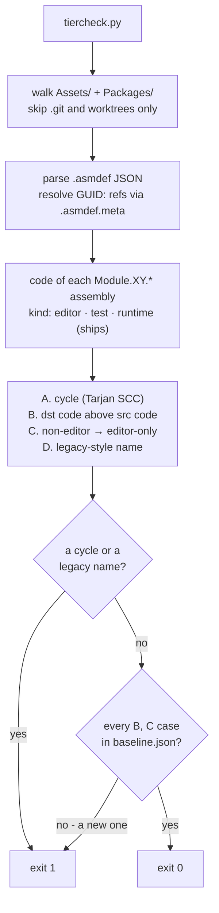

# Assembly tier check

Enforces `CLAUDE.md` section 4. Copied from M1-Creator's skill of the same name (2026-09-26); the scripts are
unchanged apart from their banner, so a fix made in one project can be copied to the other as-is.

Run the gate; it is fast (~1 s) and needs no Unity:

```bash
python3 .claude/skills/assembly-tier-check/tiercheck.py
```

Exit 0 = safe to land. Exit 1 = fix before landing.

## What it checks



| # | Check | Tolerance |
|---|-------|-----------|
| A | **Cycles** between assemblies | **Zero. No baseline, no exception.** Unity will not compile them. |
| B | **Upward edges** — a code referencing a higher code | **New ones fail.** |
| C | **Editor-only refs** — an all-platforms assembly referencing an `includePlatforms:["Editor"]` assembly | **New ones fail.** |
| D | **Legacy-style name** — `ModuleP1.*`, `ModuleT1*`, `UnityP1.*`, … | **Zero.** Such an assembly has no tier. |

Checks E–H (package placement, package edges, FishNet below U, UI homes) are M1-Creator's and look only at
`com.module.*` packages, FishNet and its UI assemblies. None exist here, so they report 0 and cost nothing; they are
left in so the script stays identical to M1-Creator's.

Only `Module.XY.*` names carry a tier. Vendor assemblies (`UniTask`, `Plugins.EasySave`, `TexturePacker.*`,
`com.rlabrecque.steamworks.net` …) have none, so B never fires on them — cycles (A) and editor-only refs (C) still do.
`com.creator.development-source/src/Module.PA.IconLibrary.asmdef` is outside `Assets/` and `Packages/` and is not
scanned; Unity does not see it either (`CLAUDE.md` section 5).

## Baseline state (measured 2026-09-26)

`15 asmdefs · 1 Module.XY.* (Module.PA.IconLibrary.Editor) · 0 legacy · 0 cycles · 0 upward · 0 editor-only refs`.
The baseline is empty: **any** violation is new.

## When it fails

1. **Fix the edge.** The usual cause is that the payload's POCOs are mis-filed in a behaviour assembly. Relocating
   them **down** is normally correct and cheap — **preserve the namespace** so call sites here and in M1-Creator need
   zero edits.
2. **Prove a reference dead before dropping it.** A name scan is not proof (CS0012 can need a reference whose name
   appears nowhere). Compile the assembly without it:
   ```bash
   python3 .claude/skills/assembly-tier-check/tiercompile.py <scratch> --only <Asm> --drop <Asm>:<Ref>
   ```
3. **Only if the edge is deliberate and justified**, accept it:
   ```bash
   python3 .claude/skills/assembly-tier-check/tiercheck.py --update-baseline
   ```
   Say why in the commit message. Never do this to silence a failure you have not understood.

Unity assembly references are **not transitive** — list every assembly a file actually names.

## Offline compile (`tiercompile.py`)

Compiles every assembly in the project with the Editor's own compiler and defines, from the Editor's last Bee
response files (`Library/Bee/artifacts/200b0aE.dag`). Unity can be closed. It writes nothing under `Library/`.

```bash
python3 .claude/skills/assembly-tier-check/tiercompile.py <scratch>/out -j 10
python3 .claude/skills/assembly-tier-check/tiercompile.py <scratch>/out --only UniTask --drop UniTask:<Ref>
```

*   After a `Library/` wipe there are no response files, so it refuses to run until Unity has opened the project once.
*   The compiler is the `DotNetSdk` of the Editor install the response files name, never a fixed version. If that
    install is gone the run stops and says so — reopen the project in the installed Editor.
*   `--map` defaults to `tier-map.json`, M1-Creator's rename map. It is not copied here (no renames to replay), and
    the tool runs without it.
*   A run that compiles nothing exits 1.

## Player-define compile (`playercompile.py`)

`tiercompile.py` compiles with the Editor's defines. `playercompile.py` compiles named runtime assemblies the way a
player build does, from the last player script compile's response files (`Library/Bee/artifacts/*P.dag`):
`ENABLE_IL2CPP`, no `UNITY_EDITOR`. This is the check that matters most here: M1-Creator ships UniTask, Easy Save
and Steamworks.NET in its players, and a symbol used outside `#if UNITY_EDITOR` in one of them fails there while
every Editor test here is green.

```bash
python3 .claude/skills/assembly-tier-check/playercompile.py UniTask Plugins.EasySave com.rlabrecque.steamworks.net
python3 .claude/skills/assembly-tier-check/playercompile.py --package com.cysharp.unitask
python3 .claude/skills/assembly-tier-check/playercompile.py --override <repo path>=<scratch copy> UniTask
```

Exit 0 compiled, 1 errors, 2 could not check: no player compile has run yet, the snapshot is older than an
`.asmdef` it depends on, or the Editor has not compiled newly added files. A player build refreshes the snapshot;
so does `UnityEditor.Build.Player.PlayerBuildInterface.CompilePlayerScripts` for StandaloneOSX. (`--fishnet` is
M1-Creator's and selects nothing here.)

## Tests

```bash
python3 -m unittest discover -s .claude/skills/assembly-tier-check -p 'test_*.py'
TIERCOMPILE_MIRROR=1 python3 -m unittest discover -s .claude/skills/assembly-tier-check -p 'test_tiercompile.py'
```

51 tests, 2 skipped (the opt-in mirror compile), passed here on 2026-09-26.

## Not copied

M1-Creator's `tierrename.py`, `pkgrename.py`, `tier-map.json` and `typedump/` drove its one-off `ModuleP1` →
`Module.XY.*` rename, which is complete. This project has no legacy names to rename. Copy them from
`M1-Creator/.claude/skills/assembly-tier-check/` if that ever changes.
