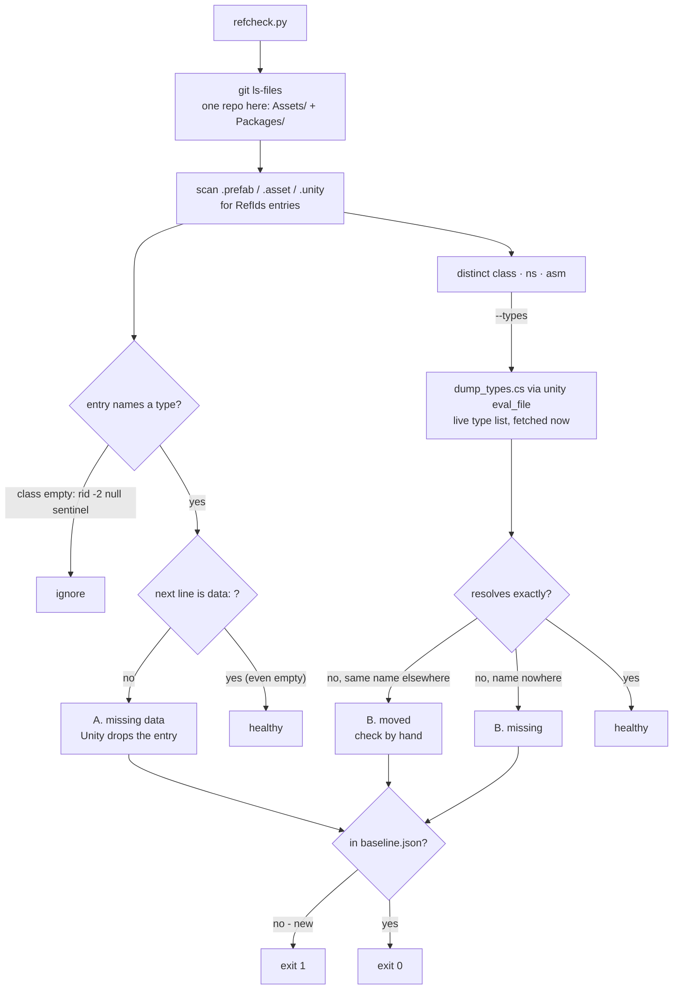

# Managed-reference check

Unity drops two kinds of `[SerializeReference]` data **without a warning, an exception, or a log line**. The
field reads `null`, and because deserialization runs after construction, the C# field initializer that would
have supplied a working default is overwritten. The symptom is a feature that silently does nothing.

Copied from M1-Creator's skill of the same name (2026-09-26); `refcheck.py` and `dump_types.cs` are unchanged
apart from their banner.

Run the gate. The default check is fast and needs no Unity:

```bash
python3 .claude/skills/managed-reference-check/refcheck.py
```

Add `--types` while the Editor is open to also check type resolution:

```bash
python3 .claude/skills/managed-reference-check/refcheck.py --types
```

Exit 0 = no new damage. Exit 1 = new damage. Exit 2 = `--types` could not reach the Editor, which is **not** a
pass.

## What it checks



| # | Check | How exact | Needs Unity |
|---|-------|-----------|-------------|
| A | **Missing `data:` line** on an entry that names a type | exact — pure YAML | no |
| B | **Unresolved type** — the `{class, ns, asm}` triple names no loaded type | exact against the live type list | yes, `--types` |

**`data: ` with nothing under it is healthy.** It is what Unity writes for a type with no serialized fields. The
defect is the `data:` line being absent altogether.

**A "moved" verdict needs a human.** It means a type with the same simple name exists somewhere else, and that
can be a coincidence.

## Scope in this project

*   **Only git-tracked assets count.** `Packages/` is part of the root repo here, so one `git ls-files` covers
    both. An untracked package — `com.editor-tools.texturepacker` on 2026-09-26 — is invisible until it is added.
*   **This project only.** M1-Creator consumes these forks, and its own assets may hold `[SerializeReference]`
    payloads whose types live here. After moving or renaming such a type, run M1-Creator's copy of this skill too.
*   `--types` needs the `unity command` bridge (`com.unity.pipeline`, see `unity-playtest`) answering from an open
    Editor. Without it the run exits 2, which is not a pass.

## Baseline state (measured 2026-09-26)

`38 tracked assets · 38 typed references · 0 missing data`. There is no `baseline.json` yet: `--update-baseline`
refuses to run without `--types`. The gate is correct without one — an absent baseline means every violation is
new. Write it with the first `--types --update-baseline` run that comes back clean.

## When it fails

**A — missing data.** Insert the line, matching what Unity writes, and change nothing else:

- a type with **no serialized fields** → `data: ` (trailing space, nothing under it)
- a type **with** fields → `data:` followed by those fields at their C# defaults

**B — unresolved type.** Re-point only when a successor is **exact**: same fields as the payload, and the owning
field's declared base type accepts it. Otherwise leave the entry: it is already `null` at runtime, so leaving it
changes nothing, and deleting it is the owner's call.

**Never** fix either kind with `SerializationUtility.ClearAllManagedReferencesWithMissingTypes`, and never let
the Editor re-save an asset to "repair" it. Both destroy the authored payload instead of restoring it
(`CLAUDE.md` section 6).

Accept a violation into the baseline only after repairing what can be repaired and deciding the rest:

```bash
python3 .claude/skills/managed-reference-check/refcheck.py --types --update-baseline
```

## What it cannot see

**A loss that has already been saved.** When a dropped entry is saved, Unity writes `rid: -2`, its ordinary null
sentinel, and the gate reads that as a deliberate empty slot. A type picker never writes `rid: -2` ("None" is a
typed entry), so a `rid: -2` in a slot whose C# initializer assigns a value is worth a look. Count `rid: -2` at every
revision of a file (`git show <sha>:<path>`); where the count rises, the parent commit holds the old value.

## Tracing where damage came from

`git log -S "class X"` is a **substring** search. Use a word boundary:

```bash
git log --all -G "class X([^A-Za-z0-9_]|$)" --format="%h %ad %s" --date=short
```
