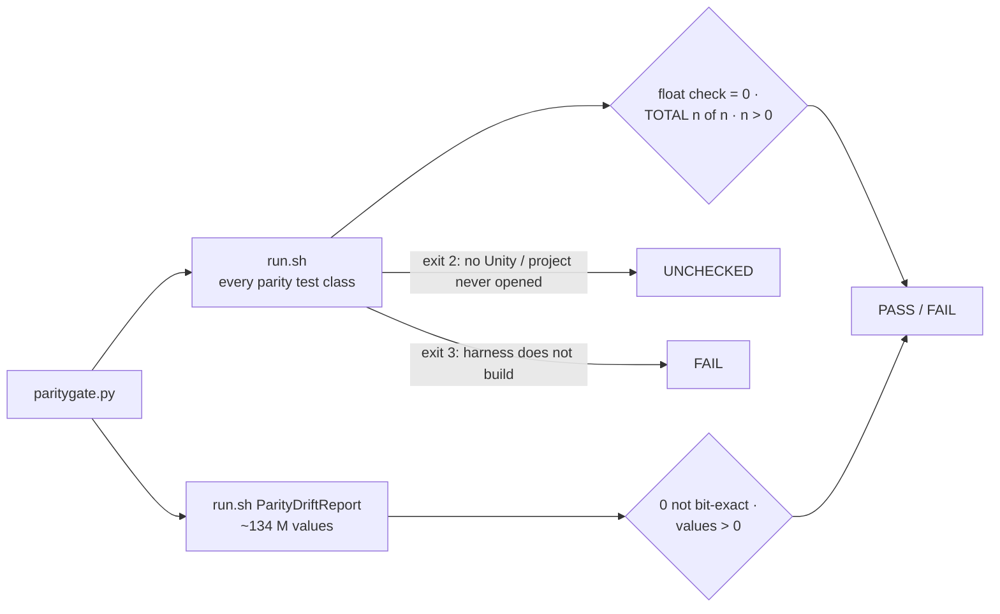

# Parity harness gate

The Unity Editor cannot prove bit-for-bit parity: Mono's JIT rounds `float` arithmetic differently depending on how it
compiles a method (142 failures in Release, 99 in Debug, from the same code). The Editor suites therefore compare
within a tolerance, with lockstep. **Exact parity is proven here**, on .NET, where every float operation is rounded to
float32. See `Packages/com.module.ta-creator-boneburst/Doc/Review/BoneBurst-ParityPlan.md`.

```bash
python3 .claude/skills/parity-harness/paritygate.py
```



## When to run it

- Any change under `Packages/com.module.ta-creator-boneburst/Runtime/`, before landing it.
- Any change to the parity tests (`Tests/Editor/Parity`, `Pose`, `Anim`, `Constraints`, `Skins`). The harness
  compiles those files, and their `#if !BONEBURST_PARITY_HARNESS` guards are easy to break.
- Any change to `Packages/com.esotericsoftware.spine.spine-csharp`: it is the parity reference.
- A Unity parity test fails and the cause is unclear: if the gate passes, the Unity failure is Mono rounding (see the
  parity plan's tolerance, lockstep and conditioning rules); if the gate fails, it is a real difference.

## What it proves, and what it does not

- **Proves:** setup pose, animation, mixing, constraints and physics, skins, and the readers agree bit for bit with
  stock, value for value (`ParityDriftReport` records every compared value).
- **Does not cover:** meshes against spine-unity's `MeshGenerator` and the GPU path. They need `UnityEngine.Mesh`,
  which the harness does not have. Run the Editor suite for those:
  `python3 .claude/skills/unity-playtest/playtest.py test --assembly Module.TA.BoneBurst.Tests.Editor --mode EditMode --timeout 2400`.

## Results

- **PASS**: every test passed, at least one ran, the drift report compared values and every one was bit-exact.
- **FAIL**: lists the failing tests (first 10) or the count of inexact values. A harness that does not build is a
  FAIL, never a stale pass: `run.sh` stops on a build error.
- **UNCHECKED**: the harness could not run. It needs Unity 6000.6.3f1 installed under `/Applications/Unity/Hub/Editor`
  (for its .NET SDK and managed engine modules), and the project opened once (`Library/ScriptAssemblies` provides
  `Unity.Collections` and `Unity.Burst`).

## Checked (2026-09-30)

- On the current code: PASS, 191 of 191 tests, 133,729,676 values, 0 not bit-exact.
- With a deliberate runtime bug (a sign flip in `PoseMath.Child`, OnlyTranslation): FAIL, naming the failing tests.
  Reverted.
