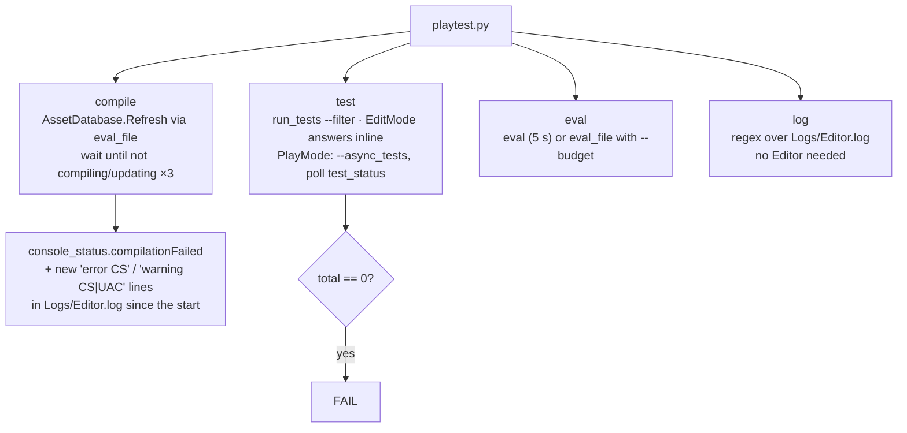

# Unity play test

One script for everything that needs the running Editor: compile, tests, a C# snippet, a log grep. It talks to the
Editor through the `unity command` CLI, which `com.unity.pipeline` serves inside the Editor. The general CLI itself
is the `unity:unity-cli` skill; this one is the project's recipes on top of it.

```bash
python3 .claude/skills/unity-playtest/playtest.py compile
python3 .claude/skills/unity-playtest/playtest.py test --assembly TexturePacker.Tests --mode EditMode
python3 .claude/skills/unity-playtest/playtest.py eval 'return UnityEngine.Application.dataPath;'
python3 .claude/skills/unity-playtest/playtest.py log "error CS"
```

Exit 0 = pass. Exit 1 = fail. Exit 2 = could not check (Editor unreachable, busy, or in play mode), which is **not**
a pass. A run that finds 0 tests is a failure, not a pass.

## Setup: the bridge

`com.unity.pipeline` `0.8.0-exp.1` (the same as M1-Creator, from the Unity registry) is in `Packages/manifest.json`
since 2026-09-26. 0.8 returns `*_status` results as real JSON rather than a string; `playtest.py` accepts both.
The server's settings are in Project Settings. It serves the CLI only while an Editor has this project open with the package resolved. Until then,
every command except `log` answers **UNCHECKED** with "No Pipeline instance found for project" — focus Unity so it
resolves and compiles, then retry. `log` needs no Editor.

## What each command does



Trimmed from M1-Creator's `playtest.py` (2026-09-26). Its `single`, `mppm` and `coop` runs, `test --platform` test
players, and `coop.py` / `steam_scene.py` depend on FishNet, `SceneFN_Boot`, Multiplayer Play Mode scenarios and the
Heathen Steamworks fork, none of which exist here. The CLI plumbing, `compile`, `test`, `eval` and `log` are the same
code.

## Traps (each one was hit in M1-Creator)

*   **Snippets.** `eval` compiles a statement body: fully-qualified names, no `using`, end with `return <string>;`,
    and a compiler warning fails it. The main thread gives it 5 s; pass `--budget <ms>` for more (the script then
    uses `eval_file`). A refresh can outlast the budget and still land.
*   **Input is the Input System only.** `activeInputHandler: 1` here, so a `UnityEngine.Input` read in a snippet or
    test throws `InvalidOperationException`. Use `Keyboard.current`, `Mouse.current`, `Pointer.current`,
    `Gamepad.current`.
*   **Tests.** An all-platforms test assembly lists under PlayMode; the EditMode tab shows 0 tests for it. Always
    filter by assembly or test name. `TexturePacker.Tests` is Editor-only, so it runs under `--mode EditMode`.
*   **Shared Editor.** The commands refuse to start while the Editor is in play mode; if it is someone else's
    session, wait. Never call `AssetDatabase.SaveAssets()` from a snippet: it writes every dirty asset, not just
    yours.
*   **Warning counts cover only what was recompiled.** Unity logs a warning only when it compiles the assembly, so
    one served from the build cache is silent. For a true count, compile offline with
    `assembly-tier-check/tiercompile.py`.
*   **Green here is half the check.** These packages also compile inside M1-Creator and M2-Sample-25DL-Shader
    (`CLAUDE.md` section 1). Don't drive those Editors unless asked; the owner refreshes them. Name the consumers a
    change reaches in the report instead.
