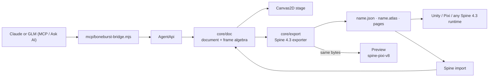

# BoneBurst

A Flash-style animation editor for **Spine 4.3**, built from
[Animo](https://github.com/justmorenoise/animo) by Morenoise.

Animo has a timeline, layers, keyframes, symbols, bones and IK, masks and PSD
import, and it exports DragonBones. BoneBurst keeps the editor and changes
what it writes to Spine: a skeleton `.json`, a `.atlas` and its pages, played in
the editor by the official Spine runtime. It also opens existing Spine files for
editing, and an AI can drive it through the same undoable commands.



## Status

**Phases 0–9 of [docs/PLAN.md](docs/PLAN.md) are done.** The editor works as
Animo's does; **File ▸ Export Spine** writes `<name>.json`, `<name>.atlas` and
the atlas pages for Spine 4.3; and the **Preview panel and Play mode run the
official Spine runtime** (spine-pixi-v8) on those exact files, matching the stage
frame by frame: eases, IK, nested symbols, masks (as Spine clipping) and colour
offsets (as two-colour tint) included. **File ▸ Open Spine** opens a Spine 4.3
JSON export (with its atlas and pages, or a zip of them) for editing. Meshes,
constraints, physics and other skins are shown through the Spine runtime and
written back unchanged. The exports play in Unity through spine-unity 4.3 exactly as in the
Preview (checked frame by frame; turn on Export Settings ▸ "Atlas as .atlas.txt" for Unity).
**An AI can animate the open rig**: Claude or GLM through AI ▸ Ask AI in the
editor, or any MCP client (Claude Code, Claude Desktop), through tools that read
the rig, key bones and check the
result against the Spine runtime. Every AI edit is one undo step. Add a sprite sheet or a
run of images in the **Reference** panel to animate against frame by frame; the AI can
look at it and at pictures of its own work (`get_reference`, `render_frame`).

## Connecting an AI

```bash
node mcp/boneburst-bridge.mjs --http-only
```

That runs the bridge for the page alone; for Ask AI, start it with `ANTHROPIC_API_KEY`
(Claude) or `GLM_API_KEY` (GLM, on api.z.ai) in its environment. For a bigmodel.cn
key, also set `BONEBURST_API_URL=https://open.bigmodel.cn/api/paas/v4/chat/completions`;
`BONEBURST_MODEL` picks the model. For Claude Code, add the bridge to a project's
`.mcp.json` instead, and Claude starts it:

```json
{ "mcpServers": { "boneburst": { "command": "node", "args": ["<path to>/mcp/boneburst-bridge.mjs"] } } }
```

Then choose **AI ▸ Connect to AI** in the editor and ask the model to animate the rig.

## Quick start

```bash
npm install
npm run dev       # http://localhost:5181
```

Chrome or Edge. The port is not Animo's 5180 on purpose. Browser storage is
per origin, so on one port the two editors would share preferences and
overwrite each other's autosave.

```bash
npm test          # vitest
npm run build     # tsc --noEmit && vite build
```

## Documentation

- [docs/PLAN.md](docs/PLAN.md): the phases, how DragonBones concepts map onto
  Spine, and the export tests to rebuild.
- [docs/ARCHITECTURE.md](docs/ARCHITECTURE.md): Animo's architecture
  document. The editor sections still apply; its note at the top lists the
  DragonBones sections that no longer do.

## Licence

**AGPL-3.0-or-later**, inherited from Animo. See [LICENSE](LICENSE),
[LICENSE-EXCEPTION.md](LICENSE-EXCEPTION.md) and
[THIRD-PARTY-NOTICES.md](THIRD-PARTY-NOTICES.md). What you export is yours.

Spine is a trademark of Esoteric Software. Using the Spine runtimes requires a
Spine Editor licence. This project is not affiliated with Esoteric Software or
with Morenoise.
