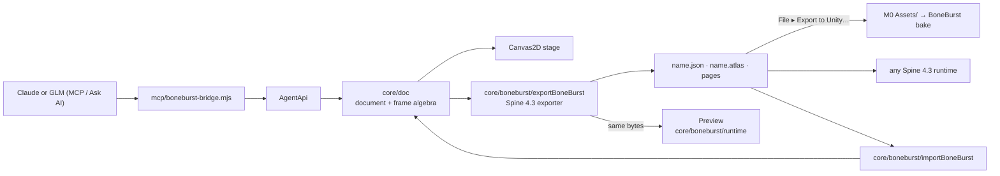

# BoneBurst

> **Oracle-only since 2026-10-06** (owner's cutover, `../Editor-BoneBurst-Src/docs/E6-PLAN.md` ▸ Step 6).
> The editor in use is the BoneBurst Editor v2 in `../Editor-BoneBurst-Src/`; this repository's
> `.mcp.json` starts v2's bridge. This one takes **no new features**: bug fixes and data-format
> work only (`docs/EDITOR-V2-PLAN.md`, D1). v2's E6 scripts run it (dev server :5181, bridge :5190)
> as the behavioural oracle. Archiving it is E6 step 7, the owner's call (D8).

A Flash-style animation editor for **Spine 4.3**, built from
[Animo](https://github.com/justmorenoise/animo) by Morenoise.

Animo has a timeline, layers, keyframes, symbols, bones and IK, masks and PSD
import, and it exports DragonBones. BoneBurst keeps the editor and changes
what it writes to Spine: a skeleton `.json`, a `.atlas` and its pages, played in
the editor by its own Spine 4.3 runtime. It also opens existing Spine files for
editing, and an AI can drive it through the same undoable commands.

It lives in the M0-Animation-2D Unity project, beside the BoneBurst Unity packages
(`../Packages/com.module.ta-creator-boneburst*`) that bake and play what it exports.
The two share specs and files only, never code.



## Status

**Phases 0–9 of [docs/PLAN.md](docs/PLAN.md) are done.** The editor works as
Animo's does; **File ▸ Export Spine** writes `<name>.json`, `<name>.atlas` and
the atlas pages for Spine 4.3; and the **Preview panel and Play mode run our own
Spine 4.3 runtime** (`src/core/boneburst/runtime/`) on those exact files, matching the
stage frame by frame and held to spine-core in the tests. No Spine Runtimes code ships:
spine-pixi-v8 runs only under `npm run dev:oracle`, for comparison. **File ▸ Open Spine**
opens a Spine 4.3 JSON export (with its atlas and pages, or a zip of them) for editing;
meshes, skins, constraints, physics, boxes, points, paths and sequences are all edited
in the model, not carried. **File ▸ Export to Unity…** writes into a folder under M0's
`Assets/`, which the Unity side rebakes; the exports are held to the BoneBurst C# runtime
frame by frame (`tests/boneburstUnity.test.ts`).
**An AI can animate the open rig**: Claude or GLM through AI ▸ Ask AI in the
editor, or any MCP client (Claude Code, Claude Desktop), through tools that read
the rig, key bones and check the
result against the Spine runtime. Every AI edit is one undo step. Add a sprite sheet or a
run of images in the **Reference** panel to animate against frame by frame; the AI can
look at it and at pictures of its own work (`get_reference`, `render_frame`).

## Connecting an AI

```bash
node mcp/boneburst-bridge.mjs --http-only
```

That runs the bridge for the page alone; for Ask AI, start it with `ANTHROPIC_API_KEY`
(Claude) or `GLM_API_KEY` (GLM, on api.z.ai) in its environment. For a bigmodel.cn
key, also set `BONEBURST_API_URL=https://open.bigmodel.cn/api/paas/v4/chat/completions`;
`BONEBURST_MODEL` picks the model. For Claude Code, add the bridge to a project's
`.mcp.json` instead, and Claude starts it:

```json
{ "mcpServers": { "boneburst": { "command": "node", "args": ["<path to>/mcp/boneburst-bridge.mjs"] } } }
```

Then choose **AI ▸ Connect to AI** in the editor and ask the model to animate the rig.

## Quick start

```bash
npm install
npm run dev       # http://localhost:5181
```

Chrome or Edge. The port is not Animo's 5180 on purpose. Browser storage is
per origin, so on one port the two editors would share preferences and
overwrite each other's autosave.

```bash
npm test          # vitest
npm run build     # tsc --noEmit && vite build
scripts/check.sh  # both, plus no spine-pixi in dist/ and core/ imports nothing above it
```

## Documentation

- [docs/ARCHITECTURE.md](docs/ARCHITECTURE.md): how the editor is built and what
  fails silently when you get it wrong. Read the section before touching its code.
- [docs/PLAN.md](docs/PLAN.md): the phases, and how DragonBones concepts map onto Spine.
- [docs/SPINE-PARITY-PLAN.md](docs/SPINE-PARITY-PLAN.md): what Spine can author, and
  what this editor builds of it.
- [docs/BONEBURST-PIPELINE-PLAN.md](docs/BONEBURST-PIPELINE-PLAN.md): from the
  artist's file to the game, through the Unity packages.

## Licence

**AGPL-3.0-or-later**, inherited from Animo. See [LICENSE](LICENSE),
[LICENSE-EXCEPTION.md](LICENSE-EXCEPTION.md) and
[THIRD-PARTY-NOTICES.md](THIRD-PARTY-NOTICES.md). What you export is yours.

Spine is a trademark of Esoteric Software. Using the Spine runtimes requires a
Spine Editor licence. This project is not affiliated with Esoteric Software or
with Morenoise.
