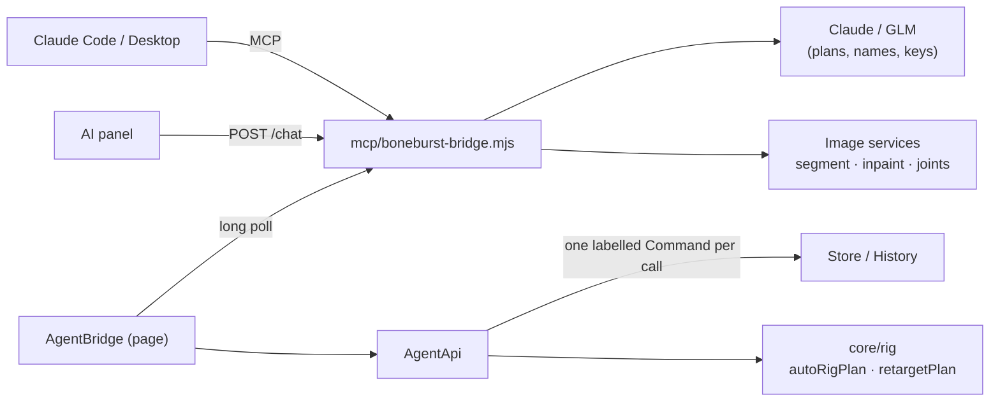

# AI rigging — plan

**Status:** phases A–C done; D (image split) and E (local models) not started (▸ Phases).

Goal: from one character picture to a rigged, animated Spine 4.3 skeleton, the way
godmodeai.co/ai-spine-animation does it, but inside the editor, with every step a normal
undoable edit the user can correct, and the export checked by the existing parity tests.

## What the reference product does

1. **Layer split**: an image model cuts a full-body PNG into body parts (head, torso, arms,
   legs) and paints in the art hidden behind overlaps.
2. **Piece split**: limbs are cut again at the joints (upper arm, forearm, hand; thigh, calf,
   foot).
3. **Auto-rig**: the pieces are named and connected into a skeleton without manual bone
   placement.
4. **Animate**: about 400 motion clips are retargeted onto that skeleton; output is Spine JSON
   + atlas, WebM or GIF.

The pieces are moved by bones, never repainted per frame, so the art stays the user's.

## What BoneBurst already has

Phase 9 (ARCHITECTURE ▸ The AI bridge) covers step 4's second half: a model animates an
existing rig through `tools.json` (`set_keys`, `get_pose`, `render_frame`, `check_preview`…),
over MCP (Claude Code / Desktop) or Ask AI (Claude or GLM, key in the bridge).

Missing:

| Step | Gap |
|---|---|
| 1, 2 | No way to turn one flat picture into parts. A layered PSD skips this: File ▸ Import PSD as Layers puts its layers in the symbol, ready to rig. |
| 3 | The AI cannot create bones, attach images or add IK: there is no tool for it. |
| 4 | No motion library and no retargeting; every animation is keyed from nothing. |

## How to connect: one bridge, two kinds of backend

The bridge stays the only thing that holds keys and talks to services. The page never calls a
model. Two kinds of backend sit behind it:

- **Language model** (exists): Claude or GLM. Decides, names, plans, keys. Cannot output pixels.
- **Image services** (new): segmentation, inpainting, pose (joint) detection. Pixels in,
  pixels or points out. Deterministic enough to test against fixtures.

Why this shape:

- **Language models are bad at pixel-precise geometry.** A vision model reading `render_frame`
  can name parts and judge a pose, but joint positions should come from a pose model, and part
  masks from a segmentation model. The LLM orchestrates; it does not measure.
- **Image work goes through the bridge, not the page**, for the same reason the chat does: the
  key stays out of the browser, and a hosted model can be swapped for a local one without
  touching the editor.
- **Decisions stay pure functions** (CLAUDE.md ▸ How a fix is written): `autoRigPlan(parts,
  joints)` and `retargetPlan(clip, rig, mapping)` live in `core/rig/`, get table tests, and the
  tool only applies the result as one command.

### Image service choice

| Task | Hosted (start here) | Local (later, `io/workers/` + onnxruntime-web) |
|---|---|---|
| Segment parts | SAM 2 on fal.ai or Replicate, prompted with points from the joint model | MobileSAM / EfficientSAM ONNX |
| Fill hidden art | An inpainting model (Flux Fill, or a Gemini/GPT image edit) | LaMa ONNX (fills, does not invent limbs well) |
| Joints | DWPose / RTMPose (whole-body 2D keypoints) | RTMPose ONNX, small enough for a worker |

Start hosted: it is one HTTP call per step from the bridge and needs no model files in the
repo. Configure like the chat provider: `BONEBURST_IMAGE_PROVIDER` (`fal` | `replicate` | `local`),
its key in the environment or `~/.boneburst-bridge.json`, set from the AI dot popup. Anime and
pixel-art styles break general pose models; the LLM's vision check (step 3 below) and the user's
correction on the stage cover that, and a local model trained on the user's style can come
later.

Check each model's licence before wiring it (SAM 2, RTMPose, LaMa: Apache-2.0; DWPose: Apache-2.0
but its training data is not; hosted Flux Fill: per-provider terms). The images produced are the
user's (LICENSE-EXCEPTION.md); a model's weights are not shipped in the bundle.

## New tools (`tools.json`)

Each edit is one history step labelled "AI: …", like the existing tools.

| Tool | Does | Applied as |
|---|---|---|
| `detect_joints` | Runs the joint model on a library image; returns named keypoints in image pixels and skeleton space, with confidence | read only |
| `split_image` | Segments an image into named parts (optionally inpainting what overlaps hid), adds them to the library in one folder | one `AddLibraryItems` |
| `add_bones` | **Built.** Creates bones from joint and tip in skeleton space, or local x, y, rotation, length | one transaction |
| `attach` | **Built.** Puts library pictures on bones (pivot, place, world rotation), or moves artwork already in the skeleton onto a bone | one transaction |
| `add_ik` | **Built.** Adds IK, making the target at the tip when none is given; refuses keyed chain bones | `AddNode` + `AddIkConstraint` |
| `draw_order` | **Built.** Orders a bone's children front to back (`siblingOrder`) | one `SetLayerOrder` |
| `auto_rig` | **Built.** Joints (read by the model, later from `detect_joints`) + `autoRigPlan` → bones, attachments, draw order, IK in one step, with notes on what fits poorly | one transaction |
| `list_motions` / `apply_motion` | **Built.** Lists library clips and the roles guessed for the rig; fits one onto the rig as a new animation, facing either way, at any length (no blend weight yet) | one transaction: `AddAnimation` + `EditTracks` |

`get_rig`, `render_frame`, `get_pose` and `check_preview` already let the model see what it built.

## The motion library

- **Format** (as built): per body role, world angles for limbs and torso and offsets for
  hips, head, hands and feet, in `src/core/rig/motions.json`, generated from formulas by
  `scripts/buildMotions.ts`. Roles: `hips`, `torso`, `head`, and `thigh`, `shin`, `foot`,
  `upperArm`, `forearm`, `hand` on `near`/`far` (side view) or `left`/`right` (front view).
- **Mapping**: `get_rig` + bone names + joint positions give a role per user bone. The LLM
  proposes the mapping, `retargetPlan` validates it (every role used once, parents agree).
- **Retargeting** (`retargetPlan`, pure): rotations copy as offsets from each role's setup
  direction; the root's translation scales by leg length; feet that the clip plants stay planted
  through the rig's IK when it has one. Side views and front views are separate clips, since 2D
  cannot rotate a character in depth.
- **Sources**: clips authored in BoneBurst on the stickman, the user's own exported animations
  (File ▸ Open Spine already reads them), and 2D projections of mocap (check the licence of each
  set; CMU's is free to use).
- The LLM then tunes with `set_keys`: exaggeration, timing, secondary motion. That is where it
  is good.

## Phases

| # | Phase | Done when |
|---|---|---|
| A | **Done.** **Rig tools**: `add_bones`, `attach`, `add_ik`, `draw_order`; `render_frame` without an animation shows the setup pose. A model rigs pictures by hand through MCP or Ask AI. | Stickman rebuilt from its images by tool calls equals `stickman.boneburst`'s rig; parity passes on an animation keyed on it; deliberate bugs (wrong parent space, y-down, draw order) each fail a test |
| B | **Done (first library).** **Motion library + retarget**: `core/rig/motion.ts`, `list_motions`, `apply_motion`; 4 side-view clips (walk, run, idle, jump) and 3 front-view (idle_front, wave, jump_front) from `scripts/buildMotions.ts`. More clips are data: add them to the script. | Each clip retargeted onto stickman and frog: feet stay on the ground (`get_pose`), parity passes, one undo removes it |
| C | **Done (vision first).** `auto_rig` + `autoRigPlan`: the connected model reads joints off `render_frame`, auto_rig builds bones, attaches the pictures, keeps the stacking and settles the IK bend. No image service yet: `detect_joints` (a hosted or local pose model) stays open, and would feed auto_rig the same joints. | Checked in the app on a 13-layer side-view PSD: joints read by eye, every visible part on its bone, the library walk matching the runtime; the stickman's pictures re-rigged from its joints in tests |
| D | **Image split**: `split_image` with segmentation, then inpainting; runs under `busy()` with progress | A flat PNG becomes parts that reassemble to the original within a set pixel error in the setup pose; inpainted regions only where parts overlapped |
| E | **Local models**: ONNX in `io/workers/` for joints and segmentation, falling back to the bridge on `WorkerCrashed` | Same results as C/D on the fixtures within tolerance, offline |

A first: it is small, uses the bridge as it is, and is useful with PSDs today. D is last
because it is the least reliable step and most users with Spine already have layered art.

## Risks

- **Hidden art**: inpainting invents the covered part of an arm or leg; it may not match the
  style. Keep the original layers and let the user replace a part from the library.
- **Joint models on stylised art**: low confidence on chibi or pixel art. `auto_rig` returns the
  confidence; below a threshold the model asks the user to drag the joints on the stage.
- **Cost**: hosted image calls cost per call. Cache results per image hash in the bridge.
- **Meshes**: the reference product moves rigid pieces. Weighted meshes for bending torsos are
  a later step and need the importer's mesh scope (PLAN ▸ Opening Spine files).
