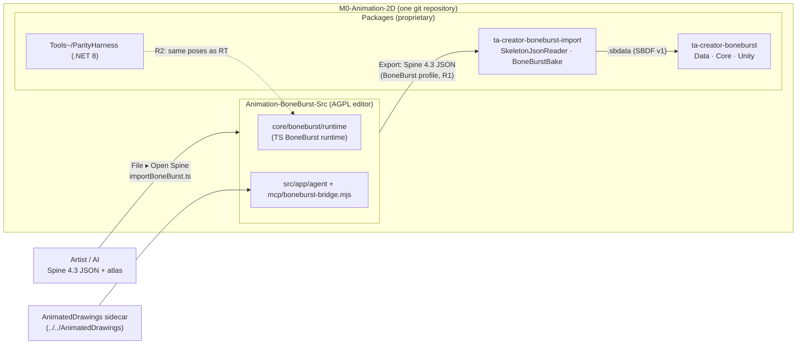

# BoneBurst pipeline — plan

**Status:** R0 done 2026-10-05 (below), **not verified** in Unity: opening this copy in
the Editor without it importing the editor folder was not checked. R1–R5 not started. Left
of R0: repointing the M2 projects' `file:` references and retiring the old folders (R0
step 7), both owner calls.

Goal: one BoneBurst, from the artist's file to the game. The editor moves into
`/Users/pnp/Project Unity/M0-Animation-2D/Animation-BoneBurst-Src`, inside the new
`M0-Animation-2D` git repository, beside the Unity packages it feeds; the two sides share
one repository, one format contract, one set of specs and one parity discipline.

Drafted 2026-10-05; updated the same day for the new repository. `M0-Animation-2D` is
a copy of `M0-Animation2D` (the same three BoneBurst packages, `Tools~/ParityHarness`,
`Doc/Format/`, the vendored spine-unity samples) with a new git repository that has no
commit yet. Decisions marked **(owner)** are open; everything else is a recommendation the
phases below assume.



## The workflow it serves

| # | Step | Today | Where it runs |
|---|---|---|---|
| 1 | Artist / AI-generated **Spine 4.3 JSON** in | File ▸ Open Spine (`core/boneburst/importBoneBurst.ts`), every M0 sample round-trips | editor |
| 2 | **AI edits** the animation | MCP bridge + Ask AI (`mcp/boneburst-bridge.mjs`, `src/app/agent/`, AI-RIG phases A–C done); AnimatedDrawings sidecar planned (ANIMATED-DRAWINGS-PLAN AD-0…4) | editor + bridge + sidecar |
| 3 | **Export** for Unity | File ▸ Export writes Spine 4.3 JSON + atlas + pages | editor |
| 4 | **Bake** to the efficient form | `.sbdata` (`SBDF` v1), lossless binary, 29–65 % of the JSON; Unity Editor only (`Assets/BoneBurst/Bake Folder...`) | Unity |

Players load only `.sbdata`. Unity's readers accept only stock Spine 4.3 exports
(`skeleton.spine` "4.3.x").

## Decisions

1. **"BoneBurst JSON" is Spine 4.3 JSON.** No new dialect: the editor already writes
   it, Unity's `SkeletonJsonReader` already reads it, both sides are gated on 4.3, and
   an artist's file and an editor export stay interchangeable. What makes it
   "BoneBurst" is a documented **subset and profile**: the fields both runtimes
   implement, written down once (D1 below). A dialect would need a second reader on
   each side and would cut the editor off from stock Spine tools. If a BoneBurst-only
   field is ever needed, it goes in an extension the stock readers ignore, never in
   a renamed key.
2. **The bake stays one implementation.** `.sbdata` is written by the C# baker that
   self-checks its curve rebuild. The editor hands off JSON; the editor-side bake (R4)
   only *drives* the Unity bake, it does not write `SBDF` itself, unless the owner
   wants bakes without Unity (R4b).
3. **Share specs and data, never code** — a licence boundary, not a style choice:
   - the editor is **AGPL-3.0** (an Animo fork); the Unity packages are **proprietary**
     ("Copyright (c) 2026, Panupun Dev"). Copying code either way would put Unity code
     under the AGPL or break it. Co-locating the folders is fine; they stay separate
     programs exchanging files.
   - what *is* shared: `Doc/Format/*.md` (specs), fixtures (exports and their expected
     poses), and test harnesses that read files.
4. **Repository layout: one new repository (decided 2026-10-05).** The editor lives in
   `M0-Animation-2D`'s own git history, under `Animation-BoneBurst-Src/`, brought in with
   `git subtree add` so its 108 commits come along (a plain copy would start it from
   nothing and lose the history CLAUDE.md and the plans point into). What this means:
   - **Licences per folder.** The repository then holds AGPL code (the editor) next to
     proprietary packages. That is allowed: they are separate programs that exchange
     files. But the editor folder keeps its `LICENSE`, `LICENSE-EXCEPTION.md` and
     `THIRD-PARTY-NOTICES.md`, the root says which licence covers which folder, and
     anyone given the repository gets the AGPL's rights to the editor folder.
   - **Unity never imports it**: `Animation-BoneBurst-Src/` is outside `Assets/` and
     `Packages/`. The root `.gitignore` must ignore the editor's `node_modules/` and
     `dist/` (the Unity template's rules do not).
   - **The editor's GitHub remote** (`12pnp/Amino-Spine2D-Src`) can still be updated with
     `git subtree push --prefix=Animation-BoneBurst-Src`, or retired; its GitHub CI only
     runs where it is pushed.
   - The old `M0-Animation2D` and `Amino-Spine2D-Src` folders are retired once R0 passes;
     nothing should keep writing to them (another session currently works in both).

## Phases

### R0 — Move (half a day)

1. **First commit of the Unity project.** `M0-Animation-2D` has no commit; commit the
   Unity project as it is (after checking `.gitignore` covers `Library/`, `Temp/`,
   `Logs/`, generated `.csproj`/`.sln`, which the template does), so the move lands on
   a known base. Land or drop the old project's uncommitted work first (the
   `Samples Custom` move, the AnimoTest folders, the licence files) so the copy is the
   state wanted.
2. **Bring the editor in with its history** (the editor's own working tree committed
   first; the other session's uncommitted files in it — `docs/AI-RIG-PLAN.md`,
   `src/styles/settings.css`, three docs — committed or set aside by that session):

   ```bash
   git -C "/Users/pnp/Project Unity/M0-Animation-2D" subtree add --prefix=Animation-BoneBurst-Src "/Users/pnp/Project Unity/Amino-Spine2D-Src" main
   ```

   Then add `Animation-BoneBurst-Src/node_modules/` and `Animation-BoneBurst-Src/dist/`
   to the root `.gitignore`, and run `npm ci` in the folder.
3. **Paths that assume `Project Unity/` siblings**, each becoming relative to the new root:

   | File | Today | After |
   |---|---|---|
   | `tests/fixtures/spineSamples.ts` | `../../../M0-Animation2D/Packages/com.esotericsoftware.spine.spine-unity/Samples~/…` | `../../../Packages/…` (from `tests/fixtures/`) |
   | `tests/unityParity.test.ts` | `../../M0-Animation2D` | `../..` (until R2 replaces it) |
   | `scripts/unity-check/` README, `dump.cs` | "the M0 project next to this one" | "the Unity project around this one" |
   | `docs/*` links to `../_Discuss/…`, `../AnimatedDrawings` | one level up | two levels up (`../../_Discuss/…`) |
   | `.claude/launch.json` | ports only | unchanged |

4. **Claude's memory** for this project is keyed by its path: copy
   `~/.claude/projects/-Users-pnp-Project-Unity-Amino-Spine2D-Src/memory/` to the new
   path's folder (`-Users-pnp-Project-Unity-M0-Animation-2D…`), or it is lost.
5. **The root `CLAUDE.md`** gains a short section: what `Animation-BoneBurst-Src/` is, that
   it is AGPL and a separate program, that its own `CLAUDE.md` governs work inside it, and
   that code never moves between it and the packages (decision 3).
6. **Done when** `npm test` and `npm run build` pass in the new place with the samples
   found (no suite skipped that ran before), Unity opens `M0-Animation-2D` without
   importing anything from the folder, and `git log -- Animation-BoneBurst-Src` shows
   the editor's history.
7. **(owner) Retire the old folders.** M2-Creator-All and M2-Sample-25DL-Shader take
   `com.module.ta-creator-boneburst` (and M2 the `-import` package) by `file:` path from
   **`M0-Animation2D`** (root CLAUDE.md §1). Before the old project goes, their
   `manifest.json` entries move to `M0-Animation-2D/Packages/…`, committed in their own
   repositories; until then the two Unity copies must not drift. `Amino-Spine2D-Src` can
   go once nothing more is committed there (another session still has uncommitted work in
   it: `docs/AI-RIG-PLAN.md`, `src/styles/settings.css`, three new docs).

**Result (2026-10-05).**
- Editor commit `6f41eba` (the rename and this plan) first; then in `M0-Animation-2D`:
  `bfd1aa6` the Unity project's first commit (2,196 files, 74 through LFS with the old
  repository's `.gitattributes`; `.gitignore` adds `.DS_Store` and the editor's
  `node_modules/`, `dist/`), `ad3f6dd` the `git subtree add` (108 editor commits
  reachable), `2eccbcf` the editor folder taken out of LFS: its history stores PNGs as
  plain blobs, which LFS rules made show as modified.
- Not in the plan: the old repository ignored `Assets/Samples/`, the new `.gitignore`
  does not, so the 2D package samples are committed (kept as the owner's `.gitignore`).
- Paths: `spineSamples.ts` is `../../../Packages/…` from `tests/fixtures/`, not
  `../../Packages/…` as first written. The samples still come from spine-unity's
  `Samples~`, which the root CLAUDE.md says nothing reads any more (the packages read
  their vendored `Tests/Editor/Data~/samples/`); switching to that copy is for R1.
- `npm ci`, `tsc`, the suite (2,166 passed, `unityParity` skipped: no Unity dump, as
  before the move) and the build pass in the new place; the sample suites run.
- `.claude/launch.json` (ignored by git) and Claude's memory copied to the new path.

### R1 — One contract (2–3 days)

- **D1 — `Doc/Format/BoneBurst-Profile.md`** in the Unity package (the spec home, beside
  `Format-Json-Atlas.md`): the Spine 4.3 JSON subset BoneBurst writes and reads —
  header (`skeleton.spine`, `hash`, which spine-csharp requires), every attachment,
  constraint and timeline kind both runtimes implement, defaults, units, and what
  either side refuses. The editor's `core/boneburst/types.ts` and Unity's
  `SkeletonJsonReader` are each checked against it.
- **D2 — the behaviours both runtimes measured**, recorded in the existing specs
  (`Timelines.md`, `Constraints.md`, `AnimationState.md`), so neither side rediscovers
  them: the two P5 fixes (mirrored local-from-world shear, unwrapped additive world
  shear), spine-core's event volume/balance reading (P4), the quad triangle order
  (P4), 32-bit key times, π as 3.1415927.
- **Done when** each runtime's test suite cites the profile, and a field outside it
  fails loudly on both sides.

### R2 — Close the loop: editor export → BoneBurst Unity runtime (3–5 days)

Today the editor's exports are checked against spine-core (vitest) and once against
spine-unity (`scripts/unity-check/`, phase 8, needs the Unity Editor). Neither is the
runtime the game ships.

- `Tools~/ParityHarness` already builds BoneBurst's `Data`, `Core` and `Import` runtime
  under .NET 8 without Unity. Add a mode that reads a folder of editor exports and
  writes every bone's world matrix, slot colour, attachment and draw order per frame
  as JSON.
- An editor test (`tests/boneburstUnity.test.ts`, skipped without `dotnet`) exports the
  fixtures, runs the harness, and compares with the editor's own runtime frame by frame,
  at the editor suites' tolerance. It replaces `unityParity.test.ts`'s dependence on a
  hand-run Unity dump (whose folder is already gone).
- Bake round-trip in the same run: harness bakes each export to `.sbdata`, reads it
  back, and the pose must not change.
- **Done when** stickman, frog and every authored fixture play identically in the
  editor's runtime and BoneBurst's C# runtime, baked and unbaked.

### R3 — AI step (the existing plans, sequenced)

- AnimatedDrawings sidecar, `/Users/pnp/Project Unity/AnimatedDrawings` (two levels up
  from the editor) → configured by path in the bridge
  (`BONEBURST_IMAGE_PROVIDER=animateddrawings`); AD-0…AD-4 as in
  ANIMATED-DRAWINGS-PLAN, AI-RIG D and E after.
- Every AI edit stays one labelled command; every result is checked by `get_pose` /
  `check_preview`, now playing BoneBurst's runtime (P4).
- **Done when** AD-3: one BVH becomes a clip on an imported artist rig, and R2 passes on
  the result.

### R4 — Export to Unity in one step (2–3 days)

- **File ▸ Export to Unity…**: pick (once, remembered) a folder under M0's `Assets/`
  that a SmartAddresser rule covers (today `Assets/Samples Custom/BoneBurstDemo`); write
  JSON + atlas + pages there by File System Access, overwriting the previous export.
- The bake then runs in Unity: **R4a (recommended)** a file-watcher in
  `com.module.ta-creator-boneburst-import/Editor` rebakes a folder when its JSON
  changes (an `AssetPostprocessor` on the export's `.json`), then Apply & Index as the
  bake already does. **R4b (owner, only if bakes without Unity are needed)**: a CLI
  mode of ParityHarness that bakes a folder with the same C# writer — still one
  implementation, callable from the editor's bridge.
- An agent tool `export_to_unity` (one call: export, wait for the bake, report sizes),
  so step 2's AI can finish the loop.
- **Done when** an edit in the editor shows up baked in Unity's Play mode without
  touching Unity's menus.

### R5 — Optional: desktop shell

`docs/REWRITE-PLAN.md`'s recommendation (Tauri v2 around the existing code, not a
rewrite) stands, with one correction: since PREVIEW-RUNTIME-PLAN P5 spine-core is no
longer bundled, so "the runtime in the same process" is our own runtime now, which any
shell keeps. A desktop shell also gives R4 plain filesystem access instead of a folder
permission prompt.

## Order and size

R0 → R1 → R2 are the backbone (about 1–2 weeks); R3 and R4 can run in either order after
R2; R5 is independent. R2 is the one that makes "go the same direction" checkable: from
then on, a change on either side that breaks the other fails a test.

## Risks

- **Licence boundary** (decision 3): the easiest mistake is pasting a solver from one
  side into the other "to stay in sync". Sync through D2's specs and R2's tests instead.
- **Two licence positions to align.** Unity's `Doc/Licence.md` (case B, original work,
  recommends written confirmation from Esoteric) and the editor's
  PREVIEW-RUNTIME-PLAN ▸ Risks (author not clean-room, legal review pending) should end
  up as one statement reviewed once, covering both runtimes.
- **Spine 4.3 only.** Both readers refuse other versions; an artist on Spine 4.2 or 4.4
  needs a re-export. Version support moves on both sides together, gated by R2.
- **Two copies of the Unity project.** Until R0 is done, `M0-Animation2D` and
  `M0-Animation-2D` can drift (another session is active in the old one). Pick a moment,
  copy what changed, retire the old one.
- **Repository size.** The editor brings 108 commits and `public/vendor/pixi.js`
  (2.4 MB) into the Unity repository's history; the old vendored spine-pixi file is in
  that history too (deleted at P5). Acceptable for one owner; a history filter could drop
  it if the repository is ever shared.
- **CI**: the editor's GitHub Actions run only on its old remote. In the new repository,
  R2 and the editor suites run locally and in the project's own gate (`paritygate.py`),
  until the new repository gets CI of its own.
