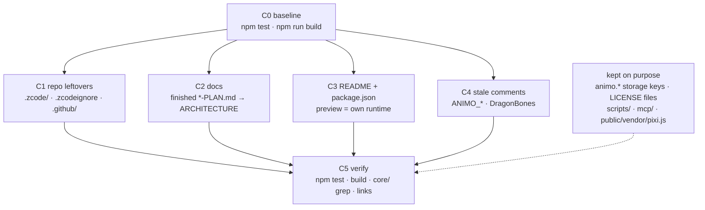

# Cleanup — plan

**Status:** done 2026-10-06 (uncommitted). `scripts/check.sh` gives the baseline: 128 test files
passed, 1 skipped; 2,245 tests passed, 3 skipped; build clean. Left: ARCHITECTURE's opening
"BoneBurst note" still describes the phase-0 state (out of this plan's scope).
Owner decisions (2026-10-06): Q1 fold then delete, Q3 leave in place; Q2 and Q4 had no firm
recommendation, so the non-destructive choice was taken: community files and the
`Amino-Spine2D-Src` URLs stay.

The editor came into M0 by `git subtree` on 2026-10-05 with everything a standalone GitHub
repository carries: its own CI, issue templates, a ZCode tool's session plans, and a docs folder
where fourteen of twenty-one plans were finished. This plan removes what no longer does a job here,
brings the README up to what the editor is now, and leaves the code alone except for comments
that are no longer true. No behaviour changes; `npm test` and `npm run build` must give the same
result before and after.

## What was found (2026-10-06)

| Item | Where | Finding |
|---|---|---|
| ZCode session plans | `.zcode/plans/*.md` (3, tracked) | Plans for done work (Ask AI provider, Poses tab, Reference dock); they still name `mcp/amino-bridge.mjs`, which is now `boneburst-bridge.mjs`. |
| ZCode ignore file | `.zcodeignore` (tracked) | Tool config with Chinese-language sync markers; duplicates `.gitignore`. |
| GitHub scaffolding | `.github/` (CI, issue + PR templates) | GitHub runs workflows only from the repository root, so in M0 `ci.yml` never runs. Its two checks (no spine-pixi in `dist/`, `core/` imports nothing above it) still matter. |
| `.DS_Store` | root, `src/`, `.github/` | Untracked and ignored; local clutter only. |
| Finished plans | `docs/` | 13 say **Done** in their first lines: DRAW-ORDER, EVENTS, GRAPH, IK-PATH, MESH, SKINS, TRANSFORM-CONSTRAINT, PHASE-F, -H, -I, -J, -K, -L. Their content already lives in ARCHITECTURE sections they name. |
| Open or reference plans | `docs/` | PLAN, SPINE-PARITY (checklist), PREVIEW-RUNTIME (cited by code, CI, notices), BONEBURST-PIPELINE (in progress), AI-RIG, CYCLE-PATH (cited by 7 source files), THEME (no status line, cited nowhere). |
| README | `README.md` | Says the Preview runs "the official Spine runtime" (spine-pixi-v8) and its diagram shows `core/export` and spine-pixi-v8. The Preview runs our own runtime (`core/boneburst/runtime/`); spine-pixi-v8 is only `npm run dev:oracle`. CLAUDE.md is already right. |
| package.json | `homepage`, `repository`, `bugs` | Point at `github.com/12pnp/Amino-Spine2D-Src`, the pre-subtree repository. |
| vite.config.ts | `base: process.env.ANIMO_BASE` | Comment is about morenoise.it hosting Animo; nothing here sets `ANIMO_BASE`. |
| Comments | `src/` (34 lines name DragonBones) | Most explain why a structure looks the way it does (Flash/DragonBones transform, reversed slot order) and stay. A few describe runtime extensions that no longer exist (`ANIMO_masks`, `ANIMO_motion_blur` in `types.ts`, `layerTree.ts`, `App.ts`; `exportBoneBurst.ts:184`). |

### Kept on purpose

- **`animo.*` localStorage keys** (`Prefs.ts`, `Workspaces.ts`, `Shell.ts`, `freeze.ts`). Renaming
  them drops every user's preferences and layouts; port 5181 already keeps them apart from Animo's.
  `window.animo` stays too: CLAUDE.md's in-app check uses it.
- `LICENSE`, `LICENSE-EXCEPTION.md`, `THIRD-PARTY-NOTICES.md` (CLAUDE.md ▸ Licensing).
  `CODE_OF_CONDUCT.md`, `CONTRIBUTING.md`, `SECURITY.md`: see question Q2.
- `scripts/` (fixture and motion generators, cited by tests and notices), `scripts/unity-check/`
  (CLAUDE.md: rerun on a header or format change), `mcp/boneburst-bridge.mjs`,
  `public/vendor/pixi.js` (2.4 MB; `preview.html` loads it; listed in the notices).
- Explanatory DragonBones/Flash comments in `core/math/`, `core/doc/` (§3 of M0's CLAUDE.md: keep
  the comment explaining why a structure looks the way it does).

## Steps

### C0 — Baseline
Run `npm test` and `npm run build` in this folder; record pass/fail counts and the `dist/` file
list here. Every later step is checked against it.

**Result:** 128 files passed, 1 skipped; 2,245 tests passed, 3 skipped. Build clean; `dist/` holds
`index.html`, `preview.html`, `favicon.svg`, `vendor/pixi.js` + its licence, and the `main`,
`index`, `preview`, `rig` and three worker chunks — no spine-pixi.

### C1 — Repository leftovers
1. `git rm -r .zcode/ .zcodeignore`.
2. `.github/`: per Q1, either delete it, or move the two meaningful CI checks into a script
   (`scripts/check.sh`: build, test, no spine-pixi in `dist/`, `core/` import grep) that CLAUDE.md's
   Commands section names, then delete `.github/`.
3. Delete local `.DS_Store` files (untracked; not a git change).

**Result:** done. `scripts/check.sh` added (build, test, the spine-pixi and `core/` checks);
CLAUDE.md ▸ Commands and ▸ Licensing and two ARCHITECTURE lines now name it instead of CI.

### C2 — Docs
1. For each of the 14 finished plans, check the ARCHITECTURE section it names covers the
   decisions, including its "changed from the plan" notes (IK-PATH, PHASE-*); copy any missing
   decision into that section.
2. `git rm` them. Fix links to them in `SPINE-PARITY-PLAN.md`, `ARCHITECTURE.md`,
   `IK-PATH-PLAN.md` and the source comments that cite them (`graphEdit.ts`, `GraphPanel.ts`,
   `ikPathEdit.ts`) to point at the ARCHITECTURE section instead.
3. THEME-PLAN: find whether it was built (named themes in Preferences ▸ Interface). Done → same as 1–2;
   not done → add a Status line.
4. CYCLE-PATH-PLAN and AI-RIG-PLAN: add a Status line each (both lack one).
5. Optional per Q3: move the remaining plans to `docs/plans/`.

**Result:** an audit of the 13 against ARCHITECTURE found four decisions only the plans held; each
was added to its section (Events: only the Preview plays sounds; Bone paths: ⇧/⌥ on a chain
bone, checked in `pathDragMode`; Skins: `folder/name` grouping; Transform constraints: no
`properties` maps nothing). Phase H's "no binary `.skel`" stays in SPINE-PARITY-PLAN. THEME was
built (ARCHITECTURE ▸ Preferences); its two unrecorded points were added and it was deleted too,
14 files in all. Links repointed in SPINE-PARITY-PLAN, ARCHITECTURE, `graphEdit.ts`,
`GraphPanel.ts`, `ikPathEdit.ts`. CYCLE-PATH and AI-RIG got Status lines. Q3: left in `docs/`.

### C3 — README and package.json
1. README: the Preview and Play mode run our own runtime; spine-pixi-v8 is the dev oracle only.
   Redraw the diagram with the real paths (`core/boneburst/exportBoneBurst.ts`,
   `core/boneburst/runtime/`), add Export to Unity (pipeline plan R4), and say it lives in M0 beside
   the Unity packages it exports for.
2. package.json `homepage`/`repository`/`bugs`: per Q4.
3. vite.config.ts: keep the `ANIMO_BASE` mechanism or rename it `BONEBURST_BASE`; drop the
   morenoise.it sentence either way.

**Result:** README rewritten (own runtime, Export to Unity, the M0 context, `scripts/check.sh`,
docs list). package.json unchanged (Q4). `ANIMO_BASE` kept (renaming would silently break any
host that sets it); the morenoise.it sentence dropped.

### C4 — Stale comments
Rewrite only comments that state something false today (the `ANIMO_*` runtime extensions,
"only the DragonBones runtime extension ever drew it"). No code lines change.

**Result:** rewritten in `types.ts` (motion blur, the `exclude` note's "mask sidecar"),
`layerTree.ts` and `App.ts` (masks are clipping attachments), `timeline.ts` (the deleted
`frameSplit.ts`), `commands.ts` (`_ske.json`). The `exportBoneBurst.ts:184` comment is true
("nothing does now") and stays.

### C5 — Verify
`npm test` and `npm run build` equal C0; the `core/` import grep prints nothing; `dist/` has no
spine-pixi; `grep -rn` for every deleted file name finds no link left. Then set the Status line here.

**Result:** equal to C0; the grep finds no link to a deleted file.

## Questions for the owner

- **Q1** `.github/`: delete outright, or fold its checks into a local `scripts/check.sh` first?
  Recommended: fold, then delete — the spine-pixi check guards the licence claim.
- **Q2** `CODE_OF_CONDUCT.md`, `CONTRIBUTING.md`, `SECURITY.md`: GitHub community files for a
  public repository. Keep if `Amino-Spine2D-Src` stays public and is still pushed to; otherwise delete.
- **Q3** Leave the open plans in `docs/`, or move them to `docs/plans/`? Recommended: leave
  them (fewer links to change).
- **Q4** Is `github.com/12pnp/Amino-Spine2D-Src` still where this editor is published (e.g. by
  `git subtree push`)? If yes, keep the URLs; if no, drop `homepage`/`repository`/`bugs`.
