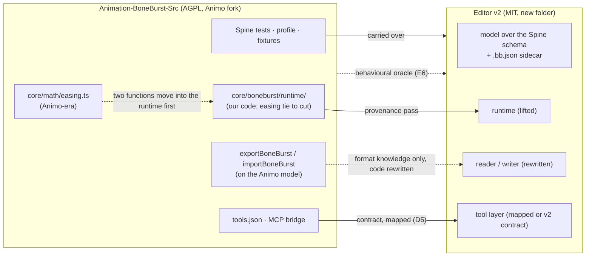

# Editor v2 — from scratch, MIT, no Animo code — plan

**Status:** not started (plan; reviewed against the code 2026-10-06). Owner decisions D1–D5 taken
2026-10-06 (end of this file); next is E0.

**Owner decision 2026-10-05:** replace the Animo-fork editor with a new editor
that contains **no Animo code**, licensed **MIT** from its first commit. The
current editor stays as the workhorse and, later, the behavioural oracle.
(The alternative routes — Morenoise's commercial licence, or staying AGPL —
remain open; asking costs one email and can run in parallel.)

Why this works now, and didn't before: almost everything hard about this
editor is already ours —

| Ours already (lifted after a provenance pass) | What it gives v2 |
|---|---|
| The Spine runtime (`src/core/boneburst/runtime/`; `src/preview/runtime/` is only the Preview's adapters) | the stage **and** the preview: posing, constraints, physics, mesh deformation — the hardest engine part, parity-proven. Written from the format, not from spine-core's source (its own header says so). One tie to cut first: it imports `boneburstPolyline` / `readPolyline` from `core/math/easing.ts`, an Animo-era file; those two functions move into the runtime before it is lifted |
| `tools.json` (50 agent tools) and the MCP bridge | the AI surface. **Not unchanged for free:** about 20 tools speak the current model — `layer` arguments (`attach`, `key_properties`, `make_sequence`, `set_tint`, …), and editor features Spine has no home for (`set_cycle`, `offset_keys`, `get_bone_path` / `set_bone_path`). v2 either maps them (layer → slot name, the rest through the sidecar) or versions the contract; see D5 |
| The Spine 4.3 **format knowledge** and its tests (`core/boneburst/profile.ts`, the importer's and exporter's rules, `tests/spine*.test.ts`) | import/export, and possibly the native document format (below). **The code is not liftable:** `exportBoneBurst.ts` and `importBoneBurst.ts` (~2,500 lines with their modules) read and write the Animo document model (`Project`, `SymbolItem`, `Layer`, nested-symbol flattening), so under rule 5 they are rewritten against v2's model; the tests and the profile carry over |
| `Doc/Format` specs, parity fixtures, harness discipline | the verification method, and the test corpus |
| The AnimatedDrawings sidecar plan | applies to v2 unchanged |

What is actually Animo's, and what v2 must rebuild: the document/frame
algebra, the symbols-layers-keyframes model, the command/undo system, the
stage canvas, the timeline UI, the panels/menus/docking, the PSD-import
bindings. Real work — but a shell around an engine we already own.

## The big simplification: Spine JSON is the document format

Animo has its own project format; v2 doesn't need one. **Open, edit and save
Spine 4.3 JSON directly** (it is a public, documented format, and we already
read and write it). Editor metadata that has no Spine home — view state,
guides, reference images, AI notes — goes into a small sidecar
(`<name>.bb.json`) next to the file. Consequences:

- No proprietary skeleton format to design, version or migrate (the sidecar
  is small, but it is a format: version it from the first field).
- The document model maps 1:1 to the Spine schema, which is publicly
  documented — the spec we implement from is not Animo's code.
- Import/export is lossless by construction **for what Spine can hold**: saving
  **is** exporting.
- Round-trip tests compare against the fixtures we already use, after
  normalising what legitimately differs (key times are written as float32
  values chosen to land on frames; `nonessential` fields; number formatting).

**What this costs — an owner decision (D4), not only a simplification.** Today's
editor authors things Spine JSON has no place for, and its export bakes or drops
them:

- **nested symbols** — flattened into the one skeleton on export; not recoverable
  from the JSON;
- **the editor's eases between frames** — where no Spine curve plays them, the
  export writes the tween frame by frame (62 tweens on one sample today);
- **cycles, bone-path spline handles, layers kept out of the export, library
  folders, PSD source layers**.

v2 either (a) is a **Spine-native editor**: none of these, or only what the
sidecar can carry without changing what the JSON means; or (b) keeps them in
the `.bb.json` sidecar, which then grows into a real format with its own model.
(a) is the smaller, cleaner editor and matches the plan's premise; it is also a
different product from v1 for anyone who animates with nested symbols.

## What "no Animo code" means, operationally

Copyright protects expression, not editing behaviour. A timeline, keyframes,
undo, onion skins — these are ideas every editor shares. The rules:

1. **Never open Animo sources as a template.** Animo runs only as a licensed
   program (it is AGPL to us; running it is fine) — for screenshots, exports
   and side-by-side comparison, never as code to study while writing v2.
2. **No pasting, no porting, no file-by-file translation** of anything from
   the fork into v2 — including by AI, and including "just the structure".
3. **Spec-first**: v2's architecture doc (model, commands, UI regions, tool
   contract binding) is written before implementation, from our own docs and
   the public Spine schema. The commit history must read greenfield.
4. **Own naming, own file layout, own architecture** — not Animo's, even where
   an Animo name is memorable.
5. **Components lifted from the fork** (the "ours already" table) get a
   provenance pass: written by us, no Animo-derived lines, no interleaving
   with Animo code; when in doubt, rewrite.
6. **Honesty flag, same as the spine-core case**: the AI authors (and the
   team) know Animo's code from this project's history. That is recorded
   here, once. The defence is the process above plus the strongest oracle we
   have — byte-level export parity — not a claim of amnesia.

## Phases

| # | Phase | Done when |
|---|---|---|
| E0 | **Charter**: v2 folder created (sibling of `Animation-BoneBurst-Src` in this repo), MIT `LICENSE` + fresh `THIRD-PARTY-NOTICES` (PixiJS, fonts, ag-psd…), the architecture spec above, the clean-code rules pinned in its CLAUDE.md | first commit is greenfield: licence, spec, empty app skeleton |
| E1 | **Model + IO, headless**: document model over the Spine schema + `.bb.json` sidecar (per D4); command/undo stack; open/save round-trips every fixture identically after normalisation (key-time float32, nonessential fields, number formatting) | v2's check script (as `scripts/check.sh` is for v1; there is no CI in this repository) round-trips the parity fixtures with zero diffs |
| E2 | **Stage**: canvas viewport rendering the model through our own runtime — setup pose, bone overlay, selection, transform gizmos, zoom/pan | the stickman fixture is inspectable and editable on screen |
| E3 | **Timeline + playback**: keys, eases, scrub, playback through our runtime; every agent `set_keys`/`show`/`get_pose` works against the new model | an AI keys a walk on a fixture rig via MCP, unmodified tool contract |
| E4 | **Authoring surfaces**: bones/slots/attachments, draw order, skins, constraints (IK, transform, path, physics), mesh edit, PSD import (ag-psd bindings), panels/docking/prefs | the `auto_rig` → `apply_motion` → `check_preview` flow runs end to end |
| E5 | **AI layer re-bind**: `tools.json` onto the new model per D5 (layer → slot names, sidecar-backed tools, or a versioned contract), Ask AI, bridge, AnimatedDrawings sidecar tools | every tool `tests/agentApi.test.ts` exercises passes against v2, or is listed as dropped in the contract's version note; the AD-0..AD-4 plans execute against v2 |
| E6 | **Parity + cutover**: side-by-side with the old editor as oracle; same rigs edited → same exports; docs migrated; the AGPL folder demoted to oracle-only, then archived | v2 is the daily driver; the fork takes no new features |

## Licence handling

- v2 is **MIT from the first commit**, owned by us; we can later sell it,
  open it, or embed it, with no one's permission.
- `THIRD-PARTY-NOTICES.md` starts fresh: MIT libs (PixiJS, ag-psd, fflate…),
  OFL fonts. No AGPL text, no Animo attribution rows (a courtesy credit in
  the readme is allowed and decent, but nothing legal).
- The old AGPL folder: usable as oracle for as long as it exists; when
  archived, AGPL still requires offering its source to whoever received it —
  keeping the repo readable satisfies that.
- The Unity packages and everything else in M0-Animation-2D are untouched by
  this plan.

## Risks

- **Double maintenance** while both editors live: recommend the AGPL fork
  takes bug fixes and data-format work only, all new features go to v2
  (owner call; the alternative — freeze fully — risks stalling daily work).
  If v2 goes ahead, the policy should start now: v1 had a large refactor on
  2026-10-06 (docs/REFACTOR-PLAN.md), and more of that is effort v2 replaces.
- **Feature-parity long tail** (docking UX, PSD edge cases, themes): E4 is
  where the tail hides; keep a "v2 gap list" and cut v1 features nobody here
  uses rather than porting habits.
- **Cutover temptation**: don't switch the daily driver before E4's flows
  run end to end; a half-parity editor costs more than two editors.
- **Taint risk** is managed by the rules above, and stated honestly; if v2 is
  ever challenged, the greenfield history + spec-first commits + export
  byte-parity are the evidence, exactly like the runtime's story.

## Owner decisions

- [x] D1 Fork policy during the build: bug fixes only (recommended) or freeze. **Decided 2026-10-06: bug fixes and data-format work only; new features go to v2.**
- [x] D2 v2 folder name (proposal: `Editor-BoneBurst-Src`, sibling of the old one). **Decided 2026-10-06: `Editor-BoneBurst-Src`.**
- [x] D3 Send the Morenoise email anyway as a hedge (free to ask; a "no" costs
      nothing, a "yes" buys fallback and goodwill). **Decided 2026-10-06: yes; the owner sends it.**
- [x] D4 Document format: (a) Spine-native — no nested symbols, between-frame
      eases, cycles or bone-path handles beyond what the sidecar can carry
      without changing the JSON's meaning (recommended: it is the plan's
      premise and the smaller editor), or (b) a sidecar that carries v1's
      authoring model as a format of its own. **Decided 2026-10-06: (a) Spine-native.** v2 has no
      nested symbols; the sidecar holds only what does not change the JSON's meaning (view state,
      guides, reference images, AI notes).
- [x] D5 Tool contract: keep the 50 tool names and map `layer` → slot name, with
      cycle/offset/path tools backed by the sidecar (recommended if D4 is b),
      or version the contract and drop or rename the tools Spine has no home
      for (recommended if D4 is a). **Decided 2026-10-06, following D4: a versioned contract.** Tools
      keep their names where the meaning holds (`layer` arguments become slot names); `set_cycle`,
      `offset_keys` and the bone-path tools are dropped or renamed, listed in the version note (E5).
