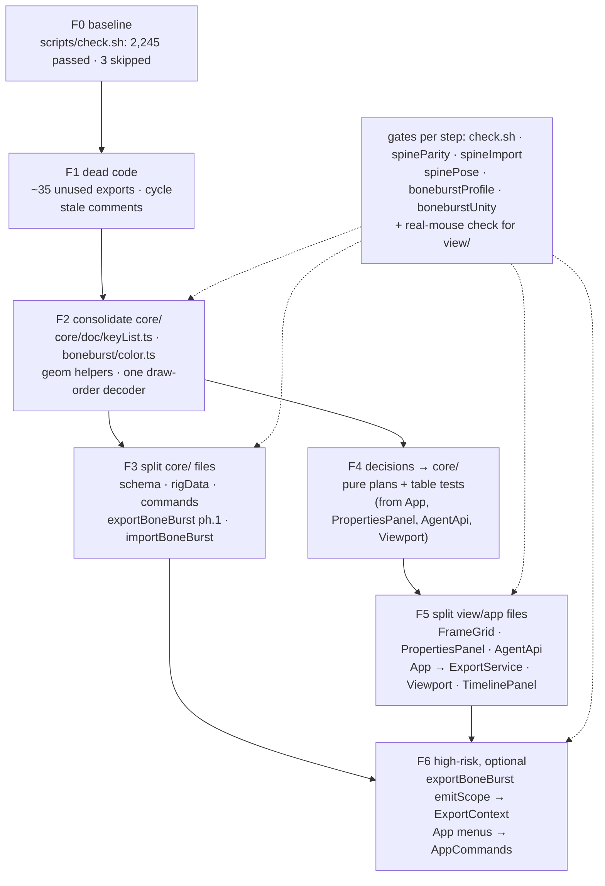

# Refactor — plan

**Status:** done 2026-10-06, uncommitted, except what is listed as left. `scripts/check.sh` passes
(2,427 tests, 3 skipped; 2,245 at F0, the rest new suites); no value-import cycle in `src/`; nothing in
`src/` imports spine-core. Checked in the app (frog and stickman fixtures, real clicks, drags and typing):
stage picking, key drag and undo, the frame menu, arrow nudge, Properties X/W fields, Colour (four blend
modes, no motion blur), the Bone and IK sections and an IK Mix key, snapping a drag. **Left:** F5's
FrameGrid painter/hit split and Viewport's guides (both would expose a dozen private fields as public
state), `deformSel` behind a setter, `validateProject` (640 lines in one function), App's menus (F6).
Owner decisions (2026-10-06), all as recommended: Q1 remove motion blur; Q2 narrow `BlendMode` to Spine's
four; Q3 keep the test-only exports that are decision rules, delete the rest; Q4 no F6.

The editor is 61.7k lines of `src/` and 23k of tests, in good shape where it matters: strict
TypeScript with `noUnusedLocals`, `core/` imports nothing above it, one import cycle in all of
`src/`, and 2,245 tests including frame-by-frame parity with spine-core and the Unity C# runtime.
What has grown is inside the layers: eleven files over 1,000 lines, the same key-list code written
once per key family, three copies of the colour conversion, and decision rules living in panels.
This plan removes dead code first, then consolidates duplicates in `core/`, then splits the large
files, the safest (pure, well tested) before the riskiest (view classes no test names). **No
behaviour change** anywhere: every step ends with `scripts/check.sh` equal to the baseline.

## Findings (2026-10-06)

Measured with an import-graph script and two read-only audits, spot-checked by hand.

| Area | Finding |
|---|---|
| Size | `src/`: core 27.4k, view 22.1k, app 8.6k, io 2.0k, preview 1.4k lines. Over 1,000: `PropertiesPanel` 2006, `FrameGrid` 1994, `exportBoneBurst` 1934, `App` 1785, `AgentApi` 1752, `TimelinePanel` 1425, `commands` 1364, `importBoneBurst` 1243, `rigData` 1203, `Viewport` 1162, `schema` 1135, `Overlay` 1028. |
| Layers | `core/` clean. `view → app` (26 imports, mostly `Store`, `TimelineOps`) is the documented design; `app → view` is `App.ts`/`Shell.ts` composing, plus four small widget imports. One value-import cycle: `view/tools/SelectTool.ts` ↔ `axisEdit.ts` (`selectionSnapshots` one way, `captureEditBase`/`finishEdit` the other). |
| Test reach | No test names `PropertiesPanel`, `FrameGrid`, `Viewport`, `Overlay`, `LibraryPanel` or `Shell`: their splits are checked in the app (CLAUDE.md rule 3), not by vitest. The `core/` files are covered by the parity suites. |
| Key families | IK, transform-constraint, constraint, deform and draw-order keys each re-implement sample (find interval + `applyTween`: `ikKeys.ts:28`, `transformKeys.ts:82`, `constraintKeys.ts:73`, `mesh/deform.ts:67`), move (generic `moveKeys` exists but in `doc/sequence.ts:119`), delete, tween-of and with-tween (`ikKeys.ts` ↔ `transformKeys.ts`, five clone pairs). Commands `SetIkKeys`, `SetTcKeys`, `SetDrawOrder` (and likely `SetDeformKeys`) repeat the generic `SetNodeKeys`. FrameGrid paints and drags each family with near-copies (`drawKeyRow`/`drawTcRow`; five ~22-line `begin*Drag`). |
| Colour | Editor colour ↔ Spine light/dark written three times (`boneburstPose.ts:382,391`, `exportBoneBurst.ts:1606`, `importBoneBurst.ts:946`); Spine hex parsing twice (`importBoneBurst.ts:932`, `runtime/rigData.ts:423`). |
| Draw order | `runtime/rigData.ts:1187 orderFromOffsets` and `doc/drawOrder.ts:105 fromOffsets` decode the same offsets. Equal on valid input; on a malformed key the runtime overwrites (as spine-core does) and the doc version returns null. |
| Geometry | Point-to-segment distance ×7, point-in-polygon ×3, `{x,y}` declared twice (`Matrix2D.Pt`, `geom.Point`), `isDescendant` ×2 (`pose.ts:398`, `view/viewport/nodeFrame.ts:74`), `clamp` ×5, the "smooth" curve `[0.42,0,0.58,1]` ×4. |
| Dead code | ~25 exports referenced only at their definition (e.g. `SnapshotCommand`, `SetAnimationLoop`, `fitDeforms`, `setupSpace`, `eventsAt`, `withTcKeys`, `copyTf`, `lerpAngle`, `determinant`, most of `geom.ts`'s rect helpers, `frag`, `toScene`); ~10 used only by tests; ~10 exported but used only in their own file. |
| Decisions in views | Rules that belong in pure `core/` functions with table tests (CLAUDE.md ▸ How a fix is written): `PropertiesPanel.singleWrite/groupWrite` (field edits), `App.nudge` + `PropertiesPanel.groupIds` (same target filter twice), `App.toggleMask/toggleMasked/swapInstance/placeItem/bindableToBone`, `AgentApi.settleBend/setBonePath`, `Viewport.hitTest`, the `"id:frame"` cell parsing (`TimelinePanel` and `FrameGrid`), `TimelinePanel.deleteDeformKeys`. Pure model math lives in `view/tools/transformOps.ts` and `gizmo.ts` and is imported by App and PropertiesPanel; `describeFrame` (pure) lives in `app/TimelineOps`; `countUsages` (pure) in `view/panels/LibraryPanel`. |
| Wasted work | For runtime-posed symbols `evaluateSymbol` still runs `applyConstraints` and `applyMeshes` (`pose.ts:332,366`), whose result the runtime then overwrites. |
| DragonBones era | Load-bearing, keep: colour as 0–100 multipliers, the skew `Transform`, `TweenSpec` ease range, top-first `layers[]`, the migration chain (both fixtures are v5/v6 files). Cost only: motion blur (model, UI, clipboard; nothing draws it, export warns) — Q1; `BlendMode`'s five non-Spine modes — Q2; "armature"/"DragonBones draws later entries" wording in `types.ts`, `pose.ts`, `displays.ts`, `symbolCommands.ts`, `Matrix2D.ts`. |
| Small | `schema.ts` `MIGRATIONS` written out of order (17–19 after 26), a stale header and a comment over the wrong entry; 21 of 27 steps only bump the version. Orphaned "Build the DragonBones bundle" JSDoc on `App.exportItemPng` (765). `pose.ts:327` cites a deleted `core/math/ik.ts`. Two different `AtlasPage` interfaces (`runtime/atlasRead.ts:15`, `io/atlas/AtlasBuilder.ts:60`). |

### Kept on purpose

The three transform representations (`core/math/Transform.ts`, `core/boneburst/transform.ts`,
`runtime/bones.ts`), the runtime's own π and `wrap180`, its `clamp`, the atlas writer/reader pair,
and `core/doc/timeline.ts` vs `runtime/track.ts`: each is a different job, and the runtime must
stay independent of the document model (ARCHITECTURE ▸ The preview is ground truth, The BoneBurst
runtime). `carry.ts` is not legacy: it carries what an opened Spine file has that the model lacks.

## Rules for every step

- One step, one commit-sized change; `scripts/check.sh` equal to F0 after it.
- Moving a function: **update its importers, no re-export left behind** — one place per thing.
  Vite and `tsc` find every importer; churn is mechanical.
- A step under `core/boneburst/` or `core/doc/pose.ts` also needs `spineParity`, `spineImport`,
  `spinePose`, `boneburstProfile` and `boneburstUnity` green (all in `npm test`; `boneburstUnity`
  runs here, it skips only without the harness's .NET).
- A step under `view/` or `app/` is also checked in the app with real mouse input on
  `frog.boneburst` (CLAUDE.md ▸ Check it in the app too), the panel or gesture it touches.
- A new pure function gets a table test; a consolidation that could change a result gets a test
  that would have failed if the copies disagreed.

## Steps

### F0 — Baseline
`scripts/check.sh`: 128 files passed, 1 skipped; 2,245 tests passed, 3 skipped (two PSD tests
without the optional local file, `unityParity` without a Unity dump). Record here when starting.

**Result:** as above (2,245 passed, 3 skipped).

### F1 — Dead code and small fixes (low risk)
1. Delete the exports used nowhere (list above; re-grep each first). Test-only exports: per Q3.
   Drop `export` from those used only in their own file.
2. Break the `SelectTool` ↔ `axisEdit` cycle: move `selectionSnapshots` into `axisEdit.ts` or a
   new `view/tools/selection.ts`.
3. Comments: the DragonBones reasons for top-first layers and slot order (Spine draws later slots
   in front too), the orphaned App JSDoc, `pose.ts:327`, the misplaced `applyConstraints` doc,
   the `MIGRATIONS` header; reorder `MIGRATIONS` by key (data unchanged).

**Result (2026-10-06):** 26 exports deleted, 10 made file-local (an AST script, diff read by
hand). Q3: `moveKeyframe` and `turnsOf` deleted with their tests; `equalsEps`, `createTrack`,
`ikRoleOf` (test helpers) and `movePivotKeepingArtwork` (a tested rule awaiting a caller) kept.
Cycle broken: `selectionSnapshots` → `view/tools/selection.ts`. Comments fixed (Spine draws later
slots in front; nested symbols are flattened; `Matrix2D` is Flash's layout, not Spine's), the
App JSDoc moved to `exportProject`, `MIGRATIONS` in key order with a true header.
**Q1/Q2 (schema 28):** motion blur removed (types, two commands' fields, schema, clipboard, Properties
panel, icon, export warning); `BlendMode` is Spine's four, the stage no longer draws the other five,
PSD import maps them to normal with its existing warning. The 27 → 28 step and a load-time sanitize
drop both from old files (`tests/blendModes.test.ts`, which fails on the old schema). The two
`DOC_VERSION` tripwire tests moved to 28. **Not verified in the app yet:** the Properties panel's
Colour and Document sections without the motion blur rows (checked with F5).

### F2 — Consolidate in `core/` (low–medium risk, well tested)
1. **`core/doc/keyList.ts`**: generic `sampleKeys(keys, frame, lerp)`, `moveKeys` (from
   `sequence.ts`), `deleteKeys`, `tweenOf`, `withTween`, `withKey`. Rewrite `ikKeys`,
   `transformKeys`, `constraintKeys`, `mesh/deform`, `drawOrder` (keeping its frame-0 collision
   rule) and `sequence` on it; `events.ts` keeps its own move (several events share a frame).
   One `SMOOTH_CURVE` in `core/math/easing.ts`. ~300 lines out.
2. **One generic key command**: `SetNodeKeys` over the record field; `SetIkKeys`, `SetTcKeys`,
   `SetDrawOrder`, `SetDeformKeys` become uses of it (labels and merge rules kept). `SetSkinOnly`
   reuses `EditNode`.
3. **`core/boneburst/color.ts`**: `toLightDark(ct, round)`, `fromLightDark`, `parseSpineColor`;
   used by `boneburstPose`, `exportBoneBurst`, `importBoneBurst`, `runtime/rigData` (the runtime
   may import from `core/boneburst/`; check it stays free of `core/doc`).
4. **One draw-order decoder**: the runtime's `orderFromOffsets` stays the authority (spine-core's
   behaviour on a malformed key); `drawOrder.fromOffsets` calls it and adds its own validity check.
   First a test with a malformed key against spine-core, so the merge cannot change either side.
5. **`core/math/geom.ts`**: `segmentDistance`, `pointInPolygon`, one `Point` type; `isDescendant`
   exported from core and used by `nodeFrame.ts`. The seven/three copies call them.
6. **Skip wasted posing**: `evaluateSymbol` skips `applyConstraints`/`applyMeshes` when the
   runtime will pose the symbol. Guard: `spinePose`, `runtimeDraw`; measure the stage on an
   opened mix-and-match before/after.

**Result (2026-10-06):**
1. `core/doc/keyList.ts` (`keySpan`, `withKeyAt`, `moveKeys`, `deleteKeys`, `withKeyTween`,
   `keyTweenOf`, `keyTweenSpec`, `SMOOTH_CURVE`, `KeyTween`); the per-family copies deleted and
   callers renamed by script (TimelinePanel's own methods of the same names untouched). The
   smooth curve lives here, not in `easing.ts` (`DEFAULT_CUSTOM_CURVE` there is a different
   thing that happens to share the values). `tests/keyList.test.ts`.
2. `core/history/animKeysCommand.ts` `SetAnimKeys` is the base of `SetIkKeys`, `SetTcKeys`,
   `SetDrawOrder`, `SetDeformKeys`, `SetNodeKeys` (constructors unchanged). The seven identical
   private `symbolOf` copies and `animOf` → `core/history/lookup.ts`. `SetSkinOnly` is an
   `EditNode` that never merges, as before. `tests/animKeysCommand.test.ts` passes on the old
   commands too (run in a throwaway worktree). `SetEventKeys` kept: it touches no stage.
3. `core/boneburst/color.ts` (`lightDarkOf`, `colorOfLightDark`) used by pose, export and import.
   The importer's `hexColor` and the runtime's `parseColor` stay apart: they read short or
   three-channel strings differently, and merging them could change what an opened file shows.
4. **Changed from the plan:** the two draw-order decoders stay. They do different jobs (the
   importer's refuses a malformed key so it stays carried; the runtime's plays it as spine-core
   does), and merging would tie `core/doc` to the runtime's raw JSON. Instead each names the other
   and `tests/drawOrder.test.ts` holds them equal on all 120 orders of five slots.
5. `geom.ts` `segmentDistance`, `inFlatPolygon`; seven distance and three polygon copies call them
   (autoRig's projection kept: it needs the projected point). `Pt` (×2) folded into `Point`.
   `isDescendant` exported from `core/doc/pose.ts`, the view copy deleted.
6. `evaluateSymbol(…, solve = false)` + `solvePose`; `posedSymbol` skips the editor's constraints
   and meshes when the runtime has a bone or slot for every entry (it overwrites `world`,
   `spine`, `outline`; neither solve writes `local`). Checked: every sample rig's posed frames
   (16 rigs, 323 frames) identical with and without the skip. Single-run timing per frame:
   mix-and-match 0.99 → 0.81 ms, raptor 0.45 → 0.17 ms, spineboy-pro 0.17 → 0.15 ms.
F2 total: `scripts/check.sh` passes, 2,386 tests (new suites included).

### F3 — Split `core/` files (low risk: top-level pure functions)
In order of value per risk:
1. `schema.ts` → `migrations.ts` (`MIGRATIONS`, `migrate`) + `schemaSanitize.ts` (the
   `sanitize*`/`*Read` helpers).
2. `runtime/rigData.ts` → `rigTypes.ts`, `rigAttachments.ts`, `rigAnimation.ts`; `readRig` stays.
   `attachmentIds` (WeakMap) keeps one home.
3. `history/commands.ts` → library commands into `libraryCommands.ts`, `layerCommands.ts`,
   `hierarchyCommands.ts` (with `createsCycle` beside `wouldCreateCycle`), `settingsCommands.ts`.
4. `exportBoneBurst.ts`, phase 1 → `exportChannels`, `exportTimelines`, `exportNames`,
   `exportCarry` (colour already gone to F2.3). `emitScope` stays (F6).
5. `importBoneBurst.ts` → the 520-line `importBoneBurst` split into phases (bones, slots,
   constraints, animations, re-modelling) over an `ImportCtx`; `importConstraints.ts`;
   `boneComps`/`colorComps` into `importKeys.ts`. Phase order is load-bearing: keep it explicit.

**Result (2026-10-06):** done with TypeScript's own "Move to file" refactor driven through the
language service (it rewrites every importer), then a tidy pass (`@/` aliases outside the runtime,
no self-imports, all-type imports as `import type`). No re-exports left behind.
1. `schema.ts` 1,135 → 742: `migrations.ts` (`MIGRATIONS`, `migrate`), `schemaSanitize.ts` (the
   sanitizers and `clampInt`); `BLEND_MODES` beside `BlendMode` in `types.ts`.
2. `runtime/rigData.ts` 1,203 → 236 (`readRig`): `rigTypes.ts`, `rigJson.ts` (`num`, `obj`, `list`,
   `parseColor`), `rigAttachments.ts`, `rigAnimation.ts` (with `attachmentIds`, one home).
3. `history/commands.ts` 1,364 → 554 (node commands): library commands into `libraryCommands.ts`,
   `layerCommands.ts`, `hierarchyCommands.ts` (`createsCycle` stays here: it is a node's parent
   chain, a different check from `wouldCreateCycle`'s symbol nesting), `settingsCommands.ts`. The
   `MaskState` re-export dropped; importers use `core/doc/layerTree`.
4. `exportBoneBurst.ts` 1,934 → 906: `exportTypes.ts` (shared types and constants first, so no
   cycle), `exportColor.ts`, `exportChannels.ts`, `exportTimelines.ts`, `exportStructure.ts`,
   `exportCarry.ts`. `emitScope` stays (F6, not done).
5. `importBoneBurst.ts` 1,243 → ~540: `importAnimation.ts` (one animation's import over an
   explicit `AnimationImport` context, the 125-line loop body), `importConstraints.ts`,
   `importEditable.ts` (re-modelling opened meshes; it poses, so it is not `importMesh.ts`, which
   stays pure), bone and colour channels into `importKeys.ts`, `importRead.ts`. **Changed from the
   plan:** only the animation phase left the 520-line function (now 405); the bone, slot and skin
   phases share a dozen maps and stay inline.
Three cycles the moves created (`exportCarry`↔`exportStructure`, `exportChannels`↔`exportTimelines`,
the importer four) were closed by moving the one helper each (`rides`, `lerpColor`, `IK_FIELDS`,
`frameOf`); a value-import cycle check over `src/` finds none. `scripts/check.sh` passes.
**Left large:** `validateProject` (640 lines in one function) was not in this plan.

### F4 — Decisions out of views and app into `core/` (medium value, low risk)
Each becomes a pure function with a table test; the caller only applies the result:
`fieldTransform`/`groupFieldWrite` (PropertiesPanel; needs `snapshotOf`, `moveBy`, `rotateAbout`
moved from `view/tools/transformOps.ts` to `core/doc/`), `editTargets` (App.nudge +
PropertiesPanel.groupIds), `toggleMaskPlan`/`maskedPlan`, `swapTargets`, `placementPlan`,
`bindPlan`, `bendFlipNeeded` (`core/rig`), `pathKeysPlan` (`core/doc/bonePath`), the AgentApi
ease helpers into `core/math/easing`, `pickNode` (`core/doc/pick.ts`, asset lookup passed in),
`parseFrameCells`, `deleteKeysPlan`. Move the pure `describeFrame` to `core/doc/timeline` and
`countUsages` to `core/doc`. Matrix-only helpers in `view/tools/gizmo.ts` used by App go to core.

**Result (2026-10-06):** each rule below is now a pure function with a table test; its caller
only applies the result.
- `view/tools/transformOps.ts` moved whole to `core/doc/transformOps.ts` (it imported only core).
  There: `editTargets` (the topmost-unlocked filter written four times: App nudge, Free Transform,
  `selectionSnapshots`, and Properties, which keeps locked layers), `fieldTransform` and
  `groupFieldWrite` (Properties' typed fields), with `FieldKey`, `GroupSnapshot`.
- `core/doc/colorEffect.ts`: `deriveColorMode`, `colorToHex`, `hexToPct`.
- `core/doc/layerTree.ts`: `toggleMaskPlan`, `toggleMaskedPlan` (App's Mask / Masked toggles and
  their menu checks now read one rule each).
- `core/doc/nodePlans.ts`: `swapTargets`, `bindPlan`. **Behaviour change (a fix):** Swap Instance's
  menu allowed image, symbol and empty nodes, but the command skipped only bones and groups, so a
  box, point or path selected beside an image was turned into an image node. One rule now
  (`tests/nodePlans.test.ts`).
- `core/rig/rigPlan.ts` `bendFlipNeeded` (AgentApi's `settleBend` decision; breaking it fails three
  auto_rig tests).
- `core/doc/pick.ts` `pickNode` (Viewport's hit test; the alpha probe is passed in).
- `core/doc/frameCells.ts` (`frameCell`, `parseFrameCell`, `frameCellBounds`): the "id:frame"
  selection cells were parsed by hand in four places and written in five.
- `countUsages` → `core/doc/libraryTree.ts`, taking the project. `describeFrame` was only ever
  re-exported, never called: deleted, with `FrameGrid`'s and `TimelineOps`' re-exports.
**Changed from the plan:** `placementPlan` not made (two named one-line rules in `placeItem`);
`deleteKeysPlan` not made (the branches pick which store op to call: tidied in place, one
`deleteKeys` and one label rule); the AgentApi ease and path-key helpers are argument parsing that
throws the agent's error, so they go to `agentArgs.ts` in F5, not to `core/math/easing`; no
`gizmo.ts` helper is used by App, so none moved. `scripts/check.sh` passes, 2,427 tests.

### F5 — Split view and app files (medium risk: checked in the app)
1. `FrameGrid.ts`: one `horizontalDrag(el, e, {first, frameWidth, onStep, onEnd})` for the ~11
   `begin*Drag` methods (~250 lines out); `drawTcRow`/`drawIkRow` on `drawKeyRow`; then painters to
   `FrameGridPaint.ts` over a snapshot of the grid state, hit zones to `frameGridHit.ts`. Make
   `deformSel` private with a setter (TimelinePanel writes it).
2. `PropertiesPanel.ts`: after F4, section builders into `view/panels/props/` (colour, bone+IK,
   transform, mesh, constraints, skin, document) over a `PropsCtx` (`fields`, `ikSync`, `docSync`,
   `suppress`, `linked`); `signatureOf` must still cover every section.
3. `AgentApi.ts`: modules of functions over an `AgentCtx` (`agentRead`, `agentRig`, `agentMotion`,
   `agentKeys`, `agentAttach`, `agentVision`, `agentArgs`); the `call` switch stays. Tests go
   through `call()`, so churn is low.
4. `App.ts`: `app/ExportService.ts` (PNG, project, folder, Unity export and failure reporting).
5. `Viewport.ts`: `GuideController.ts`, `SnapController.ts` (picking already moved in F4).
6. `TimelinePanel.ts`: the 15 `*Menu` methods into `timelineMenus.ts`.

**Result (2026-10-06):** class methods became functions taking the class as their first argument
(a converter over the TypeScript AST; each new module starts from the original's own imports and
drops the unused ones, so nothing is imported from anywhere new — an earlier pass with TypeScript's
auto-import picked spine-core's `TransformConstraint` and was thrown away).
1. `FrameGrid.ts` 1,994 → 1,852: one `dragFrames` for eight of the `begin*Drag` methods (key, span,
   event, draw order, deform/sequence/inherit/constraint, transform, property, onion markers; the IK
   drags also move vertically and stay); `drawTcRow` is `drawKeyRow`. **Not done:** painters and hit
   zones to their own files (they read ~15 private fields), `deformSel` behind a setter (TimelinePanel's
   menus read and write it throughout).
2. `PropertiesPanel.ts` 2,006 → 522: sections in `view/panels/props/` (`colorSection`, `boneSection`
   with IK and `linkRow`, `transformSection`, `meshSection` with Sequence, `constraintSections`,
   `skinSection`, `documentSection` with Instance and the frame note). The panel's builder kit (`row`,
   `section`, `scrubStep`, the sync lists) is public to them.
3. `AgentApi.ts` 1,752 → 262 (`call` and the shared helpers): `agentRead`, `agentKeys`, `agentRig`,
   `agentMotion`, `agentAttach`, `agentSkins`, `agentPaths`, `agentLook` (with the picture constants
   and `IMAGES_KEY`), `agentArgs` (parsers, ease names, `AgentError`). The tool `deleteKeys` is
   `deleteBoneKeys` (it shadowed `keyList`'s). `PosesPanel` calls `renderPoses(api, …)`.
4. `App.ts` 1,785 → 1,529: `app/ExportService.ts` (PNG, project, folder and Unity export, failure
   reports, the once-per-problem atlas explanation); it takes a PNG renderer, not the Library panel.
5. `Viewport.ts` 1,162 → 977: `SnapController` owns the snap state (session, path dot, lines) and
   reads the stage through a small `SnapStage`. **Changed from the plan:** no `GuideController`: the
   guides keep one piece of private state and moving them would expose five more.
6. `TimelinePanel.ts` 1,425 → 849: the 14 menus and `drawOrderItems`/`PROP_NAMES` in
   `timelineMenus.ts`.
ARCHITECTURE updated where it names moved code (snapping, the AI bridge, `transformOps`).

### F6 — High-risk splits (optional, per Q4)
1. `exportBoneBurst.emitScope` (400 lines, a 235-line `emitLayer`) and `clipSlot`/`childScope` into
   `exportScope.ts` with an `ExportContext` holding the ~28 accumulators. Output order is
   load-bearing; only behind the full parity suite plus a byte-for-byte comparison of every
   fixture's and sample's export before and after.
2. `App.buildMenus`/`registerCommands` (~400 lines, ~50 App methods) into `AppCommands.ts`.

## Size and order

F1 ½ day · F2 2–3 days · F3 1–2 days · F4 2 days · F5 3–4 days · F6 2 days. F1→F2 first (they
shrink what F3–F5 move); F3 and F4 are independent; F5 after F4.

## Questions for the owner

- **Q1** Motion blur: nothing draws it and the export drops it with a warning. Remove the
  Properties UI and the model fields (a schema step drops them from old files)? Recommended: yes.
- **Q2** `BlendMode`: narrow to Spine's four (a schema step maps the other five to normal, with
  the export's current warning moved to the open), or keep the nine as editor-only? Recommended:
  narrow — the export already flattens them.
- **Q3** Exports used only by tests (`occupiesFrame`, `isTweened`, `moveKeyframe`, `createTrack`,
  `ikRoleOf`, `turnsOf`, `equalsEps`, `parseBvh`, `contrastRatio`, `movePivotKeepingArtwork`):
  delete with their tests, or keep as table-tested rules? Recommended: keep the ones that are
  decision rules (`occupiesFrame`, `isTweened`, `contrastRatio`, `parseBvh`), delete the rest.
- **Q4** Do F6 at all? Recommended: not now — F1–F5 get most of the gain; F6 is high risk for
  files the parity suites already hold.
