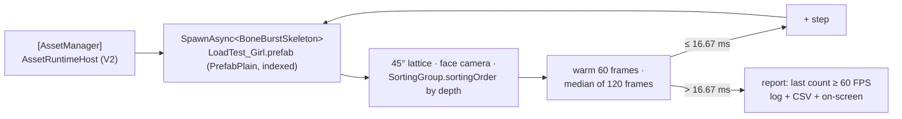

# BoneBurst load test scene: spawn through AssetSystem V2 until under 60 FPS — plan

**Status:** plan written 2026-10-04 (owner: "use new AssetSystem, create new LoadTest scene: 1 add SortingGroup / Sort3dAs2D
to spine, 2 gen ton of spine along 45° facing the camera, with sort order, 3 increase more and more until FPS < 60").
In progress.

A new scene, `Assets/Scenes/BoneBurstLoadTest.unity`, spawns mix-and-match-pro skeletons **through AssetSystem V2**
(`AssetRuntime`: `SpawnAsync` of an indexed prefab), on a field laid out at 45° to a perspective camera. Every skeleton
faces the camera and sorts through a `SortingGroup` with **Sort 3D As 2D**. It adds skeletons step by step and stops
at the first step whose median frame time is above 16.67 ms (under 60 FPS). The answer is the count before that step.

## 1. Parts

| Part | What | Why |
|---|---|---|
| `Assets/BoneBurstDemo/LoadTest/BoneBurstLoadTest_Girl.prefab` | `BoneBurstSkeleton` (mix-and-match-pro, `full-skins/girl`, `walk`) + `SortingGroup` with **Sort 3D As 2D** on | `m_Sort3DAs2D` is a serialized field only (no public property in 6000.6), so it is set once in the prefab, by an Editor script. It sits in `Assets/BoneBurstDemo`, the addressable target folder, so SmartAddresser indexes it as `PrefabPlain`, which V2 spawns |
| `Assets/BoneBurstLoadTest/BoneBurstLoadTest.cs` + asmdef `Module.UZ.BoneBurstLoadTest` | the ramp driver; `[ExpectBuiltInAsset(PrefabPlain)] IndexGenericAsset` prefab reference; `SpawnAsync` / `Despawn` through V2 | `Module.PB.AssetRuntime` is not auto-referenced, so the script needs its own asmdef (U tier: a test topping over PB) |
| `Assets/Scenes/BoneBurstLoadTest.unity` | `[AssetManager]` (V2 host), a perspective camera looking down the field, the driver | built by an Editor script, not by hand |

## 2. Layout and sorting

*   **45°:** the field is a square lattice in X/Z rotated 45° about Y, so its rows run diagonally away from the camera.
    The camera looks at it from above and in front (about 30° down). Each spawn takes the next free lattice point,
    nearest first, so the field grows outward and backward.
*   **Facing the camera:** each skeleton copies the camera's rotation (a billboard), so its plane faces the lens.
*   **Sort order:** every skeleton's `SortingGroup.sortingOrder` is set from its distance to the camera (nearer = higher),
    so a skeleton in front draws over one behind. **Sort 3D As 2D** makes the group sort as 2D sprites even though the
    camera is perspective.

## 3. The ramp

*   vSync off, uncapped frame rate. Start with 100, step +100. After each step: 60 warm-up frames, then the median of 120
    frames (`Time.unscaledDeltaTime`).
*   Stop at the first step above 16.67 ms. Report the last count at ≥ 60 FPS and the failing step, with both medians:
    `Debug.Log`, an on-screen label, and `loadtest.csv` beside the benchmark's results.
*   `-quit` on the command line quits a player when the ramp ends.

## 4. Steps

| Step | Deliverable | Verification |
|---|---|---|
| **L1** | prefab (Editor script), SmartAddresser Apply + Index | the prefab has a `PrefabPlain` index; the duplicate query is empty |
| **L2** | driver + asmdef | M0 compiles; tiercheck PASS |
| **L3** | scene (Editor script) | Editor Play: skeletons spawn through V2, face the camera, sort by depth (a capture through `editor-window-capture`) |
| **L4** | a release IL2CPP player of this scene into a new `Build/` folder; one run | the count at which it drops under 60 FPS, in the log and the CSV |
