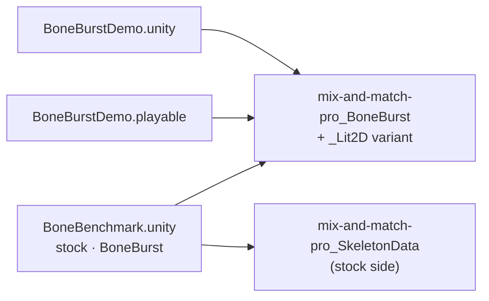

# Changelog — project work (Assets/Docs-Plan)

What changed in M0's project assets (scenes, the demo, the benchmark), newest first. Package changes have their own
changelogs (`Packages/<pkg>/Doc/CHANGELOG.md`). Each entry leads with the change, says why and what guards it.

## 2026-10-06

- **BoneBurst Editor v2, E5 step 5: the AI building tools, and an AI-rigged figure via auto_rig** (`Editor-BoneBurst-Src/`). `add_bones`, `attach`, `add_ik`, `draw_order`, `auto_rig`, `add_transform_constraint`, `map_transform`, `add_physics`, `add_slider`, `make_path`, `set_constraint_order`, `set_point`, `add_attachment` in `src/agent/build.ts`; a tool building on its own parts runs as one History gesture posed between them (`inStep`); bones placed from joint and tip under any parent, slots moved onto bones staying put. `auto_rig`'s planner lifted from v1's `autoRig.ts` after its provenance check (ours; `src/agent/rig/`), v1's `rigPlan.ts` rewritten. Fixed: the IK bend check measured the joint after the solve (never fired); a 4.3 transform constraint now gets its identity property map (without one it moves nothing); a one-piece limb picture goes on the limb's first bone (changed on screen: an arm picture on the forearm left the shoulder when waving). Version note: `attach`, `draw_order`, `set_point`, `add_attachment`, `add_bones` (meaning). Plan: [E5-PLAN.md](../../Editor-BoneBurst-Src/docs/E5-PLAN.md). Guard: `tests/agentBuild.test.ts` (8; planted faults fail it); `npm run check` (376 vitest + 2 browser tests); on screen the figure PSD rigged over MCP from joints read off `render_frame`, then a keyed wave.

- **BoneBurst Editor v2, E5 step 4: the AI key tools, and an AI-keyed walk over MCP** (`Editor-BoneBurst-Src/`). `new_animation`, `set_keys`, `delete_keys`, `key_properties`, `key_ik`, `key_transform`, `key_constraint`, `key_draw_order`, `define_event`, `key_event`, `set_inherit` in `src/agent/keys.ts`, each call one History step "AI: …" (`src/agent/apply.ts`); `set_keys` merges by bone and frame, takes left-out values from the pose, and sets a curve per channel (`setKeyCurve`); new pure edits `src/edit/events.ts` and `drawOrderAt`/`reorderFront`; `get_animation` lists constraint, draw order and event keys. Fixed: poses for the tools were taken at a frame's float64 time, a hair before its float32 key (an IK mix read the value before the key); an ease on a key still last on its timeline is reported instead of dropped silently; a flat channel reads linear. Version note: `new_animation`, `key_draw_order` added, `key_properties` corrected (bones). Plan: [E5-PLAN.md](../../Editor-BoneBurst-Src/docs/E5-PLAN.md). Guard: `tests/keyEdits.test.ts` (3) and `tests/agentKeys.test.ts` (6); planted faults fail them; `npm run check` (368 vitest + 2 browser tests); on screen a 19-key walk keyed on the stickman over MCP, feet never below the ground, a clean cycle, played, undone in one step.

- **BoneBurst Editor v2, E5 step 3: the AI read tools** (`Editor-BoneBurst-Src/`). `get_rig`, `get_animation`, `get_pose`, `get_reference`, `show` and `render_frame` in `src/agent/read.ts`, over a context the editor provides (`src/agent/context.ts`; built from the session in `src/ui/agent/context.ts`): keys and setup poses read local and absolute, eases by `set_keys`' names, `seam`/`cycle` from the poses at both ends; `render_frame` draws with an offscreen copy of the stage's renderer, framed on the drawn figure (changed on screen: framing on every bone left the stickman a third of the picture), bones named and paths drawn. Version note: `show` takes one skin (view state, no undo step) and `get_reference` returns v2's still references (meaning). Plan: [E5-PLAN.md](../../Editor-BoneBurst-Src/docs/E5-PLAN.md). Guard: `tests/agentRead.test.ts` (6, posed by the stage's `Poser`; four planted bugs fail them); `npm run check` (359 vitest + 2 browser tests); on screen a stand-in MCP client read the stickman, rendered frames and showed `run` at frame 6 with `alt`.

- **BoneBurst Editor v2, E5 step 2: the MCP bridge and the editor's AI button** (`Editor-BoneBurst-Src/`). `mcp/bridge.mjs`, lifted from v1's bridge after its provenance check (ours, Node built-ins only): MCP over stdio, the HTTP side the editor tab long-polls on 127.0.0.1:5191 (v1 keeps 5190), Ask AI's chat with Claude or GLM; `initialize` hands the client the contract's version note; v2's prompts and origins; the old `AMINO_*` aliases dropped. `src/agent/host.ts` checks each call's arguments against its schema (`src/agent/schema.ts`) and runs it (`undo`, `redo` built; the rest answer that they are not built yet); `src/ui/agent/bridge.ts` and the toolbar's AI button (dot: off, looking, connected; kept as the `ai` preference). Fixed on screen: the dot waited up to 25 s for the first long poll. Plan: [E5-PLAN.md](../../Editor-BoneBurst-Src/docs/E5-PLAN.md). Guard: `tests/bridge.test.ts` (6, the bridge as a child process with a fake page and provider) and `tests/agentHost.test.ts` (3); four planted faults fail them; `npm run check` (353 vitest + 2 browser tests); on screen an MCP client over stdio undid an edit made in the editor.

- **BoneBurst Editor v2, E5 step 1: the AI tool contract versioned per D5, its version note gated** (`Editor-BoneBurst-Src/`, `Animation-BoneBurst-Src/docs/EDITOR-V2-PLAN.md`). E5 planned ([E5-PLAN.md](../../Editor-BoneBurst-Src/docs/E5-PLAN.md)); its done-when reworded by the owner so it no longer contradicts D5 (the flow's six tools keep v1's names and arguments; the rest of the contract is versioned). v1's `tools.json` (ours, Phase 9, checked by git before it was opened) is frozen in `tests/fixtures/tools-v1.json`; v2's `src/agent/tools.json` serves 46 tools with a `version` block listing 4 dropped (`set_cycle`, `offset_keys`, `get_bone_path`, `set_bone_path`) and 7 with slot names for layers. `src/agent/contract.ts`'s `contractProblems` fails `npm run check` on an unlisted drop, rename or reshape, a line for a change that did not happen, or any argument change to a flow tool; `src/agent` gets a layer rule. Guard: `tests/contract.test.ts` (3 tests; three planted faults on the real file fail it); `npm run check` (344 vitest + 2 browser tests).

- **BoneBurst Editor v2: E4 done — step 15, popout windows verified and guarded by Playwright** (`Editor-BoneBurst-Src/`, `Animation-BoneBurst-Src/docs/EDITOR-V2-PLAN.md`). `e2e/popout.spec.ts` pops the Rig and the Stage into new windows from the tab menu (`page.waitForEvent('popup')`) and checks they draw there with the editor's styles, edit the document in the main window, take keys, and come back on close; `npm run e2e`, and `npm run check` runs it. `@playwright/test` 1.63.0 dev-only (Apache-2.0, notices row). The closing session saw popouts on screen and, by hand, skins, mesh editing with weights and constraint drawing. E4 closed in its plan, the v2 plan (E0–E4 done, E5 next) and the status line; the weight brush and guide snapping stay parked for after E5. Plan: [E4-PLAN.md](../../Editor-BoneBurst-Src/docs/E4-PLAN.md). Guard: `npm run check` (341 vitest + 2 browser tests); four planted popout breaks fail the browser tests (one only after the test was made to hide the overlay).

- **BoneBurst Editor v2, E4 step 14: re-importing a PSD into an existing rig** (`Editor-BoneBurst-Src/`). A PSD dropped on the open rig brings its changes in: layers match atlas regions by the first import's names; region attachments take the new pixels, place and size (through their bone, a scaled region staying scaled); meshes keep vertices, UVs and weights and take the new pixels cut to their picture (pixels past it reported); new layers become slots above their Photoshop neighbour; hidden or deleted layers are kept; a moved root is detected. One undo step, with the atlas, pages and the files Save owes following it. New `io/png` decodes and encodes page PNGs exactly (no canvas rounding semi-transparent colours), used for re-imports and every save of pages. Refused with the reason for premultiplied atlases, kept rotated regions and missing pages. Plan: [E4-PLAN.md](../../Editor-BoneBurst-Src/docs/E4-PLAN.md). Guard: `npm run check` (341 tests, incl. `tests/png.test.ts` and `tests/psdReimport.test.ts`; eight planted bugs fail them); on screen a rigged, meshed, animated figure re-imported from a changed PSD, undone, redone, saved and read back identical.

- **BoneBurst Editor v2, E4 step 13a: icons — Lucide plus restyled Godot editor icons, vendored** (`Editor-BoneBurst-Src/`). Lucide 1.52.0 (commit `500620a2`, ISC; 27 files unmodified) for the general chrome and the domain glyphs it has; 16 Godot editor icons from 4.7.2-stable (commit `ed1daf0b`, MIT, © Godot Engine contributors) redrawn by `scripts/godot-icons.py` as one-path 24×24 `currentColor` outlines for what Lucide lacks (constraint kinds, mesh, bounding box, key kinds, curves). Files, licences and a `MANIFEST.md` per set in `public/vendor/icons/`, two THIRD-PARTY-NOTICES rows; no npm package (runtime dependencies still ag-psd and dockview-core). `ui/icons.ts` draws them as CSS masks in the toolbar, rig rows, timeline and reference panel, following the theme. Owner request. Plan: [E4-PLAN.md](../../Editor-BoneBurst-Src/docs/E4-PLAN.md). Guard: `npm run check` (330 tests, incl. `tests/icons.test.ts`; three planted faults fail it); on screen in both themes with every constraint and attachment kind. **Not verified:** icons in a popout window (the browser pane cannot open one), moved to step 15. Also corrects step 13's entry: 325 tests, not 328.

- **BoneBurst Editor v2, E4 step 13: reference images dragged on the stage** (`Editor-BoneBurst-Src/`). The chosen reference (its row in the Reference panel, or a double-click on its picture) is outlined with corner handles; dragging inside moves it, a corner sizes it about its centre, Escape puts it back. Only the chosen one takes presses, so the stage still pans over the others; changes are the sidecar's (saved, not undo steps). Plan: [E4-PLAN.md](../../Editor-BoneBurst-Src/docs/E4-PLAN.md). Guard: `npm run check` (325 tests, incl. the step 13 tests in `tests/sidecar.test.ts`; two planted bugs fail them); on screen the stickman's reference chosen, moved, sized, put back with Escape, saved and opened again in place. One zoom change seen once and not reproduced is recorded in the plan.

- **BoneBurst Editor v2, E4 step 12: constraints drawn on the stage** (`Editor-BoneBurst-Src/`). Each active constraint is drawn in the pose shown, coloured by kind (IK links and target rings, transform links, path curves with their bones, physics rings, slider squares), the selected one in the accent colour; a press on one selects it (before a bone picked only by its segment, after the selected bone and bone origins); Preferences ▸ Show constraints. Fixed: the rig panel kept the previous document's rows when a new one opened at the same history revision. Plan: [E4-PLAN.md](../../Editor-BoneBurst-Src/docs/E4-PLAN.md). Guard: `npm run check` (322 tests, incl. `tests/constraintShapes.test.ts`; two planted bugs fail it); on screen Stretchyman's paths, IK and transforms drawn and a path picked on the stage.

- **BoneBurst Editor v2: E4 wrap-up decisions (owner)** (`Animation-BoneBurst-Src/docs/EDITOR-V2-PLAN.md`, `Editor-BoneBurst-Src/docs/E4-PLAN.md`). The `auto_rig` → `apply_motion` → `check_preview` check moves from E4 to E5 and becomes E5's primary done-when (end to end via MCP on a fixture rig, against the unmodified tools contract). E4 is done when every authoring surface is seen working in the browser, popouts included, with a permanent Playwright popout regression. Remaining E4 steps: constraints drawn on the stage, references dragged on the stage, PSD re-import, one closing verification session; the weight brush and snapping to guides are parked for after E5. Plans only; no code.

- **BoneBurst Editor v2, E4 step 11: keying constraints and deforms** (`Editor-BoneBurst-Src/`). In Animate mode a constraint's animatable values (IK, transform, path, physics, slider; physics Reset) show the pose at the playhead and key it, the key's other values kept where they were; dragging a mesh vertex on the stage keys the mesh's deform (weighted or not), one undo step per drag. Keys follow Spine's defaults, and `setKey` now drops a value keyed back to its default instead of keeping the old one. Plan: [E4-PLAN.md](../../Editor-BoneBurst-Src/docs/E4-PLAN.md). Guard: `npm run check` (317 tests, incl. `tests/animKeys.test.ts`, posed alike by both runtimes; three planted bugs fail it); on screen an IK mix and two torso deform keys on the stickman's `dance`, saved file identical to the same keys in Node (26 poses alike). Transform keys checked in tests only (the stickman has none).

- **BoneBurst Editor v2, E4 step 10: preferences** (`Editor-BoneBurst-Src/`). A Preferences dialog (⚙ in the toolbar, ⌘, / Ctrl+,) sets the theme (system, light, dark), rulers and bones on the stage (hidden bones still pick), the undo steps kept (50–5000, for the next document) and new references' opacity; changes apply at once and are kept in the browser's storage (`boneburst.preferences`, versioned; unreadable or out-of-range values are the defaults; blocked storage runs on the defaults). The toolbar's file name now shrinks instead of wrapping. Plan: [E4-PLAN.md](../../Editor-BoneBurst-Src/docs/E4-PLAN.md). Guard: `npm run check` (309 tests, incl. `tests/preferences.test.ts`); on screen each preference changed and seen, kept through a reload, reset. The ⌘, key itself could not be sent by the browser tool; a keyboard-shaped event opened the dialog.

- **BoneBurst Editor v2, E4 step 9: the Reference panel** (`Editor-BoneBurst-Src/`). Reference pictures to rig and animate against, kept in the sidecar: added with the panel's Add image… or by dropping images on an open document, drawn behind the skeleton, placed, scaled, faded, ordered and removed in the panel. Opening matches each reference to an opened image by file name; a missing one is kept, marked and named in the notes, and filled when its file is dropped. A panel arriving tabbed beside another no longer takes the front tab. Plan: [E4-PLAN.md](../../Editor-BoneBurst-Src/docs/E4-PLAN.md). Guard: `npm run check` (301 tests, incl. reference edits and refusals, the drawn quad, picture matching); on screen a reference placed over the stickman, saved, reopened missing and then with its picture.

- **BoneBurst Editor v2, E4 step 8: the sidecar in the app, and guides** (`Editor-BoneBurst-Src/`). The `<name>.bb.json` sidecar (SPEC §3) now opens with its skeleton and puts back the view it keeps (camera, skin, animation); Save writes it beside the skeleton when it holds guides, references or notes or was opened, and only when its text changed. The stage has rulers; guides are dragged out of them, moved, and dragged back to remove them; they make the sidecar need saving but are not undo steps, and the skeleton's text never changes with them. Plan: [E4-PLAN.md](../../Editor-BoneBurst-Src/docs/E4-PLAN.md). Guard: `npm run check` (298 tests, incl. guide edits, the view round trip, sidecar picking, ruler hit tests); on screen guides made on the stickman, saved with the view, reopened with guides, camera, skin and animation back.

- **BoneBurst Editor v2, E4 step 7: PSD import, with `ag-psd` (owner decision D7)** (`Editor-BoneBurst-Src/`). Opening or dropping a Photoshop file makes a new rig: a slot and region per visible layer on the root bone, placed where the layer is (the canvas's bottom centre is the origin), in Photoshop's stacking order, with layer and group opacity and the blends Spine has; each layer trimmed and packed into atlas pages; the first save writes the atlas and pages beside the skeleton. Hidden and empty layers and unsupported blends are reported; non-RGB or 16-bit files and layers larger than a page are refused with the reason. D7 (recorded in the v2 plan, amending D6) adds `ag-psd` 31.0.2 exact with `base64-js` and `pako`, all in THIRD-PARTY-NOTICES; the check script requires exactly pinned `ag-psd` and `dockview-core`. Plan: [E4-PLAN.md](../../Editor-BoneBurst-Src/docs/E4-PLAN.md). Guard: `npm run check` (292 tests, incl. `tests/psd.test.ts` on PSDs written in the test and the `figure.psd` fixture, posed alike by spine-core; three planted bugs fail it); on screen the fixture dropped, shown, saved and read back, identical to the same import in Node.

- **BoneBurst Editor v2, E4 step 6: weights** (`Editor-BoneBurst-Src/`). A mesh binds to the bones chosen in its properties, weighted by distance on the setup pose with every vertex kept in place; a weighted mesh lists the bones it follows (add, remove), shows a bone's weights as vertex colours on the stage, weights again automatically, unbinds, and edits the selected vertex's weights (the other bones share the rest in proportion). The step 5 geometry edits now work on weighted meshes. Deform keys keep their setup-pose offsets through every bind, unbind, weight and vertex change; untouched vertices keep theirs exactly as written. Fixed while testing: the 0.01 weight cut compared raw weights, not shares. Plan: [E4-PLAN.md](../../Editor-BoneBurst-Src/docs/E4-PLAN.md). Guard: `npm run check` (283 tests, incl. `tests/weights.test.ts` on spineboy-pro and hero-pro, posed alike by both runtimes; planted bugs fail it); on screen the stickman's torso bound to three bones, reshaped and reweighted, the saved file identical to the same mesh in Node (26 poses through `dance` and `run` alike).

- **BoneBurst Editor v2, E4 step 5: mesh geometry** (`Editor-BoneBurst-Src/`). A region converts to a mesh that draws the same image in the same place; with a mesh selected on the setup pose the stage draws its triangles, outline and vertices, drags a vertex (the image stays put; Alt stretches it), adds one inside or on the outline, and deletes the selected one (Delete), each one undo step; Triangulate redoes the triangles. Triangulation is ours (ear clipping, insertion, Delaunay flips keeping the outline). Deform keys keep moving the old vertices as before when vertices are added or deleted. Weighted meshes are shown, not edited, until weights (step 6). Plan: [E4-PLAN.md](../../Editor-BoneBurst-Src/docs/E4-PLAN.md). Guard: `npm run check` (276 tests, incl. `tests/mesh.test.ts`: every region of spineboy-pro and raptor-pro converted showing the same pixels, deform keys of goblins, hero-pro and spineboy-pro unchanged after adds and deletes, both runtimes posing alike; three planted bugs fail it); on screen the stickman's torso converted and shaped, the saved file identical to the same geometry built in Node (26 poses alike).

- **BoneBurst Editor v2, E4 step 4: constraints** (`Editor-BoneBurst-Src/`). A Constraints view in the rig panel lists the constraints in the order they apply, moves them earlier or later, deletes them and adds any of the five kinds (IK, transform, path, physics, slider) from the selection, leaving the pose as it was (an IK gets a target bone at the bone's tip; transform and slider mixes start at 0). The properties panel edits each kind's references and values and marks it skin-required; renames and deletes follow the name into skins' lists and animations' timelines; broken references are refused with the reason. IK, transform and path constraints always keep `bones` (spine-core's reader needs it). The properties panel no longer stays on the old selection while a checkbox or menu in it has focus. Plan: [E4-PLAN.md](../../Editor-BoneBurst-Src/docs/E4-PLAN.md). Guard: `npm run check` (268 tests, incl. `tests/constraints.test.ts` on spineboy-pro, Stretchyman, hero-pro and celestial-circus, posed alike by the engine and spine-core; three planted bugs fail it); on screen on the stickman a transform constraint added, raised, reordered and made skin-required for a new skin, the saved file identical to the same edits in Node (39 poses alike, 2.1e-9).

- **BoneBurst Editor v2, E4 step 3: skins** (`Editor-BoneBurst-Src/`). A Skins view in the rig panel adds, duplicates and deletes skins (choosing one shows it); skin properties rename it and turn its skin-required bones and constraints on and off; a bone can be marked skin-required; an attachment can move to another skin; new regions go in the shown skin. Per-skin deform and sequence timelines and linked meshes' skin references follow every edit; the default skin is fixed; a skin another skin's linked mesh draws from cannot be deleted. The dev server may serve the sample folder (dev only). Plan: [E4-PLAN.md](../../Editor-BoneBurst-Src/docs/E4-PLAN.md). Guard: `npm run check` (256 tests, incl. `tests/skins.test.ts` on goblins, hero-pro and mix-and-match, posed alike by the engine and spine-core; a rename that forgets the timelines fails); on screen a mix-and-match outfit duplicated and changed, the same edits in Node posed alike (455 poses, 2.1e-6).

- **BoneBurst Editor v2, E4 step 2: building the rig's structure** (`Editor-BoneBurst-Src/`). The rig panel adds, deletes and reparents bones; adds, deletes, renames and sets slots (bone, shown attachment, colours, blend); adds region attachments from the atlas and edits, renames and deletes them; reorders slots in a draw order view. Renames rewrite every reference; deletes cascade where they must and are refused with the reason where they would guess; draw order keys (and 4.3 folders) are rewritten to keep drawing what they drew. Reparenting keeps the bone where it is. An atlas opened alone starts a new skeleton. Selection is typed (bone, slot, attachment). Plan: [E4-PLAN.md](../../Editor-BoneBurst-Src/docs/E4-PLAN.md). Guard: `npm run check` (249 tests, incl. `tests/rig.test.ts`: every edited sample keeps the profile, round-trips and is posed alike by the engine and spine-core; four draw-order tests fail with the remapping off); a rig built on screen from the stickman's atlas, saved, read back with no issue and posed identically by both runtimes. Popout windows (step 1) still not verified on screen.

- **BoneBurst Editor v2, E4 step 1: panels and docking on Dockview (owner decision D6)** (`Editor-BoneBurst-Src/`). D6 recorded in the v2 plan. `dockview-core` 8.4.0 (MIT, exact, no dependencies) is v2's only runtime dependency and owns the whole shell: Stage, Timeline, Rig and Properties are Dockview panels that split, tab, float, maximize and pop out from Dockview's own tab menu; the fixed CSS grid is gone. Panel ids reserved for all seven panels, default places in one module, the layout kept in browser storage and restored on reload; a saved layout naming a panel this build lacks defers it quietly. Dockview's dark and light themes coloured through `--dv-*` variables; Inter and JetBrains Mono vendored as unmodified woff2 files with their OFL texts (deterministic screenshots); THIRD-PARTY-NOTICES lists all three as shipped. Plan: [E4-PLAN.md](../../Editor-BoneBurst-Src/docs/E4-PLAN.md). Guard: `npm run check` (224 tests, incl. `tests/workspace.test.ts`), plus a gate that `dockview-core` stays the only, exactly pinned runtime dependency; floating, tabbing, splitting and reload checked in the browser. **Not verified:** popout windows on screen (the built-in browser cannot open one; Claude in Chrome was not connected).

- **BoneBurst Editor v2, E3: timeline and playback** (`Editor-BoneBurst-Src/`). Animations are made, renamed and deleted; the stage and the inspector key bones at the playhead; the timeline scrubs, selects, moves, deletes and eases keys (a bezier's handles follow its interval's ends); playback runs through the engine. Pure key edits (`src/edit/keys.ts`, `curves.ts`, `boneKeys.ts`, `animations.ts`) are what E5's agent tools will call; the MCP criterion moved from E3 to E5 (owner; v2 plan updated). Fixed on the way: a slider `time` key without a value is 1 (spine-core, Format §11.9), the runtime read 0 — fixed in the engine and in `Animation-BoneBurst-Src`'s runtime (physics `mix` default to the spec's 1 too, not probed); keys stored a float32 step off their frame now match (a drag moved nothing, a move could stack two keys on one frame); stage picking prefers the selected bone, then origins. Plan: [E3-PLAN.md](../../Editor-BoneBurst-Src/docs/E3-PLAN.md). Guard: `npm run check` (214 tests): every edited document posed alike by the engine and spine-core; a walk keyed on the stickman in the browser read back alike (152 poses, worst 1.1e-7); v1 `scripts/check.sh` 2,427 passed. Not covered: physics on screen, draw order and event authoring.

- **BoneBurst Editor v2, E2: the runtime lifted as its engine, and a stage that edits the setup pose** (`Editor-BoneBurst-Src/`). Provenance pass first: every runtime file is ours (P0–P5, 2026-10-05), no Animo lines; its two ties to the fork (bezier helpers, `BoneBurstInherit`) moved into `Animation-BoneBurst-Src/src/core/boneburst/runtime/` before the lift (v1 check: 2,427 passed). spine-core knowledge in the solvers stays an open legal question (SPEC §6). `src/engine/` reads plain JSON from the document and the model's atlas; `src/ui/` draws with WebGL2 (blend modes, two-colour tint, stencil clipping), with bones, selection, move/rotate/scale gizmos (one undo step per drag), zoom and pan, an outline, an inspector, skins, open by file or drop, and save. Plan: [E2-PLAN.md](../../Editor-BoneBurst-Src/docs/E2-PLAN.md). Guard: `npm run check` (169 tests): the engine against spine-core 4.3.13 (dev only) on every sample and the stickman, ~2,080 poses within 1e-4 (a flipped IK bend fails 7, dropped curves 15); gizmo maths exact under turned, unevenly scaled, mirrored parents; checked in the browser on the stickman. Not covered: physics in the oracle, the Open… dialog and the download by hand.

- **BoneBurst Editor v2, E1: the document, headless** (`Editor-BoneBurst-Src/`). An order-preserving JSON reader (`JSON.parse` moves integer-like keys first; Spine reads names in document order), the Spine 4.3 skeleton as typed immutable data with unknown keys kept, Spine JSON, atlas and sidecar in and out, the BoneBurst profile check, and undo over whole documents with gestures (`updateBone`, `renameBone`). Plan: [E1-PLAN.md](../../Editor-BoneBurst-Src/docs/E1-PLAN.md). Guard: `npm run check` (129 tests): all 16 sample skeletons and 19 atlases round-trip with zero differences (breaking the writer fails 14), 14 broken-file profile cases caught, layer and DOM guards fail on planted violations. Written from the Doc/Format specs; the fork's sources were not opened.

- **BoneBurst Editor v2 started (E0): `Editor-BoneBurst-Src/`, MIT, no Animo code.** MIT `LICENSE`, fresh `THIRD-PARTY-NOTICES.md`, the architecture spec (`docs/SPEC.md`: Spine JSON as the document, immutable model, a versioned sidecar, undo over whole documents), the clean-room rules in its `CLAUDE.md`, and an empty Vite + TypeScript app on port 5185. Written from the v2 plan, the Doc/Format specs and Spine's public format; the fork's sources were not opened. Root `.gitignore`, `.gitattributes` and `CLAUDE.md` list the folder. Plan: [EDITOR-V2-PLAN.md](../../Animation-BoneBurst-Src/docs/EDITOR-V2-PLAN.md). Guard: its `scripts/check.sh` (build, 3 tests, no Spine runtime import, fork-name tripwire). Next: E1.

- **The BoneBurst editor is version 0.2.0** (`Animation-BoneBurst-Src/package.json`, shown in About): the refactor removed motion blur and moved saved documents to version 28, which an older editor refuses, so the minor version moves.

- **BoneBurst editor v2: owner decisions D1–D5 taken** (docs only): the Animo-fork editor takes bug fixes and data-format work only; v2 lives in `Editor-BoneBurst-Src/`; the Morenoise email goes out as a hedge (owner); v2 is Spine-native (no nested symbols, sidecar for view state only); the tool contract gets a new version. Plan: [EDITOR-V2-PLAN.md](../../Animation-BoneBurst-Src/docs/EDITOR-V2-PLAN.md). Next: E0.

- **BoneBurst editor v2 plan: a new MIT editor with no Animo code** (`Animation-BoneBurst-Src/docs/`, docs only). Reviewed against the code before landing: the runtime's real folder and its one Animo-era tie (`core/math/easing.ts`), the reader/writer as rewrite rather than lift, about 20 of the 50 tools tied to the current model, and Spine JSON as the document format costing nested symbols, between-frame eases, cycles and bone-path handles. Two owner decisions added (D4 document format, D5 tool contract). Plan: [EDITOR-V2-PLAN.md](../../Animation-BoneBurst-Src/docs/EDITOR-V2-PLAN.md). Not started.

- **The BoneBurst editor refactored: dead code out, duplicates merged, large files split** (`Animation-BoneBurst-Src/`). F1: ~26 unused exports deleted, the one import cycle broken, stale DragonBones comments fixed; motion blur removed and `BlendMode` narrowed to Spine's four (owner, Q1/Q2; document version 28 drops both from older files). F2: one key-list module for every key family, one base for the key-list commands, one colour conversion, shared geometry; opened Spine rigs skip posing work the runtime overwrites (identical output on every sample, raptor 0.45 → 0.17 ms a frame). F3: `schema`, `rigData`, `commands`, `exportBoneBurst`, `importBoneBurst` split by job. F4: decision rules out of App, Properties, AgentApi, Viewport and the timeline into pure `core/` functions with table tests; fixes Swap Instance turning a selected box into an image. F5: AgentApi, PropertiesPanel, TimelinePanel menus, App's exports and Viewport's snapping split out. Plan: [REFACTOR-PLAN.md](../../Animation-BoneBurst-Src/docs/REFACTOR-PLAN.md). Guard: `scripts/check.sh` (2,427 passed, 3 skipped; parity and the Unity C# check included), no import cycles, checked in the app with real input. Left: FrameGrid painters, Viewport guides, `validateProject`.

- **The BoneBurst editor folder cleaned up** (`Animation-BoneBurst-Src/`, no behaviour change). Removed the ZCode session plans and `.zcodeignore`, and `.github/`, whose CI never ran from a subfolder; its two checks (no spine-pixi in `dist/`, `core/` imports nothing above it) moved into `scripts/check.sh` with the build and tests. Fourteen finished plans deleted after an audit moved the five decisions only they held into ARCHITECTURE; links repointed. README brought up to date (own runtime, Export to Unity, M0); comments that were no longer true rewritten. Plan: [CLEANUP-PLAN.md](../../Animation-BoneBurst-Src/docs/CLEANUP-PLAN.md). Guard: `scripts/check.sh` equal to the baseline (2,245 passed, 3 skipped, build clean).

- **`.claude/skills/` in this repository**: the four gates the root CLAUDE.md names (`parity-harness`, `unity-playtest`, `assembly-tier-check`, `managed-reference-check`), copied from M0-Animation2D's last commit (not another session's uncommitted edit there) with the project name updated; the first commit had left `.claude/` out. Guard: each runs here and passes (parity 215 of 215 bit-exact; compile 0 errors; tiers; managed references).

- **Pipeline plan R5 (a desktop shell for the BoneBurst editor) skipped**, owner's decision (docs only): the editor stays a browser app. Plan: [BONEBURST-PIPELINE-PLAN.md](../../Animation-BoneBurst-Src/docs/BONEBURST-PIPELINE-PLAN.md).

- **The BoneBurst editor exports straight into Unity: File › Export to Unity…** (`Animation-BoneBurst-Src/`, editor). The document's folder is remembered (IndexedDB `unityExport`, database version 3); the atlas is `.atlas.txt`; the skeleton is written last so the import package's new `BoneBurstRebakeOnChange` rebakes a whole export. The AI's `export_to_unity` does the same once a folder is granted. Plan: [BONEBURST-PIPELINE-PLAN.md](../../Animation-BoneBurst-Src/docs/BONEBURST-PIPELINE-PLAN.md) R4. Guard: `tests/unityExport.test.ts`, the menu item seen in the app; editor suite 2,245 passed. **Not verified:** the loop by hand (the folder picker is the user's).

## 2026-10-05

- **The BoneBurst editor fits mocap: five AnimatedDrawings takes as motion clips** (`Animation-BoneBurst-Src/`, editor only). `core/rig/bvh.ts` reads BVH and poses its joints, `bvhClip.ts` reads each frame from the character's facing into the library's clip format, and `scripts/buildBvhMotions.ts` writes `wave_hello`, `dab`, `jumping`, `zombie_walk` and `dance` from AnimatedDrawings' MIT example takes (not the CMU one) for `apply_motion`. Why: step 2 of the pipeline, the AI animating a rig from real motion. Plan: [BONEBURST-PIPELINE-PLAN.md](../../Animation-BoneBurst-Src/docs/BONEBURST-PIPELINE-PLAN.md) R3 (AD-3). Guard: every clip fits the stickman in one undo step with the feet on or above the ground; spine-unity's Goblins, opened, given `zombie_walk` and exported, is posed the same by this project's BoneBurst C# runtime (editor suite 2,239 passed). **Not verified:** AnimatedDrawings' joint detection (AD-0..2, not installed); spineboy-pro, whose transform constraints the retarget does not model.

- **The `~` folders are in git: `Samples~`, `Data~`, `Tools~` (914 files).** The first commit left them out: a global `*~` rule in `~/.gitignore_global` hides them, and the new `.gitignore` lacked M0-Animation2D's re-includes (`!Samples~/`, `!Data~/`, `!Tools~/`), now copied. Why: BoneBurst's tests read `Data~` and spine-unity's `Samples~`, and the parity harness is `Tools~/ParityHarness`; a clone had none of them. Found by R2 of [BONEBURST-PIPELINE-PLAN.md](../../Animation-BoneBurst-Src/docs/BONEBURST-PIPELINE-PLAN.md). Guard: `git check-ignore` on the harness and the test data prints nothing.
- **M0-Animation-2D starts as a new repository, with the BoneBurst editor in `Animation-BoneBurst-Src/`.** The Unity project is committed as copied from M0-Animation2D (binaries through LFS with its `.gitattributes`), then the editor (AGPL, a separate program) is added with its 108 commits by `git subtree`, kept out of LFS, its `node_modules/` and `dist/` ignored, and its paths to the Unity project made relative to this root. Why: the editor writes the Spine 4.3 JSON the import package bakes; one repository keeps both moving together. Plan: [BONEBURST-PIPELINE-PLAN.md](../../Animation-BoneBurst-Src/docs/BONEBURST-PIPELINE-PLAN.md) (R0). Guard: the editor's suite (2,166 tests, the spine-unity samples found) and build pass in place. **Not verified:** Unity opening this copy; the M2 projects still take BoneBurst from M0-Animation2D (R0 step 7).

- **`manifest.json` takes `com.editor-tools.texturepacker`** (M1-Plugins-Custom, by `file:` path; `packages-lock.json` follows). Why: the editor tool the rim masks are painted from (the demo's `mix-and-match-pro_rim.png`, BoneBurst changelog 2026-10-02). Guard: the Editor resolves and compiles it, 0 errors; the BoneBurst suites above pass with it present.
- **Project assets renamed with the packages: `Assets/BoneBurstDemo`, `Assets/BoneBenchmark` (`-boneBench`), `Scenes/BoneBurstDemo.unity`, `Scenes/BoneBenchmark.unity`, `mix-and-match-pro_BoneBurst(_Lit2D).asset`, `BoneBurstDemo.playable`.** Moved with their metas (GUIDs kept); GameObject, timeline-clip, asset and material names changed through a `run_script` builder, then reserialized. Plan: [BoneBurst-Rename-Plan.md](../../Packages/com.module.ta-creator-boneburst/Doc/Review/BoneBurst-Rename-Plan.md). Every BoneBurst behaviour in the scenes resolves; the timeline loads 8 objects, 0 null. **Not verified:** Apply & Index and a player run (see the plan).

## 2026-10-02

- **Demo, timeline and benchmark on mix-and-match-pro; the spineboy-pro demo assets are gone.** The demo scene's four spineboys
  are mix-and-match-pro in `full-skins/girl` (CPU idle, CPU run with the timeline, GPU skinning, Lit2D + tint black
  through a new `mix-and-match-pro_BoneBurst_Lit2D.asset`), spaced 6 apart, with the camera fitted. The timeline's
  3 clips, both benchmark sides (a new `Skin` field; switch set idle, walk, run, pickaxe-action, shovel-run), and the
  stock material follow. `Assets/BoneBurstDemo/spineboy-pro*` deleted (owner); SmartAddresser Apply + Index (no
  row left, no duplicate index). Plan: [Demo-MixAndMatch-Plan.md](Demo-MixAndMatch-Plan.md). Why: owner, "remove
  spineboy-pro … convert to mix-and-match-pro_BoneBurst". Guard: Editor 433 + 1 skipped of 434, SpineUnity 24, play
  37, timeline 14 / 13, harness 215 of 215; a Scene-view capture of the five skeletons. New benchmark baseline at
  2000 (IL2CPP release): BurstCpu 3.95 / 3.85 / 5.46 ms against Stock 38.3 / 39.0 / 42.6 (idle / walk / switch),
  9.7× / 10.1× / 7.8×. The test-data sample `Tests/Editor/Data~/samples/spineboy-pro` stays, as the stock-parity corpus.
