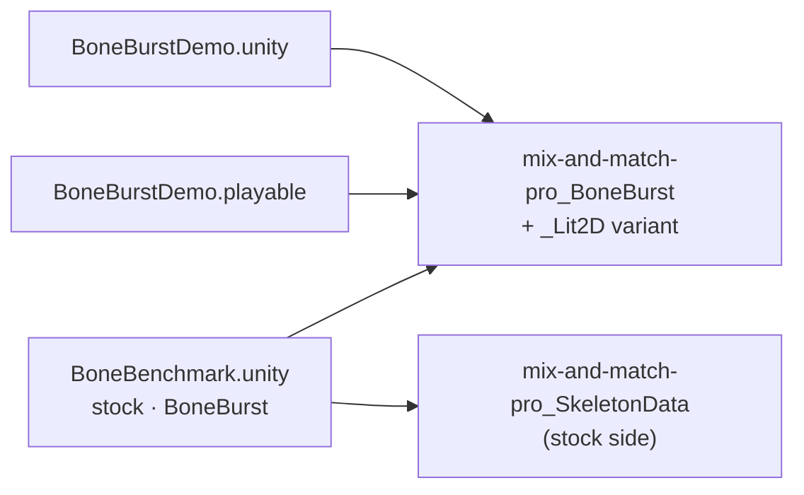

# Changelog — project work (Assets/Docs-Plan)

What changed in M0's project assets (scenes, the demo, the benchmark), newest first. Package changes have their own
changelogs (`Packages/<pkg>/Doc/CHANGELOG.md`). Each entry leads with the change, says why and what guards it.

## 2026-10-05

- **M0-Animation-2D starts as a new repository, with the BoneBurst editor in `Animation-BoneBurst-Src/`.** The Unity project is committed as copied from M0-Animation2D (binaries through LFS with its `.gitattributes`), then the editor (AGPL, a separate program) is added with its 108 commits by `git subtree`, kept out of LFS, its `node_modules/` and `dist/` ignored, and its paths to the Unity project made relative to this root. Why: the editor writes the Spine 4.3 JSON the import package bakes; one repository keeps both moving together. Plan: [BONEBURST-PIPELINE-PLAN.md](../../Animation-BoneBurst-Src/docs/BONEBURST-PIPELINE-PLAN.md) (R0). Guard: the editor's suite (2,166 tests, the spine-unity samples found) and build pass in place. **Not verified:** Unity opening this copy; the M2 projects still take BoneBurst from M0-Animation2D (R0 step 7).

- **`manifest.json` takes `com.editor-tools.texturepacker`** (M1-Plugins-Custom, by `file:` path; `packages-lock.json` follows). Why: the editor tool the rim masks are painted from (the demo's `mix-and-match-pro_rim.png`, BoneBurst changelog 2026-10-02). Guard: the Editor resolves and compiles it, 0 errors; the BoneBurst suites above pass with it present.
- **Project assets renamed with the packages: `Assets/BoneBurstDemo`, `Assets/BoneBenchmark` (`-boneBench`), `Scenes/BoneBurstDemo.unity`, `Scenes/BoneBenchmark.unity`, `mix-and-match-pro_BoneBurst(_Lit2D).asset`, `BoneBurstDemo.playable`.** Moved with their metas (GUIDs kept); GameObject, timeline-clip, asset and material names changed through a `run_script` builder, then reserialized. Plan: [BoneBurst-Rename-Plan.md](../../Packages/com.module.ta-creator-boneburst/Doc/Review/BoneBurst-Rename-Plan.md). Every BoneBurst behaviour in the scenes resolves; the timeline loads 8 objects, 0 null. **Not verified:** Apply & Index and a player run (see the plan).

## 2026-10-02

- **Demo, timeline and benchmark on mix-and-match-pro; the spineboy-pro demo assets are gone.** The demo scene's four spineboys
  are mix-and-match-pro in `full-skins/girl` (CPU idle, CPU run with the timeline, GPU skinning, Lit2D + tint black
  through a new `mix-and-match-pro_BoneBurst_Lit2D.asset`), spaced 6 apart, with the camera fitted. The timeline's
  3 clips, both benchmark sides (a new `Skin` field; switch set idle, walk, run, pickaxe-action, shovel-run), and the
  stock material follow. `Assets/BoneBurstDemo/spineboy-pro*` deleted (owner); SmartAddresser Apply + Index (no
  row left, no duplicate index). Plan: [Demo-MixAndMatch-Plan.md](Demo-MixAndMatch-Plan.md). Why: owner, "remove
  spineboy-pro … convert to mix-and-match-pro_BoneBurst". Guard: Editor 433 + 1 skipped of 434, SpineUnity 24, play
  37, timeline 14 / 13, harness 215 of 215; a Scene-view capture of the five skeletons. New benchmark baseline at
  2000 (IL2CPP release): BurstCpu 3.95 / 3.85 / 5.46 ms against Stock 38.3 / 39.0 / 42.6 (idle / walk / switch),
  9.7× / 10.1× / 7.8×. The test-data sample `Tests/Editor/Data~/samples/spineboy-pro` stays, as the stock-parity corpus.
