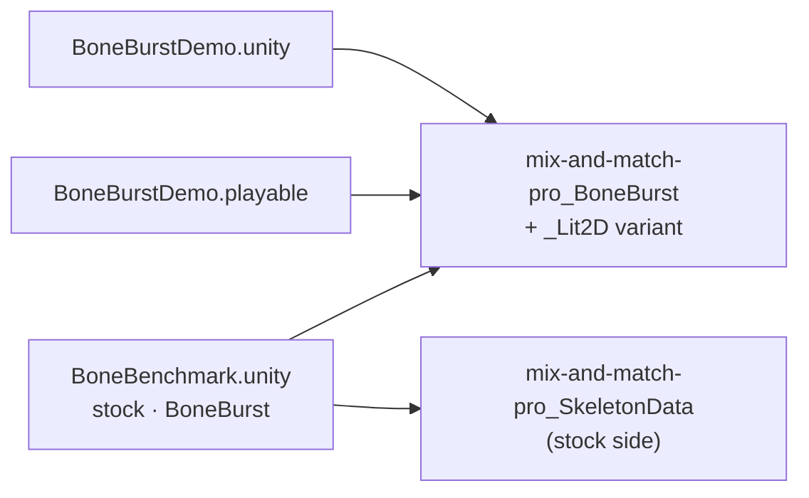

# Changelog — project work (Assets/Docs-Plan)

What changed in M0's project assets (scenes, the demo, the benchmark), newest first. Package changes have their own
changelogs (`Packages/<pkg>/Doc/CHANGELOG.md`). Each entry leads with the change, says why and what guards it.

## 2026-10-06

- **BoneBurst Editor v2, E4 step 3: skins** (`Editor-BoneBurst-Src/`). A Skins view in the rig panel adds, duplicates and deletes skins (choosing one shows it); skin properties rename it and turn its skin-required bones and constraints on and off; a bone can be marked skin-required; an attachment can move to another skin; new regions go in the shown skin. Per-skin deform and sequence timelines and linked meshes' skin references follow every edit; the default skin is fixed; a skin another skin's linked mesh draws from cannot be deleted. The dev server may serve the sample folder (dev only). Plan: [E4-PLAN.md](../../Editor-BoneBurst-Src/docs/E4-PLAN.md). Guard: `npm run check` (256 tests, incl. `tests/skins.test.ts` on goblins, hero-pro and mix-and-match, posed alike by the engine and spine-core; a rename that forgets the timelines fails); on screen a mix-and-match outfit duplicated and changed, the same edits in Node posed alike (455 poses, 2.1e-6).

- **BoneBurst Editor v2, E4 step 2: building the rig's structure** (`Editor-BoneBurst-Src/`). The rig panel adds, deletes and reparents bones; adds, deletes, renames and sets slots (bone, shown attachment, colours, blend); adds region attachments from the atlas and edits, renames and deletes them; reorders slots in a draw order view. Renames rewrite every reference; deletes cascade where they must and are refused with the reason where they would guess; draw order keys (and 4.3 folders) are rewritten to keep drawing what they drew. Reparenting keeps the bone where it is. An atlas opened alone starts a new skeleton. Selection is typed (bone, slot, attachment). Plan: [E4-PLAN.md](../../Editor-BoneBurst-Src/docs/E4-PLAN.md). Guard: `npm run check` (249 tests, incl. `tests/rig.test.ts`: every edited sample keeps the profile, round-trips and is posed alike by the engine and spine-core; four draw-order tests fail with the remapping off); a rig built on screen from the stickman's atlas, saved, read back with no issue and posed identically by both runtimes. Popout windows (step 1) still not verified on screen.

- **BoneBurst Editor v2, E4 step 1: panels and docking on Dockview (owner decision D6)** (`Editor-BoneBurst-Src/`). D6 recorded in the v2 plan. `dockview-core` 8.4.0 (MIT, exact, no dependencies) is v2's only runtime dependency and owns the whole shell: Stage, Timeline, Rig and Properties are Dockview panels that split, tab, float, maximize and pop out from Dockview's own tab menu; the fixed CSS grid is gone. Panel ids reserved for all seven panels, default places in one module, the layout kept in browser storage and restored on reload; a saved layout naming a panel this build lacks defers it quietly. Dockview's dark and light themes coloured through `--dv-*` variables; Inter and JetBrains Mono vendored as unmodified woff2 files with their OFL texts (deterministic screenshots); THIRD-PARTY-NOTICES lists all three as shipped. Plan: [E4-PLAN.md](../../Editor-BoneBurst-Src/docs/E4-PLAN.md). Guard: `npm run check` (224 tests, incl. `tests/workspace.test.ts`), plus a gate that `dockview-core` stays the only, exactly pinned runtime dependency; floating, tabbing, splitting and reload checked in the browser. **Not verified:** popout windows on screen (the built-in browser cannot open one; Claude in Chrome was not connected).

- **BoneBurst Editor v2, E3: timeline and playback** (`Editor-BoneBurst-Src/`). Animations are made, renamed and deleted; the stage and the inspector key bones at the playhead; the timeline scrubs, selects, moves, deletes and eases keys (a bezier's handles follow its interval's ends); playback runs through the engine. Pure key edits (`src/edit/keys.ts`, `curves.ts`, `boneKeys.ts`, `animations.ts`) are what E5's agent tools will call; the MCP criterion moved from E3 to E5 (owner; v2 plan updated). Fixed on the way: a slider `time` key without a value is 1 (spine-core, Format §11.9), the runtime read 0 — fixed in the engine and in `Animation-BoneBurst-Src`'s runtime (physics `mix` default to the spec's 1 too, not probed); keys stored a float32 step off their frame now match (a drag moved nothing, a move could stack two keys on one frame); stage picking prefers the selected bone, then origins. Plan: [E3-PLAN.md](../../Editor-BoneBurst-Src/docs/E3-PLAN.md). Guard: `npm run check` (214 tests): every edited document posed alike by the engine and spine-core; a walk keyed on the stickman in the browser read back alike (152 poses, worst 1.1e-7); v1 `scripts/check.sh` 2,427 passed. Not covered: physics on screen, draw order and event authoring.

- **BoneBurst Editor v2, E2: the runtime lifted as its engine, and a stage that edits the setup pose** (`Editor-BoneBurst-Src/`). Provenance pass first: every runtime file is ours (P0–P5, 2026-10-05), no Animo lines; its two ties to the fork (bezier helpers, `BoneBurstInherit`) moved into `Animation-BoneBurst-Src/src/core/boneburst/runtime/` before the lift (v1 check: 2,427 passed). spine-core knowledge in the solvers stays an open legal question (SPEC §6). `src/engine/` reads plain JSON from the document and the model's atlas; `src/ui/` draws with WebGL2 (blend modes, two-colour tint, stencil clipping), with bones, selection, move/rotate/scale gizmos (one undo step per drag), zoom and pan, an outline, an inspector, skins, open by file or drop, and save. Plan: [E2-PLAN.md](../../Editor-BoneBurst-Src/docs/E2-PLAN.md). Guard: `npm run check` (169 tests): the engine against spine-core 4.3.13 (dev only) on every sample and the stickman, ~2,080 poses within 1e-4 (a flipped IK bend fails 7, dropped curves 15); gizmo maths exact under turned, unevenly scaled, mirrored parents; checked in the browser on the stickman. Not covered: physics in the oracle, the Open… dialog and the download by hand.

- **BoneBurst Editor v2, E1: the document, headless** (`Editor-BoneBurst-Src/`). An order-preserving JSON reader (`JSON.parse` moves integer-like keys first; Spine reads names in document order), the Spine 4.3 skeleton as typed immutable data with unknown keys kept, Spine JSON, atlas and sidecar in and out, the BoneBurst profile check, and undo over whole documents with gestures (`updateBone`, `renameBone`). Plan: [E1-PLAN.md](../../Editor-BoneBurst-Src/docs/E1-PLAN.md). Guard: `npm run check` (129 tests): all 16 sample skeletons and 19 atlases round-trip with zero differences (breaking the writer fails 14), 14 broken-file profile cases caught, layer and DOM guards fail on planted violations. Written from the Doc/Format specs; the fork's sources were not opened.

- **BoneBurst Editor v2 started (E0): `Editor-BoneBurst-Src/`, MIT, no Animo code.** MIT `LICENSE`, fresh `THIRD-PARTY-NOTICES.md`, the architecture spec (`docs/SPEC.md`: Spine JSON as the document, immutable model, a versioned sidecar, undo over whole documents), the clean-room rules in its `CLAUDE.md`, and an empty Vite + TypeScript app on port 5185. Written from the v2 plan, the Doc/Format specs and Spine's public format; the fork's sources were not opened. Root `.gitignore`, `.gitattributes` and `CLAUDE.md` list the folder. Plan: [EDITOR-V2-PLAN.md](../../Animation-BoneBurst-Src/docs/EDITOR-V2-PLAN.md). Guard: its `scripts/check.sh` (build, 3 tests, no Spine runtime import, fork-name tripwire). Next: E1.

- **The BoneBurst editor is version 0.2.0** (`Animation-BoneBurst-Src/package.json`, shown in About): the refactor removed motion blur and moved saved documents to version 28, which an older editor refuses, so the minor version moves.

- **BoneBurst editor v2: owner decisions D1–D5 taken** (docs only): the Animo-fork editor takes bug fixes and data-format work only; v2 lives in `Editor-BoneBurst-Src/`; the Morenoise email goes out as a hedge (owner); v2 is Spine-native (no nested symbols, sidecar for view state only); the tool contract gets a new version. Plan: [EDITOR-V2-PLAN.md](../../Animation-BoneBurst-Src/docs/EDITOR-V2-PLAN.md). Next: E0.

- **BoneBurst editor v2 plan: a new MIT editor with no Animo code** (`Animation-BoneBurst-Src/docs/`, docs only). Reviewed against the code before landing: the runtime's real folder and its one Animo-era tie (`core/math/easing.ts`), the reader/writer as rewrite rather than lift, about 20 of the 50 tools tied to the current model, and Spine JSON as the document format costing nested symbols, between-frame eases, cycles and bone-path handles. Two owner decisions added (D4 document format, D5 tool contract). Plan: [EDITOR-V2-PLAN.md](../../Animation-BoneBurst-Src/docs/EDITOR-V2-PLAN.md). Not started.

- **The BoneBurst editor refactored: dead code out, duplicates merged, large files split** (`Animation-BoneBurst-Src/`). F1: ~26 unused exports deleted, the one import cycle broken, stale DragonBones comments fixed; motion blur removed and `BlendMode` narrowed to Spine's four (owner, Q1/Q2; document version 28 drops both from older files). F2: one key-list module for every key family, one base for the key-list commands, one colour conversion, shared geometry; opened Spine rigs skip posing work the runtime overwrites (identical output on every sample, raptor 0.45 → 0.17 ms a frame). F3: `schema`, `rigData`, `commands`, `exportBoneBurst`, `importBoneBurst` split by job. F4: decision rules out of App, Properties, AgentApi, Viewport and the timeline into pure `core/` functions with table tests; fixes Swap Instance turning a selected box into an image. F5: AgentApi, PropertiesPanel, TimelinePanel menus, App's exports and Viewport's snapping split out. Plan: [REFACTOR-PLAN.md](../../Animation-BoneBurst-Src/docs/REFACTOR-PLAN.md). Guard: `scripts/check.sh` (2,427 passed, 3 skipped; parity and the Unity C# check included), no import cycles, checked in the app with real input. Left: FrameGrid painters, Viewport guides, `validateProject`.

- **The BoneBurst editor folder cleaned up** (`Animation-BoneBurst-Src/`, no behaviour change). Removed the ZCode session plans and `.zcodeignore`, and `.github/`, whose CI never ran from a subfolder; its two checks (no spine-pixi in `dist/`, `core/` imports nothing above it) moved into `scripts/check.sh` with the build and tests. Fourteen finished plans deleted after an audit moved the five decisions only they held into ARCHITECTURE; links repointed. README brought up to date (own runtime, Export to Unity, M0); comments that were no longer true rewritten. Plan: [CLEANUP-PLAN.md](../../Animation-BoneBurst-Src/docs/CLEANUP-PLAN.md). Guard: `scripts/check.sh` equal to the baseline (2,245 passed, 3 skipped, build clean).

- **`.claude/skills/` in this repository**: the four gates the root CLAUDE.md names (`parity-harness`, `unity-playtest`, `assembly-tier-check`, `managed-reference-check`), copied from M0-Animation2D's last commit (not another session's uncommitted edit there) with the project name updated; the first commit had left `.claude/` out. Guard: each runs here and passes (parity 215 of 215 bit-exact; compile 0 errors; tiers; managed references).

- **Pipeline plan R5 (a desktop shell for the BoneBurst editor) skipped**, owner's decision (docs only): the editor stays a browser app. Plan: [BONEBURST-PIPELINE-PLAN.md](../../Animation-BoneBurst-Src/docs/BONEBURST-PIPELINE-PLAN.md).

- **The BoneBurst editor exports straight into Unity: File › Export to Unity…** (`Animation-BoneBurst-Src/`, editor). The document's folder is remembered (IndexedDB `unityExport`, database version 3); the atlas is `.atlas.txt`; the skeleton is written last so the import package's new `BoneBurstRebakeOnChange` rebakes a whole export. The AI's `export_to_unity` does the same once a folder is granted. Plan: [BONEBURST-PIPELINE-PLAN.md](../../Animation-BoneBurst-Src/docs/BONEBURST-PIPELINE-PLAN.md) R4. Guard: `tests/unityExport.test.ts`, the menu item seen in the app; editor suite 2,245 passed. **Not verified:** the loop by hand (the folder picker is the user's).

## 2026-10-05

- **The BoneBurst editor fits mocap: five AnimatedDrawings takes as motion clips** (`Animation-BoneBurst-Src/`, editor only). `core/rig/bvh.ts` reads BVH and poses its joints, `bvhClip.ts` reads each frame from the character's facing into the library's clip format, and `scripts/buildBvhMotions.ts` writes `wave_hello`, `dab`, `jumping`, `zombie_walk` and `dance` from AnimatedDrawings' MIT example takes (not the CMU one) for `apply_motion`. Why: step 2 of the pipeline, the AI animating a rig from real motion. Plan: [BONEBURST-PIPELINE-PLAN.md](../../Animation-BoneBurst-Src/docs/BONEBURST-PIPELINE-PLAN.md) R3 (AD-3). Guard: every clip fits the stickman in one undo step with the feet on or above the ground; spine-unity's Goblins, opened, given `zombie_walk` and exported, is posed the same by this project's BoneBurst C# runtime (editor suite 2,239 passed). **Not verified:** AnimatedDrawings' joint detection (AD-0..2, not installed); spineboy-pro, whose transform constraints the retarget does not model.

- **The `~` folders are in git: `Samples~`, `Data~`, `Tools~` (914 files).** The first commit left them out: a global `*~` rule in `~/.gitignore_global` hides them, and the new `.gitignore` lacked M0-Animation2D's re-includes (`!Samples~/`, `!Data~/`, `!Tools~/`), now copied. Why: BoneBurst's tests read `Data~` and spine-unity's `Samples~`, and the parity harness is `Tools~/ParityHarness`; a clone had none of them. Found by R2 of [BONEBURST-PIPELINE-PLAN.md](../../Animation-BoneBurst-Src/docs/BONEBURST-PIPELINE-PLAN.md). Guard: `git check-ignore` on the harness and the test data prints nothing.
- **M0-Animation-2D starts as a new repository, with the BoneBurst editor in `Animation-BoneBurst-Src/`.** The Unity project is committed as copied from M0-Animation2D (binaries through LFS with its `.gitattributes`), then the editor (AGPL, a separate program) is added with its 108 commits by `git subtree`, kept out of LFS, its `node_modules/` and `dist/` ignored, and its paths to the Unity project made relative to this root. Why: the editor writes the Spine 4.3 JSON the import package bakes; one repository keeps both moving together. Plan: [BONEBURST-PIPELINE-PLAN.md](../../Animation-BoneBurst-Src/docs/BONEBURST-PIPELINE-PLAN.md) (R0). Guard: the editor's suite (2,166 tests, the spine-unity samples found) and build pass in place. **Not verified:** Unity opening this copy; the M2 projects still take BoneBurst from M0-Animation2D (R0 step 7).

- **`manifest.json` takes `com.editor-tools.texturepacker`** (M1-Plugins-Custom, by `file:` path; `packages-lock.json` follows). Why: the editor tool the rim masks are painted from (the demo's `mix-and-match-pro_rim.png`, BoneBurst changelog 2026-10-02). Guard: the Editor resolves and compiles it, 0 errors; the BoneBurst suites above pass with it present.
- **Project assets renamed with the packages: `Assets/BoneBurstDemo`, `Assets/BoneBenchmark` (`-boneBench`), `Scenes/BoneBurstDemo.unity`, `Scenes/BoneBenchmark.unity`, `mix-and-match-pro_BoneBurst(_Lit2D).asset`, `BoneBurstDemo.playable`.** Moved with their metas (GUIDs kept); GameObject, timeline-clip, asset and material names changed through a `run_script` builder, then reserialized. Plan: [BoneBurst-Rename-Plan.md](../../Packages/com.module.ta-creator-boneburst/Doc/Review/BoneBurst-Rename-Plan.md). Every BoneBurst behaviour in the scenes resolves; the timeline loads 8 objects, 0 null. **Not verified:** Apply & Index and a player run (see the plan).

## 2026-10-02

- **Demo, timeline and benchmark on mix-and-match-pro; the spineboy-pro demo assets are gone.** The demo scene's four spineboys
  are mix-and-match-pro in `full-skins/girl` (CPU idle, CPU run with the timeline, GPU skinning, Lit2D + tint black
  through a new `mix-and-match-pro_BoneBurst_Lit2D.asset`), spaced 6 apart, with the camera fitted. The timeline's
  3 clips, both benchmark sides (a new `Skin` field; switch set idle, walk, run, pickaxe-action, shovel-run), and the
  stock material follow. `Assets/BoneBurstDemo/spineboy-pro*` deleted (owner); SmartAddresser Apply + Index (no
  row left, no duplicate index). Plan: [Demo-MixAndMatch-Plan.md](Demo-MixAndMatch-Plan.md). Why: owner, "remove
  spineboy-pro … convert to mix-and-match-pro_BoneBurst". Guard: Editor 433 + 1 skipped of 434, SpineUnity 24, play
  37, timeline 14 / 13, harness 215 of 215; a Scene-view capture of the five skeletons. New benchmark baseline at
  2000 (IL2CPP release): BurstCpu 3.95 / 3.85 / 5.46 ms against Stock 38.3 / 39.0 / 42.6 (idle / walk / switch),
  9.7× / 10.1× / 7.8×. The test-data sample `Tests/Editor/Data~/samples/spineboy-pro` stays, as the stock-parity corpus.
