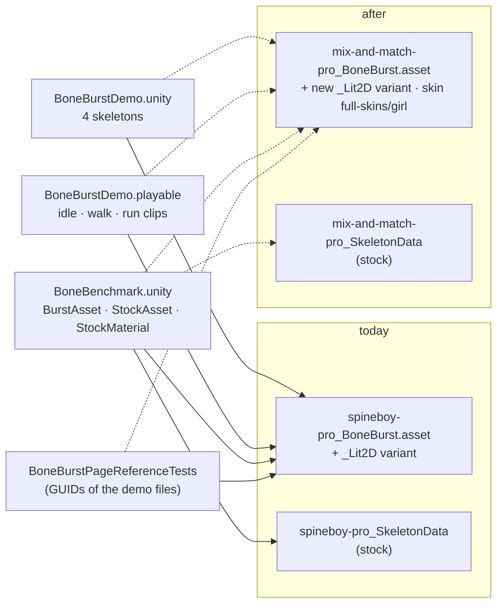

# Demo and benchmark on mix-and-match-pro; spineboy-pro demo assets removed — plan

**Status:** **done 2026-10-02**, not committed. The spineboy-pro demo folders were deleted on disk (by the owner)
before S1, so S6 became the sweep and re-index. Results in §4.

M0's demo content is spineboy-pro: the demo scene, the benchmark (both its stock and its BoneBurst side), the demo
timeline, and two Editor tests that read the baked demo files for their GUIDs. mix-and-match-pro is already baked
beside it (`Assets/BoneBurstDemo/mix-and-match-pro_BoneBurst/`) and already plays in the demo scene. This plan moves
everything that uses the spineboy-pro demo assets onto mix-and-match-pro, then deletes those assets. The test-data
sample `Tests/Editor/Data~/samples/spineboy-pro` (the stock-parity corpus) and `Assets/AnimoTest` stay (owner).

## 1. What uses the spineboy-pro demo assets (GUID sweep, 2026-10-02)

| User | Uses | Change |
|---|---|---|
| `Assets/Scenes/BoneBurstDemo.unity` | 4 `BoneBurstSkeleton`s: CPU run (it carries the timeline's `PlayableDirector`), CPU idle, GPU-skinning idle, Lit2D + tint black walk (the `_Lit2D` variant) | asset → mix-and-match-pro (the Lit2D one → its new `_Lit2D` variant), skin `full-skins/girl`, animations kept (run, idle, walk exist), names say mix-and-match. The fifth skeleton is already mix-and-match (`full-skins/boy`, `item-equip`) and stays. |
| `Assets/BoneBurstDemo/Timeline/BoneBurstDemo.playable` | clip assets reference the spineboy asset; keys `idle`, `walk`, `run` | asset → mix-and-match-pro; keys unchanged |
| `Assets/Scenes/BoneBenchmark.unity` (`BoneBenchmark`) | `BurstAsset`, `StockAsset` (stock `spineboy-pro_SkeletonData`), `StockMaterial` | → `mix-and-match-pro_BoneBurst.asset`, stock `mix-and-match-pro/mix-and-match-pro_SkeletonData.asset` |
| `Assets/BoneBenchmark/BoneBenchmark_StockURP2D.mat` | texture = the baked `spineboy-pro.png` (both sides draw the same compressed pixels, §2.2 of the performance doc) | → the baked `mix-and-match-pro.png` |
| `BoneBenchmark.cs` | spineboy's default skin; `SwitchAnimations` idle, walk, run, shoot, jump | a `Skin` field set on both sides (`full-skins/girl`); switch set → idle, walk, run, pickaxe-action, shovel-run; grid constants re-measured; comments |
| `BoneBurstPageReferenceTests` | `PagePath` / `DataPath` = the baked spineboy files (only their GUIDs) | → the baked mix-and-match files |
| `BoneBurstBakeTests` line 277 | the string `…/spineboy-pro_BoneBurst/spineboy-pro.sbdata.bytes` as "another bake's data path" | checked in S5: a path string only, or a file it needs |
| Addressables (`Packed Assets` group) | entries for every spineboy-pro file, made by SmartAddresser's rule on `Assets/BoneBurstDemo` | SmartAddresser Apply then Index after the delete (never by hand) |

**What the benchmark loses.** mix-and-match-pro has **no event timelines**, no physics and no path constraints, so the
switch mode no longer measures event delivery. The new set keeps attachment changes, draw order and IK
(pickaxe-action, shovel-run). Every past benchmark number is spineboy-pro, so the history does not carry over; a new
baseline run closes the plan.

## 2. Steps

| Step | Deliverable | Verification |
|---|---|---|
| **S1** | A Lit2D + tint black variant of mix-and-match-pro (`mix-and-match-pro_BoneBurst_Lit2D.asset`) through the bake's variant path, as spineboy's was made | the bake reports it; it loads and attaches with `full-skins/girl` |
| **S2** | Demo scene: the 4 skeletons converted by a `run_script` through the Editor (no YAML edits); sizes and positions checked against mix-and-match's bounds | each skeleton attaches with its skin and animation; a capture of the Scene view through the `editor-window-capture` skill |
| **S3** | Demo timeline: clip assets → mix-and-match-pro | the timeline play-mode tests; the director's clips resolve `idle`, `walk`, `run` |
| **S4** | Benchmark: scene fields, stock material texture, `Skin` field, new switch set, grid re-measured | Editor play of `BoneBenchmark.unity` draws both sides with the skin; a release IL2CPP player into a new `Build/` folder runs the suite |
| **S5** | Tests: `BoneBurstPageReferenceTests` paths; bake test line 277 | Editor suite green |
| **S6** | Delete `Assets/BoneBurstDemo/spineboy-pro/` and `spineboy-pro_BoneBurst/` after a GUID sweep shows no user; SmartAddresser Apply then Index | sweep empty; `AssetSystem.db` duplicate-index query empty; console clean |
| **S7** | Full suites, parity harness; new benchmark baseline (mix-and-match-pro, stock against BoneBurst) | M0 Editor / SpineUnity / play / timeline suites, harness 215 of 215; the results table in `BoneBurst-Performance.md` as a new dated section, the spineboy history left as written |
| **S8** | Docs: M0 `CLAUDE.md` mentions, `Assets/BoneBenchmark/README.md`, the timeline README's demo line | grep shows no stale "spineboy-pro demo" claim outside history |

## 3. Decisions (owner, 2026-10-02)

*   **Scope: demo assets only.** `Tests/Editor/Data~/samples/spineboy-pro` stays as the stock-parity corpus, and so do the
    ~10 tests that load it. `Assets/AnimoTest/Spine/SpineboyPro` stays.
*   **Skin: `full-skins/girl`** on every converted skeleton and on both benchmark sides. The demo scene's existing
    mix-and-match skeleton keeps `full-skins/boy`.

## 4. Results (2026-10-02)

*   **S1** rebake of mix-and-match-pro with a variant: `mix-and-match-pro_BoneBurst_Lit2D.asset` (Lit2D, tint black,
    same data; the export was unchanged).
*   **S2** demo scene: the 4 spineboy skeletons became mix-and-match-pro in `full-skins/girl`, renamed *Girl …*,
    animations kept. Spacing changed from 3 to 6 units (−12 … 12), because mix-and-match is about 4.8 wide. The existing
    `full-skins/boy` skeleton moved from x 0 (on top of the GPU one) to 12, and the camera went to size 8.5 at y 4. A
    Scene-view capture (`editor-window-capture`) shows all five drawn. Found on the way: a single-mode `OpenScene` unloads
    a just-created asset nothing references yet, so a builder script must load it after opening the scene.
*   **S3** timeline: the 3 `BoneBurstAnimationClip` templates point at mix-and-match-pro; keys idle / walk / run kept.
*   **S4** benchmark: `BurstAsset` and `StockAsset` set to mix-and-match-pro, and the stock material samples the baked
    `mix-and-match-pro.png`. A new `Skin` field (`full-skins/girl`) is set on both sides (stock: `SetSkin` +
    `SetupPoseSlots`). The switch set is idle, walk, run, pickaxe-action, shovel-run, and `SkeletonHeight` is 6.8 → 9.
*   **S5** `BoneBurstPageReferenceTests` and the bake test's "another export" path → the mix-and-match files.
*   **S6** GUID sweep of the 12 deleted files: no user left (Unity had already dropped their Addressables entries).
    SmartAddresser Apply then Index: no active row left for them, the Lit2D variant indexed (group 1, index 1),
    duplicate-index query empty.
*   **S7** Editor 433 + 1 skipped of 434, SpineUnity 24, play 37, timeline 14 / 13, harness 215 of 215. The new
    baseline (`Build/macOS_SpineBenchmark_IL2CPP_9/`; `_8` was cancelled mid-build) is in
    `Assets/BoneBenchmark/Results/2026-10-02_macOS-Metal_release_IL2CPP_mix-and-match_summary.csv`. Medians in ms at 2000:

| | Stock | StockThreaded | BurstCpu | BurstGpu |
|---|---|---|---|---|
| idle | 38.34 | 24.62 | **3.95** | 3.96 |
| walk | 39.05 | 25.36 | **3.85** | 3.86 |
| switch | 42.56 | 27.19 | **5.46** | 5.60 |

    mix-and-match-pro (146 bones, 81 slots) costs stock about 2.3× what spineboy-pro did; BoneBurst is now **9.7×**
    (idle), **10.1×** (walk) and **7.8×** (switch) faster than Stock, and about 6× faster than StockThreaded.
*   **S8** M0 `CLAUDE.md`, the benchmark README and the timeline README name the new content.
