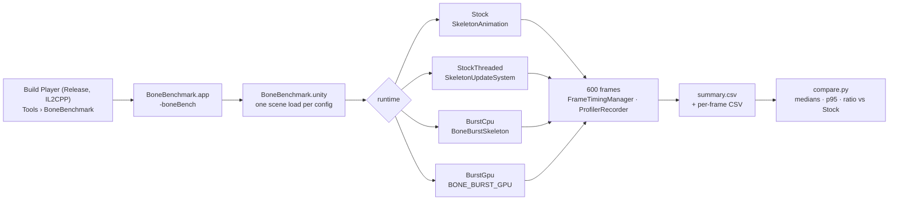

# BoneBenchmark: stock spine-unity against BoneBurst

This benchmark measures stock spine-unity against BoneBurst in a real scene. It runs N copies of mix-and-match-pro (skin `full-skins/girl`; spineboy-pro until 2026-10-02), all on screen and animating, in a release player, and compares four runtimes on the same content. **IL2CPP is the primary target**; Mono is kept for comparison. On macOS / Metal with IL2CPP (2026-09-30), **BoneBurst's CPU mesh takes about a third of threaded stock's frame time at 2 000 skeletons** (3.6 ms idle, 3.8 ms walk, against 9.9 and 10.3 ms), and is now faster than BoneBurst's own GPU skinning. Its vertices are uploaded through vertex fetch, into a ring of GPU buffers filled by a Burst job.

## Fair conditions

| Kept the same | How |
|---|---|
| Content | Since 2026-10-02 the same export of **mix-and-match-pro** (`Assets/BoneBurstDemo/mix-and-match-pro`, skin `full-skins/girl` on both sides, `Assets/Docs-Plan/Demo-MixAndMatch-Plan.md`); every result below that date is spineboy-pro (`Assets/BoneBurstDemo/spineboy-pro`, deleted), scale 0.01, straight-alpha texture. Since 2026-09-30 BoneBurst loads it baked (`Assets/BoneBurstDemo/spineboy-pro_BoneBurst/`), baked with texture compression **on** (since 2026-10-01), and the stock material (`BoneBenchmark_StockURP2D.mat`) samples that same bake copy, so both sides draw the same compressed pixels. Earlier results used the uncompressed RGBA32 source on both sides. The frame work is unchanged: the same `SkeletonDef` gives the same blob. |
| Shader family | Stock draws with `Universal Render Pipeline/2D/Spine/Skeleton` (`BoneBenchmark_StockURP2D.mat`, through `CustomMaterialOverride`). BoneBurst draws with `BoneBurst/Unlit`. Both are unlit URP 2D. |
| Workload | The same grid and camera, with every skeleton on screen. Start times are seeded, so the same skeleton starts at the same moment on every side. |
| Update rules | `FullUpdate` on both runtimes, so nothing is culled. vSync is off and the frame rate is uncapped. |
| Isolation | Each configuration reloads the scene. Each repeat reverses the runtime order (ABBA). |
| Measurement | 60 warm-up frames, then 600 measured frames. The player keeps running in the background. |

Stock runs twice: once single-threaded, and once with spine-unity 4.3's threaded animation and threaded mesh generation (`StockThreaded`).

## Run it

1. `Tools › BoneBenchmark › Build Player (Release, IL2CPP)` builds a new folder under `Build/`. `Build Player (Release, Mono)` builds the comparison player.
   - The build switches the Standalone scripting backend for its own duration only, then restores the project's setting and saves it.
   - It sets `EOS_SKIP_BUILD_VALIDATION=1` for its own build; see the EOS fork's `CHANGELOG.md`.
   - An IL2CPP build takes several minutes. It also writes a `*_BackUpThisFolder_ButDontShipItWithYourGame` folder (about 1.9 GB) beside the app.
2. Launch the player (a full suite takes about 25 min):
   `open -n Build/<folder>/BoneBenchmark.app --args -boneBench -screen-fullscreen 0 -screen-width 1920 -screen-height 1080`
   Closing the window ends the suite early.
3. Compare with `python3 Assets/BoneBenchmark/compare.py`, which reads the newest `summary.csv` under `~/Library/Application Support/`.

For load time instead of frame time, pass `-loadBench N` (`BoneBenchmarkLoad.cs`): BoneBurst's baked first use, its old JSON path and stock's load, each timed N times, written to `loadtime.csv` beside `summary.csv`; the player then quits. Results: `Packages/com.module.ta-creator-boneburst/Doc/Review/BoneBurst-Performance.md` §2.1.

For a single configuration, pass `-runtime Stock|StockThreaded|BurstCpu|BurstGpu -count N -anim name`. The name `switch` keeps changing animation. Other flags: `-warmup N`, `-frames N`, `-repeats N`, `-out dir`, `-quit` (quit after a single run). For worker-thread and per-marker time, use `Build Player (Development + Profiler)` with `-profileTo <dir>`, which writes a Profiler `.raw` capture of exactly the measured frames; open it in the Profiler window.

## Results: IL2CPP with animation changes (2026-09-30)

`switch` makes every skeleton change animation every 0.5–1.5 s among idle, walk, run, shoot and jump, crossfading by the asset's 0.2 s mix on both runtimes. The sequence is seeded and identical per skeleton on every runtime. These are from a macOS IL2CPP release player on Metal: 72 runs (idle, walk, switch). The raw data is in `Results/2026-09-30_macOS-Metal_release_IL2CPP_switch_summary.csv`. Frame time in ms:

| Animation × count | Stock | StockThreaded | BurstCpu | BurstGpu |
|---|---|---|---|---|
| idle × 2000 | 17.19 | 10.55 | **3.90** | 4.10 |
| walk × 2000 | 20.44 | 11.13 | **4.00** | 4.90 |
| switch × 100 | 0.80 | 0.60 | **0.50** | 0.60 |
| switch × 500 | 5.30 | 2.91 | **1.20** | 1.67 |
| switch × 2000 | 22.05 | 13.39 | **5.01** | 6.06 |

- **Animation changes cost every runtime.** At 2 000: Stock +4.9 ms over idle, StockThreaded +2.8, BurstCpu +1.1, BurstGpu +2.0. BurstGpu's walk and run fall back to the CPU mesh.
- **BurstCpu re-declares about 31 mesh topologies per frame while switching** (`burst_topology` column; 0 idle). That is cheap; the extra time is BoneBurst's managed animation state.
- **Discarded run.** The first run of this suite overlapped an IL2CPP build of another project (load average 125) and was re-run.

## Results: IL2CPP, vertex fetch with ring upload and fetch fallback (2026-09-30)

These are from a macOS IL2CPP release player on Metal (Mac17,8, 18 cores) at 1920×1080: 48 runs, 2 repeats, 600 frames each. The raw data is in `Results/2026-09-30_macOS-Metal_release_IL2CPP_fetch-ring_summary.csv`.

Median frame time in ms, with the ratio against Stock (lower is better):

| Animation × count | Stock | StockThreaded | BurstCpu | BurstGpu |
|---|---|---|---|---|
| idle × 100 | 0.65 | 0.59 (×0.90) | **0.35 (×0.54)** | 0.40 (×0.61) |
| idle × 500 | 3.96 | 2.55 (×0.64) | **0.83 (×0.21)** | 1.00 (×0.25) |
| idle × 2000 | 16.92 | 9.90 (×0.59) | **3.56 (×0.21)** | 3.89 (×0.23) |
| walk × 100 | 0.70 | 0.60 (×0.86) | **0.45 (×0.64)** | 0.65 (×0.93) |
| walk × 500 | 4.74 | 2.71 (×0.57) | **1.10 (×0.23)** | 1.46 (×0.31) |
| walk × 2000 | 20.95 | 10.30 (×0.49) | **3.80 (×0.18)** | 4.75 (×0.23) |

- **The vertex upload moved off the main thread.** A `SetData` of 13 MB (0.9 ms of main thread at 2 000) became a parallel Burst copy into a locked ring buffer. At 2 000 skeletons, BurstCpu went 4.7 → 3.6 ms idle and 4.9 → 3.7 ms walk (alternating A/B).
- **GPU skinning's deform fallback uses vertex fetch.** BurstGpu walk × 2 000 went 8.7 → 4.7 ms.
- **The CPU mesh is now faster than GPU skinning**, since both skin on the CPU side of the frame and the GPU path adds its pose upload and job.

## Results: IL2CPP with CPU vertex fetch, first version (2026-09-30)

These are from a macOS IL2CPP release player on Metal (Mac17,8, 18 cores) at 1920×1080: 48 runs, 2 repeats, 600 frames each. The raw data is in `Results/2026-09-30_macOS-Metal_release_IL2CPP_vertex-fetch_summary.csv`. Stock, StockThreaded and BurstGpu match the earlier IL2CPP run within about 2%, so the runs are comparable.

Median frame time in ms, with the ratio against Stock (lower is better):

| Animation × count | Stock | StockThreaded | BurstCpu (fetch) | BurstGpu |
|---|---|---|---|---|
| idle × 100 | 0.60 | 0.55 (×0.91) | 0.49 (×0.81) | **0.25 (×0.42)** |
| idle × 500 | 3.86 | 2.50 (×0.65) | 0.99 (×0.26) | **0.75 (×0.19)** |
| idle × 2000 | 16.90 | 9.95 (×0.59) | 4.95 (×0.29) | **3.45 (×0.20)** |
| walk × 100 | 0.70 | 0.56 (×0.80) | 0.69 (×0.98) | **0.40 (×0.57)** |
| walk × 500 | 4.51 | 2.60 (×0.58) | **1.01 (×0.22)** | 1.90 (×0.42) |
| walk × 2000 | 19.70 | 10.22 (×0.52) | **5.05 (×0.26)** | 8.45 (×0.43) |

BurstCpu before and after vertex fetch (frame ms):

| | Before (per-mesh upload) | With vertex fetch |
|---|---|---|
| idle × 2000 | 8.05 | 4.95 |
| walk × 2000 | 8.05 | 5.05 |
| idle × 500 | 1.85 | 0.99 |
| walk × 500 | 1.80 | 1.01 |
| render thread, idle × 2000 | 6.30 | 0.82 |

- **Vertex fetch removed BurstCpu's render-thread cost** (6.3 → 0.8 ms at 2 000) and one `Mesh.SetVertexBufferData` per skeleton on the main thread. Every vertex is still computed on the CPU, so deforming animations (`walk`) gain as much as `idle`.
- **With deform, BurstCpu is now the fastest runtime:** 5.05 ms against 8.45 ms for BurstGpu, which falls back to the per-mesh upload every frame, and 10.22 ms for StockThreaded at 2 000.
- **At 100 skeletons, BurstCpu frame time is bimodal**, about 0.30 or 0.67 ms per run, where it was 0.30 before. Its main thread (0.33 ms), render thread (0.10 ms) and GPU time (0.14–0.31 ms) are all at or below before. The extra time is outside the measured threads, at 1 500–3 300 frames per second; the cause (presentation pacing, or the shared buffer's upload waiting on the GPU) is not established.

## Results: IL2CPP before vertex fetch (2026-09-30)

These are from a macOS IL2CPP release player on Metal (Mac17,8, 18 cores, Apple Silicon build) at 1920×1080, after the mesh-upload fix: 48 runs, 2 repeats, 600 frames each. The raw data is in `Results/2026-09-30_macOS-Metal_release_IL2CPP_summary.csv`.

Median frame time in ms, with the ratio against Stock (lower is better):

| Animation × count | Stock | StockThreaded | BurstCpu | BurstGpu |
|---|---|---|---|---|
| idle × 100 | 0.65 | 0.55 (×0.85) | 0.30 (×0.46) | **0.30 (×0.46)** |
| idle × 500 | 4.19 | 2.64 (×0.63) | 1.85 (×0.44) | **0.80 (×0.19)** |
| idle × 2000 | 17.05 | 10.18 (×0.60) | 8.05 (×0.47) | **3.45 (×0.20)** |
| walk × 100 | 0.75 | 0.55 (×0.73) | **0.30 (×0.40)** | 0.41 (×0.55) |
| walk × 500 | 4.65 | 2.70 (×0.58) | **1.80 (×0.39)** | 1.96 (×0.42) |
| walk × 2000 | 19.85 | 10.25 (×0.52) | **8.05 (×0.41)** | 8.44 (×0.43) |

At 2 000 skeletons, split by thread (median ms):

| | Stock | StockThreaded | BurstCpu | BurstGpu |
|---|---|---|---|---|
| idle: main thread | 17.05 | 10.18 | 6.22 | **3.45** |
| idle: render thread | 5.76 | 6.57 | 6.30 | **0.96** |
| walk: main thread | 19.85 | 10.25 | **6.30** | 6.91 |
| walk: render thread | 5.75 | 6.55 | 6.32 | 6.42 |

IL2CPP against Mono, same code (frame ms at 2 000 skeletons):

| | Stock | StockThreaded | BurstCpu | BurstGpu |
|---|---|---|---|---|
| idle: Mono → IL2CPP | 28.94 → 17.05 | 8.11 → 10.18 | 8.15 → 8.05 | 5.45 → 3.45 |
| walk: Mono → IL2CPP | 32.55 → 19.85 | 8.35 → 10.25 | 7.74 → 8.05 | 8.35 → 8.44 |

- **Single-threaded stock gains most from IL2CPP** (−41%), since it is all managed C#.
- **Threaded stock gets slower on IL2CPP** (+25%). The measurement is clear, but the cause was not profiled.
- **BurstCpu is unchanged.** Its per-frame work is Burst-compiled either way, and its frame is set by the render thread (about 6.3 ms).
- **BurstGpu idle gains 2 ms** (5.45 → 3.45). With the mesh on the GPU, the remaining main-thread cost is the managed animation-state update, which IL2CPP speeds up.
- **BoneBurst is fastest on both backends**, but on IL2CPP the lead is larger: at 2 000 skeletons CPU is ×0.79 and GPU ×0.34 of threaded stock's frame time.

## Results: Mono (2026-09-30, after the mesh-upload fix)

These are from a macOS release player on Metal (Mac17,8, 18 cores) at 1920×1080: 48 runs, 2 repeats, 600 frames each. The raw data is in `Results/2026-09-30_macOS-Metal_release_summary_after-upload-fix.csv`. The run from before the fix is `Results/2026-09-30_macOS-Metal_release_summary.csv`. Separate runs of the same build differ by about ±5%.

Median frame time in ms, with the ratio against Stock (lower is better):

| Animation × count | Stock | StockThreaded | BurstCpu | BurstGpu |
|---|---|---|---|---|
| idle × 100 | 1.29 | 0.55 (×0.43) | 0.40 (×0.31) | **0.35 (×0.27)** |
| idle × 500 | 7.01 | 2.05 (×0.29) | 1.75 (×0.25) | **1.16 (×0.17)** |
| idle × 2000 | 28.94 | 8.11 (×0.28) | 8.15 (×0.28) | **5.45 (×0.19)** |
| walk × 100 | 1.45 | 0.60 (×0.41) | **0.40 (×0.28)** | 0.50 (×0.34) |
| walk × 500 | 8.47 | 2.10 (×0.25) | **1.70 (×0.20)** | 1.90 (×0.22) |
| walk × 2000 | 32.55 | 8.35 (×0.26) | **7.74 (×0.24)** | 8.35 (×0.26) |

At 2 000 skeletons, split by thread (median ms):

| | Stock | StockThreaded | BurstCpu | BurstGpu |
|---|---|---|---|---|
| idle: main thread | 28.94 | 7.82 | 7.39 | **5.45** |
| idle: render thread | 5.78 | 6.40 | 6.36 | **1.05** |
| walk: main thread | 32.55 | 8.21 | **7.09** | 8.16 |
| walk: render thread | 5.65 | 6.45 | 6.05 | 6.33 |

BoneBurst frame time before and after the fix (ms):

| | Before | After |
|---|---|---|
| BurstCpu idle × 2000 | 13.85 | 8.15 |
| BurstCpu walk × 2000 | 13.65 | 7.74 |
| BurstCpu idle × 500 | 3.04 | 1.75 |
| BurstGpu walk × 2000 (CPU fallback every frame) | 13.91 | 8.35 |

## What the numbers say

- **The fix removed BoneBurst's render-thread bottleneck.** The CPU mesh's render thread fell from 10.4 ms to about 6 ms at 2 000 skeletons, stock's level. BoneBurst used to re-declare every mesh's buffers each frame through `Mesh.ApplyAndDisposeWritableMeshData`, and the render thread replaced 2 000 meshes' GPU buffers per frame. Now `MeshJob` writes into persistent per-skeleton scratch, and while the topology (counts, indices, submeshes) is unchanged only the vertex data is uploaded, into the existing buffers (`BoneBurstSkeleton.UploadCpuMesh`). The GPU path's per-frame CPU fallback (`walk`) takes the same path.
- **Main thread: BurstCpu is below StockThreaded in every configuration** (7.1–7.4 against 7.8–8.2 ms at 2 000 skeletons). The per-skeleton upload moved about 0.8 ms onto it; before the fix it was 6.3 ms.
- **GPU skinning is best without deform.** At idle × 2 000 its render thread takes 1.05 ms. `walk` deforms meshes, so BurstGpu falls back to the CPU mesh every frame (`GpuSkinning.md` §1) and lands at CPU-mesh cost. Keeping deform on the GPU is the next lever.
- **GPU time is equal on all four runtimes.** The runtimes differ only in CPU-side cost.

## Not covered

- **Worker-thread job time and GC per frame.** The release player records neither; the `gc_bytes` and `burst_*` columns stay empty. For those, run the Development build with `-profileTo <dir> -quit`, which captures exactly the measured frames. Before the fix, a Development build showed BurstCpu allocating about 50 KB of garbage per frame at 2 000 skeletons, against 0.3 KB for StockThreaded; that has not been re-measured.
- **Other platforms and GPUs.** Only macOS / Metal on one machine was measured.
- **Skeletons other than spineboy-pro.** The ratios depend on bone count, deform use and attachment count.

**Next leads:** keep mesh deform on the GPU path, so `walk` stops falling back to the CPU mesh; the per-frame garbage; the 0.8 ms of main-thread upload at 2 000 skeletons.
