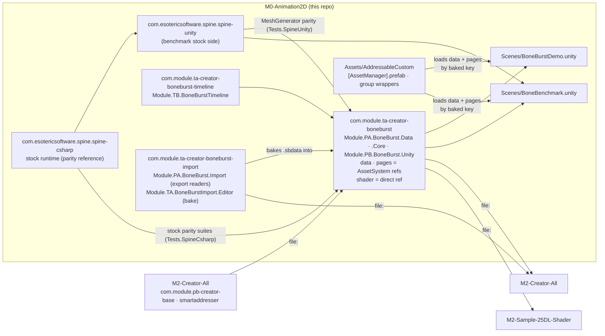
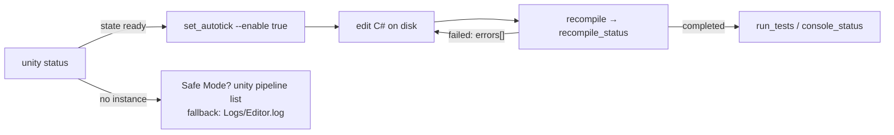
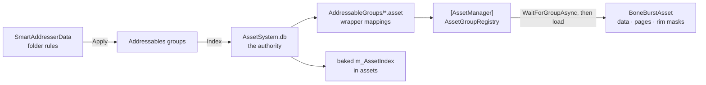

# Unity M0-Animation2D Repository Guidance for Agents

This is the single canonical guidance file for AI agents working in this Unity project.
`AGENTS.md` is the Codex entry point and directs Codex agents here before they work; keep project guidance in this file rather than duplicating it there.

## Project Overview
*   **Type**: Unity 2D URP project, **Unity 6000.6 or newer only** (on `6000.6.3f1`; see §7): the **Spine 2D animation test bed**.
*   **What it holds**: the Spine 4.3 runtime forks and **BoneBurst**, our from-scratch Burst runtime for Spine data, with BoneBurst's tests, a demo scene and the stock-vs-BoneBurst benchmark.
*   **Why a separate project**: moved out of M1-Plugins-Custom on 2026-09-30, so Spine work can be built, tested and benchmarked on its own. M1-Plugins-Custom's git history keeps everything before the move.
*   **Primary Language**: C#; Python for the gate and test scripts.
*   **Status**: **BETA.** Two projects take BoneBurst from this folder (see §1), so an edit here is live there.



## Key Files & Directories
*   `Packages/`: embedded packages, **same git repository as the root**. An embedded package needs no `manifest.json` entry.

    | Folder | displayName | Upstream |
    |---|---|---|
    | `com.esotericsoftware.spine.spine-csharp` | spine-csharp Runtime | EsotericSoftware/spine-runtimes `4.3` @ `7ce5d0da`; local `var` clean-up in `CHANGELOG.md` |
    | `com.esotericsoftware.spine.spine-unity` | spine-unity Runtime | same commit; local `var` clean-up + one `#if UNITY_EDITOR` guard in `CHANGELOG.md` |
    | `com.esotericsoftware.spine.{timeline,addressables,on-demand-loading,urp-shaders}` | the stock spine-unity modules | same commit; no project code or asset here uses them (BoneBurst's decouple plan) |
    | `com.dragonbones.unity` | DragonBones Unity Runtime | DragonBones/DragonBonesCSharp `master` @ `29a3613` (runtime 5.6.300); asmdefs, package path and Unity 6.6 API fixes in `CHANGELOG.md` |
    | `com.module.ta-creator-boneburst` | TA Creator BoneBurst | ours — three runtime assemblies, `Module.PA.BoneBurst.Data` (format, readers, keys: `Runtime/Data`) < `Module.PA.BoneBurst.Core` (pose and mesh logic, no UnityEngine: `Runtime/Core`) < `Module.PB.BoneBurst.Unity` (components, system, jobs, GPU: `Runtime/`), split plan `Doc/Review/BoneBurst-AssemblySplit-Plan.md`; `BoneBurstAsset` holds AssetSystem references for its data, pages and rim masks, and a direct `Shader` reference (the shaders are package files, never addressable: `Doc/Review/BoneBurst-PlayerShader-Plan.md`); plan `Doc/Review/BoneBurst-Plan.md`, AssetSystem plan `Doc/Review/BoneBurst-AssetSystemPlan.md`, performance `Doc/Review/BoneBurst-Performance.md`, tests `Doc/Review/BoneBurst-TestReport.md`, runtime decision `Doc/Review/D1-SpineRuntime-Decision.md` |
    | `com.module.ta-creator-boneburst-import` | TA Creator BoneBurst Import | ours — the authoring side: `Module.PA.BoneBurst.Import` (the Spine export readers `SkeletonJsonReader`, `JsonNode`, `SkeletonBinaryReader`, `AtlasReader`; namespace `BoneBurst.Data`, models stay in Data) and `Module.TA.BoneBurstImport.Editor` (the bake, its menu, popup, settings, drop, and `BoneBurstRebakeOnChange`, which rebakes a folder baked before when its export changes, e.g. the BoneBurst editor's Export to Unity; + `.Tests.Editor`). No player path reads an export; BoneBurst's own tests and the benchmark's `json_first_use` reference the readers. Plan `Doc/Review/BoneBurstImport-Plan.md` |
    | `com.module.ta-creator-boneburst-timeline` | TB Creator BoneBurst Timeline | ours — `Module.TB.BoneBurstTimeline` (+ `.Editor`, `.Tests`, `.Tests.Editor`); Unity Timeline tracks for BoneBurst skeletons; plan + state `Doc/Review/BoneBurstTimeline-Plan.md` |

*   `Animation-BoneBurst-Src/`: the **BoneBurst editor**, a web app (TypeScript + Vite, `npm`) that opens artists' Spine 4.3 JSON, edits it (with AI, over MCP) and exports the Spine 4.3 JSON the import package bakes. **AGPL-3.0-or-later** (an Animo fork), unlike the packages: a separate program in the same repository, brought in with its history by `git subtree` on 2026-10-05. Its own `CLAUDE.md` governs work inside it. **Never move code between it and the packages** in either direction; they share specs (`Doc/Format/`) and files only. Outside `Assets/` and `Packages/`, so Unity never imports it; its `node_modules/` and `dist/` are ignored, and it is kept out of LFS (`.gitattributes`). Plan: `Animation-BoneBurst-Src/docs/BONEBURST-PIPELINE-PLAN.md`.
*   `Editor-BoneBurst-Src/`: the **BoneBurst Editor v2**, a web app (TypeScript + Vite, `npm`), **MIT**, written from scratch with **no Animo code**; its document is the Spine 4.3 JSON file itself. It replaces `Animation-BoneBurst-Src/`, which since 2026-10-06 takes bug fixes and data-format work only (decisions D1–D5 in `Animation-BoneBurst-Src/docs/EDITOR-V2-PLAN.md`). Its own `CLAUDE.md` governs it, including the **clean-room rules: never open the fork's sources while working there**. Architecture: `Editor-BoneBurst-Src/docs/SPEC.md`. Outside `Assets/` and `Packages/`; `node_modules/` and `dist/` ignored; out of LFS. Status: E2 (the document headless, the runtime lifted as its engine, a stage that edits the setup pose).
*   **Keep searches inside this project.** Sibling projects under `../` hold copies of the same packages; a hit there is not this project's code.
*   `Packages/com.module.ta-creator-boneburst/Tests/Editor/Data~/samples/`: the sample exports BoneBurst's and the timeline package's tests read (vendored from spine-unity's `Samples~`, 2026-10-01 — nothing reads `Samples~` itself any more); `.gitignore` re-includes `Data~/` against a global `*~` rule. `Data~/m2-mix-and-match/` is M2's binary `.skel.bytes` export with its atlas.
*   `Assets/BoneBurstDemo/`, `Assets/Scenes/BoneBurstDemo.unity`: the demo scene, all mix-and-match-pro: CPU, GPU-skinning and Lit2D + tint black skeletons in `full-skins/girl`, and one in `full-skins/boy` (spineboy-pro left the demo on 2026-10-02, `Assets/Docs-Plan/Demo-MixAndMatch-Plan.md`; the test-data sample `Tests/Editor/Data~/samples/spineboy-pro` stays for stock parity).
*   `Assets/BoneBenchmark/`, `Assets/Scenes/BoneBenchmark.unity`: stock spine-unity against BoneBurst in release players (`README.md` there).
*   `Assets/AddressableCustom/`: the AssetSystem. `[AssetManager].prefab` (made by pb-creator-base's `Tools/Asset System/AssetManager/Setup`, placed in both scenes), the group wrappers `AddressableGroups/Default Local Group.asset` (GroupIndex 0) and `Packed Assets.asset` (1), and `KeyIntMapping.asset`, the KeyInt bake target the build gate needs (§11).
*   `ProjectSettings/EditorConfig/SmartAddresser/AssetSystem.db` (the index authority), `ProjectSettings/EditorConfig/Creator/SmartAddresserData.asset` (the rules), `ProjectSettings/AssetIndexAutoSyncSettings.asset` (the KeyInt bake target's GUID).
*   `Patches/spine-local-edits-from-M1-2026-09-30.patch`: uncommitted edits to the Spine packages that were in M1-Plugins-Custom at the move, **not applied here** (the committed version moved). They are also kept as a git stash in M1-Plugins-Custom. They are **not** the cause of the stock-parity test failures: here, without them, the Editor results are identical (142/284, same per class; 2026-09-30).
*   `Logs/Editor.log`: the Editor log, **project-relative** (not `~/Library`). A **fallback** for compile status only — it keeps every past compile block one after another, so an old error reads like a current one. The live Editor is the authority (next section).

## Workflow and Commands
*   **Build/Run/Test**: in the Unity Editor, driven from the shell through the `unity` CLI (next section). There are no root-level `bash` build commands.
*   **Testing**: Unity Test Runner. `Module.TA.BoneBurst.Tests.Editor` runs in EditMode (keys, bake, AssetSystem references, rim, instance table, GPU-vs-CPU mesh, shader variants, assembly layout — no stock Spine assembly). `Module.TA.BoneBurst.Tests.SpineCsharp` (EditMode) is the only test assembly referencing stock spine-csharp (the parity suites, 2026-10-05, `Doc/Review/BoneBurst-TestSplit-Plan.md`). `Module.TA.BoneBurst.Tests.SpineUnity` (EditMode) is the only test code naming spine-unity. `Module.TA.BoneBurst.Tests` runs in PlayMode (system, meshes, GPU skinning, vertex fetch, bounds, deferred attach). Timeline: `Module.TB.BoneBurstTimeline.Tests(.Editor)`. Through the live Editor: `unity command run_tests --mode <EditMode|PlayMode> --filter_type assembly --filter <name> --async_tests true`, then poll `test_status` (PlayMode must run async: entering play mode reloads the domain). Or `python3 .claude/skills/unity-playtest/playtest.py test --assembly <name> --mode <EditMode|PlayMode>`. **A run that reports 0 tests is a failure** (a filter that matched nothing).
*   **Benchmark**: `Tools › BoneBenchmark › Build Player (Release, IL2CPP)`, then `open -n Build/<folder>/BoneBenchmark.app --args -boneBench`, then `python3 Assets/BoneBenchmark/compare.py`. `-loadBench N` times BoneBurst's first use against stock. Addressables does **not** build with the player here (`m_BuildAddressablesWithPlayerBuild: 0`): build the content first (`AddressableAssetSettings.BuildPlayerContent`), or the player has no data to load.
*   **Gates** (`.claude/skills/`): `assembly-tier-check`, `managed-reference-check`, `unity-playtest`, `parity-harness` (BoneBurst's strict-float parity with stock, outside Unity). Each `SKILL.md` says when to run it.

## Driving the live Editor (`com.unity.pipeline`)

The project has `com.unity.pipeline`, so an open Editor serves the `unity` CLI (port file
`Library/Pipeline/.unity-pipeline-port`; the port differs when M2 is open too — run commands from this folder and the
CLI picks this project's Editor).



*   **Start with `unity status`.** If this project's Editor reports `ready`, work through it: `unity command <name> --caller plugin --skill <skill>`. `unity open "<this folder>"` starts one; wait until a command answers (it returns 503 while importing).
*   **`unity command set_autotick --enable true` first.** An unfocused Editor otherwise stalls compiles and tests.
*   **Compile status:** `recompile`, then `recompile_status` until done; or `console_status` → `groundTruth.compilationFailed` and `consoleErrors`. A file added or edited in a package from **another** project (pb-creator-base, smartaddresser) needs `AssetDatabase.Refresh()` (an `eval`) before `recompile` sees it.
*   **Scenes, prefabs, components: never hand-edit `.unity` / `.prefab` / `.asset` YAML while an Editor is reachable.** Use the scene commands or `run_script` with a builder `.cs` kept **outside `Assets/`** (`Temp/AgentScripts/` works: no import, no domain reload, nothing left in the project). Open a scene additively, change it, save, and close it again when it was not open, so the user's open scenes stay as they were.
*   **Seeing anything in Unity: capture it through Unity ONLY — ZERO TOLERANCE** (owner rule, 2026-09-28). Never the OS `screencapture`, `InternalEditorUtility.ReadScreenPixel` (it crashed the Editor on macOS), computer-use or desktop screenshots, the browser pane, or any tool that sees the screen. This project has no capture skill: check state by reading it (`eval`, `run_script`: components, `IsValid`, material textures and shaders). **If something can only be judged by eye, stop and tell the user.**
*   **No connection:** a compile error puts the Editor in Safe Mode, where the pipeline does not load. `unity pipeline list` tells you; then `Logs/Editor.log` is the fallback — read only the **last** compile block.

---

# Working Agreement (MOU)

## 1. Consumers

**Two projects take `com.module.ta-creator-boneburst` from this folder by `file:` path** (M2-Creator-All also takes `com.module.ta-creator-boneburst-import`, for the bake, since 2026-10-05) (checked 2026-10-02):
*   **M2-Creator-All** — `Module.TC.CCP.Spine2D` (`SpineSkeletonAnimationHandle`, `SpineLook`) runs on BoneBurst; its character prefab `P Graphics 2` uses it. M2 removed the stock Spine packages on 2026-10-01 (its `com.module.tc-creator-charactercontroller/Doc/Review/BoneBurst-Migration-Plan.md`).
*   **M2-Sample-25DL-Shader** — needs it because it takes M2's CCP package; three demo scenes show mix-and-match-pro on it.
*   Nobody takes the **stock** Spine packages from here any more. M1-Creator-Network-Disable and M3-Creator-GitHub take spine-runtimes from its git URL. The timeline package has no consumer outside this project.

From now on an edit to BoneBurst is live in both on their next compile: **search them for callers before changing a public API** (`BoneBurstAsset`, `BoneBurstSkeleton`, `BoneAnimationState`, `BoneBurstSkin`, `BoneBurstKey`, the bake), and change their manifests in the same session when moving a package folder. Their Editors do not see an edit here until they refresh.

The reverse direction too: M0's manifest references M2-Creator-All's `com.module.pb-creator-base` and `jp.co.cyberagent.smartaddresser`, and M1-Plugins-Custom's `com.cysharp.unitask`, `com.creator.development` and `com.kyrylokuzyk.primetween`, by `file:` path. BoneBurst depends on pb-creator-base directly (its data, pages and rim masks are AssetSystem `IndexGenericAsset` references; the bake calls the SmartAddresser-backed `MappingMutationService` for durable keys) — remove those entries and BoneBurst stops resolving. **Editing pb-creator-base or smartaddresser here edits M2's copy**: commit those changes in M2's repository, with M2's changelog rules.

## 2. A fork is upstream + a written list of changes

Each fork must be re-appliable onto a newer upstream release. So:

*   **Record every local change** in the package's changelog (`CHANGELOG.md` at each Spine package root). Say *what* and *why*, and name the files.
*   **Keep the diff against upstream small.** Do not reformat, reorder or modernize vendor code you are not otherwise changing — every touched line is a line to re-apply by hand after the next upgrade.
*   **Changes to a vendor runtime must not change its behavior** unless that is the point, and then say so in the changelog. spine-csharp is BoneBurst's **parity reference**: a behavior change there moves the reference, not BoneBurst.
*   Vendor **assembly names stay as upstream ships them** (`spine-csharp`, `spine-unity`, …).
*   Package layout for our own packages: `Runtime/`, `Editor/`, `Tests/`, `Doc/` beside `package.json`; BoneBurst also has `Shaders/` (owner, 2026-10-02: shaders belong to no assembly, so not under an asmdef folder). Play-mode tests in `Tests/Runtime/<area>`, edit-mode tests in `Tests/Editor/<area>`, docs in `Doc/<area>`. Vendor packages keep upstream's layout; do not move their folders to conform.

## 3. Beta posture — clean break

*   **Delete** obsolete types; do not leave them `[Obsolete]` "for migration".
*   Do not write migration tooling for data that is empty or trivially re-authored — **verify the data first**, then break cleanly.
*   Do keep the *comment* explaining why a structure looks the way it does.

## 4. Assembly tiers are load-bearing — consolidate, never accumulate

Everything lives in **exactly one place**, as **low** as it can, doing **one job**. A new sibling next to something that already owns the concept is a design smell — fold it in instead.

**Before adding anything, three questions:**
1.  **Single source of truth.** Each fact (a setting, an ID, a list, a mapping, a default) is stored in one place; everything else reads or derives it. A copy that must be "kept in sync" is a bug scheduled for later. Precedent: `BoneBurstAsset` holds its references (AssetSystem ones, and its shader) and nothing else; `SpineSkeletonAnimationHandle` in M2 reads the asset through its `BoneBurstSkeleton` instead of holding a second reference (`BoneBurstKeyDrawer` follows the skeleton field).
2.  **Single responsibility.** A type, and an assembly, does one job; if describing it needs "and", split it.
3.  **Lowest tier that can hold it.** Data goes low; the behaviour that wires it goes up.

Our own assemblies follow M2-Creator-All's scheme: `Module.<Tier><Band>.<Name>` — **data LOW, managers UPPER**.

*   **Tier** — `P` data + primary functions, `T` logic + tools + packages, `U` managers + toppings. **Band** — `A`–`Z` inside a tier, lower letter = lower layer.
*   An assembly references only **same-or-lower codes**: `P < T < U`, and `A < B < …` inside a tier. Editor/test assemblies take their runtime's code.
*   Today: `Module.PA.BoneBurst.Data`, `Module.PA.BoneBurst.Core`, `Module.PB.BoneBurst.Unity` (the front is `PB` because it references `Module.PB.AssetSystem`), `Module.TA.BoneBurst.Editor` (+ `.Tests`, `.Tests.Editor`, `.Tests.SpineCsharp`, `.Tests.SpineUnity`), `Module.PA.BoneBurst.Import` and `Module.TA.BoneBurstImport.Editor` (+ `.Tests.Editor`; the import package), and `Module.TB.BoneBurstTimeline`. `BoneBurstAssemblyLayoutTests` guards the BoneBurst direction; Data and Core are what the parity harness compiles. Third-party packages keep their vendor assembly names (§2).
*   Before landing any `.asmdef` change, run the gate (`python3 .claude/skills/assembly-tier-check/tiercheck.py`): **0 cycles**, **no new upward edges**, **no legacy-style names**.
*   **Preserve the namespace when relocating a type.**
*   Unity assembly references are **not transitive**; list every assembly a file actually names.

## 5. BoneBurst: how it is checked

*   **Bit-for-bit parity lives in the strict-float harness.** `Tools~/ParityHarness` runs the Editor parity tests on .NET, where every float operation rounds to float32, and must match stock spine-csharp exactly (gate: `parity-harness`). Run it before landing any change to BoneBurst's runtime, its parity tests, or spine-csharp.
*   **The Editor suites compare within a tolerance, not bits.** Under Unity's Mono, float rounding depends on how the JIT compiles each method (142 failures in Release, 99 in Debug, from the same code), so the stock-comparing suites use a size-scaled tolerance, lockstep (compare, then sync the state carried into the next frame), and wider bounds only on ill-conditioned frames (IK out of reach). Never widen a bound to make a test pass without tracing the cause first: `Doc/Review/BoneBurst-ParityPlan.md`.
*   **Parity against stock.** The Editor suites compare BoneBurst's managed reference with stock spine-csharp: setup pose, animation, mixing, constraints, skins (in the dedicated `Module.TA.BoneBurst.Tests.SpineCsharp` assembly — the only test code referencing spine-csharp), and meshes (against spine-unity's `MeshGenerator`, in the dedicated `Module.TA.BoneBurst.Tests.SpineUnity` assembly — the only test code referencing spine-unity). Each stock assembly is named by exactly one dedicated test assembly; the neutral `Module.TA.BoneBurst.Tests.Editor` references neither (it owns the shared `SampleCorpus` both reach through). The play-mode suites compare the Burst runtime with that managed reference, and each GPU path with the CPU path.
*   **The editor's exports** (`Animation-BoneBurst-Src/`) are posed by this runtime through the harness's dump mode (`run.sh --dump`, `Tools~/ParityHarness/Dump.cs`) and compared frame by frame with the editor's own runtime by its `tests/boneburstUnity.test.ts`. A change to `Runtime/Data`, `Runtime/Core` or the readers should keep that test passing too (`npm test` in the editor folder).
*   **Pixel tests** (`VertexFetchPlayModeTests`) draw through two paths and compare; they wait for the Editor's shader compile first. The Editor draws a cyan placeholder while a variant compiles.
*   **A deliberate bug must fail the test.** When a test guards a subtle path, break the code on purpose once and confirm the test catches it. The fetch ring, late-copy and deferred-attach tests were written that way.
*   **The AssetSystem path is checked in a player, not only in the Editor.** In the Editor every reference answers by GUID with or without an `AssetManager`, so an Editor pass proves nothing about baked keys. A player load (`-loadBench`, or a frame run) is the check; a single-frame run cannot show page textures, which arrive a frame later.
*   **Performance claims come from release players** (`Assets/BoneBenchmark`), IL2CPP first. Use alternating A/B runs, and discard any run that overlapped another build or heavy process: check `uptime` and running `bee_backend` before and after. Development builds inflate managed code (safety checks).

## 6. Never destroy authored work

Asset-creating code must be non-destructive by construction:

*   **Existence always wins.** Load the target path first; if something is there, return it.
*   Load as `Object` (not the expected type) so a **type mismatch** is a loud error, not mistaken for "nothing here" — that mistake is how overwrites happen.
*   **No `AssetDatabase.DeleteAsset` in a create path.**
*   Overwriting a prefab is **not undoable**.

## 7. Unity mechanics that bite

*   **Unity 6000.6 is the floor — write for 6000.6+ only.** No code path for an older Unity: fold every `#if UNITY_20xx_…` / `UNITY_6000_0`–`_5_OR_NEWER` guard in our code to its 6000.6 branch and delete the rest, and use no API that 6000.6 deprecates. Raise the `unity` field of one of our packages to `6000.6` when you touch its `package.json`. (Vendor code: only where you are already editing, logged in its changelog — §2.)
*   **Moving a file: move its `.meta` too** (`git mv` both, or `AssetDatabase.MoveAsset`), or every reference to it breaks.
*   Moving a serialized type between assemblies/namespaces can silently null existing asset data. Check for `m_EditorClassIdentifier` / `SerializeReference` `{class, ns, asm}` tags before moving. `managed-reference-check` covers this project.
*   **Changing a serialized field's type drops its data on the next load** (a `TextAsset Data` that became an `IndexGenericAsset m_Data`). Read the old values from the YAML **before** the change, then write them back through `run_script`.
*   `using UnityEditor;` must be inside `#if UNITY_EDITOR` in any all-platforms assembly, or player builds break.
*   **Diagnostic guards use `#if UNITY_EDITOR || UNITY_INCLUDE_INSTRUMENTATION`**, not the deprecated `DEVELOPMENT_BUILD` (Unity 6.6 warns UAC0009; removed in 6.8). Upstream vendor code may still use it; change it only when you are already editing that block, and log it in the changelog.
*   **Input is the Input System package only — never `UnityEngine.Input`.** Active Input Handling is "Input System Package (New)" (`activeInputHandler: 1`). A `UnityEngine.Input` read of a key, button, axis, mouse or touch throws `InvalidOperationException`, in the Editor as in a build. Read `Keyboard.current`, `Mouse.current`, `Pointer.current` or `Gamepad.current` (each can be null). An EventSystem gets `InputSystemUIInputModule`, never `StandaloneInputModule`.
*   **Every player build goes into a NEW folder under the project's `Build/`** (git-ignored), named after what it is (`BoneBenchmarkBuild` names `<target>_BoneBenchmark_<backend>[_Dev]`). If the name is taken, append a number — `_2`, `_3`, the first free one. Never build into an existing folder and never delete an old build.
*   **Shader keywords set from C# on runtime materials are `multi_compile`**; a `shader_feature` variant that no material asset uses is stripped from player builds.
*   **`UniTask.Preserve()` does not allow two awaiters while the task is pending** (its `MemoizeSource` forwards to the single-continuation source). For one load many callers wait on, use a `UniTaskCompletionSource` (`BoneBurstAsset.PrepareAsync`).

## 8. Editor tooling budget — do NOT add EditorWindows

**Adding a new `EditorWindow` is a last resort.** In preference order:

1.  Extend an existing tool's tab / inspector.
2.  A single `[MenuItem]` command.
3.  A new window — only for a genuinely recurring, multi-field workflow.

**Never** create a window for a one-shot job (migration, fixup, conversion). On a beta project, prefer deleting the old thing outright over shipping a migration UI.

## 9. Verify before you assert

*   **"No callers" ≠ dead code.** Distinguish *unreachable* (a circular precondition that can never be true — genuinely dead) from *uncalled* (a working feature awaiting a caller — keep it).
*   Do not trust a summary, a plan document, a package doc or a prior claim — **re-check it on disk**. A changelog here once said four stock modules were deleted while they were back in git.
*   **To find where something is used, grep for its GUID** from the matching `.meta`, not its name — and sweep every script GUID of a package before removing it (a scene's `SkeletonMecanim` hid behind a `SkeletonRenderer` sweep once). Mind paths with spaces in shell loops; Python is safer.
*   A green "success" report with a zero count is a **failure**, not a pass. Prefer a loud warning over a silent no-op.
*   The compiler is the final authority. After edits, recompile through the live Editor and check `recompile_status` / `console_status` yourself; fall back to the last compile block of `Logs/Editor.log` only when no Editor answers.

## 10. Every Markdown doc ships with a Mermaid diagram

**When asked to create a `.md` file, always include at least one Mermaid diagram.** Prose alone loses the shape of a system; the diagram is the part that still reads correctly six months later.

*   Use a `mermaid`-tagged code fence, placed near the top — right after the one-paragraph summary, before the detail.
*   Pick the diagram type that matches the content: `flowchart` (pipelines, tool orchestration, assembly topology), `sequenceDiagram` (call order, async handoffs), `classDiagram` (type hierarchies, `[SerializeReference]` families), `stateDiagram-v2` (lifecycles).
*   **Draw the real mechanism, not a box labelled with the doc's title.** Nodes must name actual types, assemblies, assets or methods from this repo.
*   Keep node labels short; the explanation belongs in the prose beneath the diagram. More than one diagram is fine.

This applies to every `.md` this project produces — package `Doc/` pages, changelogs, plans, handoffs and READMEs. Where they go and how they are opened: §12.

## 11. SmartAddresser owns Addressables — never mark an asset by hand

Since 2026-10-01 M0 runs the AssetSystem (pb-creator-base `Doc/Review/AssetManager-Setup-M0-Plan.md`); since 2026-10-03
BoneBurst loads through **AssetSystem V2** (`Module.PB.AssetRuntime`, M2's D70): `AssetRuntimeHost` on `[AssetManager]`
serves the data, pages and rim masks by baked key in a player (the old `AssetManager` beside it has no M0 user left;
it goes in M2's phase E). A V2 load refuses an un-indexed reference, so index first. The bake's indexing still uses the
old editor tooling until phase E (`BoneBurst-AssetRuntimeV2-Plan.md`). Addressable status
is **derived from SmartAddresser rules**, not authored per asset — the same model as M2 (its CLAUDE.md §10 has the
full story).



*   **The target folders** (folder objects, followed by GUID): `Assets/BoneBurstDemo` → `Packed Assets`, and `Assets/AddressableCustom/AddressableGroups` → `Default Local Group` (the wrappers themselves must be addressable, or the registry cannot load them). An asset anywhere else is not addressable; to make one loadable, put it in a target folder or add its folder to a rule.
*   **Apply before Index — that order is load-bearing.** Use the SmartAddresser window's **Apply & Index** (from code: its `ApplyAndIndex` through reflection; it asks for confirmation only when nothing is pending).
*   **Do not** call `settings.CreateOrMoveEntry`, hand-pick a group, hand-write an entry into `AssetGroups/*.asset`, or hand-edit an index in a mapping asset or a reference. The bake's `MappingMutationService.EnsureIndexed` is the one sanctioned write path.
*   **Verify against the database, not the mapping asset.** Duplicate-index check (anything returned is a scanner bug):
    `sqlite3 ProjectSettings/EditorConfig/SmartAddresser/AssetSystem.db "SELECT GroupIndex, StoredAssetTypeMapping, ObjectIndex, COUNT(*) n FROM EntryAssetReference WHERE IsActive=1 GROUP BY 1,2,3 HAVING n>1;"`
    After a rules change, the `ObjectBasedAssetFilter` count in `SmartAddresserData.asset` must not drop (2 today).
*   **Load only after the group resolves.** The wrappers resolve on their own async flow after `AssetManager` starts; a load in that window fails in a player. Every AssetSystem client awaits `AssetManager.WaitForGroupAsync(group, timeout)` first, as `BoneBurstAsset` does.
*   **The build gate (`AssetIndexBuildGate`) refuses a player build** when the KeyInt DB has entries and no bake target is known; `Assets/AddressableCustom/AddressableGroups/KeyIntMapping.asset` is that target. Not addressable: the BoneBurst shaders (package files). A `BoneBurstAsset` references its shader directly, which puts that shader in any build that includes the asset. An asset with no shader falls back to `Shader.Find("BoneBurst/Unlit")`, which works because both shaders are in `GraphicsSettings` *Always Included Shaders* (owner, 2026-10-05; each consumer project needs the same two entries; `BoneBurst-PlayerShader-Plan.md`).

## 12. Plan docs: where they live, how they close, how they are opened

*   **Order.** The plan file comes **first**, in its proper place, before any code changes; the work is done from it.
*   **Where.** In the package it changes: `Packages/<pkg>/Doc/Review/<Name>-Plan.md` (create `Doc/Review/` if missing). Work that spans packages goes with the one it changes most, naming the others. Work that belongs to no package (scenes, project settings, the benchmark) goes in `Assets/Docs-Plan/<Name>-Plan.md` (create the folder when first needed). Work that changes M2's packages (pb-creator-base) goes in **M2's** package. Say in the reply which package you matched and why.
*   **Two systems, one duty.** When the work reaches a duty two systems serve, name both, recommend one, and ask; record the decision in the owning package's `Doc/Review/D<n>-…-Decision.md` so it is never asked twice. Precedent: `D1-SpineRuntime-Decision.md` (BoneBurst is the core Spine runtime; stock spine-unity stays here only as the parity reference and the benchmark's stock side). Never feed both, never bridge them.
*   **When the changelog gets its entry: only when committing** (owner rule, 2026-09-28). Never write a `CHANGELOG.md` entry for uncommitted work. When the user asks for a commit, add the entry and stage it **in the same commit**: the package's `Doc/CHANGELOG.md` (BoneBurst: a dated `### 2026-… — …` section under its version, newest first), or `Assets/Docs-Plan/CHANGELOG.md`. A commit never lands without its changelog line; work you did not do gets none from you, so leave other sessions' changes uncommitted.
*   **Finishing.** Update the plan: a **Status** line at the top (**done** or **not verified**, the date, what is left) and each step's actual result, including what changed from the plan and why. The changelog entry leads with the change in **bold**, links the plan, and says why and what guards it — or **"not verified"** and the test that failed or could not run.
*   **Opening.** The first time any `.md` comes up in the chat, give the user **one** way to open it in VS Code: a `bash` block with `code` and the absolute path in quotes, one command per block. No `open_in_editor`, no `vscode://` links.

    ```bash
    code "/Users/pnp/Project Unity/M0-Animation2D/CLAUDE.md"
    ```

## 13. Artist-facing work

The target user is an artist, not an engineer. Optimize for: fewest decisions, no menu hunting, nothing to hand-assign that the tool can resolve itself (the bake writes the references and keys; Setup builds the whole `AssetManager`), and **honest status** — never report success over empty output.

---

## Critical Code Style Rules (MUST VERIFY BEFORE EVERY FILE WRITE)

Scope: all **new** code, and every line you touch in existing code. Do not sweep untouched vendor code into this style — that is diff noise against upstream (§2).

### XML Documentation Formatting — ZERO TOLERANCE
```csharp
// ❌ FORBIDDEN: Closing tag and declaration on same line
/// </summary>    public class Foo : MonoBehaviour

// ✅ REQUIRED: Each element on separate line
/// <summary>
///     Core singleton asset manager.
/// </summary>
public class Foo : MonoBehaviour
```
- `/// <summary>` → content → `/// </summary>` → **newline** → declaration
- Same rule applies to ALL XML doc tags (`<remarks>`, `<param>`, `<returns>`, `<exception>`)
- **Violation check**: If the line containing `</summary>` also contains `class`, `struct`, `interface`, `enum`, `void`, `async`, `public`, `internal`, `private`, or `protected` → REWRITE IMMEDIATELY

### No `var` — ZERO TOLERANCE in code you write
Never write `var` in new C#. Always write the explicit type.
```csharp
// ❌ FORBIDDEN
var map = new Dictionary<string, int>();
foreach (var kv in map) { }
if (map.TryGetValue("a", out var n)) { }

// ✅ REQUIRED
Dictionary<string, int> map = new();
foreach (KeyValuePair<string, int> kv in map) { }
if (map.TryGetValue("a", out int n)) { }
```
- Target-typed `new()` is fine — the type is still explicit on the left.
- When editing a file, don't leave `var` in any line you touch. Vendor files are full of it; leave the lines you don't touch.
