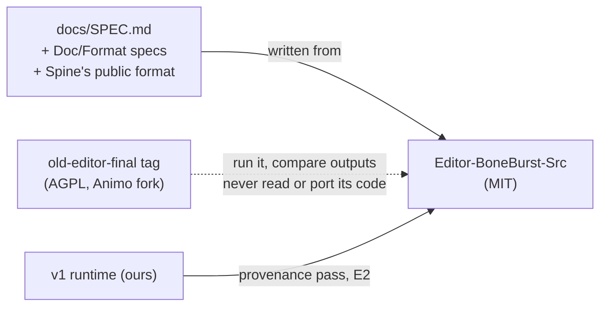

# CLAUDE.md

Guidance for agents working in `Editor-BoneBurst-Src/`: the BoneBurst Editor, a Spine 4.3
animation editor, **MIT**, written from scratch. Its document is the Spine JSON file
(docs/SPEC.md). It replaced the old editor, `Animation-BoneBurst-Src/`, an AGPL fork of Animo, on 2026-10-06 (E6
step 6). The fork is archived at the git tag `old-editor-final` (D8) and is no longer in `main`; it
is the behavioural oracle, which `scripts/oracle/editors.ts` extracts from the tag into the
repository's ignored `.oracle-v1/` when an oracle script runs. Decisions D1–D8:
`docs/EDITOR-V2-PLAN.md`.



**Read docs/SPEC.md before changing anything.** It is the architecture; a change it does not
describe updates it first.

## Clean room — the rules that keep this MIT

1. **Never open the fork's sources while working here**, nor its `docs/ARCHITECTURE.md`. Not as a
   template, not "for the structure", not to check a name. The fork may be **run**: its exports,
   screenshots and behaviour are fair to compare against. The copy the oracle scripts extract into
   `../.oracle-v1/` is the fork too, and so is the `old-editor-final` tag: run them, never read them.
2. **No pasting, porting or file-by-file translation** from the fork, by anyone, AI included.
3. **What to work from:** docs/SPEC.md, `../Packages/com.module.ta-creator-boneburst/Doc/Format/`
   (ours), Spine's public JSON format, and the plan.
4. **Own names, own layout.** Where the fork has a memorable name for something, pick another.
5. **Lifting our own code from the fork** (the runtime, in E2) goes through the plan's provenance
   pass first: written by us, no Animo-derived lines, nothing interleaved with Animo code; when in
   doubt, rewrite. Record each lifted file and its check in docs/SPEC.md.
6. **Honesty:** the people and agents writing this know the fork's code; the plan says so once.
   The defence is this process and export parity, not a claim of not knowing.

`scripts/check.sh` fails if `src/` names the fork or imports a Spine runtime package: tripwires,
not proof.

## Commands

```bash
npm start          # the built editor on :5185 (builds when stale; starts the bridge if none)
npm run dev        # Vite on :5185
npm test           # vitest run
npm run e2e        # Playwright: popout windows (once: npx playwright install chromium)
npm run build      # tsc --noEmit && vite build
npm run check      # all of it (e2e, the build's e2e, no chunk over 500 kB), plus the licence guards
node mcp/bridge.mjs  # the AI bridge (MCP on stdio, the editor's AI button on :5191)
npx vite-node scripts/oracle-parity.ts  # E6: the old editor as oracle: round trips compared
npx vite-node scripts/oracle-edits.ts   # E6: the same edits through both editors' bridges, posed
npx vite-node scripts/unity-parity.ts   # the engine against BoneBurst's C# runtime (needs Unity's .NET SDK)
npx vite-node scripts/daily-driver.ts   # E7: e2e/dailyDriver.spec.ts's export, posed by the C# runtime
FUZZ_STEPS=1000 FUZZ_SEED=3 npx vitest run tests/fuzzEdits.test.ts       # E7: longer edit fuzzing
HOSTILE_STEPS=150 HOSTILE_SEED=3 npx vitest run tests/hostileFiles.test.ts  # E7: longer hostile-file runs
```

An MCP client starts the bridge itself: in this repository the root `.mcp.json` does it for Claude
Code (`boneburst-editor`, guarded by `tests/mcpConfig.test.ts`); elsewhere
`claude mcp add boneburst-editor -- node "<this folder>/mcp/bridge.mjs"`. Then press AI in the
editor's toolbar. Ask AI (the AI panel) uses the same bridge with Claude or GLM; `?bridge=<port>` in
the editor's URL talks to a bridge on another port.

## How code is written here

- `src/model`, `src/io`, `src/edit` and `src/engine` touch no DOM and import nothing above them
  (docs/SPEC.md §1).
- **Edits are pure functions** document → document; the history keeps documents (SPEC §4). A
  decision gets a table test.
- **A test that guards a fix must fail on the old code.**
- Comment only what is not obvious; no mannered prose.
- Licences: keep `LICENSE` and `THIRD-PARTY-NOTICES.md` current; anything that ships is listed
  there before it lands. Spine's official runtimes are dev-only oracles at most.
