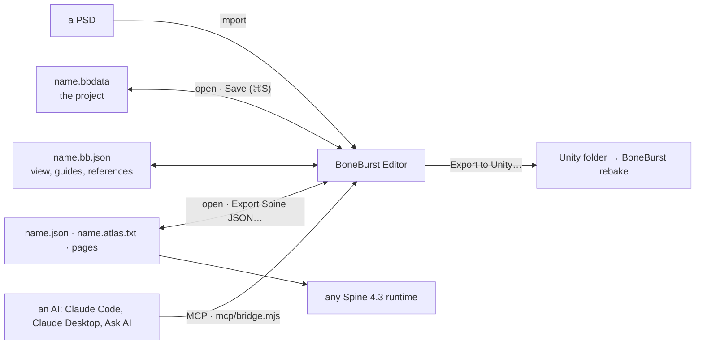

# BoneBurst Editor

A Spine 4.3 animation editor whose document is the Spine JSON file itself: open an export, rig
and animate it, save it, and the file goes straight to any Spine 4.3 runtime, including
BoneBurst in Unity. **MIT.**



## Running it

```bash
npm install
npm start
```

`npm start` builds the editor when its sources changed, serves it on http://localhost:5185, starts
the AI bridge if none is running, and opens the browser; Ctrl+C stops it. Use Chrome or Edge
(Export to Unity uses the browser's folder picker, which Safari and Firefox do not have). Working
on the editor itself: `npm run dev` (the same address, so preferences and recovery copies are
shared; stop one before starting the other). ⌘S saves a project (`.bbdata`, one file with the rig, atlas, pages, guides and references); Spine JSON and Unity go through File ▸ Export. Open a project, or a skeleton with its atlas and page images,
drop a PSD to start a rig from its layers, or drop a PSD on an open rig to bring in its changes.

## What it does

- **Rig**: bones, slots and attachments (regions, meshes with their weights, and every attachment
  kind Spine 4.3 has, kept as written), skins, draw order, events, and all five constraints (IK,
  transform, path, physics, slider), edited in the Rig panel and Properties and drawn on the
  stage.
- **Animate**: a timeline with keys, eases and a curve graph; Auto Key; copy and paste of keys and
  poses; onion skin; constraint, deform, draw-order and event keys; playback with physics.
- **Stage**: Move, Rotate, Scale and Shear with Local, Parent and World axes; snapping to bones,
  guides, a grid or whole pixels; rulers, guides and reference images; a weight brush.
- **Safe**: undo for every edit, and a History panel that goes back to any step; a recovery copy of
  unsaved work kept in the browser; a broken file refused with a reason, or opened saying what is
  wrong.
- **Keys**: every shortcut listed in Help ▸ Keyboard Shortcuts (or press `?`).
- **Files**: Spine 4.3 JSON, read and written exactly (a file opened and saved comes back as it
  was); Export to Unity writes the atlas, pages and skeleton into a folder BoneBurst rebakes.

## Connecting an AI

The editor's AI tools (46, contract version 2: `src/agent/tools.json`) reach the open rig through
a local bridge. An MCP client starts it itself. In the M0-Animation-2D repository, its `.mcp.json`
already does it for Claude Code (the server `boneburst-editor`; Claude Code asks once). Elsewhere,
add it:

```bash
claude mcp add boneburst-editor -- node "/path/to/Editor-BoneBurst-Src/mcp/bridge.mjs"
```

Then press **AI** in the editor's toolbar: the button turns green when the bridge sees the page.
**Ask AI** (the AI panel) talks to Claude or GLM through the same bridge, with a key the bridge
keeps on this computer. One bridge holds a port (5191): a second Claude session started beside the
first shows the server failed, and the first keeps the editor. To run two, give one
`BONEBURST_BRIDGE_PORT` and open the editor with `?bridge=<port>`.

## How it is checked

```bash
npm run check                               # types, tests, browser tests, licence guards
npx vite-node scripts/unity-parity.ts       # v2's engine against BoneBurst's C# runtime (needs Unity's .NET SDK)
npx vite-node scripts/daily-driver.ts       # the daily-driver test's export, posed by the C# runtime (run its e2e first)
npx vite-node scripts/oracle-parity.ts      # the old editor as oracle: round trips (taken from its tag)
npx vite-node scripts/oracle-edits.ts       # the old editor as oracle: the same edits through both bridges
```

- [docs/SPEC.md](docs/SPEC.md): the architecture.
- [docs/EDITOR-V2-PLAN.md](docs/EDITOR-V2-PLAN.md): why v2 exists, its phases and the owner's decisions (D1–D8).
- [docs/E6-PLAN.md](docs/E6-PLAN.md): parity with the old editor and the cutover; the earlier
  phases in `docs/E1-PLAN.md` … `docs/E5-PLAN.md`.

It succeeds `Animation-BoneBurst-Src` (archived at the git tag `old-editor-final`), a fork of
Animo by Morenoise, and contains none of its code. Spine is a trademark of Esoteric Software; this project is not affiliated with it.
