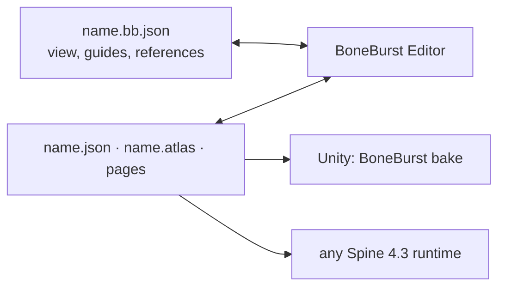

# BoneBurst Editor

A Spine 4.3 animation editor whose document is the Spine JSON file itself: open an export,
animate it, save it, and the file goes straight to any Spine 4.3 runtime, including BoneBurst in
Unity. **MIT.** Early: this is the charter (E0); nothing is editable yet.



```bash
npm install
npm run dev        # http://localhost:5185
```

- [docs/SPEC.md](docs/SPEC.md): the architecture.
- [../Animation-BoneBurst-Src/docs/EDITOR-V2-PLAN.md](../Animation-BoneBurst-Src/docs/EDITOR-V2-PLAN.md):
  why this editor exists and its phases.

It succeeds `Animation-BoneBurst-Src`, a fork of Animo by Morenoise, and contains none of its
code. Spine is a trademark of Esoteric Software; this project is not affiliated with it.
