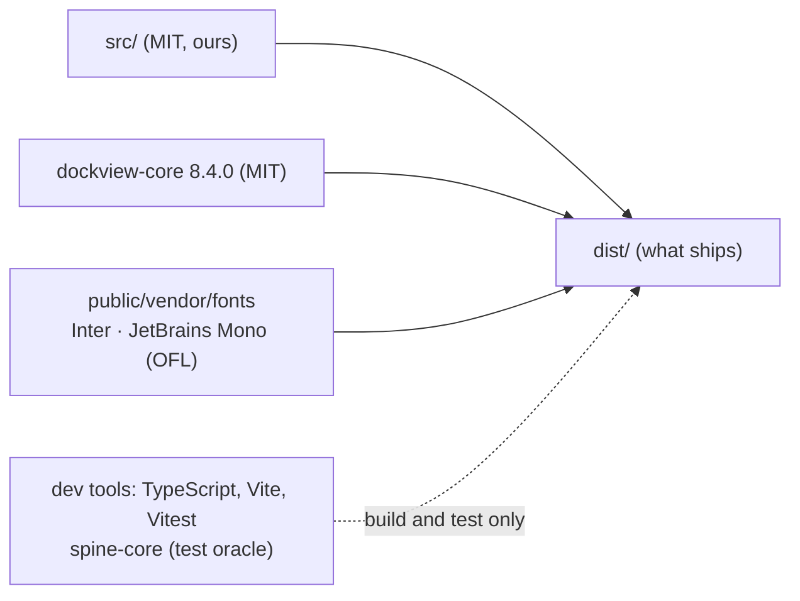

# Third-party notices

What this editor ships that others wrote, and what it only uses to be built and tested.

## Shipped

Each library or asset that reaches `dist/` has a row here, with its licence, before it lands.

| What | Version | Licence | Where | Use |
|---|---|---|---|---|
| [dockview-core](https://github.com/dockview/dockview) | 8.4.0 (exact) | MIT | npm dependency, bundled; licence `public/vendor/LICENCE-dockview-core.md` | panels and docking (D6); no dependencies of its own |
| [Inter](https://github.com/rsms/inter), variable, latin | from @fontsource-variable/inter 5.3.0 | SIL OFL 1.1 | `public/vendor/fonts/inter-latin-wght-normal.woff2`, licence `OFL-Inter.txt` beside it | interface text |
| [JetBrains Mono](https://github.com/JetBrains/JetBrainsMono), variable, latin | from @fontsource-variable/jetbrains-mono 5.3.0 | SIL OFL 1.1 | `public/vendor/fonts/jetbrains-mono-latin-wght-normal.woff2`, licence `OFL-JetBrainsMono.txt` beside it | numbers and values |

The fonts are copied unmodified from the Fontsource packages (not installed as packages, so
dockview-core stays the only npm runtime dependency); OFL reserves their names, so they are never
modified or renamed inside.

## Build and test only (not in `dist/`)

| Package | Licence | Use |
|---|---|---|
| [TypeScript](https://www.typescriptlang.org) | Apache-2.0 | type checking |
| [Vite](https://vite.dev) | MIT | dev server and build |
| [Vitest](https://vitest.dev) | MIT | tests |
| [@types/node](https://github.com/DefinitelyTyped/DefinitelyTyped) | MIT | Node types for the tests and the Vite config |
| [@esotericsoftware/spine-core](https://github.com/EsotericSoftware/spine-runtimes) 4.3.13 | Spine Runtimes License | the engine's test oracle (`tests/engineOracle.test.ts`) only; `scripts/check.sh` fails if `src/` imports it or `dist/` carries it |
