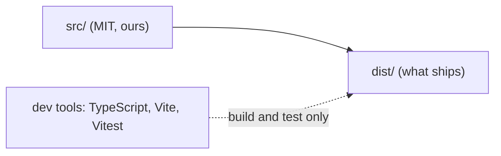

# Third-party notices

What this editor ships that others wrote, and what it only uses to be built and tested. Today
it ships nothing third-party: the E0 skeleton is our code only.

## Shipped

None yet. Each library that reaches `dist/` gets a row here, with its licence, before it lands.

## Build and test only (not in `dist/`)

| Package | Licence | Use |
|---|---|---|
| [TypeScript](https://www.typescriptlang.org) | Apache-2.0 | type checking |
| [Vite](https://vite.dev) | MIT | dev server and build |
| [Vitest](https://vitest.dev) | MIT | tests |
