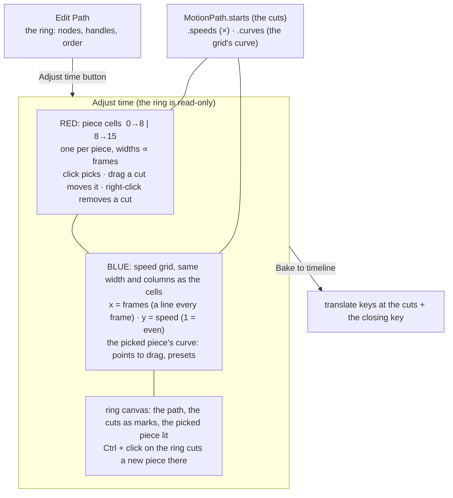

# Adjust time as a grid: pieces of the ring above, one speed grid under them — plan

> **Dropped 2026-10-08:** Adjust time and its speed grid were removed; see `TWINSPLINE-PLAN.md` (a speed for each node, in Edit Path). `panels/speedGrid.ts` is deleted.

**Status:** planned 2026-10-07, **the three questions answered the same day (all three recommendations: cells, speed grid, ring canvas below; one grid for all pieces; cuts dragged and removed in the cell row)**; **built 2026-10-07** (steps 1 and 2; not committed; not verified by hand): the cells and the speed grid (`panels/speedGrid.ts`), Ctrl (or ⌘) + click on the ring cuts it (the picked piece drawn thick, the others thin, a double click only says how), cuts dragged and removed in the cell row. `+ Time` / `− Time` stay as buttons. Tests: `e2e/speedGrid.spec.ts`, `e2e/motionPath.spec.ts`. It rebuilds the **Adjust time** half of `docs/PATH-FRAMES-PLAN.md`; **Edit Path** is unchanged.

Edit Path makes the **ring path** (the spline through the numbered nodes). Adjust time no longer touches that path: it only says **how fast the bone goes along each piece of it**.
The ring is cut into pieces (two to begin with); the pieces are a row of cells (the red box), and under them a grid (the blue box) lets the picked piece's speed be drawn as a curve.

## What was asked

> add Grid to "adjust time"
> 1 we get "Ring Path" from "Edit Path"
> 2 "adjust time" cant edit path, but purpose for adjust speed by each section
> 3 ring of 2 piece, we must slice to piece, by ctrl + L click on ring, then show each
> red box, for control piece of ring path
> 4 blue box for adjust speed
>
> let plan

The screenshot's red box is the strip of piece tabs (`0→8`, `8→15`); the blue box is the area under it, with **one vertical line, at the cut between the two pieces, running down from the red box through the blue one**.

## What is there today (checked on disk)

- `panels/motionPanel.ts`: Adjust time (`mode === "time"`) shows block tabs in `slotBar` (`renderStrip`, text cells), a **small 240 × 72 speed graph** (`graphBar`, `drawGraph`, presets Even / Slow in / Slow out / Slow in & out, draggable points), `+ Time` / `− Time`, the node-time frame field, `Time ×`, Total frames, Bake to timeline.
- Pieces are `MotionPath.starts` (the node times: frames), `speeds` (a multiplier each) and `curves` (a speed graph each, `[u, v, …]`, `edit/motionPath.ts` `graphShare`, `withBlockGraph`). The bone's place at a frame is `progressAtFrame`.
- A new cut today: `+ Time` at the playhead, or a **double click** on the ring (`addTimeAt`). The ring canvas is already locked in Adjust time (`timing`): no node or handle drags.

## The design

1. **Pieces = cells (red).** A row of equal-height cells, **one per piece, width proportional to its frames** (so the row is a time ruler: 15 frames across), each showing `start→end`, `×` and `∿` as the tabs do now. A click picks the piece (shared with the Timeline's tabs through `Session.pickedBlock`). A cut between two cells can be dragged to move it (`moveNodeTime`, a frame at a time), and right-clicking a cut removes it (`removeNodeTime`; never below two pieces). The text cells in `slotBar` are replaced by this row.
2. **Speed grid (blue), aligned under the cells.** One grid **as wide as the cell row, with the same columns**: a faint line every frame, stronger at each cut (the line in your screenshot), the y axis the speed (1 = even, a line at 0.5 steps, 0 at the foot, 3 at the top). The picked piece's speed curve is drawn in its columns and **edited there** (points to drag, double click to add or remove, the four presets); the other pieces' curves are drawn dimmer in theirs, so the whole run is seen at once and one click on another piece's columns picks it. This is today's small graph, grown to the whole width and given the frame grid; the data is the same (`curves`, `speeds`).
3. **Slice by Ctrl + click on the ring.** On the ring canvas a Ctrl + click (⌘ + click on a Mac, as the app's `mod`) cuts the ring where the pointer is: a new cut at the whole frame the bone passes nearest that point (`addTimeAt`'s rule, which exists), the cells and the grid gain a column, and the new piece is picked. Where a cut is, the ring shows a mark with its frame; the picked piece is drawn bold along the ring, the others thin. A double click is no longer a cut (one way to do it).
4. **The path is read-only here**, as today: nothing on the canvas moves a node or a handle; nodes are Edit Path's. Total frames stays (it sets the grid's width in frames).
5. **Edit Path unchanged.** `Bake to timeline` unchanged (the fit takes the speed curves into account already).

## Steps

1. `ui/panels/speedGrid.ts` (new, one job: the cells and the grid): draws the cell row and the grid, hit-tests cells, cuts and points, and reports edits as `MotionPath` values through the panel's `timeEdit`; replaces `graphBar`/`drawGraph`/`renderStrip`'s time half in `motionPanel.ts`.
2. `motionPanel.ts`: lays out Adjust time as cells, grid, ring canvas (the canvas keeps the rest of the height); Ctrl + click on the ring cuts; the picked piece lit on the ring (`drawMotion`); the double-click cut goes.
3. `edit/motionPath.ts`: only if needed: a function for the cut nearest a point (it lives in the panel today), and `moveNodeTime` already exists.
4. Timeline tabs and `Session.pickedBlock` keep working (same pick).
5. Tests: unit for any pure function moved; e2e in `e2e/motionPath.spec.ts` (updated: the speed-graph test now drives the grid) and a new `e2e/speedGrid.spec.ts`: two cells at 0→8 and 8→15 with widths in that ratio; Ctrl + click on the ring makes a third; a cut dragged moves; right-click removes, never below two; the grid's columns line up with the cells' edges; a curve dragged in the grid changes only the picked piece; the ring does not change. **A deliberate bug must fail it** (a cut that ignores the Ctrl, a grid column off by a frame).
6. Docs: `PATH-FRAMES-PLAN.md` points here; the changelog on commit.

## Risks

- **Two canvases of different scales** (the ring in panel units, the grid in frames) must not be confused: the grid is its own canvas, the cells its header.
- **Many pieces make narrow cells**: a piece of one frame in 15 across 400 px is 27 px wide; the text drops to `1f`, then a number, as the Timeline's tabs do.
- **A cut moved by a drag** changes the frames of the two pieces beside it, not their curves (a curve is a shape over the piece, so it stretches with it).
- The old double-click cut disappears; people who learned it get a note in the status line the first time.

## Questions for the owner (answered: 1a, 2a, 3a)

1. **Where does the ring canvas go?** The blue box covers the canvas in your picture. (a) Cells, then the speed grid, then the ring canvas below them, the canvas keeping what height is left (*recommended*: you can slice and see the ring while you draw the speed). (b) The grid replaces the ring canvas in Adjust time, and slicing is done on a small ring preview. (c) The grid is drawn over the top of the ring canvas, as an overlay.
2. **One grid or one per piece?** (a) One grid across all pieces, the columns lined up under the cells, the picked piece's curve bright (*recommended*, and what the vertical line in your picture looks like). (b) A grid for the picked piece only, filling the blue box, with the cells above as its tabs.
3. **How is a cut removed and moved?** (a) Drag the cut in the cell row to move it, right-click it to remove (*recommended*). (b) Only `− Time` and the frame field, as now.
