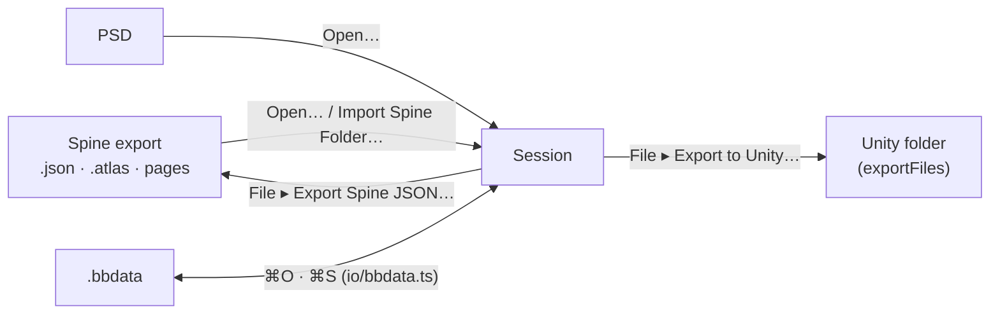

# BBDATA-PLAN: a project file (`.bbdata`) beside the Spine JSON

**Status: not verified** (2026-10-06): written and tested in vitest; the browser tests are updated, the
native save/open pickers are not exercised (Playwright cannot drive them).

Two kinds of file, two jobs. **Spine JSON** (with its atlas and pages) is the interchange: what
Import brings in and Export writes, what Unity reads. **`.bbdata`** is the project: ⌘S writes it, Open
reads it, and it holds everything needed to continue work, so reopening needs nothing beside it.

## Format

`BBDATA1\n`, a little-endian u32 length, a JSON header `{format, version, files:[{name,size}]}`, then
the files' bytes in that order. The files are exactly what the folder import reads: `<name>.json`, `<name>.atlas.txt`,
the page PNGs, `<name>.bb.json` (the sidecar: guides, references, notes, view) and the reference images.
So opening a project is the folder open of those files, with no second reader.

## Steps

1. `src/io/bbdata.ts`: `packBbdata`, `unpackBbdata` (refuses a wrong magic, header, or sizes).
2. `Session`: `.bbdata` in `open`; `markSaved`, `projectSidecar`; `referenceBlobs` (a reference's bytes are
   kept to be written); `projectHandle` (per document: ⌘S overwrites the file it was opened from or saved to).
3. `src/ui/project.ts`: `saveProject` (File System Access picker when the browser has one and is not
   automated; a download otherwise).
4. Menu: Open…, Save Project, Save Project As…, Close File, Export Spine JSON…, Export to Unity…. ⌘S is the project.

## Guard

`tests/bbdata.test.ts` (round trip, every refusal), `e2e/project.spec.ts` (save downloads a `.bbdata`, which
opens again as the same rig; Export Spine JSON… writes the three files).
