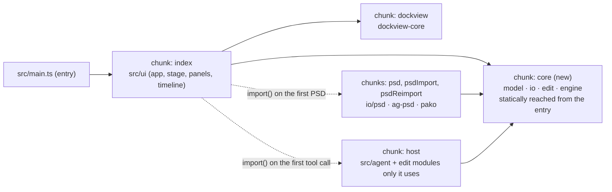

# Chunk split: the document's layers in a chunk of their own

**Status: done (2026-10-09), not committed.** Built as planned: `index` 406 kB, `core` 171 kB, `dockview` 357 kB, `psd` 297 kB (same file hash as before), `host` 212 kB (+0.07 kB); `core` imports nothing back from `index`; `dist/index.html` preloads `core` and `dockview` only. `npm run check` passes (793 unit tests, 145 browser tests, the build's smoke test). Nothing changed from the plan.

`npm run check` fails at its bundle-size gate: `index-*.js` is 575 kB, over Vite's 500 kB warning
(552 kB at 3a4bd390, 569 kB at 0e849fe9; the Motion Path panel's growth crossed the line). This plan
moves the pure layers (`src/model`, `src/io`, `src/edit`, `src/engine`) that the editor loads at
start into a `core` chunk beside `index`, the same seam SPEC §1 and `check.sh`'s layer rule already
enforce. Nothing changes in what loads when, or in what the editor does.

## Measured (the build's source map, bytes of minified output per source folder)

| chunk | kB | biggest parts |
|---|---|---|
| index | 575 | ui/panels 150 (motionPanel 71), ui 127, edit 78, ui/stage 75, engine 55, ui/timeline 26, io 24, ui/workspace 15, model 13 |
| dockview | 357 | dockview-core |
| psd | 297 | ag-psd 244, pako 49 |
| host | 212 | src/agent |

The pure layers in `index` add up to about 170 kB, so `index` drops to about 405 kB and `core` is
about 170 kB: both well under 500 kB, with room for the next panels.

## Decisions

| # | Question | Choice |
|---|---|---|
| 1 | Lazy panels or a split? | **A `manualChunks` split.** The Motion Path panel (the largest single source) is wired into start-up: the Stage draws its trail, the dock layout restores its memory, and the tests reach it through `window.boneburst.motionPath`. Loading it with `import()` would change start-up order and every caller. Preferences (15 kB) and the shortcuts sheet (5 kB) are too small to matter alone. The layer split changes no code path. |
| 2 | Which modules go to `core`? | Modules under `src/model`, `src/io`, `src/edit`, `src/engine` **that the entry reaches through static imports**. A module only reached through `import()` (`io/psd`, edit helpers only the AI tools use) stays in its lazy chunk: a manual chunk would otherwise pull it, and `ag-psd` behind it, into the start-up load. |
| 3 | A guard? | `check.sh` already fails on Vite's chunk warning; it gains nothing new. The plan's step 3 checks that `psd` and `host` keep their contents. |

## Steps

1. `vite.config.ts`: `manualChunks` returns `"dockview"` as now, and `"core"` for a pure-layer
   module statically reachable from an entry (walked with Rollup's `getModuleInfo`, memoised).
2. SPEC's "Running it" paragraph and `check.sh`'s comment name the `core` chunk.
3. Measure again: `npm run build` with no "Some chunks are larger" warning; `psd` and `host` the
   same size as before (± a few hundred bytes of import statements).
4. `npm test`, `npx playwright test`, and the build's e2e (`-c playwright.build.config.ts`).
