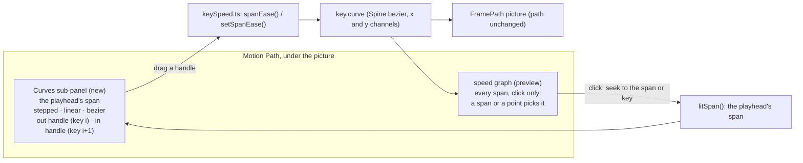
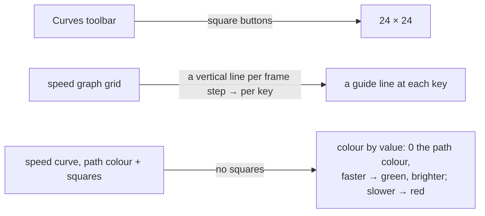

# FramePath's Curves sub-panel, and the speed graph as a preview

**Status:** done, 2026-10-09 (steps 1–6). Left for the owner: whether the frame strip should also span the Curves view (it lines up with the graph); and the data row's buttons scrolling the graphs out of sight (step 5's finding).

The owner's note, with two screenshots (the speed graph boxed in green, the picked span in red, the graph's left margin in blue,
and Spine's own Curves view):

> big refactor. 1 Add new dedicated Curves sub panel at Blue Box. 2 convert Green box to preview graph with click able only, then
> migrate edit graph to [the Curves panel].

Today the speed graph (green) is both the overview of every span and the place speeds are edited: a key's point drags up and down,
each leg drags up and down for its speed and sideways for its reach (step 10), Linked and Broken link the two legs (step 11). The
plan splits the two jobs. A **Curves** sub-panel, left of the graph where its value labels are now (blue), shows **one span**, the
one the playhead is in (red, the strip's lit tab, `litSpan()`), as Spine's Curves view does: time across, progress up, a handle at
each end. All editing of a span's timing moves there. The speed graph stays as the overview of the whole animation: **click only**,
to pick a span or a key, nothing dragged.

## What the Curves view shows

A span from key *i* to key *i+1* is one Spine bezier per channel: time handles (when) and value handles (where). FramePath writes
the same time handles to x and y and keeps the value handles as the path's shape (steps 5, 8, 9), so a span's **timing** is the
time curve `(0, u1, u2, 1)` against the path's own parameter. The Curves view draws exactly that: x = the span's time 0 → 1,
y = how far along the path 0 → 1, and two handles: key *i*'s **out** handle at the start and key *i+1*'s **in** handle at the end,
in the leg colours (step 19).

- **Straight span** (the path between the two keys is a line): both of a handle's coordinates are free. Across is its reach (step 10),
  the slope is its speed; this is the same two numbers the leg drag sets today, now dragged as one point, as in Spine.
- **Curved span** (a Mirror or Break key bends the path): the up coordinate is how far the path handle reaches along the chord, and
  the owner chose it free too (Decision 1): dragging it changes the path handle's length along the chord, so the picture's bend
  changes with it.

## Steps

1. **Model** (`src/edit/keySpeed.ts`, no DOM): `spanEase(bone, k, next)` reads a span as `{ kind: stepped | linear | bezier, out:
   [x, y], in: [x, y], free: "both" | "across" }`; `setSpanEase(animation, bone, index, ease)` writes it, the path's places and shape
   unless an up coordinate changed (Decision 1), held to what the span allows (the bounds of steps 8 and 10). Table tests, written
   first, including: a straight span's handle sets the same file as today's speed and reach edits; on a curved span an across drag
   leaves the path's places and handles alone, an up drag changes only the handle's part along the chord.
2. **Curves sub-panel** (`src/ui/panels/curvesView.ts`, its own module; `motionPanel.ts` is 2 470 lines and only hosts it): a
   square canvas at the graph's left (blue box), the same height as the graph, with a resize line between them. The span's curve,
   the dashed even-pace diagonal, the two handles in the leg colours, the playhead's place on the span. A toolbar like Spine's:
   **stepped · linear · bezier** (Decision 3). Dragging a handle: one undo step per drag; Shift
   holds it to one axis. With no span at the playhead (past the last key, Pose mode): empty, saying why.
3. **Speed graph to preview** (green box): clicking a point picks its key (the playhead there), clicking inside a span picks that span;
   points, legs and reach are drawn as now but **nothing drags**. The leg drag, the reach drag, the point drag and their state
   (`speedDrag`, `legDrag`, `dragKeyLeg`, `dragKeyReach`) are deleted, not kept behind a switch (beta: clean break). Its value
   labels move to the graph's right edge, since the Curves view takes its left.
4. **Linked · Broken and the number fields stay in the key's data row** (Decision 2); the preview graph's right-click menu
   (Linked · Broken · Delete) stays, since it changes nothing by dragging.
5. **Tests**: e2e for the Curves view (drag a handle → the file and the preview change, the picture does not; stepped / linear /
   bezier; a curved span's up drag changes the path handle along the chord only); the speed graph's tests change from drags to clicks (`motionModes`,
   `speedReach`); the leg-colour and Hybrid tests follow the graph's new place.
6. **Docs**: docs/SPEC.md's Motion Path paragraph; this plan's result.

## Decisions (the owner, 2026-10-09)

1. **A curved span's handle moves up and down too.** Its up coordinate is, as in Spine's per-channel view, how far the path handle
   reaches along the span's chord: `y_out = (out · chord) ÷ |chord|²`, `y_in = 1 + (in · chord) ÷ |chord|²`. On a straight span this
   is the handle's share of the chord (steps 8 and 10), so both kinds of span read the same way. Dragging it up or down adds or takes
   away along the chord only (`out' = out + Δy · chord`), so the part of the handle across the chord, the bend, stays; the path's shape
   on the picture changes with it, which the owner accepts. This reverses step 9's "the graph never changes the shape" for the Curves
   view only: the preview graph still changes nothing.
2. **Linked · Broken and the Speed / Reach fields stay in the key's data row.** The Curves view's toolbar has only the curve's kind.
   Linked still links key *i*'s two legs; in the Curves view the span's out handle belongs to key *i* and its in handle to key *i+1*,
   so dragging one handle there moves the other side of that key (the neighbouring span, not shown) when the key is Linked.
3. **Presets: stepped · linear · bezier only**, as Spine's.
4. **Match only.** One curve for x and y, as FramePath writes today; no Separate.

Confirmed with the plan: the Curves view shows the playhead's span (the strip's lit tab); a click on the preview graph moves the
playhead, so it also chooses the span.

With these, step 1's `spanEase` reads `{ kind, out: [x, y], in: [x, y] }` with both coordinates free on every span, and step 2's
toolbar is the three kinds alone.

## Result

### Step 1 (done, 2026-10-09)

`src/edit/keySpeed.ts`: `SpanEase`, `spanEase(bone, k, next)` and `setSpanEase(animation, bone, index, { kind, out?, in? })`, as
planned. Two details the tests settled:

- The up coordinate is computed from the handle as it is, not from the four-place read-back, so a write lands exactly (the first run
  was 0.002 units off on a 60-unit chord).
- An up value within that rounding (5e-5) of where the handle already is counts as unchanged: a drag that only moves across, passing
  back the up value it read, leaves the path's handles exactly as they were.

`tests/spanEase.test.ts` (11, written first and failing before the code): no curve reads linear on the diagonal's thirds; stepped
reads stepped; a straight span's speed and reach read as across = reach, up = speed × reach; a curved span's up is the handle's reach
along the chord; the three kinds write; handles read back with the keys' places kept; on a straight span `setSpanEase` writes the same
curve as the speed and reach edits it replaces; on a curved span across moves no path handle, and up changes the handle along the
chord only (its part across the chord stays); time held inside the span and a side not given kept; the refusals. vitest 793 pass.

### Step 2 (done, 2026-10-09)

`src/ui/panels/curvesView.ts`: `CurvesView` with a `CurvesHost` (the span, the colours, `begin` / `end` / `apply`): the toolbar
(stepped · linear · bezier, Godot's curve icons), a 4 × 4 grid with the dashed even-pace diagonal, the playhead across the span in
green, the curve in the path colour, the out and in handles dashed from their ends in the leg colours (a linear span shows its handles
at the thirds; dragging one makes it a bezier), Shift holding a drag to the axis it went along most, and the value range widened for
handles past 0 or 1 but held still during a drag. With no span at the playhead it says why and its buttons are off.

`motionPanel.ts` hosts it: `curveSpan()` (the playhead's span from `litSpan()`), `applySpanEase()` (a kind is one undo step; a drag is
one gesture; on a Linked key the leg on the other side takes the dragged leg's speed and reach), and the row `.lp-speed-row` with the
Curves view, a resize line (`curvesSplit`, double-click: back to 170 px, kept per browser) and the speed graph. The graph's height
setting now sizes the row.

As it stands, the frame strip lines up with the speed graph, so the part of the strip above the Curves view shows no frames. Step 3
moves the graph's value labels; whether the strip should span the Curves view too is for the owner to say.

`e2e/curvesView.spec.ts` (3): the kind buttons write stepped, linear and bezier, each pressed and one undo step, with no handles on a
stepped span; dragging the out handle up keeps every key's time and place, is one undo step, makes key 2 leave faster, and Linked gives
its arrival the same speed; undo puts the keys back; past the last key the view says so. Seen on a Playwright screenshot. vitest 793
pass; e2e: all pass except the 3 AI-bridge tests (no bridge from the dev server on 5199).

### Step 3 (done, 2026-10-09)

The speed graph is a preview. A click on a key's point goes to that key; a click anywhere else puts the playhead on the frame under it,
so the Curves view shows that span. Kept, since they write nothing by dragging: Shift + click on a point deletes its key, ⌘ + click or
right-click opens its menu (Linked · Broken · Delete), double-click on a point links its legs (elsewhere it fits the graph), the middle
button pans and the wheel zooms. The cursor is the hand over a point, else the arrow.

Deleted (beta, clean break): the point drag (FRAMEPATH-SPEED-PLAN steps 3 and 7, up and down for the speed), the leg drag (step 3,
its side's speed; Alt to break), the leg's sideways reach drag (step 10), the top edge's scrub, the lit leg under the pointer, and their
state and helpers (`speedDrag`, `legDrag`, `capDrag`, `speedHover`, `dragKeyLeg`, `dragKeyReach`, `speedLegAt`, `scrubGraph`,
`speedAtY`, `valueAtY`). The legs are still drawn, the picked key's only, as long as their reach. The value labels moved to the
graph's right edge (`plot()`: 10 px left, 40 px right).

Tests: `motionModes.spec.ts`'s step 13 test now drags a point up and sideways and finds the file unchanged, the press having picked the
key; `speedReach.spec.ts` is rewritten: the graph draws the leg as long as the reach and a drag on it writes nothing, a typed reach
lengthens it, and Shift + dragging the Curves view's out handle across sets the reach with every key's place kept; `curvesView.spec.ts`
adds a click inside a span on the graph, which moves the playhead there and gives the Curves view that span. Seen on a Playwright
screenshot. vitest 793 pass; e2e: all pass except the 3 AI-bridge tests (no bridge from the dev server on 5199).

### Step 4 (done, 2026-10-09)

Already in place from step 2 (Decision 2): Linked · Broken and the Speed and Reach fields stay in the key's data row, and the Curves
view follows them (Linked: a handle drags the key's other leg too; Broken: its side only). The preview graph's menu (Linked · Broken ·
Delete) stays. Changed: the words. Linked's and Broken's tips say what a Curves handle does under each; the speed graph's title tip says
it is a preview and that a span is eased in Curves. `curvesView.spec.ts` adds: on a Broken key, dragging the out handle in Curves
changes the speed out and leaves the speed in; a speed in typed in the data row is written and the out kept.

### Step 5 (done, 2026-10-09)

Steps 2–4 brought their own tests (`curvesView.spec.ts`, `speedReach.spec.ts`, `motionModes.spec.ts`); step 5 adds what the plan
asked for beyond them, in `curvesView.spec.ts` (now 9):

- a handle dragged in Curves changes the preview graph's points and leaves every key's dot in the picture where it was;
- on a curved span (key 3 Mirrored, its out handle's tip dragged off the line on the picture), a Shift + up drag in Curves lengthens the
  path handle along the chord and leaves its part across the chord as it was (Decision 1, end to end);
- the Curves handles are drawn in the leg colours (`#38b6ff` in, `#ff5c8a` out), and Hybrid paints the Curves view `#d3d3d3`;
- the line between Curves and the graph widens the Curves view, the width is kept, and a double-click puts it back.

Found while writing them: clicking a button in the key's data row (Mirror) scrolls the area under the picture to it, which can scroll the
Curves view and the graph partly out of sight under the frame strip; the test scrolls back. Not changed here.

vitest 793 pass; e2e: all pass except the 3 AI-bridge tests (no bridge from the dev server on 5199).

### Step 6 (done, 2026-10-09)

docs/SPEC.md §6a rewritten: the diagram names every path into the keys (`setKeyHandles` from the picture, `setSpanEase` from the Curves
view, `setTranslateKeySpeeds` / `setTranslateKeyReaches` from the data row, `retimeTranslateKey` from the strip); the speed is described
as it is since step 9 (velocity on a straight span with a free reach, the rate along the path on a curved one), with the Curves view's
across and up. §7's Motion Path paragraph is rewritten as a list from top to bottom, the panel as it is today (steps 2–21 of
FRAMEPATH-SPEED-PLAN, the Stage path, the Curves view and the preview graph).

`npm run check` fails at its bundle-size gate: the main chunk is 575 kB against `scripts/check.sh`'s 500 kB. Not this plan's doing
alone: built at each commit, it was already 552 kB at `3a4bd390` (before today's FramePath, Stage path, Hybrid and Curves work) and
569 kB at `0e849fe9`; this plan adds 6 kB. A split of the main chunk is its own task.

## Step 7: the look of the Curves toolbar and the preview graph (2026-10-09, the owner's follow-up)

> 1 at black box, icon must w == h. 2 at black line, convert ver guide line per node block. 3 at blue box, remove mini box icon at
> line, then update line by add color hue: if more than 1 more green more bright, if value low than 1 more red by value.

1. `.lp-curves-bar` buttons square (24 × 24), side by side from the left.
2. The speed graph's vertical lines: one at each key (a span's edges), in place of the lines every few frames.
3. No square on the curve at the keys (a click near a key's place still picks it, Shift still shows the red one it would delete).
   The curve is coloured by its value: at 0 (the even pace, multiplier 1) the path colour; above, toward a bright green, fully at 2
   (three times as fast); below, toward red, fully at −0.99. The picked key's legs stay.
4. Tests: the toolbar's buttons square; a key's guide line and no square at a key; a fast stretch green and a slow one red.

### Step 7 (done, 2026-10-09)

As planned. `speedColour(base, v)` lives in `src/ui/graphLook.ts` (DOM-free), with `#3dff7a` at 2 and above and `#ff3b30` at −0.99;
the curve is stroked a sample at a time in it. The graph's guide lines are at the keys; the frame-step lines are gone. The only square
left on the curve is the red one Shift would delete. Tests: `tests/graphLook.test.ts` (2: the ends of the scale, more green the
faster, more red the slower); `curvesView.spec.ts` (10): the Curves buttons are square, no square at key 2's place (just off the line
is the background), speed out 3 draws green, −0.9 red. Seen on a Playwright screenshot. vitest 795 pass; e2e: all pass except the 3
AI-bridge tests (no bridge from the dev server on 5199).

### Step 8: no legs on the preview (done, 2026-10-09; the owner: "no need show leg, remove it")

The speed graph no longer draws the picked key's legs (the leg colours and reach show in the Curves view and on the picture). Deleted
with them: the graph's leg list and its test hook (`speedLegs`, `speedHandles`). Preferences' leg-colour note says "on the picture and
in the Curves view". `speedReach.spec.ts`'s first test now types a reach and finds the Curves view's out handle moved across, and the
graph's leg hook gone. vitest 795 pass; e2e: all pass except the 3 AI-bridge tests (no bridge from the dev server on 5199).
