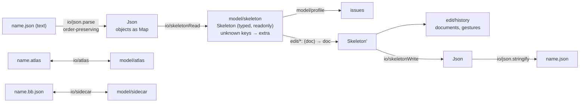

# E1 — model and IO, headless — plan

**Status:** done 2026-10-06. `npm run check` passes: 129 tests, every sample skeleton (16) and
atlas (19) round-trips with zero differences, every sample passes the profile, layer and licence
guards hold. Not done here (later phases): edits beyond bones, the engine (E2).

E1 gives the editor a document it can hold, read, write and undo, with no screen yet: the Spine
4.3 skeleton as typed immutable data (SPEC §2), the atlas and the sidecar (SPEC §3), Spine JSON
in and out (SPEC §5), and the history (SPEC §4). It is done when every sample skeleton and atlas
the format specs' tests use reads and writes back with zero differences (`EDITOR-V2-PLAN.md` ▸ E1).
Sources: SPEC.md, `Format-Json-Atlas.md` and `BoneBurst-Profile.md`
(`../../Packages/com.module.ta-creator-boneburst/Doc/Format/`). Clean room: the fork's code is not
opened (CLAUDE.md).

## Decisions

- **Our own JSON reader.** `JSON.parse` moves integer-like keys (`"1"`, `"2"`) to the front of an
  object, and Spine relies on document order for animations, events, skins' attachments and
  timelines (`Format-Json-Atlas.md` §2–3). `io/json.ts` parses objects into `Map`s (insertion
  order kept for every key; a duplicate key keeps its first position and the last value, as the
  spec's reader does) and writes them back in that order.
- **Presence is kept.** A model field is set exactly when the file had the key; defaults are not
  filled in. Defaults belong to queries (`Format-Json-Atlas.md` tables), not to the data, so a file
  that writes a default explicitly, and one that omits it, both round-trip.
- **Unknown keys are kept** in each object's `extra` (a `Map`, in file order) and written after the
  known ones. A known key whose JSON type is wrong stays in `extra` too, with an issue: nothing is
  dropped or coerced.
- **Numbers are kept as read** (doubles). Writing uses the shortest form that reads back as the same
  double, so an untouched number round-trips exactly; float32 is the engine's business (E2).
- **Round-trip equality**: parse(write(read(file))) equals parse(file) as JSON values, with key
  order compared inside objects whose keys are names (animations, events, timeline groups,
  attachments) and ignored inside fixed-key objects (a bone's `x` before or after its `y` means
  the same).

## Steps

1. `io/json.ts`: parse, stringify, deep equality (both orders); table tests incl. integer-like keys.
2. `model/skeleton.ts`: the types (header, bones, slots, the five constraint kinds, skins and the
   seven attachment kinds, events, animations and their keys).
3. `io/skeletonRead.ts`, `io/skeletonWrite.ts`; round trip of every sample.
4. `model/profile.ts`: `BoneBurst-Profile.md` §1's rules as issues.
5. `model/atlas.ts`, `io/atlas.ts`: pages and regions with their fields kept as written; round trip.
6. `model/sidecar.ts`, `io/sidecar.ts`: version 1, unknown format or version refused.
7. `edit/history.ts` and the first edits (`updateBone`, `renameBone`, which rewrites every
   reference), each result deep-frozen under test.
8. `scripts/check.sh`: the layer rule of SPEC §1 enforced.

## Results

1. `io/json.ts` (+ `model/json.ts`): order-preserving parse and write, `jsonEqual` with a per-path
   order rule. `tests/json.test.ts` shows `JSON.parse` reordering `"1"`/`"2"` and ours not.
2. `model/skeleton.ts`: every object of §4–13. `audio` and `images` are `string | null`: the Spine
   Editor writes `null` for none (found on the samples: 15 of 16 headers).
3. `io/skeletonRead.ts`, `io/skeletonWrite.ts`, field tables in `io/skeletonFields.ts`: all 16
   samples read with no issue and nothing left in `extra`, and write back equal
   (`tests/skeletonRoundTrip.test.ts`). Breaking the writer on purpose (dropping curves) fails 14
   of them.
4. `model/profile.ts`: §1 and §2's rules; 14 broken-file cases each caught, every sample passes.
5. `model/atlas.ts`, `io/atlas.ts`: pages, regions and fields as written (all values, not the
   reader's first four), `regionBounds`, `regionDegrees`; 19 sample atlases round-trip.
6. `model/sidecar.ts`, `io/sidecar.ts`: version 1 with guides, references and notes; an unknown
   format or version gives the empty sidecar and an issue.
7. `edit/history.ts`, `edit/bones.ts` (`updateBone`, `renameBone`). **Changed from SPEC §4's
   wording:** a gesture records nothing only when it ends on the identical document; one that moves
   out and back to equal values is a step (a deep comparison per gesture is not worth it).
   `renameBone` there and back leaves every sample byte-identical when written.
8. `scripts/check.sh`: the layer rule and a DOM check for the pure layers. Both were first written
   wrong (a missing `src/engine` made grep error out, and under `set -e` a loop ended the script
   silently); each now fails on a planted violation.
