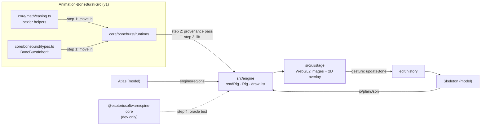

# E2 — the stage — plan

**Status:** done 2026-10-06. `npm run check` passes: 169 tests, the engine agrees with spine-core on
every sample and the stickman (about 2,080 poses, worst 6.6e-5), and the stickman opens, is
selected, moved, rotated, scaled, renamed, undone and saved in the browser. Not done here (later
phases): animation on the stage (E3), editing anything but bones (E4), the sidecar's view state
(E4).

E2 puts the document on screen: a canvas showing the skeleton's setup pose, posed by our own
runtime, with a bone overlay, selection, transform gizmos, zoom and pan, and every edit going
through the history. It is done when the stickman fixture is inspectable and editable on screen
(`EDITOR-V2-PLAN.md` ▸ E2). The runtime comes from the old
editor's folder, after the provenance pass the plan and CLAUDE.md ▸ Clean room require; of the
rest of the old editor, only the lines that tie the runtime to it are opened, to cut them.

## Decisions

- **The engine reads plain JSON**, as the runtime always has: `io` turns the document into the
  plain object `JSON.parse` would give (`plainJson(skeletonToJson(doc))`), and the engine builds
  its rig from that. Rewriting the runtime's reader over the model is a later choice; lifting it
  as it is keeps the parity it was proved with. Integer-like names get `JSON.parse`'s order there,
  as in the old editor.
- **No second atlas reader.** The runtime's `atlasRead.ts` is not lifted; `engine/regions.ts`
  builds the regions the rig needs from the model's atlas (`io/atlas` reads it once).
- **The renderer is ours**: WebGL2 for the images (regions and meshes, premultiplied blending,
  the four blend modes, clipping through the stencil), a 2D canvas over it for bones and gizmos.
  No PixiJS: E2 needs textured triangles and nothing else, and nothing new ships.
- **spine-core 4.3.13 is a dev dependency**, the oracle only (SPEC §9); the check script keeps it
  out of `src/` and `dist/`.
- **Gizmos edit the setup pose's local values** (`updateBone`): a drag is one gesture, so one
  undo step. Translate, rotate and scale; the pointer's world motion is turned into the bone's
  local frame through its parent's world matrix.

## Steps

1. **v1: cut the runtime's two ties.** `EaseSegment`, `boneburstPolyline`, `readPolyline` move
   from `core/math/easing.ts` into `runtime/bezier.ts`; `BoneBurstInherit` moves into
   `runtime/rigTypes.ts`. The old users import them from there. v1's `scripts/check.sh` passes.
2. **Provenance pass**, file by file: who wrote it and when (git), what it imports, any
   Animo-side name or line, any comment pointing at the old editor. Recorded in SPEC §6.
3. **Lift** into `src/engine/`: comments pointing at the old editor rewritten; imports only within
   the engine and the model.
4. **Oracle test**: every sample and the stickman, setup pose and each animation at several
   times, bone world matrices and drawn vertices against spine-core.
5. **Stage**: open a skeleton with its atlas and pages (file picker or drop; a dev link opens the
   stickman); draw it; bones overlay; click to select; outline list; gizmos; zoom at the pointer,
   pan; undo and redo; save the JSON.
6. **Gizmo maths** in a DOM-free module with table tests (world drag → local values, hit tests).
7. **Check on screen**: the stickman opened, a bone moved, rotated, scaled, undone, saved and read
   back.

## Results

1. **v1 ties cut.** `runtime/bezier.ts` holds `EaseSegment`, `boneburstPolyline`, `readPolyline`;
   `runtime/rigTypes.ts` holds `BoneBurstInherit` (`core/boneburst/types.ts` re-exports it). The
   runtime folder now imports nothing outside itself. v1's `scripts/check.sh` passes (2,427
   tests). To do this the pass opened, outside the runtime: `easing.ts`'s two helpers and its list
   of exports, `types.ts` around `BoneBurstInherit`, the runtime's own plan's risk notes, and the
   import lines of the five files and one test that used the helpers. Nothing of those reached
   v2 except through the runtime.
2. **Provenance:** recorded in SPEC §6. Animo: clean, every file ours (P0–P5, 2026-10-05).
   **spine-core: carried, not cleared:** the runtime's author knows spine-core's algorithms and the
   solvers follow its structure; the runtime's plan asks for legal review, and that stands.
3. **Lifted** into `src/engine/` (15 files): comments repointed, `LooseBones` left out, and
   `atlasRead.ts` replaced by `regions.ts` over the model's atlas. **Changed from the plan:** the
   engine reads `io/json.plainJson` output, so `io` gained `plainJson`.
4. **Oracle:** `tests/engineOracle.test.ts`, 18 tests. Tolerance 1e-4 relative; the worst
   sample is 6.6e-5 (raptor-pro's front leg), the stickman 2e-9. Physics is posed off. A flipped
   IK bend fails 7 skeletons, dropped curves 15. Region corners are listed in a different order
   from spine-core's; the test maps them.
5. **Stage:** `src/ui/` (session, files, stage, renderer, camera, gizmo, posed, outline,
   inspector, app). WebGL2 for images with premultiplied blending, the four blend modes,
   two-colour tint and stencil clipping; a 2D canvas for bones and the gizmo. Tools W/E/R, F to
   fit, ⌘Z/⇧⌘Z, ⌘S downloads the JSON, ⌘O or drop to open, Escape cancels a drag. A skin picker
   when the file has skins. Re-posing the largest sample costs 3.5 ms, so every drag step re-poses
   the whole document.
6. **Gizmo maths:** `tests/stage.test.ts`, 22 tests. **Found by the test:** rotating by "the
   pointer's turn, signed by the parent's mirror" is wrong under an unevenly scaled parent (off
   by 50°). Rotation now takes the target direction into the parent's space (`localRotation`),
   exact for normal inheritance; the sign rule stays for the other modes. A drag's untouched axis
   keeps its key as written (`asWritten`), so scaling along x does not write `"scaleY": 1`.
7. **On screen** (built-in browser, dark and light): the stickman opens from the dev link and by
   a dropped set of files; the head was moved (37.86 units for 40 px at that zoom, into its
   local y under the turned chest), rotated, scaled along x only, renamed (a clash refused with
   its reason), undone and redone; the saved text read back with no issues. Fixed on the way:
   the inspector's first draw, the `[hidden]` attribute losing to `display: flex`, opening over
   unsaved edits now asks. The dev server serves `tests/fixtures/stickman/` for the dev link.
   Choosing files through Open… was not clicked through (it shares the drop path's reader).
   Saving was checked by reading the saved text in the page, not by downloading a file.
