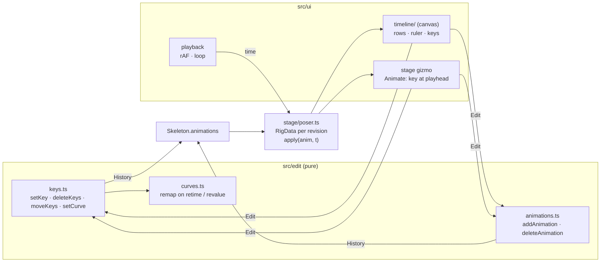

# E3 — timeline and playback — plan

**Status:** done 2026-10-06. `npm run check` passes: 214 tests. A walk was keyed on the stickman
from a new animation in the browser (feet at frames 0, 12, 24; hips bobbing, eased), played,
saved, and read back by the engine and spine-core alike (152 poses, worst 1.1e-7). Not done here:
physics on screen (the stickman has none; playback steps it, untested by eye), draw order and
event keys from the UI (they show and move, but are not authored), the agent tools (E5).

E3 makes the editor animate: pick or create an animation, see its keys on a timeline, scrub and
play it through the engine, key bones from the stage and the inspector at the playhead, move and
delete keys, and set the curve between two keys. Every change is an edit on the Spine JSON's
`animations` (Format-Json-Atlas.md §11–12), one undo step each. It is done when a walk can be
keyed from nothing on the stickman, played, saved, and read back by the engine and spine-core
alike.

**Scope decision (owner, 2026-10-06):** the v2 plan's E3 line also asked for the agent tools
(`set_keys`, `show`, `get_pose`) over MCP with an unmodified contract. That contradicts D5 (the
contract gets a new version) and needs the contract text, which is E5's. E3 builds the pure key
edits those tools will call (`src/edit/keys.ts`); the MCP criterion moves to E5, and the v2
plan's table says so.

## Decisions

- **Times are Spine's.** Frame `f` at `skeleton.fps` (30 when absent) is written as the shortest
  decimal that reads back as the same float32 as `f / fps` — `0.13333334`, as the Spine Editor
  writes it. A key's frame is `round(time × fps)`. A time of 0 is left out of the key, as Spine
  does. The playhead poses at a frame's float32 time: Spine stores key times as float32, so a key
  at 0.2 is 0.2000000029, and posing at the double 0.2 lands just before it.
- **Key values are Spine's:** rotate, translate and shear are offsets from the setup pose, scale
  is a factor of it (§11.4). Keying from the stage writes the pose the gizmo makes, converted so;
  a bone whose setup scale is 0 cannot take a scale key (refused with the reason).
- **Which timeline a stage key goes to:** the split one (`translatex`…) when the bone already
  has it for that property, else the combined one (`translate`). A combined key always carries
  both channels, the untouched one at its value at the playhead.
- **Curves keep their shape when keys move.** A bezier's handles are absolute times and values
  (§12.1). When an interval's ends change (a key moved, its value changed, a key inserted or
  deleted inside it), its handles are mapped from the old ends to the new ones, proportionally in
  time and in each channel's value; a flat channel keeps its handle offsets.
- **Presets** apply the same normalised cubic to every channel: ease in (0.42, 0, 1, 1), ease
  out (0, 0, 0.58, 1), ease in-out (0.42, 0, 0.58, 1); plus linear and stepped.
- **Moving keys** snaps to whole frames and is refused when a key would land below 0 or on a key
  of the same timeline that does not move.
- **Setup and Animate.** With no animation chosen the stage edits the setup pose (E2); with one
  chosen it keys at the playhead. The animation list's first entry is the setup pose.
- **Physics** plays only while playing (stepped from the last frame, reset when play starts);
  scrubbing and a paused playhead pose without it, so a scrubbed frame is the same every time.
- **Rows:** one per bone, slot and constraint the animation keys, in the skeleton's order, plus
  the selected bone; draw order and events get a row each. A row expands into one row per
  timeline. Deform and sequence keys show under their slot. Draw order folders are not shown.

## Steps

1. Fix the v2 plan's E3 and E5 lines (the scope decision).
2. `src/model/timelines.ts`: the queries — every key list of an animation with its path, a key's
   time and frame, channel count and values per timeline (§11–12 tables).
3. `src/edit/curves.ts`, `src/edit/keys.ts`, `src/edit/animations.ts`, with table tests, and a
   check that the engine and spine-core read what they write.
4. `stage/poser.ts`: rig data per document revision, posed at an animation and time; the
   unconstrained local pose kept for keying.
5. Stage in Animate mode: the gizmo and the inspector key at the playhead.
6. Timeline panel: header (animation list, new, delete, play, loop, frame), ruler, rows, keys;
   scrub, select, move, delete, curve presets, a Key button for the selected bone.
7. Playback loop; keyboard: Space play, , and . step a frame, Home/End.
8. On screen: key a walk on the stickman from a new animation, play it, save, read it back.

## Results

1. **Scope:** the v2 plan's E3 line now ends at the pure key edits; its MCP criterion is E5's.
2. `src/model/timelines.ts`: key lists by path, `frameTime` (the shortest decimal for a frame's
   float32, as Spine writes it), `channelValues` per §11–12, `animationDuration`.
3. `src/edit/curves.ts` (remap, presets), `keys.ts` (`setKey`, `deleteKeys`, `moveKeys`,
   `setCurve`), `animations.ts` (add, delete, rename with sliders following), `boneKeys.ts` (a
   pose to keys). `tests/keys.test.ts`, 33 tests; every edited document is posed by the engine and
   spine-core alike, round-trips, and passes the profile. A version of the file with the curve not
   remapped breaks the shape (the test shows it can fail).
   **Found on the way, engine and v1 runtime fixed:** a slider `time` key without a value is 1
   (spine-core, Format §11.9), the runtime read 0; a physics `mix` key without a value is 1 (spec;
   needs stepped physics to observe, not probed). The samples always write them, so the oracle
   could not see it; `tests/keys.test.ts` now holds the slider case against spine-core. v1's check
   still passes (2,427).
   **Found on screen, fixed with tests:** Spine exports may store a frame's time a float32 step off
   the frame's own (the stickman has 2/24 as 0.0833333283662796). Matching keys by float32
   equality missed them: a timeline drag moved nothing yet recorded a step, and a move onto such
   a key made two keys on one frame. Keys now match within 1e-5 s, refs keep the stored time until
   moved (`shiftedRefs`), and an edit that changes no key returns the same document.
4. `stage/posed.ts` → `Poser`: rig data per document, posed at an animation and time; the local
   pose before constraints kept for keying (an IK-driven thigh's own value, tested).
5. Animate mode: the gizmo keys translate, rotate or scale at the playhead (one undo step per
   drag); the inspector shows the pose at the playhead and keys what is typed (length stays setup).
6. `src/ui/timeline/` (layout pure and tested, 10 tests; the panel): animation list with New,
   Rename, Delete; ⏮ ▶ Loop; frame readout; Key (K); Linear, Stepped, Ease in/out/in-out; rows
   per bone, slot and constraint, expandable to timelines; scrub, select (Shift adds), drag to move
   by frames, Delete. **Changed from the plan:** picking on the stage now prefers the selected bone,
   then bone origins over segments (an IK target on a shin's tip, hips and pelvis on one point).
7. Playback by real time; Space, `,` `.`, Home, End, K, Delete. Space no longer pans the stage
   (middle and right drag do).
8. On screen as in the status; the browser pauses animation frames in a hidden pane, so playback
   was watched only while captured.
