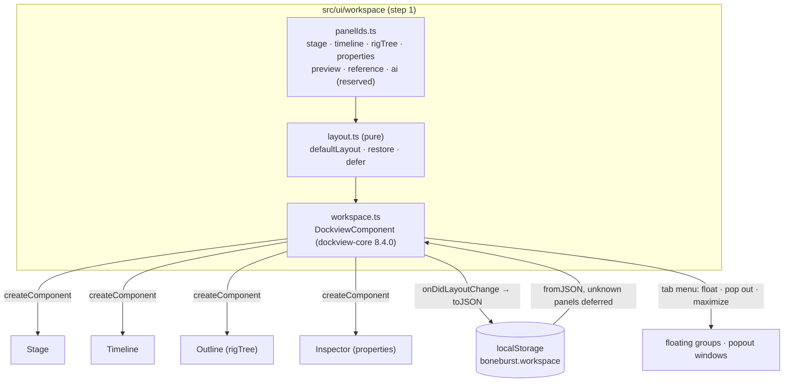

# E4 — authoring surfaces — plan

**Status:** in progress, 2026-10-06. Step 1 (the Dockview shell, D6) done except one check:
**popout windows are not verified on screen** (the built-in browser pane loads a popout's page in
place of the app; Claude in Chrome was not connected). Every other acceptance point holds, and
`npm run check` passes (224 tests). Later steps not started.

E4 makes the editor author a rig, not only animate one: panels and docking (D6), slots,
attachments, draw order, skins, constraints, mesh editing, PSD import and preferences. It is
done when the `auto_rig` → `apply_motion` → `check_preview` flow runs end to end
(`../../Animation-BoneBurst-Src/docs/EDITOR-V2-PLAN.md` ▸ E4). It starts with the shell every
later surface lives in.

## Step 1 — the Dockview shell (D6)

### Decisions

- **`dockview-core` 8.4.0, exact.** MIT, no dependencies of its own: the only npm runtime
  dependency, listed in THIRD-PARTY-NOTICES as shipped when installed. Its styles are injected by
  its UMD build (`dist/dockview-core.js`; the ES module carries none), so the app loads that build
  at run time and takes the types from the package.
- **Dockview owns the shell**: splits, tabs, groups, drag and drop, floating groups, popout
  windows, maximize. Float, pop out and maximize come from Dockview's own tab context menu
  (`getTabContextMenuItems`); there is no custom docking code. The toolbar and the status line
  stay outside the dock; everything that is a panel is a Dockview panel.
- **Panel ids reserved** in one file (`panelIds.ts`): `stage`, `timeline`, `rigTree`,
  `properties`, `preview`, `reference`, `ai`. Only built panels register (the first four now;
  reference in E4, AI in E5, preview when it exists). No empty panels.
- **Default placement in one place** (`defaultLayout`): rig tree left, stage centre, properties
  right, timeline below; preview right of the stage, reference and AI tabbed with properties. A
  panel that first appears, or comes back after being closed, goes there.
- **Layout persistence: the browser's storage**, key `boneburst.workspace`, versioned. The
  workspace is view-only state of the app, not of a document, and must restore on reload with
  nothing open, so it is not in the `.bb.json` sidecar yet; the sidecar's `view` can carry the
  same blob once the editor writes sidecars (a later E4 step). A saved layout naming a panel this
  build lacks keeps that entry (deferred, with the panel it was tabbed with) and applies it when
  the panel arrives; a layout that does not read is dropped for the default, quietly.
- **Panels size by Dockview**: each panel's content gets `layout(width, height)`; the stage and
  the timeline draw from it, not from their own observers, so they work in a popout window too.
  Keys pressed in a popout window reach the same shortcuts.
- **Theme**: Dockview's `themeDark` (and `themeLight` when the system is light), coloured through
  its `--dv-*` variables from our tokens; Inter for text and JetBrains Mono for numbers, vendored
  as Fontsource's variable woff2 builds (latin), preloaded, unmodified, with their OFL texts
  beside them. Deterministic typography is the reason: screenshots and pixel diffs must not
  depend on the machine's fonts.

### Steps

1. Record D6 (v2 plan, decision log).
2. Install `dockview-core@8.4.0` exact; notices row. Vendor the two fonts with their OFL texts;
   notices rows.
3. `panelIds.ts`, `layout.ts` (pure: defaults, restore with deferral), with table tests.
4. `workspace.ts`: the Dockview component, panel renderers wrapping Stage, Timeline, Outline,
   Inspector; theme switching; persistence; popout windows' keys.
5. Remove the fixed CSS grid shell; panels size from Dockview.
6. Check on screen: split, tab, float, pop out each panel; reload restores; gates green.

## Later steps (planned when step 1 lands)

Slots and attachments, draw order, skins, constraints, mesh editing, PSD import, the sidecar's
read and write (view state, guides, references), the reference panel, preferences.

## Results

### Step 1 — the Dockview shell

1. D6 recorded in the v2 plan's decision log; the E4 row names it.
2. `dockview-core` 8.4.0, exact (`npm install --save-exact`): the only entry in `dependencies`.
   `scripts/check.sh` now fails unless that stays true (checked both ways). Inter and JetBrains
   Mono: the latin variable woff2 files from `@fontsource-variable/*` 5.3.0, copied byte for byte
   into `public/vendor/fonts/` with their OFL texts; Dockview's licence in `public/vendor/`.
   All four are in THIRD-PARTY-NOTICES as shipped; `dist/` carries them.
   **Changed from the brief:** Dockview 8.x ships no SCSS; its theming entry points are the
   theme objects and `--dv-*` CSS variables, used here. Its ES module carries no styles, so the
   app loads the UMD build (`dist/dockview-core.js`, which injects them) and takes the types from
   the package (`ui/workspace/dockview-umd.d.ts`).
3. `ui/workspace/panelIds.ts` (seven ids, four built), `ui/workspace/layout.ts` (default places
   with fallbacks, restore with deferral, filtering grid, floating and popout groups, dropping a
   dangling active group). `tests/workspace.test.ts`, 10 tests.
4. `ui/workspace/workspace.ts`: Dockview with `createComponent`, the tab context menu (Float,
   Open in New Window, Maximize, Close), `themeDark`/`themeLight` following the system,
   persistence in `localStorage` (`boneburst.workspace`, saved 250 ms after a layout change),
   keys from popout windows routed to the same shortcuts, a Panels menu in the toolbar (show a
   closed panel at its default place; reset the layout).
5. No hand-rolled docking existed to delete (E2–E3 used a fixed CSS grid); the grid shell is
   gone. The stage and timeline size from Dockview's `layout()` instead of their observers, and
   use their own window for pixel ratio, styles, animation frames and focus; the stage redraws on
   a new WebGL context if the browser drops one.
6. On screen (built-in browser, light and dark): the default layout (rig 220 px, properties
   260 px, timeline 230 px); Properties floated from its tab menu, dragged into the Rig group as a
   tab; Timeline dragged to split right of the stage; reload restored all of it exactly. Through
   the API, each of the four panels floated, tabbed and split; Close, then Panels ▸ Properties
   brought it back. Dark theme switches live; Inter and JetBrains Mono load (both preloaded).
   **Not verified: popout windows** — the pane navigates to `/popout.html` instead of opening a
   window. A saved layout with a popout that cannot open falls back to the main grid with no
   error (Dockview's own handling, seen). To check by hand: right-click a tab ▸ Open in New
   Window, in Chrome with pop-ups allowed for localhost; the panel should draw, take keys (W/E/R,
   Space, ⌘Z) and dock back when the window closes.
