# E4 — authoring surfaces — plan

**Status:** in progress, 2026-10-06. Step 1 (the Dockview shell, D6) done except one check:
**popout windows are not verified on screen** (the built-in browser pane loads a popout's page in
place of the app; Claude in Chrome was not connected). Every other acceptance point holds, and
`npm run check` passes (249 tests). Step 2 (the rig's structure) done: a rig built from an empty
skeleton on screen, saved and read back alike by both runtimes. Step 3 (skins) done: a
mix-and-match outfit duplicated and changed on screen, posed alike by both runtimes. Step 4
(constraints) done: a transform constraint added, raised, reordered and made skin-required on
screen, the file saved and posed alike by both runtimes. Step 5 (mesh geometry) done: the
stickman's torso turned into a mesh and shaped on the stage, saved, posed alike by both
runtimes. Step 6 (weights) done: the torso mesh bound to three bones on screen, reshaped and
reweighted, saved, posed alike by both runtimes through its animations. Step 7 (PSD import)
done: a layered PSD dropped on the editor, shown, saved with its atlas and page, read back.
Step 8 (the sidecar in the app, guides) done: guides made on the stickman, saved with the view,
opened again with everything back. Step 9 (the reference panel) done: a reference picture added to the stickman, placed and
faded, saved, opened again missing and then with its file. Step 10 (preferences) done: each
preference changed in the dialog and seen, kept through a reload, reset. Step 11 (keying
constraints and deforms) done: an IK mix keyed and the torso mesh deformed at two frames on
the stickman, played, saved, posed alike by both runtimes. Steps 12–15 planned (wrap-up, owner
decisions 2026-10-06); step 12 (constraints drawn on the stage) done: Stretchyman's paths, IK
and transforms drawn, a path picked on the stage; steps 13–15 to come; weight brush and guide
snapping parked for after E5. `npm run check`: 322 tests.

E4 makes the editor author a rig, not only animate one: panels and docking (D6), slots,
attachments, draw order, skins, constraints, mesh editing, PSD import and preferences. It is
done when the `auto_rig` → `apply_motion` → `check_preview` flow runs end to end
(`../../Animation-BoneBurst-Src/docs/EDITOR-V2-PLAN.md` ▸ E4). It starts with the shell every
later surface lives in.

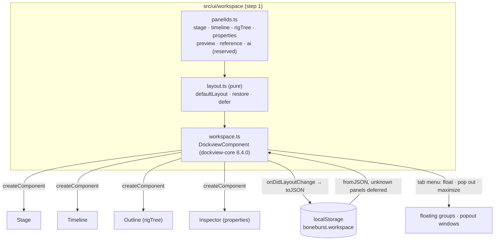

## Step 1 — the Dockview shell (D6)

### Decisions

- **`dockview-core` 8.4.0, exact.** MIT, no dependencies of its own: the only npm runtime
  dependency, listed in THIRD-PARTY-NOTICES as shipped when installed. Its styles are injected by
  its UMD build (`dist/dockview-core.js`; the ES module carries none), so the app loads that build
  at run time and takes the types from the package.
- **Dockview owns the shell**: splits, tabs, groups, drag and drop, floating groups, popout
  windows, maximize. Float, pop out and maximize come from Dockview's own tab context menu
  (`getTabContextMenuItems`); there is no custom docking code. The toolbar and the status line
  stay outside the dock; everything that is a panel is a Dockview panel.
- **Panel ids reserved** in one file (`panelIds.ts`): `stage`, `timeline`, `rigTree`,
  `properties`, `preview`, `reference`, `ai`. Only built panels register (the first four now;
  reference in E4, AI in E5, preview when it exists). No empty panels.
- **Default placement in one place** (`defaultLayout`): rig tree left, stage centre, properties
  right, timeline below; preview right of the stage, reference and AI tabbed with properties. A
  panel that first appears, or comes back after being closed, goes there.
- **Layout persistence: the browser's storage**, key `boneburst.workspace`, versioned. The
  workspace is view-only state of the app, not of a document, and must restore on reload with
  nothing open, so it is not in the `.bb.json` sidecar yet; the sidecar's `view` can carry the
  same blob once the editor writes sidecars (a later E4 step). A saved layout naming a panel this
  build lacks keeps that entry (deferred, with the panel it was tabbed with) and applies it when
  the panel arrives; a layout that does not read is dropped for the default, quietly.
- **Panels size by Dockview**: each panel's content gets `layout(width, height)`; the stage and
  the timeline draw from it, not from their own observers, so they work in a popout window too.
  Keys pressed in a popout window reach the same shortcuts.
- **Theme**: Dockview's `themeDark` (and `themeLight` when the system is light), coloured through
  its `--dv-*` variables from our tokens; Inter for text and JetBrains Mono for numbers, vendored
  as Fontsource's variable woff2 builds (latin), preloaded, unmodified, with their OFL texts
  beside them. Deterministic typography is the reason: screenshots and pixel diffs must not
  depend on the machine's fonts.

### Steps

1. Record D6 (v2 plan, decision log).
2. Install `dockview-core@8.4.0` exact; notices row. Vendor the two fonts with their OFL texts;
   notices rows.
3. `panelIds.ts`, `layout.ts` (pure: defaults, restore with deferral), with table tests.
4. `workspace.ts`: the Dockview component, panel renderers wrapping Stage, Timeline, Outline,
   Inspector; theme switching; persistence; popout windows' keys.
5. Remove the fixed CSS grid shell; panels size from Dockview.
6. Check on screen: split, tab, float, pop out each panel; reload restores; gates green.

## Step 2 — the rig's structure: bones, slots, region attachments, draw order

The rig tree becomes the place to build a rig: add, delete and reparent bones; add, delete,
rename slots and set their bone, colours, blend and setup attachment; add region attachments from
the atlas, edit and rename them; reorder slots (the setup draw order). Each is an edit on the
document that keeps it a file the BoneBurst profile accepts (SPEC §2): it is refused with its
reason, never written broken.

### Decisions

- **Deleting cascades only where it must, and is refused where it would guess.** Deleting a bone
  deletes its descendants, the slots on them with their skin entries and timelines, and their bone
  timelines; it is refused while a constraint names one of those bones or slots ("delete the
  constraint first"), and for the root while other bones hang from it. Deleting a slot removes
  its skin entries, its slot and attachment timelines and its draw order offsets; refused while a
  path constraint or a clipping attachment's `end` names it. Deleting an attachment removes its
  deform and sequence timelines; a slot whose setup attachment it was shows nothing.
- **Renaming rewrites every reference** (as `renameBone` does): a slot's name in skins,
  animations, draw order offsets, clipping `end`, path constraints and linked meshes' `slot`; an
  attachment's key in every skin's entry for that slot, the slot's setup attachment, attachment
  keys, deform and sequence timelines and linked meshes' `source`.
- **Reparenting keeps the bone where it is on screen**: the stage works out the local values that
  give the same setup world transform under the new parent (normal inheritance), and the edit
  takes them. Bones stay ordered parent before child: the bone and its descendants move to just
  after the new parent's subtree. A bone cannot become its own descendant's child.
- **Reordering slots keeps every draw order key meaning what it meant**: each key's order is
  rebuilt by name from the old offsets, then written as offsets against the new setup order
  (ascending, Format §11.11); a folder's slot list is re-sorted to the new setup order the same way
  (§11.12).
- **A new region** takes its key and path from the atlas region, its size from the region's
  original size, and goes in the default skin on the selected slot (a new slot on the selected
  bone when a bone is selected).
- **Selection becomes typed**: a bone, a slot, or an attachment (skin, slot, key). The stage
  still picks bones; the rig tree and the properties panel follow any kind.

### Steps

1. `edit/bones.ts` (`addBone`, `deleteBone`, `reparentBone`), `edit/slots.ts` (`addSlot`,
   `deleteSlot`, `renameSlot`, `updateSlot`, `moveSlot`), `edit/attachments.ts` (`addRegion`,
   `deleteAttachment`, `renameAttachment`, `updateAttachment`), each with table tests: refusals,
   references rewritten, the profile still holding, both runtimes posing the result alike.
2. Typed selection in the session; the stage, timeline and properties read it.
3. Rig tree: bones, their slots, the slots' attachments; add, delete; a draw order view.
4. Properties for a slot and for a region attachment (other kinds shown, read only).
5. On screen: build a small rig on the stickman's atlas from an empty skeleton; save; read back.

### Step 2 results

1. `edit/bones.ts` (`addBone`, `deleteBone`, `reparentBone`, `subtree`), `edit/slots.ts`
   (`addSlot`, `deleteSlot`, `renameSlot`, `updateSlot`, `moveSlot`), `edit/attachments.ts`
   (`addRegion`, `deleteAttachment`, `renameAttachment`, `updateAttachment`),
   `edit/drawOrder.ts` (draw order keys kept by name), `edit/newSkeleton.ts`.
   `tests/rig.test.ts`, 25 tests: every edited sample keeps the profile, round-trips and is
   posed alike by the engine and spine-core; moving, renaming and deleting a slot leave
   raptor-pro's draw order keys drawing what they drew (four of these fail with the remapping
   off); a synthetic draw order folder is re-sorted and keeps its order; refusals for the root,
   an IK target, a path constraint's slot, a clipping's end, a linked mesh's source.
   **Added to the plan:** an atlas opened without a skeleton starts a new one (a root bone, a
   random header hash, unsaved), so a rig can be built from nothing.
2. Typed selection (`Selection`: bone, slot, attachment) in the session; `selectedBone` for
   the stage, the timeline and keying.
3. Rig panel: bones as a tree with their slots and the slots' attachments (the shown skin's
   and the default's; the shown one marked), + Bone, + Slot, + Region (a region chosen from the
   atlas), Delete (also the Delete key in the panel); a draw order view, front to back, with
   forward and back. **Changed on screen:** the region chooser was first a menu that added on
   change; it added a second region from one choice (the menu rebuilt its options inside its own
   change handler), so it is now a choice plus a + Region button.
4. Properties for a bone (parent as a menu that keeps the bone where it is; defaults left out),
   a slot (name, bone, shown attachment, colour, dark, blend) and a region (name, image, x, y,
   rotation, scale, size, colour); other attachment kinds read only. Fields are labelled for
   screen readers by their label, not their value.
5. On screen: from the stickman's atlas alone, bones `body` and `neck`, the head and torso
   regions, the head brought in front, a slot renamed, an attachment deleted and undone, `neck`
   moved under `root` without moving on screen; saved; the saved file has no profile issue and
   both runtimes pose it identically.

## Step 3 — skins

Skins become something to author: add, duplicate, rename and delete them; choose which
skin-required bones each one turns on; mark a bone skin-required; put new regions in the shown
skin and move an attachment between skins (Format-Json-Atlas.md §8.1).

### Decisions

- **The default skin is fixed**: it cannot be deleted or renamed, and no skin may be renamed to
  `default` (§8.1: that name makes the default skin).
- **Skins follow their attachments' timelines**: deform and sequence keys are stored per skin,
  so renaming a skin renames them, duplicating copies them, deleting drops them, and moving an
  attachment moves them. Linked meshes name their source's skin; those references follow a
  rename and a move, a copy points at itself, and deleting a skin that another skin's linked
  mesh takes its source from is refused.
- **New regions go in the shown skin** (the toolbar's Skin; the default skin when none is
  chosen).
- **Skin-required constraints** are listed and toggled per skin like bones, but marking a
  constraint skin-required waits for step 4 (constraints).
- Selection gains a fourth kind: a skin.

### Steps

1. `edit/skins.ts` (`addSkin`, `deleteSkin`, `renameSkin`, `duplicateSkin`, `setSkinMember`,
   `moveAttachment`), with table tests on goblins, hero-pro and mix-and-match: refusals,
   references and timelines followed, the profile holding, both runtimes posing alike.
2. Rig panel: a Skins view (add, duplicate, delete; choosing one shows it).
3. Properties for a skin (name, its skin-required bones and constraints), a bone's "Skin
   required", an attachment's skin.
4. On screen: duplicate a mix-and-match skin, change it, show it; save; read back.

### Step 3 results

1. `edit/skins.ts`: `addSkin`, `deleteSkin`, `renameSkin`, `duplicateSkin`, `setSkinMember`,
   `moveAttachment`. `tests/skins.test.ts`, 7 tests on goblins, hero-pro and mix-and-match:
   each edited file keeps the profile, round-trips and is posed alike by both runtimes; renaming
   follows the deform timelines and the linked meshes (a rename that forgets the timelines fails
   the test); `goblin` cannot be deleted while `goblingirl`'s linked meshes take their sources
   from it.
2. Rig panel: a Skins view (+ Skin, Duplicate, Delete); choosing a skin shows it. New regions go
   in the shown skin. The toolbar falls back to the default skin when the shown one is deleted or
   undone away.
3. Properties: a skin's name (fixed for the default), its attachment count, a checkbox per
   skin-required bone and constraint it turns on; a bone's "Skin required"; an attachment's skin
   (a menu that moves it, its timelines and its linked meshes along).
4. On screen (mix-and-match, opened from the samples through the dev server, now allowed to
   serve that folder): `full-skins/girl` duplicated as `girl-bald`, its 15 hair attachments
   deleted, shown: drawn without hair (36 images against the original's 51); a skin's bone
   toggled off and a bone made skin-required, both undone. The same edits in Node: no profile
   issue, 455 poses alike within 2.1e-6.

## Step 4 — constraints

Constraints become something to author: add each of the five kinds (IK, transform, path,
physics, slider), edit their references and values, rename, delete and reorder them, and mark
them skin-required (Format-Json-Atlas.md §7). The rig panel gets a Constraints view; the
properties panel a form per kind.

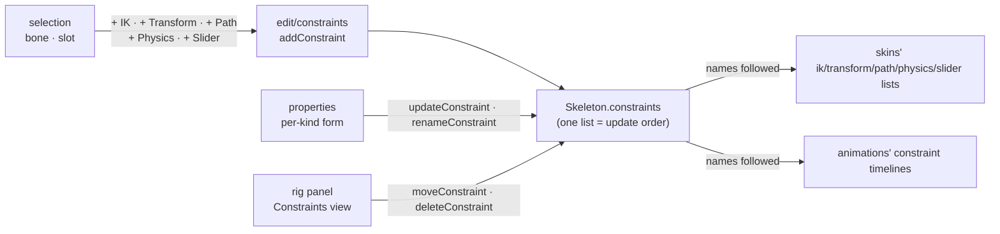

### Decisions

- **One list, in update order** (§7.1): the Constraints view shows it in file order and moves a
  constraint up or down; that is the order the runtimes apply them in. A new one goes last.
- **Names are unique within a kind** (§7.1: lookup matches name and kind); the selection names
  both. Selection gains a fifth kind: a constraint (type, name).
- **A new constraint leaves the pose as it was.** IK: the selected bone, aimed at a new bone
  `<bone> target` under the root at the bone's tip (so it already points there). Transform: the
  selected bone, its parent as the source, each property mapped to itself, every mix 0. Path:
  the selected slot, which must hold a path attachment, no bones yet. Physics: the selected bone,
  rotation fed in (it moves only in playback). Slider: the shown animation (else the first), mix
  0. Raising a mix, adding bones or playing is what moves anything.
- **References are checked when written, refused with the reason**: IK takes one or two bones,
  the second a child of the first, and a target that is neither constrained nor under the first
  bone; a transform's source is not one of its bones; a path's slot exists; physics and slider
  bones exist; a slider's animation exists, and a bone-driven slider names its property.
- **Renaming and deleting follow the name** into every skin's list of that kind and every
  animation's timelines of that kind; deleting drops both. Deleting a bone or slot a constraint
  uses stays refused (step 2).
- **Values at their default are left out**, as Spine writes them, except mixes whose default
  depends on another key (a transform's `mixY` and `mixScaleY`, a path's `mixY`): written as
  shown.
- **Not in this step:** keying constraint values in Animate mode, drawing constraints on the
  stage, editing a transform's property map beyond what the form shows (offset, scale and max of
  each from→to pair; adding and removing pairs).

### Steps

1. `edit/constraints.ts` (`addConstraint`, `updateConstraint`, `renameConstraint`,
   `deleteConstraint`, `moveConstraint`), `model/defaults.ts` constraint defaults; table tests
   on spineboy-pro, stretchyman, hero-pro, celestial-circus and a synthetic slider: refusals,
   names followed, the profile holding, both runtimes posing alike (and a new constraint not
   moving the setup pose).
2. Selection kind `constraint`; rig panel Constraints view (add per kind, delete, up, down).
3. Properties per kind, with "Skin required"; the skin form lists it once marked.
4. On screen: add an IK to the stickman's arm, raise a transform's mix, reorder, mark one
   skin-required and turn it on in a skin; save; read back.

### Step 4 results

1. `edit/constraints.ts`: `addConstraint`, `updateConstraint`, `renameConstraint`,
   `deleteConstraint`, `moveConstraint`, `findConstraint`; `model/defaults.ts`:
   `CONSTRAINT_DEFAULTS`, `constraintValue`, `constraintMix` (a transform's mixes as the runtimes
   read them, §7.3). `ui/panels/newConstraint.ts` builds the new constraint of each kind.
   `tests/constraints.test.ts`, 12 tests on spineboy-pro, Stretchyman, hero-pro and
   celestial-circus, plus a slider on spineboy-pro's `aim`: renames and deletes follow skins'
   lists and timelines (and keep the global physics group), reordering is applied alike by both
   runtimes, every refusal, all five new kinds leaving hero-pro's setup pose as it was. Three
   planted bugs fail them (timelines not followed; `bones` dropped; `mixY` not following `mixX`).
   **Added to the plan:** spine-core's reader needs `bones` on IK, transform and path
   constraints even when empty (Format §7.4 lets it go), so the edits keep the key, `[]` when
   empty. **Changed from the plan:** an IK's new target is placed to four decimals, not two; two
   shifted hero-pro's head 0.006 under the re-aimed bone.
2. Selection kind `constraint` (type, name). Rig panel: a Constraints view in update order, a
   kind menu and + Constraint (from the selected bone, or slot for a path), Delete, ↑ (earlier),
   ↓ (later).
3. Properties per kind: name, place in the order, Skin required; IK bone (one or two), target,
   mix, softness, bend, compress, stretch, scale Y; transform source, flags, the mixes its
   mapping uses, offsets, the mapping (offset, scale, max per pair; add and remove pairs) and its
   bones; path slot, modes, values, bones; physics bone, inputs, simulation values and their
   global flags; slider animation, mix, driver (its time, or a bone's property with from, to,
   scale, local). **Fixed on screen:** the properties panel kept showing the last selection while
   a checkbox or menu in it held focus (it waits for a field being typed in, which those are
   not); it now waits for text fields only.
4. On screen (the stickman): `arm_far_fore_ik` bent the other way; a transform constraint added
   to `head` (the head did not move), its rotation mix raised to 1 and a 30° offset set, moved
   from last to third, made skin-required (the head went back), a skin `tilt` added that turns it
   on (the head turned 30° with `tilt` shown, not with the default). Saved; the same edits in
   Node give the identical file (SHA-256 equal), no profile issue as written, 39 poses alike in
   both runtimes within 2.1e-9.

## Step 5 — mesh geometry

Meshes become something to make and shape: turn a region into a mesh, move its vertices (the
image staying put, or stretching with them), add vertices inside it or on its outline, delete
them, and triangulate again (Format-Json-Atlas.md §8.4, §8.9, §11.10). This step covers
unweighted meshes; binding vertices to bones (weights) is step 6.

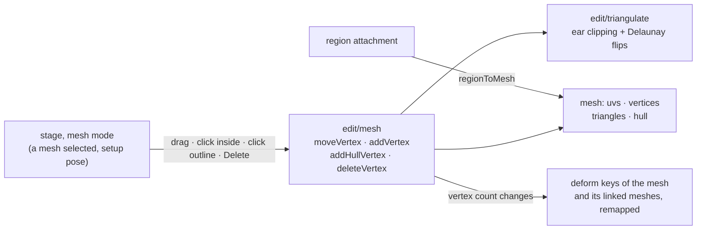

### Decisions

- **A region becomes a mesh that draws the same**: four outline vertices at the region's
  corners in bone space (its offset, rotation, scale and size applied), UVs at the image's
  corners, two triangles; path, colour, sequence and size kept. Its sequence timelines stay.
- **Vertices are moved on the setup pose only**; in Animate mode the stage says to switch to the
  setup pose (deform keys are a later step). A plain drag keeps the image where it was: the
  vertex's UV follows it through the affine map of a triangle it belongs to. Alt-drag stretches
  the image: the UV stays.
- **Adding**: a click inside the mesh adds a vertex there, a click on the outline splits that
  edge (the new vertex joins the hull); its UV comes from where it lands. A click outside pans.
  **Deleting** a vertex (Delete on the stage) is refused when the outline would keep fewer than
  three. Outline vertices are the first `hull` vertices, in order around it.
- **Triangulation is ours and deterministic**: ear clipping of the outline, then each inner
  vertex inserted into the triangle that holds it, then edge flips to Delaunay that never cross
  the outline. Adding or deleting triangulates again; moving does not (a fold is the artist's
  to see and undo). "Triangulate" in the properties redoes it on demand. Inner vertices outside
  the outline are left out of triangles and reported.
- **Deform keys keep meaning what they meant**: they store offsets from the setup vertices
  (§11.10), so a move needs nothing; an added vertex takes the offsets interpolated from the
  triangle or edge it landed in, a deleted one's are dropped — in the mesh's own deform
  timelines and those of linked meshes that use them.
- **`edges` (nonessential) are dropped** by any edit that changes the vertices' number or
  order; Spine rebuilds them.
- **Weighted meshes** draw their wireframe and refuse geometry edits with the reason until step 6.

### Steps

1. `edit/triangulate.ts` (pure); `edit/mesh.ts`: `regionToMesh`, `moveVertex`, `addVertex`,
   `addHullVertex`, `deleteVertex`, `retriangulate`, the deform remapping. Tests: triangulation
   (concave outlines, Delaunay on random points, determinism), every region of a sample turned
   into a mesh drawing the same, deform keys of goblins, hero-pro and spineboy-pro keeping their
   old vertices where they were after adds and deletes, refusals, both runtimes posing alike.
2. Stage mesh mode: wireframe, outline and vertices over the selected mesh; drag, add, delete
   (one undo step each); weighted meshes shown, not edited.
3. Properties: Convert to mesh on a region; a mesh's counts, image, colour and Triangulate.
4. On screen: a stickman region turned into a mesh, shaped, saved, read back.

### Step 5 results

1. `edit/triangulate.ts` (ear clipping, insertion, Delaunay flips that keep the outline);
   `edit/mesh.ts`: `regionToMesh`, `moveVertex`, `addVertex`, `addHullVertex`, `deleteVertex`,
   `retriangulate`, `verticesOutside`, with deform keys remapped. `tests/mesh.test.ts`, 8 tests:
   concave outlines both ways round; Delaunay on 40 random points, deterministic, a point
   outside left out; every region of spineboy-pro and raptor-pro turned into a mesh showing
   each page pixel where the region showed it (within 0.05); a moved vertex's UV following its
   triangle, or not; added and deleted vertices leaving the image in place; deform keys of
   goblins, hero-pro and spineboy-pro moving the old vertices exactly as before after an inner
   add, an outline split and a delete; refusals; both runtimes posing every result alike. Three
   planted bugs fail them (deform keys not remapped; UVs not following; no flips).
   **Changed from the plan:** a converted region keeps its corners unrounded (rounding to two
   decimals moved a scaled image's pixels by up to 0.08), and is triangulated by the same code
   as everything else.
2. Stage mesh mode (`ui/stage/meshMode.ts`, in the stage): when a mesh attachment is selected
   and the setup pose shown, its triangles, outline and vertices are drawn over it (a linked
   mesh shows its source's; a weighted one is drawn and says why it cannot be edited). A press
   on a vertex selects and drags it; on the outline splits that edge; inside adds a vertex; each
   is one undo step with the drag that follows; Delete on the stage deletes the selected vertex.
   Mesh mode takes the press before the bones under the mesh.
3. Properties: Convert to mesh on a region; a mesh's image, colour, vertex, outline and
   triangle counts, whether it is bound to bones, inner vertices outside the outline,
   Triangulate, and how to shape it on the stage.
4. On screen (the stickman): `torso` converted (four vertices, two triangles); a corner dragged
   inward (the image stayed, cut by the new edge), an inner vertex added and dragged, the top
   edge split and the new vertex deleted with Delete, Undo back through them; a corner dragged
   with Alt (UV kept: the image stretches) and without (UV followed). Saved; the same geometry
   built in Node gives the identical file (SHA-256 equal), no profile issue as written, 26
   poses alike in both runtimes. **Seen:** a vertex dragged out past the image's edge with the
   image kept takes UVs outside 0..1, so the atlas page around the image shows there; that is
   what the UVs say, and the outline is the artist's to keep on the image. The browser tool's
   Alt-drag did not hold Alt during the moves; Alt was checked with pointer events carrying it.

## Step 6 — weights

Meshes get bound to bones: bind a mesh to the bones it should follow with weights worked out
from distance, see and change each vertex's weights, weight again automatically, unbind; and the
step 5 geometry edits work on weighted meshes too (Format-Json-Atlas.md §8.9, §11.10).

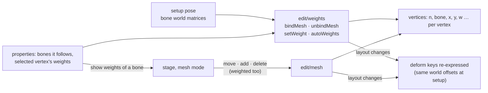

### Decisions

- **Binding is on the setup pose**: each vertex keeps its place; a bind position is the vertex in
  that bone's space as the setup pose has it (constraints applied, as the stage shows it). The
  edits take the setup bones' world matrices as data, so they stay pure.
- **Automatic weights by distance**: for each vertex, every chosen bone weighs 1 / (d + 1)⁴,
  d the distance to the bone's segment (origin to tip); the four heaviest are kept, any under
  0.01 dropped, the rest normalised to sum 1. Deterministic. A mesh bound to one bone is fully
  on it.
- **Changing a weight** sets that bone's share for the vertex; the vertex's other bones share
  the rest in their old proportion. 0 removes the bone from the vertex (not its last one); a
  bone not yet on the vertex joins it. Weights are written to four decimals, bind positions to
  four.
- **Unbinding** writes each vertex in the slot's bone space where the setup pose has it.
- **Weighted geometry**: moving a vertex keeps its weights and rebinds it where it lands; an
  added vertex takes the weights of the triangle or edge it lands in (blended, then the four
  heaviest); deleting drops it and its bindings.
- **Deform keys keep their setup-pose meaning**: whenever the vertex layout changes (bind,
  unbind, a weight added or removed, a vertex added or deleted), every key's offsets are turned
  into world offsets on the setup pose, carried to the new vertices (kept, blended, dropped),
  and written in the new layout. Exact on the setup pose; under animated bones an offset follows
  the bones its vertex now follows.
- **Seeing weights**: with a weighted mesh selected, the properties panel chooses a bone and the
  stage colours each vertex by that bone's weight (none → full).

### Steps

1. `edit/weights.ts` (`bindMesh`, `unbindMesh`, `setWeight`, `autoWeights`, decode and encode
   of the weighted layout, the deform re-expression) and the weighted paths of `edit/mesh.ts`.
   Tests on a converted region and on weighted meshes of spineboy-pro and hero-pro: the setup
   pose drawn the same after bind, unbind, reweighting and geometry edits; deform keys giving the
   same setup-pose world offsets; weights summing to 1, at most four; refusals; both runtimes
   posing alike.
2. Session: the selected vertex and the weight bone shown; the stage edits weighted meshes and
   colours vertices by weight.
3. Properties: bind (bones chosen from a menu, the slot's bone first), the bones a mesh
   follows (add, remove), Auto weights, Unbind; the selected vertex's weights.
4. On screen: the stickman's torso mesh bound to its bones, a vertex's weight changed, an
   animation played with the mesh following; saved, read back.

### Step 6 results

1. `edit/meshLayout.ts` (the two vertex layouts, bind and place on the setup pose, deform keys
   rewritten vertex by vertex), `edit/weights.ts` (`bindMesh`, `unbindMesh`, `setWeight`,
   `setMeshBone`, `autoWeights`, `distanceWeights`, `meshBones`); `edit/mesh.ts`'s geometry edits
   take the setup bones and work on weighted meshes. `tests/weights.test.ts`, 7 tests: the
   weight rules as a table; binding a spineboy-pro torso and back leaving every vertex in place;
   unbinding weighted meshes of spineboy-pro and hero-pro keeping the setup pose and every
   deform key's setup offsets; a weight change keeping the vertex, its deform offsets, and every
   other vertex's binds and deform offsets exactly as written; auto weights and adding and
   removing a followed bone; weighted move, add, outline split and delete keeping the other
   vertices' deform offsets; both runtimes posing each result alike. Planted bugs fail them
   (deform keys never re-expressed; re-expressing untouched vertices; no normalising).
   **Fixed while testing:** the 0.01 cut was first applied to raw distance weights, not to each
   bone's share, so a 7% share was dropped; the distance table test fails on that code.
   **Changed from the plan:** a vertex whose binds did not change keeps its deform offsets
   verbatim (going through the setup pose would keep their sum but move them between bones,
   which changes them under animated bones).
2. Session: the selected vertex (cleared with the selection), the bone whose weights are shown,
   and the setup pose's bone matrices (`setupBones`, its own rig, cached per revision and skin).
   The stage edits weighted meshes and colours each vertex by the shown bone's weight (dark blue
   none, red full).
3. Properties: for an unweighted mesh, Bind with a list of bones (the slot's bone first, more
   from a menu); for a weighted one, the bones it follows (remove, add: weighted again by
   distance), Show weights, Auto weights, Unbind, and the selected vertex's weights (edit, add a
   bone at 0.25, Auto weight this vertex).
4. On screen (the stickman): `torso` converted and bound to hips, chest and torso; two inner
   vertices added and the left edge split on the weighted mesh; weights shown for hips; the new
   outline vertex given hips 0.9 (chest and torso shared the rest 5:1, as before); `dance`
   played with the mesh following. Saved; the same geometry in Node gives the identical file
   (SHA-256 equal), no profile issue as written, 26 poses through `dance` and `run` alike in both
   runtimes.

## Step 7 — PSD import

An artist's Photoshop file becomes a rig to build on: open or drop a `.psd` and get a new
skeleton with one slot and region per layer, placed where the layer is, stacked as in Photoshop,
with its images packed into an atlas the editor writes. The reader is `ag-psd` (owner decision
D7, recorded in the v2 plan).

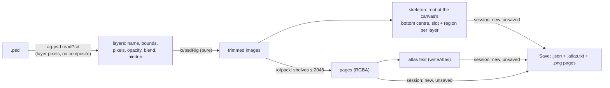

### Decisions

- **D7: `ag-psd` 31.0.2**, exact, with `base64-js` and `pako`; THIRD-PARTY-NOTICES lists all three
  as shipped; the check script now allows exactly `dockview-core` and `ag-psd` as runtime
  dependencies, each pinned. It is read with layer pixels as plain image data (no canvas, no
  composite image, no thumbnail).
- **One layer, one slot and one region**, on the root bone, named after the layer (made unique
  with a number). Layers inside groups are taken too; the group's name is not part of the slot's
  name, and its opacity and visibility apply to the layers in it. Draw order is Photoshop's:
  the bottom layer is drawn first.
- **Placement**: the skeleton's origin is the canvas's bottom centre, y up; each region sits at
  its trimmed image's centre. Pixel-for-pixel: one Photoshop pixel is one unit.
- **Layer properties**: opacity (layer × groups) becomes the slot's colour alpha; blend Normal,
  Multiply, Screen and Linear Dodge become normal, multiply, screen and additive; any other blend
  is drawn normal and reported. Hidden layers, empty layers and layers without pixels (adjustment
  layers) are left out and reported.
- **Images**: each layer is trimmed to its non-transparent pixels, then packed tallest first on
  shelves into pages of at most 2048 × 2048 with 2 pixels between images (more pages when one is
  full; a layer larger than a page is refused with its name). The atlas is written in Spine's
  format (`bounds` per region); pages are `<name>.png`, `<name>_2.png`, …
- **The result is a new, unsaved document**; Save then writes the skeleton, the atlas and its
  pages, each a download. Only RGB at 8 bits per channel is read (`ag-psd` does not read 16);
  other colour modes and depths are refused with what to save the file as.
- **Not in this step:** importing into an open skeleton (re-import), groups becoming bones,
  layer tags.

### Steps

1. D7 recorded (v2 plan), `ag-psd` installed exact, notices rows, the dependency guard.
2. `io/pack.ts` (shelf packing), `io/psdRig.ts` (layers → skeleton, atlas, pages, issues), with
   tests on PSD files `ag-psd` writes in the test: placement, order, opacity, blend, groups,
   hidden and empty layers, trimming, more than one page, a too-large layer; the page pixels
   under each region equal the layer's; the profile holding; both runtimes posing it alike.
3. Opening or dropping a `.psd`: read, imported, the pages drawn; Save writes the atlas and pages
   with the skeleton when they came from an import.
4. On screen: a PSD made for the test opened, shown, saved; the saved files read back.

### Step 7 results

1. D7 recorded in the v2 plan's decision log (amending D6's "only runtime dependency").
   `ag-psd` 31.0.2 installed exact; `base64-js` 1.5.1 and `pako` 2.1.0 come with it. All three
   in THIRD-PARTY-NOTICES as shipped, their licences in `public/vendor/`; `scripts/check.sh`
   requires exactly pinned `ag-psd` and `dockview-core`.
2. `io/psd.ts` (`readPsdLayers`, `trim`, `PSD_LIMITS`), `io/pack.ts` (`place`, `pack`),
   `edit/layerRig.ts` (`rigFromLayers`), `ui/psdImport.ts` (`importPsd`, `safeName`).
   `tests/psd.test.ts`, 9 tests on PSDs `ag-psd` writes in the test: packing (no overlaps,
   padding, more than one page, deterministic, too large refused); trimming; visible layers
   bottom first with group opacity, hidden layers and groups and empty layers reported; slots,
   regions, placement, opacity and blends; an unsupported blend reported; region pixels equal to
   the layer's; names the atlas reader cannot misread; the profile holding; spine-core posing it
   alike. Three planted bugs fail them (y not flipped; no padding; group opacity ignored).
   **Changed from the plan:** `ag-psd` reads 8 bits per channel only, so 16-bit files are
   refused rather than converted. The file is read as `ag-psd`'s guide for untrusted files says:
   structure first (raw channel data), sizes and counts checked against `PSD_LIMITS`, then each
   layer's pixels decoded on its own and the raw data dropped. Layer pixels come as plain arrays
   (`ag-psd` is given an image-data maker and no canvas), so reading is the same in the browser
   and under Node. **Added:** `tests/fixtures/psd.ts` writes `tests/fixtures/psd/figure.psd`
   (a small character in groups, with a translucent multiply shadow and a hidden sketch); a test
   holds the committed file to that code.
3. Opening or dropping a `.psd` imports it (the Open dialog lists `.psd`); the pages are made
   into images directly; the first Save writes `<name>.json`, `<name>.atlas.txt` and the pages,
   and says so.
4. On screen: `figure.psd` dropped on the editor: seven slots in Photoshop's order, the head
   over the body, the arms over it, the shadow translucent under the feet at the origin; "1 note"
   for the hidden sketch. Save handed the browser three files (captured, not downloaded): the
   JSON, the atlas, a 468 × 156 PNG; the document clean after. Dropped back in: no issue, written
   again byte for byte the same. The same import in Node gives the identical JSON and atlas
   (SHA-256 equal), no profile issue as written, spine-core posing it alike.

## Step 8 — the sidecar in the app, and guides

The `<name>.bb.json` sidecar (SPEC §3; read and written since E1, used by nothing yet) opens and
saves with its skeleton, restores the view, and holds guides: lines dragged out of rulers on the
stage. Reference images are step 9; notes stay for the AI (E5).

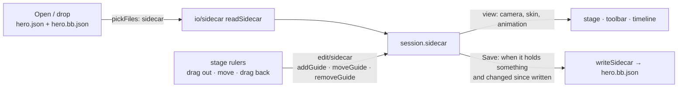

### Decisions

- **Opening**: a `.bb.json` among the opened files is the sidecar of the skeleton whose name it
  carries (`hero.bb.json` for `hero.json`); another one is ignored with a note. One that does not
  read, or has an unknown format or version, leaves the empty sidecar and a note (as E1 reads it).
- **The view** the sidecar keeps: the camera (centre, zoom), the skin shown and the animation
  shown. It is taken when saving and put back when opening; it never marks the document unsaved.
  The dock layout stays the window's (D6), not the document's.
- **Guides**: the stage gets rulers along its top and left edges; dragging out of the top ruler
  makes a horizontal guide, out of the left a vertical one; a guide is dragged to move it and
  back onto its ruler to remove it. Positions are in skeleton units, to two decimals. Guide
  changes are not undo steps (they are not the document) but do make the sidecar need saving.
- **Saving**: Save writes the skeleton and, beside it, the sidecar, when the sidecar holds
  guides, references or notes, or was opened from a file; and only when its text differs from
  what was last written. Saving never changes the skeleton's text.

### Steps

1. `edit/sidecar.ts` (`addGuide`, `moveGuide`, `removeGuide`, `withView`); `pickFiles` takes the
   sidecar; tests: guide edits, which sidecar belongs to which skeleton, the view round trip, the
   skeleton's text the same with and without a sidecar.
2. Session: the sidecar, opened and saved with the skeleton; the view taken and restored.
3. Stage: rulers, guides drawn, dragged out, moved, removed (`ui/stage/guides.ts`, pure hit
   tests).
4. On screen: guides made on the stickman, saved, opened again with the sidecar: guides, camera,
   skin and animation back.

### Step 8 results

1. `edit/sidecar.ts` (`addGuide`, `moveGuide`, `removeGuide`, `withView`, `viewOf`,
   `hasContent`); `pickFiles` takes the skeleton's own sidecar (named after it, any case) and
   ignores another's. Tests in `tests/sidecar.test.ts` and `tests/stage.test.ts`: guide edits to
   two decimals (no change is the same sidecar); the view through the file, with a newer
   editor's view keys kept and what does not read left out; the skeleton's text the same with
   any sidecar; which sidecar is whose.
2. Session: the sidecar opened with its skeleton (its notes in the issues), the skin and
   animation it kept shown, its camera handed to the stage once; guides make the document need
   saving (the view does not); Save writes `<name>.bb.json` beside the skeleton when the sidecar
   holds something or was opened, and only when its text changed.
3. Stage: rulers along the top and left edges, labelled in skeleton units (ticks 1, 2 or 5 ×
   10ⁿ, at least 50 pixels apart); a drag out of a ruler makes a guide, a drag on a guide moves
   it, a drag back onto its ruler removes it (shown faint while over it). Guides are found after
   the mesh and the bones, so they never take a press meant for those. `ui/stage/guides.ts`
   (pure), with tests; a `--guide` colour in both themes.
4. On screen (the stickman): two guides dragged out (one at the feet, one through the body), a
   third dragged out and back onto its ruler (removed), one moved 30 pixels (44.8 units at that
   zoom, the camera untouched); the `alt` skin and `dance` shown, the view zoomed. Save handed
   over the skeleton and `Stickman_IK.bb.json` (captured, not downloaded); a second Save, with
   nothing changed, only the skeleton. The saved skeleton is exactly what the editor writes for
   the untouched stickman. Dropped again with the atlas and page: the guides, the camera, the
   `alt` skin and `dance` back, nothing to save, no issue.

## Step 9 — the reference panel

Reference images to rig and animate against: pictures placed in skeleton space behind the
skeleton, kept in the sidecar (SPEC §3: path, x, y, scale, opacity). The `reference` panel
(reserved in step 1) lists them and sets where and how strongly each shows.

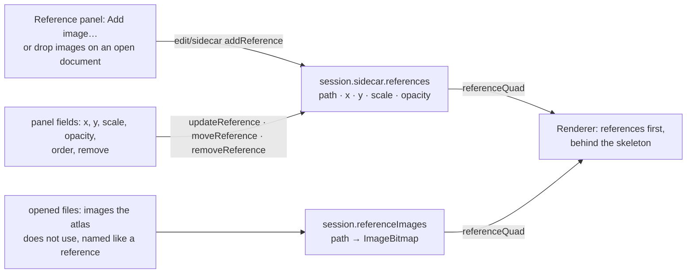

### Decisions

- **Placement**: a reference's x, y is its image's centre in skeleton units; its size is the
  image's pixels times its scale. References draw before the skeleton, in list order, at their
  opacity, whatever skin or animation is shown.
- **Adding**: the panel's Add image… (any image the browser opens), or images dropped on an open
  document with no skeleton among them. A new reference is placed at the stage's centre, scale 1,
  opacity 0.5; its path is the file's name, and the panel says to keep the file beside the
  skeleton. A dropped image whose name a missing reference has fills that one instead.
- **Opening**: images among the opened files that the atlas does not use and that a reference
  names are that reference's picture; a reference with no picture is kept, listed as missing,
  and named in the notes. The sidecar never loses a reference because its file is not there.
- **Editing**: x and y to two decimals; a scale above 0; opacity from 0 to 1 (anything else is
  refused with the reason). Like guides, these change the sidecar, not the document: not undo
  steps, but they make it need saving.
- **Not in this step:** dragging a reference on the stage, references in front of the skeleton,
  video.

### Steps

1. `edit/sidecar.ts`: `addReference`, `updateReference`, `removeReference`, `moveReference`;
   `ui/stage/references.ts`: `referenceQuad` (pure). Tests: edits and refusals, the quad's
   corners and UVs, which opened images are references.
2. Session: `referenceImages`; opening matches them; dropping images on an open document adds or
   fills references. Renderer: references drawn first.
3. The Reference panel: the list (missing ones marked), fields, order, remove, Add image….
4. On screen: a reference added to the stickman, placed and faded; saved; opened again with the
   image: back where it was.

### Step 9 results

1. `edit/sidecar.ts`: `addReference`, `updateReference`, `removeReference`, `moveReference`
   (scale above 0, opacity 0 to 1, place to two decimals; refusals with the reason);
   `ui/stage/references.ts`: `referenceQuad`, `referenceFile`, `matchReferences` (pure). Tests:
   the edits and refusals, the quad's corners and UVs, the round trip through the file, and which
   opened images are references (by file name, any case, never an atlas page).
2. Session: `referenceImages`; opening gives each reference its picture or lists it as missing
   (a note); images alone dropped on an open document (`addReferenceImages`) fill a missing
   reference of that name or are added at the stage's centre, scale 1, opacity 0.5, and the status
   line says to keep the file beside the skeleton. The renderer draws references first, through
   the stage's own shader (premultiplied, opacity as the vertex colour's alpha).
3. The Reference panel (`ui/panels/references.ts`, panel id `reference`): Add image…, Remove,
   ↑ ↓, the list (opacity, or "missing: drop the file to show it"), and X, Y, Scale and Opacity
   % for the chosen one. **Added:** a panel that arrives tabbed with another (the reference
   panel next to Properties, in the default and in a saved layout) no longer takes the front tab
   (Dockview's `inactive`); Panels ▸ Reference brings it forward.
4. On screen (the stickman): a sketch dropped on the window became a reference behind the
   skeleton at 50%; through the panel it was put at (470, −400), scale 0.75, 35%, over the figure.
   Saved (skeleton and sidecar, captured). Opened again without the picture: the reference kept,
   marked missing, named in the notes; the picture dropped after: shown, nothing to save. Opened
   with the picture among the files: shown, no note.

## Step 10 — preferences

The editor's own settings, the same for every document: kept in the browser's storage like the
dock layout (view state of the app, D6), changed in a Preferences dialog, applied at once.

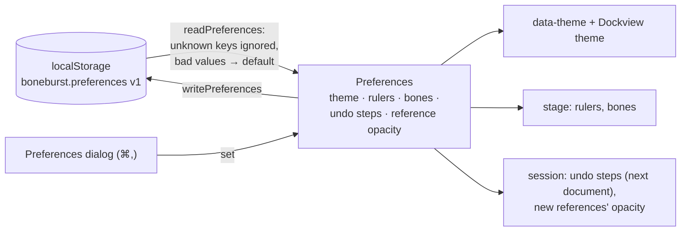

### Decisions

- **What is a preference**: how the editor looks and behaves for this person, never what a
  document means. First set: theme (follow the system, light, dark); show rulers; show bones;
  undo steps kept (50–5000, default 500; takes effect for the next document opened, said so in
  the dialog); new reference images' opacity (0–100 %, default 50).
- **Storage**: `localStorage` key `boneburst.preferences`, `{"version": 1, …}`. A value that does
  not read, or is out of range, is the default; an unknown key is ignored; another version is
  ignored whole. Storage blocked or full: the editor runs on the defaults, nothing breaks.
- **The dialog** is a native `<dialog>` from a toolbar button (and ⌘, / Ctrl+,): changes apply as
  they are made, Reset puts every preference back to its default, Close or Escape closes it.
- **Hiding bones** hides their drawing only; a press still picks the bone under it.

### Steps

1. `ui/preferences.ts` (pure: defaults, ranges, `readPreferences`, `writePreferences`, a
   `Preferences` holder with listeners and storage passed in). Tests: defaults, every bad value,
   ranges, unknown keys, another version, blocked storage.
2. Applied: theme to the page and to Dockview (live), rulers and bones to the stage, undo steps
   to the next document's history, reference opacity to new references.
3. The dialog and its toolbar button and shortcut.
4. On screen: each preference changed and seen; reload: kept; Reset: defaults back.

### Step 10 results

1. `ui/preferences.ts` (pure: `DEFAULTS`, `UNDO_RANGE`, `readPreferences`, `writePreferences`, the
   `Preferences` holder with the storage passed in). `tests/preferences.test.ts`, 8 tests:
   defaults; the round trip; JSON that does not read, another version, no version, not an
   object, all ignored whole; each bad or out-of-range value its default, unknown keys ignored;
   changes stored, heard once, numbers set out of range brought into it; Reset; blocked storage
   (the defaults, changes kept for the visit).
2. Applied: the theme to the page (`data-theme`, set before the dock is built so it starts in
   it) and to Dockview (`Workspace.refreshTheme`); rulers and bones to the stage (hidden bones are
   still picked; with the rulers hidden no guide is made or removed at the edges); undo steps to
   the next document's history; the opacity to new references.
3. The dialog (`ui/preferencesDialog.ts`, a native `<dialog>`): theme, rulers, bones, undo steps
   (with "takes effect for the next document opened"), new references' opacity; Reset, Close,
   Escape. Opened from a ⚙ button (labelled Preferences) and ⌘, / Ctrl+, (matched by the key or
   its physical position, so other keyboard layouts work too). **Changed on screen:** the
   toolbar's file name now shrinks with an ellipsis instead of wrapping onto a second row when
   the bar is full; the dialog's value column was widened so "Follow the system" is not cut.
4. On screen (the stickman): Light applied at once to the dock and panels; rulers and bones
   hidden (the images alone); 99999 undo steps kept as 5000; new references at 30%. Reload: all
   kept, the opened document's history holding 5000 steps; a press on the hidden head bone still
   picked it; a reference added came in at 30%. Reset: all defaults back, stored. **Not tested
   through the browser tool:** the ⌘, key itself (the tool sends that key with neither its
   character nor its code); a key event as a keyboard sends it opened the dialog.

## Step 11 — keying constraints and deforms

What steps 4–6 made can now be animated: in Animate mode the properties panel keys a
constraint's animatable values at the playhead, and the stage keys a mesh's vertices (a deform
key) when one is dragged (Format-Json-Atlas.md §11.5–11.10). The timeline already shows, moves,
deletes and eases these keys (E3); this step makes them.

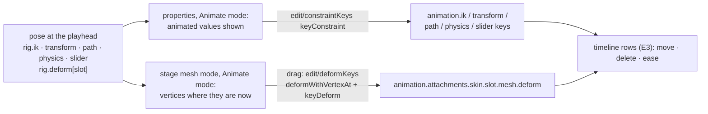

### Decisions

- **Which values key** (the format's timelines): IK mix, softness, bend, compress, stretch (one
  key holds all five); transform's six mixes (one key holds all six); path position, spacing,
  and its mixes (three timelines); physics inertia, strength, damping, mass, wind, gravity, mix
  (one timeline each) and Reset (a key with only a time); slider time and mix. Everything else
  about a constraint (its bones, target, modes, offsets) is the setup pose's, edited as before.
- **A key holds the pose at the playhead**: changing one value keys that timeline with the
  others in it at their animated values there, so nothing else moves. Values at their key
  default are left out, as Spine writes them (a transform key's `mixY` defaults to its own
  `mixX`, its `mixScaleY` to 1).
- **Deform keys from the stage**: in Animate mode, a mesh the slot shows at the playhead is drawn
  where its vertices are now; dragging a vertex keys the whole mesh's offsets at the playhead,
  one undo step per drag. An unweighted vertex follows the pointer in its slot's bone space; a
  weighted one moves by the same world offset through each of its bones. Vertices are added and
  deleted on the setup pose only (said when tried); a linked mesh's deforms are keyed on its
  source; a mesh its slot does not show at the playhead says so.
- **Written as Spine writes them**: deform offsets from the first non-zero value to the last
  (`offset`, `vertices`); a key with no offset at all has no `vertices`.

### Steps

1. `edit/constraintKeys.ts` (`keyConstraint`, `keyPhysicsReset`, `CONSTRAINT_KEYS`) and
   `edit/deformKeys.ts` (`keyDeform`, `deformWithVertexAt`). Tests on spineboy-pro, hero-pro,
   celestial-circus and a converted mesh: keying one value leaves the others where they were at
   the playhead; defaults left out; deform keys put the dragged vertex where it was dragged and
   leave the others; weighted and unweighted; both runtimes posing every keyed file alike.
2. Properties in Animate mode: a constraint's keyable fields show and key the animated values;
   the title says the frame; physics gets Reset here.
3. Stage mesh mode in Animate mode: posed vertices, drag keys a deform; add and delete refused
   with the reason.
4. On screen: an IK mix and a transform mix keyed on the stickman, the torso mesh deformed over
   a few frames; played; saved; both runtimes pose the saved file alike.

### Step 11 results

1. `edit/constraintKeys.ts` (`keyConstraint`, `keyPhysicsReset`, `CONSTRAINT_KEYS`),
   `edit/deformKeys.ts` (`keyDeform`, `deformWithVertexAt`), `ui/stage/posed.ts`
   `constraintNow` (a constraint's animated values off the posed rig, named as its keys name
   them). `edit/keys.ts` `setKey` gained `clear` (fields an existing key loses first, so a value
   keyed back to its default is left out instead of the old value staying) and compares arrays
   by their numbers. `tests/animKeys.test.ts`, 8 tests: IK between two keys (raptor-pro or
   Stretchyman: the first sample with one), one value keyed and the others where they were;
   a default keyed back leaves the key; transform's six mixes with `mixY` and `mixScaleY` left
   out only at their key defaults; path, physics (mass raw, Reset a key with only a time) and a
   slider; refusals; deform keys on an unweighted (converted) and a weighted mesh: the dragged
   vertex where it was dragged, the others unmoved, a second drag keyed over the first; offsets
   trimmed, none left as a key without vertices; both runtimes posing every keyed file alike.
   Three planted bugs fail them (other values not kept; `clear` ignored; the weighted offset not
   turned through each bone).
2. Properties in Animate mode: a constraint's animatable fields show the pose at the playhead
   and key it ("Constraint · IK · keys at frame 10"); setup fields edit the setup pose as before;
   physics has Reset physics here.
3. Stage mesh mode in Animate mode (`animatedMeshView`): the mesh where its vertices are at the
   playhead when its slot shows it; a drag keys the deform (one undo step); a press off a vertex
   goes to the bones under it (keying bones is Animate mode's main job); Delete says vertices
   are added and deleted on the setup pose; a linked mesh says to key its source.
4. On screen (the stickman, `dance`): `arm_far_fore_ik` mix typed as 0.4 at frame 10 (keyed;
   the arm stopped short of its target); the torso, converted on the setup pose, dragged at
   frame 5 (one vertex) and frame 20 (another); at frame 12 the first held and the second was
   on its way; played. Saved; the same keys built in Node give the identical file (SHA-256
   equal), no profile issue as written, 26 poses alike in both runtimes. **Changed from the
   plan:** the stickman has no transform constraint, so transform keys are checked in the tests
   only. **Seen, not explained:** a browser-tool drag at frame 20 missed its vertex (it panned,
   as a press off the mesh does), and the zoom was found changed afterwards; the same drag sent
   as pointer events at the vertex keyed it with the camera untouched, and a plain tool drag
   only pans. Nothing in the app zooms except the wheel and Fit.

## Step 12 — constraints drawn on the stage

The stage shows what each constraint does, in the pose shown: where an IK chain reaches for its
target, which bone a transform follows, the curve a path constraint lays bones along, and which
bones physics and sliders act on. A press on a drawn constraint selects it.

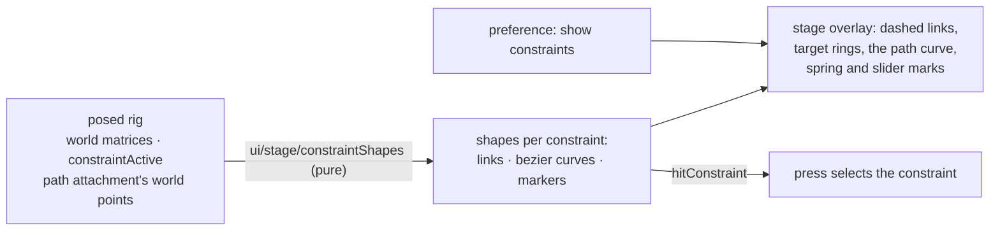

### Decisions

- **What each kind draws** (world space, in the pose shown):
  IK: a dashed link from the chain's end (the last bone's tip) to the target bone, and a ring on
  the target. Transform: a dashed link from the source bone to each bone it moves. Path: the
  path attachment's curve (its bezier segments, closed when the path is) and a dot at each bone
  it moves. Physics: a small ring around its bone's origin. Slider: a small square on the bone
  that drives it (none for a slider driven by its own time).
- **Colour by kind**, one colour each in both themes; a selected constraint in the accent colour
  and thicker; an inactive one (its bones or skin not shown) left out.
- **Picking**: a press within 6 pixels of a constraint's links, curve or marks selects it,
  after the mesh, the selected bone and any bone's origin, but before a bone picked only by its
  segment (and before guides and panning). The Constraints view and properties follow the
  selection.
- **A preference**, Show constraints (on by default), beside rulers and bones.

### Steps

1. `ui/stage/constraintShapes.ts` (pure): `constraintShapes(posed)` and `hitConstraint`. Tests
   on spineboy-pro, hero-pro (path), celestial-circus (physics) and a slider: each kind's shape
   where its bones are; inactive ones left out; picking by link, curve and mark.
2. The overlay draws them; pressing selects; the preference and colour tokens.
3. On screen: the stickman's IK links and targets, hero-pro's path curve, a constraint picked on
   the stage.

### Step 12 results

1. `ui/stage/constraintShapes.ts` (`constraintShapes`, `pathCurves`, `hitConstraint`).
   `tests/constraintShapes.test.ts`, 5 tests: an IK link from its chain's tip (an IK whose last
   bone has length) to its target, with a ring there; a transform's links from its source; a
   Stretchyman path at position 0 puts its first bone on the curve's start, and its segments
   join; physics rings, a bone-driven slider squares its bone, a time-driven one draws nothing;
   a skin-required constraint not shown is left out; picking by link, curve and mark. Two
   planted bugs fail them (the path's points read in the wrong order; the IK link from the
   chain's origin). **Changed while testing:** hero-pro's path is skin-required (not drawn on
   the setup pose, correctly), so the path test uses Stretchyman's.
2. The overlay draws each kind in its own colour (`--c-ik`, `--c-transform`, `--c-path`,
   `--c-physics`, `--c-slider`, both themes), the selected one in the accent colour; a press
   selects; Preferences ▸ Show constraints. **Changed on screen:** picked after the bones as
   planned, a path's curve could never be pressed (its bones lie along it), so a constraint now
   comes before a bone picked only by its segment; the selected bone and bone origins (an IK
   target is dragged by its origin) still come first.
3. On screen: the stickman's IK rings at its hands and feet; Stretchyman (from the samples, with
   its atlas) with its four path curves along the limbs, IK rings and transform links; a press on
   the front leg's curve selected `front-leg-path` (drawn in the accent colour, its properties
   shown); with Show constraints off, the same press picked the bone. **Fixed on screen:** the
   rig panel kept the previous document's rows when a newly opened one was at the same history
   revision (both 0); it now keys on the document's own history.

## Step 13 — reference images dragged on the stage

A reference picture is placed by hand on the stage, not only by typing X, Y and Scale: chosen,
it is dragged to move and its corners dragged to size it, as a guide is.

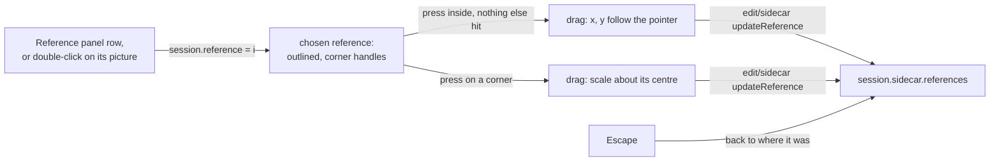

### Decisions

- **Which reference moves**: only the chosen one (`session.reference`). A reference covering the
  stage must not take every press, or the left button could never pan over it. It is chosen by
  its row in the Reference panel or by double-clicking its picture on the stage (the topmost
  picture under the pointer); selecting anything in the rig, or a press on empty stage, lets it
  go.
- **Press order**: rulers and guides on the rulers, the mesh, bones and constraints keep their
  places; then a corner of the chosen reference (within 6 pixels), then inside its picture,
  then guides, then panning. The middle and right buttons always pan.
- **Moving**: x, y follow the pointer by the world distance moved since the press (to two
  decimals, as typed). **Sizing**: a corner scales the picture about its centre, by the ratio of
  the pointer's distance from the centre now to at the press; the scale stays above 0.
- **Drawn**: the chosen reference outlined in the accent colour with a square at each corner,
  over the skeleton (the picture itself stays behind it).
- **Like typed changes**, a drag changes the sidecar: not an undo step, but the document needs
  saving. Escape during a drag puts the reference back where it was.
- **Not in this step:** rotating a reference; snapping it to guides (parked with snapping, E4.5).

### Steps

1. `ui/stage/references.ts` (pure): `hitReference` (the topmost picture under a screen point),
   `referenceCorner` (a corner within the radius), `movedReference`, `scaledReference`. Tests:
   the topmost wins, a missing picture is never hit, corners, moving and sizing (about the
   centre, never to 0).
2. Session: `reference` (the chosen one) and `selectReference`; the Reference panel follows and
   sets it. Stage: the outline and corners; double-click chooses; press moves or sizes; Escape.
3. On screen: the stickman's reference chosen by double-click, dragged and sized; Escape mid-drag;
   the panel's X, Y and Scale following; saved and opened again.

### Step 13 results

1. `ui/stage/references.ts`: `hitReference`, `referenceCorner`, `movedReference`,
   `scaledReference` (pure). `tests/sidecar.test.ts`, 3 tests: the topmost picture wins, a
   missing one is never hit, scale counts; the nearest corner within the radius; moving by the
   pointer's travel, sizing about the centre, never to 0. Two planted bugs: searching bottom
   first fails them; measuring from the origin instead of the centre passed at first (every
   picture in the tests sat at 0, 0), so a test with an off-centre picture was **added**, and it
   fails the bug.
2. Session: `reference` and `selectReference` (choosing in the rig, a press on empty stage or
   opening a document lets go). The Reference panel's row, Add image…, ↑ ↓ and Remove set it, and
   it follows the stage. Stage: the chosen picture outlined in the accent colour with corner
   squares; a double-click where a press hit nothing chooses the topmost picture; a press on a
   corner or inside it, after bones and constraints and before guides, sizes or moves it;
   Escape (and a cancelled pointer) puts it back.
3. On screen (the stickman, a 300×400 sketch): chosen by double-click (outline, corners, the
   status line saying what to do); dragged 50 screenshot pixels, moved 126.7 units each way at
   that zoom; its bottom-right corner dragged out, scale 1 to 1.5323 with its centre unchanged;
   the panel's X, Y and Scale following; the document marked as needing saving. Escape mid-drag
   (synthetic pointer events): back to where it was, later moves ignored. Saved and opened again
   with the picture: at (555.72, −100.05), scale 1.9114, nothing to save, not chosen. **Not
   explained:** once, between two checks, the camera's zoom went from 0.6 to 0.49 and the chosen
   reference was let go and resized, with no drag of mine in between (step 11 saw a zoom change
   like it). With every stage event logged, the same drags and tab clicks gave no wheel event and
   no change; the likeliest cause is input on the shared browser pane from outside the session.

## Step 13a — icons (owner, 2026-10-06)

The interface gets icons: Lucide for the general chrome, and a small subset of Godot's editor
icons, restyled, for the animation glyphs Lucide lacks. Both are vendored as SVG files (no npm
icon package; the runtime dependencies stay ag-psd and dockview-core) and theme through
`currentColor`.

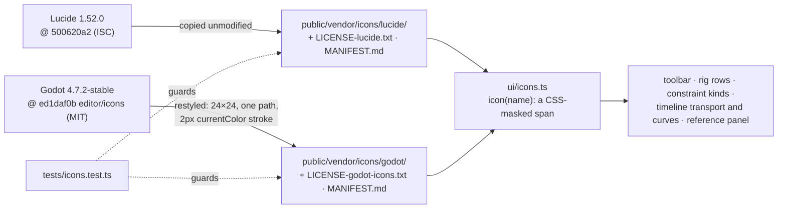

### Decisions

- **Sources, pinned**: Lucide `1.52.0` (commit `500620a2e8123f8d1db191538886dc0c223f69a9`) and
  Godot `4.7.2-stable` (commit `ed1daf0bf001b61586d9930840f2f1394092c079`), files taken from
  those commits only. Godot's `COPYRIGHT.txt` puts `editor/icons/` under its MIT (Expat) licence;
  only `misc/logo/` is CC-BY, and nothing is taken from it.
- **Lucide first.** Where Lucide has the glyph it is used, including domain ones it happens to
  have: bone, skull (skeleton), shirt (skin), layers (draw order), image (region), spline (path
  attachment), crosshair (point), scissors (clipping), diamond (a key), paintbrush (weights).
  **Godot fills the rest** (16): the five constraint kinds (IK ← ChainIK3D, transform ←
  RemoteTransform2D, path ← PathFollow2D, physics ← SpringBoneSimulator3D, slider ← HSlider), mesh
  ← MeshInstance2D, bounding box ← CollisionPolygon2D, key kinds (translate ← KeyTrackPosition,
  rotate ← KeyTrackRotation, scale ← KeyTrackScale, deform ← KeyTrackBlendShape), and the five
  curves (linear, stepped ← CurveConstant, ease in, ease out, ease in-out). Godot has no skin
  icon in 4.7.2; Lucide's shirt is used.
- **Restyling**: Godot's icons are 16×16 filled, coloured shapes. Each is redrawn after its
  original as one `<path>`, viewBox `0 0 24 24`, `fill="none"`, `stroke="currentColor"`,
  `stroke-width="2"`, round caps and joins (Lucide's own attributes). A redrawn file is a
  derivative and keeps Godot's MIT notice; the manifest names its original and the commit.
- **Provenance files**: `public/vendor/icons/godot/` holds the restyled files only, with
  `LICENSE-godot-icons.txt` (Godot's `LICENSE.txt` at that commit) and `MANIFEST.md` (file ←
  original name, commit); `public/vendor/icons/lucide/` the same for Lucide (its `LICENSE`,
  which includes Feather's MIT for the icons derived from it). Two rows in
  THIRD-PARTY-NOTICES.md. Never an icon from the old editor.
- **Drawing**: `ui/icons.ts` maps names to files; `icon(name)` is a span whose CSS mask is the
  file and whose background is `currentColor`, so icons follow the text colour, the theme
  (`--dv-*` palette included) and the selected row's colour, in popout windows too.
- **Where**: the toolbar (Open, Save, Undo, Redo, the three tools, Fit, Preferences); the rig
  rows (bone, slot, each attachment's kind, skin, constraint kinds); the timeline (to start,
  play/pause, loop, key, the five curves); the reference panel (add, remove, up, down). Buttons
  keep their words beside the icon where they had words; ⚙ ↑ ↓ ⏮ ▶ become icons with an
  `aria-label`.
- **Guard** (`tests/icons.test.ts`): every name in `ui/icons.ts` has its file; every vendored
  SVG is in its manifest and every manifest row has its file; each Godot file is 24×24, one
  path, `currentColor` stroke 2, no other colour; both licences present; the manifests name the
  pinned commits.

### Steps

1. Vendor Lucide's files; redraw the 16 Godot icons; licences, manifests, notices rows.
2. `ui/icons.ts`, the CSS, and the icons in place; `tests/icons.test.ts`.
3. On screen: light and dark themes, a selected row, a popout window's panel.

### Step 13a results

1. Lucide `1.52.0` (`500620a2`): 27 files copied unmodified (`plus` fetched and then left out,
   nothing used it). Godot `4.7.2-stable` (`ed1daf0b`): 16 icons redrawn by
   `scripts/godot-icons.py` (kept, so the redraw can be repeated and read); `CurveConstant` is
   drawn as a step, which reads as "stepped" where a flat line would read as a minus. Godot has
   no skin icon at that commit, so Lucide's shirt is used. Licences (Godot's `LICENSE.txt`,
   Lucide's `LICENSE` with Feather's MIT), a `MANIFEST.md` per set (with a diagram), two notices
   rows. Each redraw was compared with its original side by side at 56 px and at 16 px.
2. `ui/icons.ts` (`icon`, `setIcon`, `iconButton`, `ICON_FILES`, `CONSTRAINT_ICONS`), the CSS
   mask, and the icons in the toolbar, the rig rows (bone, slot, each attachment's kind, skin,
   each constraint's kind; the old ▣ ▫ ⌁ glyphs gone), the timeline (transport, Key, the curves,
   Delete; a row's owner, and translate, rotate, scale and deform timelines), and the reference
   panel. `tests/icons.test.ts`, 5 tests; three planted faults (a colour in a Godot file, a
   manifest row removed, an icon named with no file) each fail one.
   **Changed on screen:** with icons, the curve buttons wrapped the timeline's bar onto two lines;
   they are icons only now, their name leading the tooltip and as the accessible name.
3. On screen: the stickman (64–79 icons, every one masked by its file, none missing); light
   theme with Stretchyman: the five constraint kinds each with its own icon (a physics and a
   slider constraint added for it), attachments as mesh, path and region, the selected row's icon
   in the row's text colour. **Fixed on screen:** `icon()` made a span `setIcon` did not
   recognise, so no icon drew at first. **Not verified:** a popout window. In the browser pane
   Dockview's popout replaced the tab itself instead of opening a window, so this goes to step
   15's popout session and its Playwright test.

## Step 14 — re-importing a PSD into an existing rig

The artist repaints, moves and adds layers in Photoshop after the rig is built. Dropping the PSD
on the open rig brings that in: each layer the rig already has gets its new pixels and place,
new layers become new slots, and nothing the rig built on them (bones, slots, meshes, weights,
constraints, skins, animations) is lost. One undo step takes it all back.

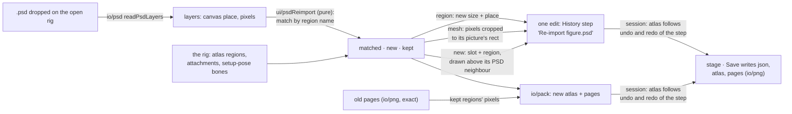

### Decisions

- **Matching**: a PSD layer belongs to the rig's atlas region of the same name: its name made
  safe and unique exactly as the first import made it (`safeName`, `unique`, bottom first). An
  attachment shows a region when its `path`, or else its name, is that region's name; every
  attachment in every skin that shows it follows the layer.
- **Where the canvas is in the rig**: the canvas's bottom centre was the origin at import; if
  the rig has moved since (the root dragged), the offset most matched layers share between where
  they show now and where the PSD has them is taken as the canvas's place (none shared: the
  origin). Positions are the setup pose's, constraints applied, as the stage shows it.
- **A region attachment** gets the layer's trimmed pixels, its centre where the layer is now
  (through its bone's setup-pose world transform), and its width and height scaled by how much
  the trimmed image grew or shrank, so a region the artist scaled stays scaled; its rotation,
  colour and scale are kept.
- **A mesh** (and a linked mesh, through its source) keeps its vertices, triangles, UVs and
  weights. Its picture's rectangle on the canvas is found from its setup-pose vertices and UVs;
  the layer's new pixels are cut to that rectangle (anything painted outside it is cut and
  reported with what to do: redo the mesh's outline). A mesh turned or scaled against its
  picture, or whose region is whitespace-stripped, keeps its old pixels and is reported.
- **New layers** become a slot and region on the root, placed like the first import, drawn just
  above the slot of the nearest layer under it in the PSD that the rig has (none: at the back);
  names made unique against the rig's slots and regions.
- **Kept**: regions no visible PSD layer matches (deleted or hidden in Photoshop, or never from
  it) keep their pixels and are listed. Nothing is deleted.
- **The atlas** is packed again from all regions (new, updated, kept) as the first import packs
  (`io/pack`), its pages named after the skeleton. Kept regions keep their `offsets` and
  `index` fields. Refused, with the reason, when the atlas is premultiplied or a region that
  would be copied is packed turned (`rotate`): the rig's file is not changed.
- **Exact pixels (new, `io/png`)**: page PNGs are decoded and encoded by the editor itself (the
  browser's streams for deflate), not through a canvas, which rounds semi-transparent colours.
  Kept regions are copied bit for bit; Save writes pages through it too (also for a first
  import). 8-bit RGBA, RGB, grey, grey+alpha and palette PNGs are read; others are refused.
- **Undo**: the skeleton change is one History step; the atlas, pages and the files Save writes
  follow it: undoing the step brings the old atlas back (and Save writes it again, so files on
  disk always match the skeleton), redoing brings the new one.
- **How**: dropping a `.psd` on an open document re-imports it into that document; Open… with a
  `.psd` still starts a new rig. The status line and notes say what was updated, moved, added,
  kept and cut.
- **Not in this step:** layers becoming bones, matching renamed layers, re-importing into a
  skeleton without an atlas.

### Steps

1. `io/png.ts` (`decodePng`, `encodePng`) with tests (round trip, every colour type read, the
   stickman page, refusals); Save writes pages with it.
2. `edit/reimport.ts` (pure): the plan of a re-import from the rig, its setup-pose bone
   matrices, the atlas's region sizes and the PSD's layers: the edit, the images to pack, the
   report. Tests on `figure.psd` and variants written in the test: moved, repainted larger,
   added, hidden; a meshed and weighted layer; a keyed animation; the root moved; refusals.
3. Session and app: re-import on drop, the atlas following undo and redo, Save.
4. On screen: the figure imported, a layer meshed and weighted, an animation keyed; a changed
   PSD dropped: updated, added, kept; undo and redo; saved and read back.

### Step 14 results

1. `io/png.ts` (`decodePng`, `encodePng`, `PngRefused`): 8-bit grey, RGB, palette, grey + alpha
   and RGBA, with `tRNS`; every chunk's CRC checked; deflate through `CompressionStream` and
   `DecompressionStream` (browser and Node alike). `tests/png.test.ts`, 5 tests on PNGs written
   in the test with Node's zlib (independent of the encoder): each colour type, each row filter
   (Paeth's tie included), a bit-exact round trip with semi-transparent and fully transparent
   colours, the stickman's page at its atlas size, the refusals. Planted bugs (Average without
   its halving; Paeth's second tie broken the other way) fail them. **Found while planting:**
   changing Paeth's first comparison from `<=` to `<` is not a bug (a tie there means the
   predictors are equal), so the tie test targets the second. Save now writes pages through it.
2. **Changed from the plan:** the planner is `ui/psdReimport.ts`, not `edit/reimport.ts`: it reads
   `io/psd`'s layers and the import's naming (`ui/psdImport`: `layerNames`, `layerBlend`,
   `layerCentre`, now shared), which the `edit` layer may not import; it is pure all the same
   (`planReimport`, `rebuildAtlas`, `meshPicture`, `cutLayer`). `io/pack` takes extra fields per
   image (a kept region's `offsets`, `index`). `tests/fixtures/psd.ts` now builds the figure from
   `figureLayers()` and `writeFigure()` (the committed file unchanged, byte for byte).
   `tests/psdReimport.test.ts`, 6 tests: the same file changes nothing (skeleton text and pixels
   equal); a moved head on a turned bone lands where its layer is now, its slot's bone and the
   animation untouched; a body repainted larger about its centre is resized, not moved; a new belt
   is drawn just above the body and a hat above the head; a layer hidden in the file is kept bit
   for bit; a meshed, weighted leg keeps its geometry and weights, its new pixels cut to its
   picture, the painted pixels past it reported; with the root moved, nothing moves back and a new
   layer lands where the import would put it; premultiplied atlases and kept turned regions are
   refused; the mesh picture fit and the cut. Four planted bugs fail them (the canvas offset
   ignored; the mesh rectangle's top not flipped; new slots appended last, which passed until a
   new layer in the middle of the stack was added to the test; kept pixels copied with x and y
   swapped).
3. Session: `reimportPsd`; each page's exact pixels kept (`pageData`, from its file or as made);
   the atlas, pages and the files Save owes swap as undo and redo cross the re-import's step (a
   step even when only pixels changed). A PSD dropped on an open rig re-imports; Open… with a PSD
   still starts a new rig.
4. On screen: `figure.psd` imported; hip and knee bones added, the left leg made a weighted mesh,
   the head put on a turned neck bone, an animation keyed. The changed figure (head moved, body
   larger, a belt, a hat, the left leg repainted green and longer, the right arm hidden) dropped
   on the window: "6 layers updated (1 moved), 2 added (belt, hat), 1 kept from before"; draw
   order shadow, leg L, leg R, body, belt, arm L, arm R, head, hat; the mesh and the animation
   unchanged; a note for the 28 leg pixels cut. Undo: the very skeleton and atlas before, the
   old pixels on the stage; redo: the new. Saved (files captured): `figure.json`,
   `figure.atlas.txt`, a 652 × 164 `figure.png`; opened again from them: the same skeleton text
   and atlas, no notes, nothing to save.

## Wrap-up (owner decisions, 2026-10-06)

E4 finishes with three more steps and one closing verification; two items are parked, not
dropped.

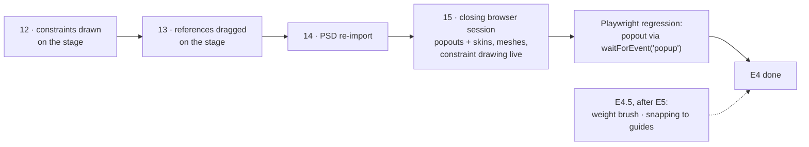

- **Done when (v2 plan, amended)**: every authoring surface is built and seen working in the
  browser, popout windows included, with a permanent Playwright regression for popouts. The
  `auto_rig` → `apply_motion` → `check_preview` flow moved to E5 and is its primary criterion.
- **Step 12** — constraints drawn on the stage (IK chains to their targets, transform links,
  path followers, physics and slider bones).
- **Step 13** — reference images dragged on the stage.
- **Step 14** — re-importing a PSD into an existing rig: new pixels and placement for the layers
  it already has, new layers added, nothing the rig built on them (bones, weights, animation)
  lost.
- **Step 15** — one browser verification session: popout windows on screen (the oldest
  unverified item, from step 1), and everything added since step 2 not yet seen live (skins,
  mesh editing, constraint drawing); then a Playwright regression that opens a panel in a new
  window (`waitForEvent('popup')`) and checks it draws, so it never lapses again.
- **Parked for after E5 (E4.5)**: the weight brush; snapping to guides.
- **Pushing**: `git push origin main` after every step commit, from 2026-10-06 on.

## Results

### Step 1 — the Dockview shell

1. D6 recorded in the v2 plan's decision log; the E4 row names it.
2. `dockview-core` 8.4.0, exact (`npm install --save-exact`): the only entry in `dependencies`.
   `scripts/check.sh` now fails unless that stays true (checked both ways). Inter and JetBrains
   Mono: the latin variable woff2 files from `@fontsource-variable/*` 5.3.0, copied byte for byte
   into `public/vendor/fonts/` with their OFL texts; Dockview's licence in `public/vendor/`.
   All four are in THIRD-PARTY-NOTICES as shipped; `dist/` carries them.
   **Changed from the brief:** Dockview 8.x ships no SCSS; its theming entry points are the
   theme objects and `--dv-*` CSS variables, used here. Its ES module carries no styles, so the
   app loads the UMD build (`dist/dockview-core.js`, which injects them) and takes the types from
   the package (`ui/workspace/dockview-umd.d.ts`).
3. `ui/workspace/panelIds.ts` (seven ids, four built), `ui/workspace/layout.ts` (default places
   with fallbacks, restore with deferral, filtering grid, floating and popout groups, dropping a
   dangling active group). `tests/workspace.test.ts`, 10 tests.
4. `ui/workspace/workspace.ts`: Dockview with `createComponent`, the tab context menu (Float,
   Open in New Window, Maximize, Close), `themeDark`/`themeLight` following the system,
   persistence in `localStorage` (`boneburst.workspace`, saved 250 ms after a layout change),
   keys from popout windows routed to the same shortcuts, a Panels menu in the toolbar (show a
   closed panel at its default place; reset the layout).
5. No hand-rolled docking existed to delete (E2–E3 used a fixed CSS grid); the grid shell is
   gone. The stage and timeline size from Dockview's `layout()` instead of their observers, and
   use their own window for pixel ratio, styles, animation frames and focus; the stage redraws on
   a new WebGL context if the browser drops one.
6. On screen (built-in browser, light and dark): the default layout (rig 220 px, properties
   260 px, timeline 230 px); Properties floated from its tab menu, dragged into the Rig group as a
   tab; Timeline dragged to split right of the stage; reload restored all of it exactly. Through
   the API, each of the four panels floated, tabbed and split; Close, then Panels ▸ Properties
   brought it back. Dark theme switches live; Inter and JetBrains Mono load (both preloaded).
   **Not verified: popout windows** — the pane navigates to `/popout.html` instead of opening a
   window. A saved layout with a popout that cannot open falls back to the main grid with no
   error (Dockview's own handling, seen). To check by hand: right-click a tab ▸ Open in New
   Window, in Chrome with pop-ups allowed for localhost; the panel should draw, take keys (W/E/R,
   Space, ⌘Z) and dock back when the window closes.
