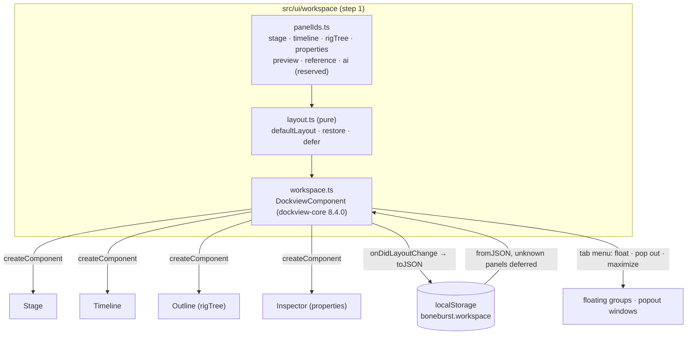
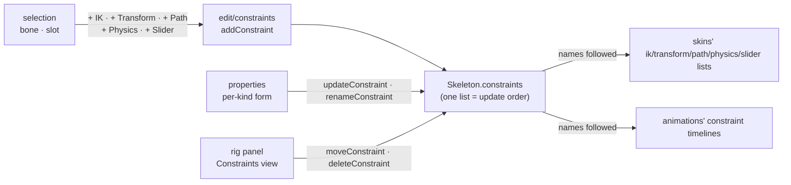
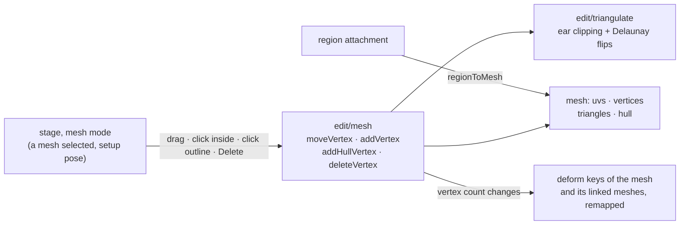
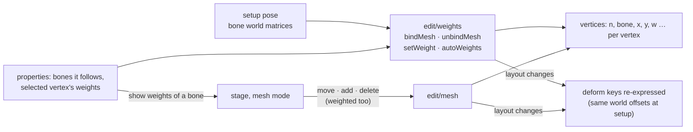

# E4 — authoring surfaces — plan

**Status:** in progress, 2026-10-06. Step 1 (the Dockview shell, D6) done except one check:
**popout windows are not verified on screen** (the built-in browser pane loads a popout's page in
place of the app; Claude in Chrome was not connected). Every other acceptance point holds, and
`npm run check` passes (249 tests). Step 2 (the rig's structure) done: a rig built from an empty
skeleton on screen, saved and read back alike by both runtimes. Step 3 (skins) done: a
mix-and-match outfit duplicated and changed on screen, posed alike by both runtimes. Step 4
(constraints) done: a transform constraint added, raised, reordered and made skin-required on
screen, the file saved and posed alike by both runtimes. Step 5 (mesh geometry) done: the
stickman's torso turned into a mesh and shaped on the stage, saved, posed alike by both
runtimes. Step 6 (weights) done: the torso mesh bound to three bones on screen, reshaped and
reweighted, saved, posed alike by both runtimes through its animations. Later steps not started.
`npm run check`: 283 tests.

E4 makes the editor author a rig, not only animate one: panels and docking (D6), slots,
attachments, draw order, skins, constraints, mesh editing, PSD import and preferences. It is
done when the `auto_rig` → `apply_motion` → `check_preview` flow runs end to end
(`../../Animation-BoneBurst-Src/docs/EDITOR-V2-PLAN.md` ▸ E4). It starts with the shell every
later surface lives in.

## Step 1 — the Dockview shell (D6)

### Decisions

- **`dockview-core` 8.4.0, exact.** MIT, no dependencies of its own: the only npm runtime
  dependency, listed in THIRD-PARTY-NOTICES as shipped when installed. Its styles are injected by
  its UMD build (`dist/dockview-core.js`; the ES module carries none), so the app loads that build
  at run time and takes the types from the package.
- **Dockview owns the shell**: splits, tabs, groups, drag and drop, floating groups, popout
  windows, maximize. Float, pop out and maximize come from Dockview's own tab context menu
  (`getTabContextMenuItems`); there is no custom docking code. The toolbar and the status line
  stay outside the dock; everything that is a panel is a Dockview panel.
- **Panel ids reserved** in one file (`panelIds.ts`): `stage`, `timeline`, `rigTree`,
  `properties`, `preview`, `reference`, `ai`. Only built panels register (the first four now;
  reference in E4, AI in E5, preview when it exists). No empty panels.
- **Default placement in one place** (`defaultLayout`): rig tree left, stage centre, properties
  right, timeline below; preview right of the stage, reference and AI tabbed with properties. A
  panel that first appears, or comes back after being closed, goes there.
- **Layout persistence: the browser's storage**, key `boneburst.workspace`, versioned. The
  workspace is view-only state of the app, not of a document, and must restore on reload with
  nothing open, so it is not in the `.bb.json` sidecar yet; the sidecar's `view` can carry the
  same blob once the editor writes sidecars (a later E4 step). A saved layout naming a panel this
  build lacks keeps that entry (deferred, with the panel it was tabbed with) and applies it when
  the panel arrives; a layout that does not read is dropped for the default, quietly.
- **Panels size by Dockview**: each panel's content gets `layout(width, height)`; the stage and
  the timeline draw from it, not from their own observers, so they work in a popout window too.
  Keys pressed in a popout window reach the same shortcuts.
- **Theme**: Dockview's `themeDark` (and `themeLight` when the system is light), coloured through
  its `--dv-*` variables from our tokens; Inter for text and JetBrains Mono for numbers, vendored
  as Fontsource's variable woff2 builds (latin), preloaded, unmodified, with their OFL texts
  beside them. Deterministic typography is the reason: screenshots and pixel diffs must not
  depend on the machine's fonts.

### Steps

1. Record D6 (v2 plan, decision log).
2. Install `dockview-core@8.4.0` exact; notices row. Vendor the two fonts with their OFL texts;
   notices rows.
3. `panelIds.ts`, `layout.ts` (pure: defaults, restore with deferral), with table tests.
4. `workspace.ts`: the Dockview component, panel renderers wrapping Stage, Timeline, Outline,
   Inspector; theme switching; persistence; popout windows' keys.
5. Remove the fixed CSS grid shell; panels size from Dockview.
6. Check on screen: split, tab, float, pop out each panel; reload restores; gates green.

## Step 2 — the rig's structure: bones, slots, region attachments, draw order

The rig tree becomes the place to build a rig: add, delete and reparent bones; add, delete,
rename slots and set their bone, colours, blend and setup attachment; add region attachments from
the atlas, edit and rename them; reorder slots (the setup draw order). Each is an edit on the
document that keeps it a file the BoneBurst profile accepts (SPEC §2): it is refused with its
reason, never written broken.

### Decisions

- **Deleting cascades only where it must, and is refused where it would guess.** Deleting a bone
  deletes its descendants, the slots on them with their skin entries and timelines, and their bone
  timelines; it is refused while a constraint names one of those bones or slots ("delete the
  constraint first"), and for the root while other bones hang from it. Deleting a slot removes
  its skin entries, its slot and attachment timelines and its draw order offsets; refused while a
  path constraint or a clipping attachment's `end` names it. Deleting an attachment removes its
  deform and sequence timelines; a slot whose setup attachment it was shows nothing.
- **Renaming rewrites every reference** (as `renameBone` does): a slot's name in skins,
  animations, draw order offsets, clipping `end`, path constraints and linked meshes' `slot`; an
  attachment's key in every skin's entry for that slot, the slot's setup attachment, attachment
  keys, deform and sequence timelines and linked meshes' `source`.
- **Reparenting keeps the bone where it is on screen**: the stage works out the local values that
  give the same setup world transform under the new parent (normal inheritance), and the edit
  takes them. Bones stay ordered parent before child: the bone and its descendants move to just
  after the new parent's subtree. A bone cannot become its own descendant's child.
- **Reordering slots keeps every draw order key meaning what it meant**: each key's order is
  rebuilt by name from the old offsets, then written as offsets against the new setup order
  (ascending, Format §11.11); a folder's slot list is re-sorted to the new setup order the same way
  (§11.12).
- **A new region** takes its key and path from the atlas region, its size from the region's
  original size, and goes in the default skin on the selected slot (a new slot on the selected
  bone when a bone is selected).
- **Selection becomes typed**: a bone, a slot, or an attachment (skin, slot, key). The stage
  still picks bones; the rig tree and the properties panel follow any kind.

### Steps

1. `edit/bones.ts` (`addBone`, `deleteBone`, `reparentBone`), `edit/slots.ts` (`addSlot`,
   `deleteSlot`, `renameSlot`, `updateSlot`, `moveSlot`), `edit/attachments.ts` (`addRegion`,
   `deleteAttachment`, `renameAttachment`, `updateAttachment`), each with table tests: refusals,
   references rewritten, the profile still holding, both runtimes posing the result alike.
2. Typed selection in the session; the stage, timeline and properties read it.
3. Rig tree: bones, their slots, the slots' attachments; add, delete; a draw order view.
4. Properties for a slot and for a region attachment (other kinds shown, read only).
5. On screen: build a small rig on the stickman's atlas from an empty skeleton; save; read back.

### Step 2 results

1. `edit/bones.ts` (`addBone`, `deleteBone`, `reparentBone`, `subtree`), `edit/slots.ts`
   (`addSlot`, `deleteSlot`, `renameSlot`, `updateSlot`, `moveSlot`), `edit/attachments.ts`
   (`addRegion`, `deleteAttachment`, `renameAttachment`, `updateAttachment`),
   `edit/drawOrder.ts` (draw order keys kept by name), `edit/newSkeleton.ts`.
   `tests/rig.test.ts`, 25 tests: every edited sample keeps the profile, round-trips and is
   posed alike by the engine and spine-core; moving, renaming and deleting a slot leave
   raptor-pro's draw order keys drawing what they drew (four of these fail with the remapping
   off); a synthetic draw order folder is re-sorted and keeps its order; refusals for the root,
   an IK target, a path constraint's slot, a clipping's end, a linked mesh's source.
   **Added to the plan:** an atlas opened without a skeleton starts a new one (a root bone, a
   random header hash, unsaved), so a rig can be built from nothing.
2. Typed selection (`Selection`: bone, slot, attachment) in the session; `selectedBone` for
   the stage, the timeline and keying.
3. Rig panel: bones as a tree with their slots and the slots' attachments (the shown skin's
   and the default's; the shown one marked), + Bone, + Slot, + Region (a region chosen from the
   atlas), Delete (also the Delete key in the panel); a draw order view, front to back, with
   forward and back. **Changed on screen:** the region chooser was first a menu that added on
   change; it added a second region from one choice (the menu rebuilt its options inside its own
   change handler), so it is now a choice plus a + Region button.
4. Properties for a bone (parent as a menu that keeps the bone where it is; defaults left out),
   a slot (name, bone, shown attachment, colour, dark, blend) and a region (name, image, x, y,
   rotation, scale, size, colour); other attachment kinds read only. Fields are labelled for
   screen readers by their label, not their value.
5. On screen: from the stickman's atlas alone, bones `body` and `neck`, the head and torso
   regions, the head brought in front, a slot renamed, an attachment deleted and undone, `neck`
   moved under `root` without moving on screen; saved; the saved file has no profile issue and
   both runtimes pose it identically.

## Step 3 — skins

Skins become something to author: add, duplicate, rename and delete them; choose which
skin-required bones each one turns on; mark a bone skin-required; put new regions in the shown
skin and move an attachment between skins (Format-Json-Atlas.md §8.1).

### Decisions

- **The default skin is fixed**: it cannot be deleted or renamed, and no skin may be renamed to
  `default` (§8.1: that name makes the default skin).
- **Skins follow their attachments' timelines**: deform and sequence keys are stored per skin,
  so renaming a skin renames them, duplicating copies them, deleting drops them, and moving an
  attachment moves them. Linked meshes name their source's skin; those references follow a
  rename and a move, a copy points at itself, and deleting a skin that another skin's linked
  mesh takes its source from is refused.
- **New regions go in the shown skin** (the toolbar's Skin; the default skin when none is
  chosen).
- **Skin-required constraints** are listed and toggled per skin like bones, but marking a
  constraint skin-required waits for step 4 (constraints).
- Selection gains a fourth kind: a skin.

### Steps

1. `edit/skins.ts` (`addSkin`, `deleteSkin`, `renameSkin`, `duplicateSkin`, `setSkinMember`,
   `moveAttachment`), with table tests on goblins, hero-pro and mix-and-match: refusals,
   references and timelines followed, the profile holding, both runtimes posing alike.
2. Rig panel: a Skins view (add, duplicate, delete; choosing one shows it).
3. Properties for a skin (name, its skin-required bones and constraints), a bone's "Skin
   required", an attachment's skin.
4. On screen: duplicate a mix-and-match skin, change it, show it; save; read back.

### Step 3 results

1. `edit/skins.ts`: `addSkin`, `deleteSkin`, `renameSkin`, `duplicateSkin`, `setSkinMember`,
   `moveAttachment`. `tests/skins.test.ts`, 7 tests on goblins, hero-pro and mix-and-match:
   each edited file keeps the profile, round-trips and is posed alike by both runtimes; renaming
   follows the deform timelines and the linked meshes (a rename that forgets the timelines fails
   the test); `goblin` cannot be deleted while `goblingirl`'s linked meshes take their sources
   from it.
2. Rig panel: a Skins view (+ Skin, Duplicate, Delete); choosing a skin shows it. New regions go
   in the shown skin. The toolbar falls back to the default skin when the shown one is deleted or
   undone away.
3. Properties: a skin's name (fixed for the default), its attachment count, a checkbox per
   skin-required bone and constraint it turns on; a bone's "Skin required"; an attachment's skin
   (a menu that moves it, its timelines and its linked meshes along).
4. On screen (mix-and-match, opened from the samples through the dev server, now allowed to
   serve that folder): `full-skins/girl` duplicated as `girl-bald`, its 15 hair attachments
   deleted, shown: drawn without hair (36 images against the original's 51); a skin's bone
   toggled off and a bone made skin-required, both undone. The same edits in Node: no profile
   issue, 455 poses alike within 2.1e-6.

## Step 4 — constraints

Constraints become something to author: add each of the five kinds (IK, transform, path,
physics, slider), edit their references and values, rename, delete and reorder them, and mark
them skin-required (Format-Json-Atlas.md §7). The rig panel gets a Constraints view; the
properties panel a form per kind.

### Decisions

- **One list, in update order** (§7.1): the Constraints view shows it in file order and moves a
  constraint up or down; that is the order the runtimes apply them in. A new one goes last.
- **Names are unique within a kind** (§7.1: lookup matches name and kind); the selection names
  both. Selection gains a fifth kind: a constraint (type, name).
- **A new constraint leaves the pose as it was.** IK: the selected bone, aimed at a new bone
  `<bone> target` under the root at the bone's tip (so it already points there). Transform: the
  selected bone, its parent as the source, each property mapped to itself, every mix 0. Path:
  the selected slot, which must hold a path attachment, no bones yet. Physics: the selected bone,
  rotation fed in (it moves only in playback). Slider: the shown animation (else the first), mix
  0. Raising a mix, adding bones or playing is what moves anything.
- **References are checked when written, refused with the reason**: IK takes one or two bones,
  the second a child of the first, and a target that is neither constrained nor under the first
  bone; a transform's source is not one of its bones; a path's slot exists; physics and slider
  bones exist; a slider's animation exists, and a bone-driven slider names its property.
- **Renaming and deleting follow the name** into every skin's list of that kind and every
  animation's timelines of that kind; deleting drops both. Deleting a bone or slot a constraint
  uses stays refused (step 2).
- **Values at their default are left out**, as Spine writes them, except mixes whose default
  depends on another key (a transform's `mixY` and `mixScaleY`, a path's `mixY`): written as
  shown.
- **Not in this step:** keying constraint values in Animate mode, drawing constraints on the
  stage, editing a transform's property map beyond what the form shows (offset, scale and max of
  each from→to pair; adding and removing pairs).

### Steps

1. `edit/constraints.ts` (`addConstraint`, `updateConstraint`, `renameConstraint`,
   `deleteConstraint`, `moveConstraint`), `model/defaults.ts` constraint defaults; table tests
   on spineboy-pro, stretchyman, hero-pro, celestial-circus and a synthetic slider: refusals,
   names followed, the profile holding, both runtimes posing alike (and a new constraint not
   moving the setup pose).
2. Selection kind `constraint`; rig panel Constraints view (add per kind, delete, up, down).
3. Properties per kind, with "Skin required"; the skin form lists it once marked.
4. On screen: add an IK to the stickman's arm, raise a transform's mix, reorder, mark one
   skin-required and turn it on in a skin; save; read back.

### Step 4 results

1. `edit/constraints.ts`: `addConstraint`, `updateConstraint`, `renameConstraint`,
   `deleteConstraint`, `moveConstraint`, `findConstraint`; `model/defaults.ts`:
   `CONSTRAINT_DEFAULTS`, `constraintValue`, `constraintMix` (a transform's mixes as the runtimes
   read them, §7.3). `ui/panels/newConstraint.ts` builds the new constraint of each kind.
   `tests/constraints.test.ts`, 12 tests on spineboy-pro, Stretchyman, hero-pro and
   celestial-circus, plus a slider on spineboy-pro's `aim`: renames and deletes follow skins'
   lists and timelines (and keep the global physics group), reordering is applied alike by both
   runtimes, every refusal, all five new kinds leaving hero-pro's setup pose as it was. Three
   planted bugs fail them (timelines not followed; `bones` dropped; `mixY` not following `mixX`).
   **Added to the plan:** spine-core's reader needs `bones` on IK, transform and path
   constraints even when empty (Format §7.4 lets it go), so the edits keep the key, `[]` when
   empty. **Changed from the plan:** an IK's new target is placed to four decimals, not two; two
   shifted hero-pro's head 0.006 under the re-aimed bone.
2. Selection kind `constraint` (type, name). Rig panel: a Constraints view in update order, a
   kind menu and + Constraint (from the selected bone, or slot for a path), Delete, ↑ (earlier),
   ↓ (later).
3. Properties per kind: name, place in the order, Skin required; IK bone (one or two), target,
   mix, softness, bend, compress, stretch, scale Y; transform source, flags, the mixes its
   mapping uses, offsets, the mapping (offset, scale, max per pair; add and remove pairs) and its
   bones; path slot, modes, values, bones; physics bone, inputs, simulation values and their
   global flags; slider animation, mix, driver (its time, or a bone's property with from, to,
   scale, local). **Fixed on screen:** the properties panel kept showing the last selection while
   a checkbox or menu in it held focus (it waits for a field being typed in, which those are
   not); it now waits for text fields only.
4. On screen (the stickman): `arm_far_fore_ik` bent the other way; a transform constraint added
   to `head` (the head did not move), its rotation mix raised to 1 and a 30° offset set, moved
   from last to third, made skin-required (the head went back), a skin `tilt` added that turns it
   on (the head turned 30° with `tilt` shown, not with the default). Saved; the same edits in
   Node give the identical file (SHA-256 equal), no profile issue as written, 39 poses alike in
   both runtimes within 2.1e-9.

## Step 5 — mesh geometry

Meshes become something to make and shape: turn a region into a mesh, move its vertices (the
image staying put, or stretching with them), add vertices inside it or on its outline, delete
them, and triangulate again (Format-Json-Atlas.md §8.4, §8.9, §11.10). This step covers
unweighted meshes; binding vertices to bones (weights) is step 6.

### Decisions

- **A region becomes a mesh that draws the same**: four outline vertices at the region's
  corners in bone space (its offset, rotation, scale and size applied), UVs at the image's
  corners, two triangles; path, colour, sequence and size kept. Its sequence timelines stay.
- **Vertices are moved on the setup pose only**; in Animate mode the stage says to switch to the
  setup pose (deform keys are a later step). A plain drag keeps the image where it was: the
  vertex's UV follows it through the affine map of a triangle it belongs to. Alt-drag stretches
  the image: the UV stays.
- **Adding**: a click inside the mesh adds a vertex there, a click on the outline splits that
  edge (the new vertex joins the hull); its UV comes from where it lands. A click outside pans.
  **Deleting** a vertex (Delete on the stage) is refused when the outline would keep fewer than
  three. Outline vertices are the first `hull` vertices, in order around it.
- **Triangulation is ours and deterministic**: ear clipping of the outline, then each inner
  vertex inserted into the triangle that holds it, then edge flips to Delaunay that never cross
  the outline. Adding or deleting triangulates again; moving does not (a fold is the artist's
  to see and undo). "Triangulate" in the properties redoes it on demand. Inner vertices outside
  the outline are left out of triangles and reported.
- **Deform keys keep meaning what they meant**: they store offsets from the setup vertices
  (§11.10), so a move needs nothing; an added vertex takes the offsets interpolated from the
  triangle or edge it landed in, a deleted one's are dropped — in the mesh's own deform
  timelines and those of linked meshes that use them.
- **`edges` (nonessential) are dropped** by any edit that changes the vertices' number or
  order; Spine rebuilds them.
- **Weighted meshes** draw their wireframe and refuse geometry edits with the reason until step 6.

### Steps

1. `edit/triangulate.ts` (pure); `edit/mesh.ts`: `regionToMesh`, `moveVertex`, `addVertex`,
   `addHullVertex`, `deleteVertex`, `retriangulate`, the deform remapping. Tests: triangulation
   (concave outlines, Delaunay on random points, determinism), every region of a sample turned
   into a mesh drawing the same, deform keys of goblins, hero-pro and spineboy-pro keeping their
   old vertices where they were after adds and deletes, refusals, both runtimes posing alike.
2. Stage mesh mode: wireframe, outline and vertices over the selected mesh; drag, add, delete
   (one undo step each); weighted meshes shown, not edited.
3. Properties: Convert to mesh on a region; a mesh's counts, image, colour and Triangulate.
4. On screen: a stickman region turned into a mesh, shaped, saved, read back.

### Step 5 results

1. `edit/triangulate.ts` (ear clipping, insertion, Delaunay flips that keep the outline);
   `edit/mesh.ts`: `regionToMesh`, `moveVertex`, `addVertex`, `addHullVertex`, `deleteVertex`,
   `retriangulate`, `verticesOutside`, with deform keys remapped. `tests/mesh.test.ts`, 8 tests:
   concave outlines both ways round; Delaunay on 40 random points, deterministic, a point
   outside left out; every region of spineboy-pro and raptor-pro turned into a mesh showing
   each page pixel where the region showed it (within 0.05); a moved vertex's UV following its
   triangle, or not; added and deleted vertices leaving the image in place; deform keys of
   goblins, hero-pro and spineboy-pro moving the old vertices exactly as before after an inner
   add, an outline split and a delete; refusals; both runtimes posing every result alike. Three
   planted bugs fail them (deform keys not remapped; UVs not following; no flips).
   **Changed from the plan:** a converted region keeps its corners unrounded (rounding to two
   decimals moved a scaled image's pixels by up to 0.08), and is triangulated by the same code
   as everything else.
2. Stage mesh mode (`ui/stage/meshMode.ts`, in the stage): when a mesh attachment is selected
   and the setup pose shown, its triangles, outline and vertices are drawn over it (a linked
   mesh shows its source's; a weighted one is drawn and says why it cannot be edited). A press
   on a vertex selects and drags it; on the outline splits that edge; inside adds a vertex; each
   is one undo step with the drag that follows; Delete on the stage deletes the selected vertex.
   Mesh mode takes the press before the bones under the mesh.
3. Properties: Convert to mesh on a region; a mesh's image, colour, vertex, outline and
   triangle counts, whether it is bound to bones, inner vertices outside the outline,
   Triangulate, and how to shape it on the stage.
4. On screen (the stickman): `torso` converted (four vertices, two triangles); a corner dragged
   inward (the image stayed, cut by the new edge), an inner vertex added and dragged, the top
   edge split and the new vertex deleted with Delete, Undo back through them; a corner dragged
   with Alt (UV kept: the image stretches) and without (UV followed). Saved; the same geometry
   built in Node gives the identical file (SHA-256 equal), no profile issue as written, 26
   poses alike in both runtimes. **Seen:** a vertex dragged out past the image's edge with the
   image kept takes UVs outside 0..1, so the atlas page around the image shows there; that is
   what the UVs say, and the outline is the artist's to keep on the image. The browser tool's
   Alt-drag did not hold Alt during the moves; Alt was checked with pointer events carrying it.

## Step 6 — weights

Meshes get bound to bones: bind a mesh to the bones it should follow with weights worked out
from distance, see and change each vertex's weights, weight again automatically, unbind; and the
step 5 geometry edits work on weighted meshes too (Format-Json-Atlas.md §8.9, §11.10).

### Decisions

- **Binding is on the setup pose**: each vertex keeps its place; a bind position is the vertex in
  that bone's space as the setup pose has it (constraints applied, as the stage shows it). The
  edits take the setup bones' world matrices as data, so they stay pure.
- **Automatic weights by distance**: for each vertex, every chosen bone weighs 1 / (d + 1)⁴,
  d the distance to the bone's segment (origin to tip); the four heaviest are kept, any under
  0.01 dropped, the rest normalised to sum 1. Deterministic. A mesh bound to one bone is fully
  on it.
- **Changing a weight** sets that bone's share for the vertex; the vertex's other bones share
  the rest in their old proportion. 0 removes the bone from the vertex (not its last one); a
  bone not yet on the vertex joins it. Weights are written to four decimals, bind positions to
  four.
- **Unbinding** writes each vertex in the slot's bone space where the setup pose has it.
- **Weighted geometry**: moving a vertex keeps its weights and rebinds it where it lands; an
  added vertex takes the weights of the triangle or edge it lands in (blended, then the four
  heaviest); deleting drops it and its bindings.
- **Deform keys keep their setup-pose meaning**: whenever the vertex layout changes (bind,
  unbind, a weight added or removed, a vertex added or deleted), every key's offsets are turned
  into world offsets on the setup pose, carried to the new vertices (kept, blended, dropped),
  and written in the new layout. Exact on the setup pose; under animated bones an offset follows
  the bones its vertex now follows.
- **Seeing weights**: with a weighted mesh selected, the properties panel chooses a bone and the
  stage colours each vertex by that bone's weight (none → full).

### Steps

1. `edit/weights.ts` (`bindMesh`, `unbindMesh`, `setWeight`, `autoWeights`, decode and encode
   of the weighted layout, the deform re-expression) and the weighted paths of `edit/mesh.ts`.
   Tests on a converted region and on weighted meshes of spineboy-pro and hero-pro: the setup
   pose drawn the same after bind, unbind, reweighting and geometry edits; deform keys giving the
   same setup-pose world offsets; weights summing to 1, at most four; refusals; both runtimes
   posing alike.
2. Session: the selected vertex and the weight bone shown; the stage edits weighted meshes and
   colours vertices by weight.
3. Properties: bind (bones chosen from a menu, the slot's bone first), the bones a mesh
   follows (add, remove), Auto weights, Unbind; the selected vertex's weights.
4. On screen: the stickman's torso mesh bound to its bones, a vertex's weight changed, an
   animation played with the mesh following; saved, read back.

### Step 6 results

1. `edit/meshLayout.ts` (the two vertex layouts, bind and place on the setup pose, deform keys
   rewritten vertex by vertex), `edit/weights.ts` (`bindMesh`, `unbindMesh`, `setWeight`,
   `setMeshBone`, `autoWeights`, `distanceWeights`, `meshBones`); `edit/mesh.ts`'s geometry edits
   take the setup bones and work on weighted meshes. `tests/weights.test.ts`, 7 tests: the
   weight rules as a table; binding a spineboy-pro torso and back leaving every vertex in place;
   unbinding weighted meshes of spineboy-pro and hero-pro keeping the setup pose and every
   deform key's setup offsets; a weight change keeping the vertex, its deform offsets, and every
   other vertex's binds and deform offsets exactly as written; auto weights and adding and
   removing a followed bone; weighted move, add, outline split and delete keeping the other
   vertices' deform offsets; both runtimes posing each result alike. Planted bugs fail them
   (deform keys never re-expressed; re-expressing untouched vertices; no normalising).
   **Fixed while testing:** the 0.01 cut was first applied to raw distance weights, not to each
   bone's share, so a 7% share was dropped; the distance table test fails on that code.
   **Changed from the plan:** a vertex whose binds did not change keeps its deform offsets
   verbatim (going through the setup pose would keep their sum but move them between bones,
   which changes them under animated bones).
2. Session: the selected vertex (cleared with the selection), the bone whose weights are shown,
   and the setup pose's bone matrices (`setupBones`, its own rig, cached per revision and skin).
   The stage edits weighted meshes and colours each vertex by the shown bone's weight (dark blue
   none, red full).
3. Properties: for an unweighted mesh, Bind with a list of bones (the slot's bone first, more
   from a menu); for a weighted one, the bones it follows (remove, add: weighted again by
   distance), Show weights, Auto weights, Unbind, and the selected vertex's weights (edit, add a
   bone at 0.25, Auto weight this vertex).
4. On screen (the stickman): `torso` converted and bound to hips, chest and torso; two inner
   vertices added and the left edge split on the weighted mesh; weights shown for hips; the new
   outline vertex given hips 0.9 (chest and torso shared the rest 5:1, as before); `dance`
   played with the mesh following. Saved; the same geometry in Node gives the identical file
   (SHA-256 equal), no profile issue as written, 26 poses through `dance` and `run` alike in both
   runtimes.

## Later steps (planned when step 7 starts)

PSD import, the sidecar's read and write (view state, guides, references), the reference panel,
preferences; keying constraint values, deform keys, drawing constraints on the stage, a weight
brush.

## Results

### Step 1 — the Dockview shell

1. D6 recorded in the v2 plan's decision log; the E4 row names it.
2. `dockview-core` 8.4.0, exact (`npm install --save-exact`): the only entry in `dependencies`.
   `scripts/check.sh` now fails unless that stays true (checked both ways). Inter and JetBrains
   Mono: the latin variable woff2 files from `@fontsource-variable/*` 5.3.0, copied byte for byte
   into `public/vendor/fonts/` with their OFL texts; Dockview's licence in `public/vendor/`.
   All four are in THIRD-PARTY-NOTICES as shipped; `dist/` carries them.
   **Changed from the brief:** Dockview 8.x ships no SCSS; its theming entry points are the
   theme objects and `--dv-*` CSS variables, used here. Its ES module carries no styles, so the
   app loads the UMD build (`dist/dockview-core.js`, which injects them) and takes the types from
   the package (`ui/workspace/dockview-umd.d.ts`).
3. `ui/workspace/panelIds.ts` (seven ids, four built), `ui/workspace/layout.ts` (default places
   with fallbacks, restore with deferral, filtering grid, floating and popout groups, dropping a
   dangling active group). `tests/workspace.test.ts`, 10 tests.
4. `ui/workspace/workspace.ts`: Dockview with `createComponent`, the tab context menu (Float,
   Open in New Window, Maximize, Close), `themeDark`/`themeLight` following the system,
   persistence in `localStorage` (`boneburst.workspace`, saved 250 ms after a layout change),
   keys from popout windows routed to the same shortcuts, a Panels menu in the toolbar (show a
   closed panel at its default place; reset the layout).
5. No hand-rolled docking existed to delete (E2–E3 used a fixed CSS grid); the grid shell is
   gone. The stage and timeline size from Dockview's `layout()` instead of their observers, and
   use their own window for pixel ratio, styles, animation frames and focus; the stage redraws on
   a new WebGL context if the browser drops one.
6. On screen (built-in browser, light and dark): the default layout (rig 220 px, properties
   260 px, timeline 230 px); Properties floated from its tab menu, dragged into the Rig group as a
   tab; Timeline dragged to split right of the stage; reload restored all of it exactly. Through
   the API, each of the four panels floated, tabbed and split; Close, then Panels ▸ Properties
   brought it back. Dark theme switches live; Inter and JetBrains Mono load (both preloaded).
   **Not verified: popout windows** — the pane navigates to `/popout.html` instead of opening a
   window. A saved layout with a popout that cannot open falls back to the main grid with no
   error (Dockview's own handling, seen). To check by hand: right-click a tab ▸ Open in New
   Window, in Chrome with pop-ups allowed for localhost; the panel should draw, take keys (W/E/R,
   Space, ⌘Z) and dock back when the window closes.
