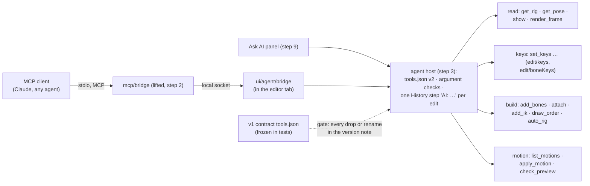

# E5 — the AI layer re-bound — plan

**Status:** in progress, 2026-10-06. Step 1 (provenance and the contract) done: v2's `tools.json`
with its version note, the gate in `npm run check`. Step 2 (the bridge) is next.

E5 puts the AI tools onto v2's model: an MCP client (Claude Code, Claude Desktop, any agent) and
the in-app Ask AI drive the open rig through the tool contract, each edit one undo step. It is
**done when** `auto_rig` → `apply_motion` → `check_preview` runs end to end via MCP on a fixture
rig, against the tools contract as versioned by D5 — the flow's own tools (`auto_rig`,
`apply_motion`, `check_preview`, `set_keys`, `show`, `get_pose`) keeping their v1 names and
argument shapes (`../../Animation-BoneBurst-Src/docs/EDITOR-V2-PLAN.md` ▸ E5, worded by the owner
on 2026-10-06). Also: every tool v1's `tests/agentApi.test.ts` exercises passes on v2 or is in the
version note; an AI keys a walk on a fixture rig via MCP; the AnimatedDrawings plan's motion half
(AD-3) runs on v2.

## Decisions

- **The contract (D5, refined by the owner 2026-10-06).** v2 serves a versioned `tools.json`.
  Tools keep their names and argument shapes where the meaning holds; `layer` arguments become
  slot names; `set_cycle`, `offset_keys` and the bone-path tools, which Spine has no home for, are
  dropped or renamed. The flow's six tools keep v1's names and argument shapes exactly.
- **The version note is a gate.** The note lives in one place: a `version` block in v2's
  `tools.json` (number, and per tool dropped, renamed or reshaped: what, why, what to use
  instead), so an MCP client reads the contract and its changes together. v1's `tools.json` is
  frozen in the tests; a test compares the two and fails `npm run check` when a v1 tool is gone,
  renamed or reshaped without its line in the note, when the note lists a change that did not
  happen, or when one of the flow's six tools differs from v1 at all. A drop or rename lands in
  the same commit as its line.
- **Clean room: what is lifted, and how.** The v1 files E5 draws on were created in our own
  commits (git: "Phase 9: an AI can animate the open rig", 2026-10-01, and the AI-RIG and AD-3
  work after it; every commit in the fork's history has one author). As in E2, each is checked
  before it is opened for a lift: authorship and dates from git, then its imports, any Animo-side
  name or line, and comments pointing at the old editor; recorded in SPEC §8. **Lifted** where the
  file stands on its own: the contract (`tools.json`), the MCP bridge script, and the rig and
  motion algorithms that work on numbers and names (the rig plan, motion retarget, BVH reader and
  clips, their data). **Rewritten** against v2's model where the file speaks the old model
  (documents, layers, library items, commands): the agent API and its modules, the Ask AI views.
  v1's tests say what each tool must do; they are read for that, and v2's tests are written anew.
- **Where it lives.** `src/agent/` (new, pure: the contract, argument checks, each tool as a
  function of the session's document and the tool's arguments, returning an edit and an answer);
  lifted algorithms beside it (`src/agent/rig/`), importing only the model and each other;
  `src/ui/agent/` for the socket and the Ask AI panel; `mcp/` at the editor's root for the bridge
  script. `scripts/check.sh` gets the layer rule for `src/agent`.
- **Every edit a tool makes is one History step** labelled "AI: …" (SPEC §8), so one undo takes
  a whole `auto_rig` or `apply_motion` back.
- **AnimatedDrawings.** The motion half (AD-3: BVH takes as clips) comes with the motion library.
  The detection half (AD-0..2) has not started in v1 either: it waits for the owner's install
  decision (TorchServe, mmpose; no Apple Silicon wheel for mmcv-full), and does not block E5.

## Steps

Each step gets its own decisions and results here when it starts, as in E4.

1. **Provenance and the contract.** The pass over `tools.json`, the bridge script and the
   agent tests; v2's `tools.json` with its `version` block; v1's frozen beside the tests; the
   gate test; an inventory of the 50 tools (kept, slot-mapped, dropped, renamed, and the step
   that builds each).
2. **The bridge.** The MCP script lifted (stdio ↔ local socket), the editor's end in
   `ui/agent/`; a tool call reaches the open document and answers.
3. **The host and the read tools.** Argument checks from the contract; `get_rig`, `get_pose`,
   `show`, `render_frame`.
4. **The key tools.** `set_keys` and the other keying tools on `edit/keys` and `edit/boneKeys`;
   an AI-keyed walk on the stickman via MCP.
5. **The building tools.** `add_bones`, `attach` (atlas regions in place of library pictures),
   `add_ik`, `draw_order`, and `auto_rig` with the rig plan lifted.
6. **Motion.** `list_motions`, `apply_motion`: the motion library, retarget, BVH reader and the
   AnimatedDrawings clips lifted (AD-3), credited in THIRD-PARTY-NOTICES.
7. **`check_preview`** on v2's engine: what it measures, the same answers as v1 on the same rig.
8. **The rest of the contract**: every remaining tool built, mapped or dropped with its note.
9. **Ask AI**: the `ai` panel, the providers v1 offers, the same tools.
10. **End to end**: an MCP client test (Node, through the bridge, the editor in Playwright's
    Chromium): `auto_rig` → `apply_motion` → `check_preview` on a fixture rig, kept in
    `npm run check`. Then E5 closes.

## Step 1 results

1. **Provenance.** Git, before opening: `tools.json`, the bridge script, `AgentApi.ts`,
   `AgentBridge.ts` and `tests/agentApi.test.ts` were each created in "Phase 9: an AI can animate
   the open rig" (2026-10-01) and changed only in our own commits after it (23, 10, 29, 6 and 26
   commits; one author throughout). Then `tools.json` was opened: data only (no code); no Animo
   name; "tween" only as the animation verb; one "the symbol's constraints"
   (`set_constraint_order`), rewritten as "the skeleton's". Recorded in SPEC §8.
2. **The contract.** v1's `tools.json` frozen byte for byte as `tests/fixtures/tools-v1.json`.
   v2's `src/agent/tools.json`: `{ version, tools }`, version 2 from 1, 46 tools.
   **Dropped** (with why and what to use instead): `set_cycle`, `offset_keys`, `get_bone_path`,
   `set_bone_path`. **Meaning** (same arguments, slot names for layers): `auto_rig`,
   `set_skin_image`, `make_sequence`, `key_sequence`, `link_mesh`, `set_tint`, `key_properties`.
   Prose changed in two descriptions (`apply_motion` no longer points at `set_cycle`;
   `set_constraint_order` as above); schemas otherwise as in v1.
3. **The gate.** `src/agent/contract.ts`: `contractProblems(v1, v2)` and `shape` (a schema
   without its prose, so wording may change and arguments may not). `tests/contract.test.ts`,
   3 tests: the real contract has no problem and the six flow tools' shapes equal v1's; every rule
   on small contracts (unlisted drop, rename, reshape; lines for changes that did not happen;
   flow tools refused even with a line). Three planted faults on the real file (a note line
   removed, a flow tool's `frames` minimum changed, `export_to_unity` removed unlisted) each fail
   it. `scripts/check.sh` gives `src/agent` the layer rule (model, io, edit, engine, itself; no
   DOM).
4. **Inventory.** v1's agent tests call all 50 tools, so all 46 kept tools are built on v2:

| Step | Tools |
|---|---|
| 3 · host and reading | `get_rig`, `get_animation`, `get_pose`, `get_reference`, `show`, `render_frame`, `undo`, `redo` |
| 4 · keys | `new_animation`, `set_keys`, `delete_keys`, `key_ik`, `key_transform`, `key_constraint`, `key_draw_order`, `key_properties`, `define_event`, `key_event`, `set_inherit` |
| 5 · building | `add_bones`, `attach`, `add_ik`, `draw_order`, `auto_rig`, `add_transform_constraint`, `map_transform`, `add_physics`, `add_slider`, `make_path`, `set_constraint_order`, `set_point`, `add_attachment` |
| 6 · motion | `list_motions`, `apply_motion` |
| 7 · checking | `check_preview` |
| 8 · the rest | `export_to_unity`, `make_mesh`, `bind_mesh`, `link_mesh`, `add_skin`, `set_skin_image`, `set_skin_color`, `set_skin_members`, `make_sequence`, `key_sequence`, `set_tint` |
