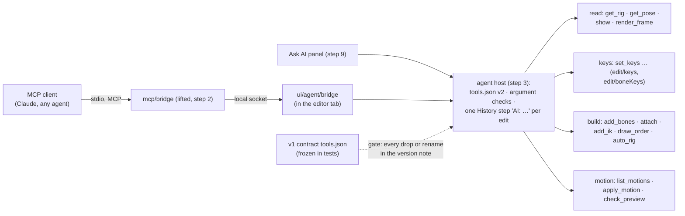
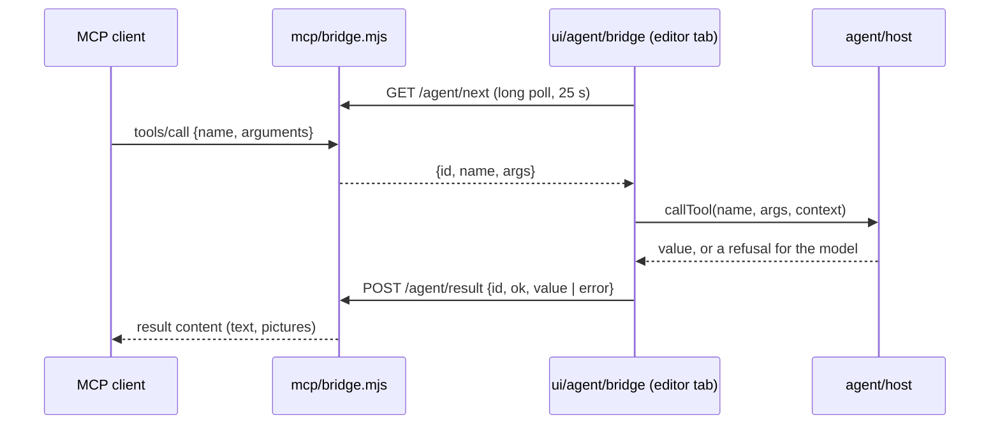
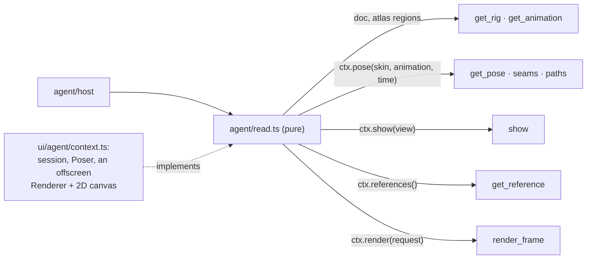
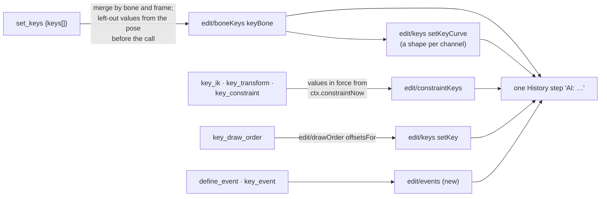
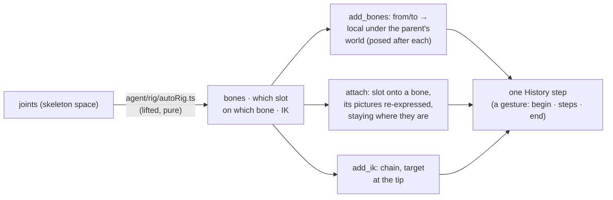
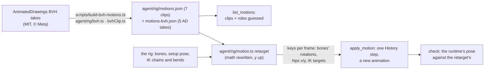

# E5 — the AI layer re-bound — plan

**Status:** in progress, 2026-10-06. Step 1 (provenance and the contract) done: v2's `tools.json`
with its version note, the gate in `npm run check`. Step 2 (the bridge) done: an MCP client's call
reaches the open rig (`undo`, `redo` built; every argument checked). Step 3 (the read tools) done:
`get_rig`, `get_animation`, `get_pose`, `get_reference`, `show`, `render_frame`. Step 4 (the key
tools) done: all eleven, and a walk keyed on the stickman by an AI over MCP. Step 5 (the building
tools) done: the thirteen, and the figure PSD rigged by an AI with `auto_rig` over MCP and waving.
Step 6 (motion) done: the motion library on v2, AnimatedDrawings' captures (AD-3) included.
Step 7 (`check_preview`) next.

E5 puts the AI tools onto v2's model: an MCP client (Claude Code, Claude Desktop, any agent) and
the in-app Ask AI drive the open rig through the tool contract, each edit one undo step. It is
**done when** `auto_rig` → `apply_motion` → `check_preview` runs end to end via MCP on a fixture
rig, against the tools contract as versioned by D5 — the flow's own tools (`auto_rig`,
`apply_motion`, `check_preview`, `set_keys`, `show`, `get_pose`) keeping their v1 names and
argument shapes (`../../Animation-BoneBurst-Src/docs/EDITOR-V2-PLAN.md` ▸ E5, worded by the owner
on 2026-10-06). Also: every tool v1's `tests/agentApi.test.ts` exercises passes on v2 or is in the
version note; an AI keys a walk on a fixture rig via MCP; the AnimatedDrawings plan's motion half
(AD-3) runs on v2.

## Decisions

- **The contract (D5, refined by the owner 2026-10-06).** v2 serves a versioned `tools.json`.
  Tools keep their names and argument shapes where the meaning holds; `layer` arguments become
  slot names; `set_cycle`, `offset_keys` and the bone-path tools, which Spine has no home for, are
  dropped or renamed. The flow's six tools keep v1's names and argument shapes exactly.
- **The version note is a gate.** The note lives in one place: a `version` block in v2's
  `tools.json` (number, and per tool dropped, renamed or reshaped: what, why, what to use
  instead), so an MCP client reads the contract and its changes together. v1's `tools.json` is
  frozen in the tests; a test compares the two and fails `npm run check` when a v1 tool is gone,
  renamed or reshaped without its line in the note, when the note lists a change that did not
  happen, or when one of the flow's six tools differs from v1 at all. A drop or rename lands in
  the same commit as its line.
- **Clean room: what is lifted, and how.** The v1 files E5 draws on were created in our own
  commits (git: "Phase 9: an AI can animate the open rig", 2026-10-01, and the AI-RIG and AD-3
  work after it; every commit in the fork's history has one author). As in E2, each is checked
  before it is opened for a lift: authorship and dates from git, then its imports, any Animo-side
  name or line, and comments pointing at the old editor; recorded in SPEC §8. **Lifted** where the
  file stands on its own: the contract (`tools.json`), the MCP bridge script, and the rig and
  motion algorithms that work on numbers and names (the rig plan, motion retarget, BVH reader and
  clips, their data). **Rewritten** against v2's model where the file speaks the old model
  (documents, layers, library items, commands): the agent API and its modules, the Ask AI views.
  v1's tests say what each tool must do; they are read for that, and v2's tests are written anew.
- **Where it lives.** `src/agent/` (new, pure: the contract, argument checks, each tool as a
  function of the session's document and the tool's arguments, returning an edit and an answer);
  lifted algorithms beside it (`src/agent/rig/`), importing only the model and each other;
  `src/ui/agent/` for the socket and the Ask AI panel; `mcp/` at the editor's root for the bridge
  script. `scripts/check.sh` gets the layer rule for `src/agent`.
- **Every edit a tool makes is one History step** labelled "AI: …" (SPEC §8), so one undo takes
  a whole `auto_rig` or `apply_motion` back.
- **AnimatedDrawings.** The motion half (AD-3: BVH takes as clips) comes with the motion library.
  The detection half (AD-0..2) has not started in v1 either: it waits for the owner's install
  decision (TorchServe, mmpose; no Apple Silicon wheel for mmcv-full), and does not block E5.

## Steps

Each step gets its own decisions and results here when it starts, as in E4.

1. **Provenance and the contract.** The pass over `tools.json`, the bridge script and the
   agent tests; v2's `tools.json` with its `version` block; v1's frozen beside the tests; the
   gate test; an inventory of the 50 tools (kept, slot-mapped, dropped, renamed, and the step
   that builds each).
2. **The bridge.** The MCP script lifted (stdio ↔ local socket), the editor's end in
   `ui/agent/`; a tool call reaches the open document and answers.
3. **The host and the read tools.** Argument checks from the contract; `get_rig`, `get_pose`,
   `show`, `render_frame`.
4. **The key tools.** `set_keys` and the other keying tools on `edit/keys` and `edit/boneKeys`;
   an AI-keyed walk on the stickman via MCP.
5. **The building tools.** `add_bones`, `attach` (atlas regions in place of library pictures),
   `add_ik`, `draw_order`, and `auto_rig` with the rig plan lifted.
6. **Motion.** `list_motions`, `apply_motion`: the motion library, retarget, BVH reader and the
   AnimatedDrawings clips lifted (AD-3), credited in THIRD-PARTY-NOTICES.
7. **`check_preview`** on v2's engine: what it measures, the same answers as v1 on the same rig.
8. **The rest of the contract**: every remaining tool built, mapped or dropped with its note.
9. **Ask AI**: the `ai` panel, the providers v1 offers, the same tools.
10. **End to end**: an MCP client test (Node, through the bridge, the editor in Playwright's
    Chromium): `auto_rig` → `apply_motion` → `check_preview` on a fixture rig, kept in
    `npm run check`. Then E5 closes.

## Step 1 results

1. **Provenance.** Git, before opening: `tools.json`, the bridge script, `AgentApi.ts`,
   `AgentBridge.ts` and `tests/agentApi.test.ts` were each created in "Phase 9: an AI can animate
   the open rig" (2026-10-01) and changed only in our own commits after it (23, 10, 29, 6 and 26
   commits; one author throughout). Then `tools.json` was opened: data only (no code); no Animo
   name; "tween" only as the animation verb; one "the symbol's constraints"
   (`set_constraint_order`), rewritten as "the skeleton's". Recorded in SPEC §8.
2. **The contract.** v1's `tools.json` frozen byte for byte as `tests/fixtures/tools-v1.json`.
   v2's `src/agent/tools.json`: `{ version, tools }`, version 2 from 1, 46 tools.
   **Dropped** (with why and what to use instead): `set_cycle`, `offset_keys`, `get_bone_path`,
   `set_bone_path`. **Meaning** (same arguments, slot names for layers): `auto_rig`,
   `set_skin_image`, `make_sequence`, `key_sequence`, `link_mesh`, `set_tint`, `key_properties`.
   Prose changed in two descriptions (`apply_motion` no longer points at `set_cycle`;
   `set_constraint_order` as above); schemas otherwise as in v1.
3. **The gate.** `src/agent/contract.ts`: `contractProblems(v1, v2)` and `shape` (a schema
   without its prose, so wording may change and arguments may not). `tests/contract.test.ts`,
   3 tests: the real contract has no problem and the six flow tools' shapes equal v1's; every rule
   on small contracts (unlisted drop, rename, reshape; lines for changes that did not happen;
   flow tools refused even with a line). Three planted faults on the real file (a note line
   removed, a flow tool's `frames` minimum changed, `export_to_unity` removed unlisted) each fail
   it. `scripts/check.sh` gives `src/agent` the layer rule (model, io, edit, engine, itself; no
   DOM).
4. **Inventory.** v1's agent tests call all 50 tools, so all 46 kept tools are built on v2:

| Step | Tools |
|---|---|
| 3 · host and reading | `get_rig`, `get_animation`, `get_pose`, `get_reference`, `show`, `render_frame`, `undo`, `redo` |
| 4 · keys | `new_animation`, `set_keys`, `delete_keys`, `key_ik`, `key_transform`, `key_constraint`, `key_draw_order`, `key_properties`, `define_event`, `key_event`, `set_inherit` |
| 5 · building | `add_bones`, `attach`, `add_ik`, `draw_order`, `auto_rig`, `add_transform_constraint`, `map_transform`, `add_physics`, `add_slider`, `make_path`, `set_constraint_order`, `set_point`, `add_attachment` |
| 6 · motion | `list_motions`, `apply_motion` |
| 7 · checking | `check_preview` |
| 8 · the rest | `export_to_unity`, `make_mesh`, `bind_mesh`, `link_mesh`, `add_skin`, `set_skin_image`, `set_skin_color`, `set_skin_members`, `make_sequence`, `key_sequence`, `set_tint` |

## Step 2 — the bridge

An MCP client's tool call reaches the rig open in the editor and comes back with its answer.
The bridge is a local Node process with no dependencies: MCP over stdio for Claude Code and
Claude Desktop, and an HTTP side on 127.0.0.1 that the editor tab long-polls for calls (no key
or socket server in the page). The same process runs Ask AI's conversations (step 9 builds the
panel), so API keys live only there.

### Decisions

- **Lifted, after its pass** (SPEC §8): v1's `mcp/boneburst-bridge.mjs` becomes
  `mcp/bridge.mjs` in the editor's folder. Kept: the long-poll protocol (`/agent/next`,
  `/agent/result`, `/agent/status`), MCP over newline-delimited JSON-RPC, the chat providers
  (Claude, GLM) and the key file. Changed: the contract is read from `src/agent/tools.json`
  (`tools`), and `initialize` gives the client the contract's version and its changes from
  version 1 with the instructions, so a client reads what changed where it reads the tools;
  the instructions and Ask AI's system prompt describe v2 (no library, no layers, the PSD is
  dropped on the window); the `AMINO_*` aliases and the old key file name are gone; the
  editor's origins are 5185's; the call timeout can be set (tests).
- **Port 5191** by default (`BONEBURST_BRIDGE_PORT`), so v1's bridge (5190) can run beside it.
- **Every contract tool is listed** by `tools/list`; until a tool is built (steps 3–8) a call
  answers that it is not built in v2 yet, so a client sees the whole contract from the start.
- **The page's end is rewritten** (`ui/agent/bridge.ts`): v1's `AgentBridge` runs the old agent
  API. It long-polls, hands each call to `agent/host.ts` (pure: the contract, dispatch, each
  tool's refusals as messages for the model) and posts the answer.
- **Connecting** is a toolbar button, AI, with a dot: off, looking for the bridge (and the
  command that starts it), connected. Off by default; the choice is kept with the preferences.
- `undo` and `redo` are built here (they need only the history), so the round trip changes the
  document on the first day.

### Steps

1. `mcp/bridge.mjs` lifted; `tests/bridge.test.ts` runs it as a child process: MCP
   `initialize` (the version note in the instructions), `tools/list` (46 tools), a call through
   a fake page and back, a refusal, an unknown tool, a refused origin, no editor connected, and
   a chat turn through a fake provider calling a tool.
2. `agent/host.ts` with `undo`, `redo`; `ui/agent/bridge.ts`; the AI button.
3. On screen: the bridge started, the editor connected, an MCP client (a script over stdio)
   lists the tools and undoes an edit made in the editor.

### Step 2 results

1. `mcp/bridge.mjs` lifted (SPEC §8). `tests/bridge.test.ts`, 6 tests, the bridge as a child
   process: `initialize` carries the version note (a dropped tool, a slot meaning); `tools/list`
   has the 46 tools with their schemas; a call goes to a fake page and its value comes back, a
   refusal comes back as `isError`; an unknown tool (`set_cycle`) is refused; a call nobody answers
   says so; a foreign origin gets 403; Ask AI's `/chat` with a fake provider runs the model's tool
   call in the page and returns its last words, the provider given all 46 tools and v2's prompt.
   Two planted faults fail it (the origin check removed; a refusal resolved as a value).
2. `agent/host.ts` (`callTool`, `AgentRefused`, `undo`, `redo`) and **added**, moved forward from
   step 3: `agent/schema.ts`, the argument checks, since calls arrive here first (the keywords the
   contract uses: type, properties, required, additionalProperties, items, min/maxItems,
   minimum, maximum, exclusiveMinimum, enum, oneOf). `tests/agentHost.test.ts`, 3 tests; two
   planted faults fail them (extra arguments let through; `required` ignored).
   `ui/agent/bridge.ts`; the toolbar's AI button with its dot (Lucide `bot`, added to the
   manifest), kept as the `ai` preference.
3. On screen: a stand-in MCP client (a script that starts the bridge over stdio, as Claude Code
   does) listed 46 tools and read the version note; the AI button pressed by hand; the client saw
   the editor connect, `show` answered that it is not built yet, `undo` with 99 steps was refused
   (at most 50), and `undo` took back "Move bone hips" made in the editor (the hips back at x 400,
   Redo offering it). **Fixed on screen:** the dot stayed amber for up to 25 s after the bridge
   started, since the tab marked itself connected only when a long poll returned; it now asks the
   bridge's status first and turns green at once (1.5 s after a reload with the bridge up). The
   bridge stopped: amber, the start command in the status line; the button pressed again: grey,
   "Disconnected", the preference off.

## Step 3 — the read tools

An AI can see the rig: its structure, its animations' keys, where bones are at any frame, the
reference pictures, and a picture of the skeleton; and it can show the user what it means.
`get_rig`, `get_animation`, `get_pose`, `get_reference`, `show` and `render_frame`.

### Decisions

- **The host's context grows** (all as data or functions the editor provides, so `src/agent`
  stays pure): the atlas's regions, the view (animation, frame, skin, frame rate), `show`,
  `pose` (each bone's world matrix, local pose and length at a skin, animation and time, from
  the stage's `Poser`), the references (the sidecar's, with their pictures' sizes and PNGs), and
  `render`.
- **Values follow the contract's words**: keys and setup poses are local and absolute (a key's
  stored offset added to the setup value, its factor multiplied for scale); world values are y
  up, degrees counter-clockwise. Eases read back as the names `set_keys` takes (`linear`,
  `hold`, `in`, `out`, `inout`, for the editor's presets) or a normalised `[x1, y1, x2, y2]`;
  a key whose properties ease differently gives `eases` per property.
- **`get_rig`**: bones (parent, length, setup pose, world position and rotation on the setup
  pose); slots with what they show — for a region its image, size, the pivot pixel (the bone's
  origin in the picture's pixels), the pivot in skeleton space and the picture's world
  rotation, as the contract's formula reads them; every constraint (kind, name, bones, target or
  source); the atlas's images with their sizes (in place of v1's library); skins; animations
  with their lengths; the frame rate; what the editor shows; the references.
- **`get_animation`**: per bone, the frames it is keyed at with its local values there and the
  ease that starts there; its length in frames; `seam`, the bones whose pose at the last frame
  differs from frame 0, and `cycle` when there is none (v2 has no cycle flag: D5 dropped
  `set_cycle`).
- **`get_pose`**: world x, y, rotation, scaleX, scaleY per bone, as the runtime poses it,
  constraints applied, on the skin the editor shows.
- **`show`** sets the editor's animation, frame and skin. **Meaning change** (in the version
  note): the stage shows one skin over the default, so `skins` takes none or one (more is
  refused with the reason), and showing is view state, not an undo step.
- **`get_reference`**: **meaning change** (in the version note): a v2 reference is a still
  picture placed in skeleton space and shown at every frame (the sidecar's, E4 step 9), not a
  per-frame sequence of an animation. It returns each reference's place, size and the
  pixel-to-skeleton formula, and with `frames` its pictures (once each, whatever the frames).
- **`render_frame`**: the skeleton drawn by the stage's renderer into a picture of at most
  768 px, fitted to the pose and the references, the references at half strength when asked,
  every active bone drawn from joint to tip and named (blue for names with far or right,
  magenta otherwise), each bone's joint and tip in pixels, and the mapping
  (skeleton (x, y) is at pixel (ox + x·s, oy − y·s)). `paths`: each named bone's tip at every
  frame of the animation, joined, its keyed frames as rings.

### Steps

1. `agent/read.ts` with tests on the stickman and spineboy-pro (through a context built on the
   stage's `Poser`): each answer's values against the document and the pose, the absolute key
   values, eases by name, a seam, refusals; the version note's two lines.
2. `ui/agent/context.ts`: the context from the session; the offscreen render.
3. On screen: an MCP client reads the stickman, renders a frame (the picture checked by eye),
   and shows an animation at a frame on the stage.

### Step 3 results

1. `agent/read.ts`; the context's types moved to `agent/context.ts` (the host and the tools both
   need them; one module, no import cycle). `tests/agentRead.test.ts`, 6 tests on the stickman
   through a test context posed by the stage's `Poser` (`tests/fixtures/agentContext.ts`):
   `get_rig`'s bones, world places, every region's picture centre landing where the runtime puts
   it through its pivot and rotation, images, skins, animations, constraints, what is shown;
   `get_animation`'s absolute values (setup plus the stored offset), eases read back by name
   (`in` for the preset, `hold` for stepped, per property under `eases`), a seam found and gone;
   `get_pose` against the pose; `show`'s skin rules and frame limit; `get_reference`'s placement
   formula, a missing picture, pictures on request; `render_frame`'s request with a bone's tip
   path over every frame and its keyed frames. Four planted bugs fail them (offsets read as
   values; the pivot's v sign; in and out swapped; no seam ever). **Changed while testing:** the
   test first assumed `run` is 16 frames; its last key (on another bone) is at 17, so the length is
   now taken from the document. The version note gained `show` and `get_reference` (meaning).
2. `ui/agent/context.ts` (`sessionContext`, `posedBones`, `poserCache`, the offscreen render).
3. On screen, through a stand-in MCP client over stdio: `get_rig` (27 bones, 11 slots, 7 images,
   `shin_far`'s pivot at pixel (11, 30), world (405.63, −473.55), −105°); `get_animation run`
   (17 frames, a cycle, hips y −404 = setup −400 + stored −4); `get_pose`; `render_frame` with
   `head`'s path (picture checked by eye); `show run` at frame 6 with `alt` (the stage and the
   timeline followed); two skins refused. **Changed on screen:** the first pictures were framed
   on every bone, the stickman's root at the origin included, so the figure took a third of the
   picture; they are now framed on the drawn pictures and the bones on them (scale 1.29 → 2.26
   pixels per unit), a bone outside the picture marked `outside`.

## Step 4 — the key tools

An AI animates: it makes animations, keys bones (absolute local values, eases per key and per
property), deletes keys, keys constraints, draw order, events and inherit modes, and pins a pose.
`new_animation`, `set_keys`, `delete_keys`, `key_ik`, `key_transform`, `key_constraint`,
`key_draw_order`, `key_properties`, `define_event`, `key_event`, `set_inherit`. It ends with an
AI keying a walk on the stickman over MCP.

### Decisions

- **One call, one step**: each tool's edits compose into one edit applied as one History step
  labelled "AI: <tool> …"; an edit's refusal (`EditRefused`) becomes the tool's refusal.
- **`set_keys`**: keys are merged by bone and frame; what a key leaves out is the value the
  animation has there before the call (the pose's local values, before constraints); `rotation`
  keys rotate, `x`/`y` translate, `scaleX`/`scaleY` scale (`keyBone`, split timelines kept).
  Curves are set after every value is in place: each keyed channel gets `eases[property]`, else
  `ease`, else linear (`hold` steps the whole key); the names map to the editor's presets (`in`,
  `out`, `inout`), arrays are normalised cubics. A last key's ease has nothing to shape and is
  kept off. Returns the keys made and the animation's new length.
- **`new_animation`**: **meaning change** (version note): a Spine animation lasts until its last
  key, so `frames` is reported back as the length to key, not stored; an empty animation is made.
- **`delete_keys`**: every bone timeline's key at that frame for that bone.
- **`key_ik`, `key_transform`, `key_constraint`**: the key holds every value of its timeline; what
  the call leaves out is the value in force there (`ctx.constraintNow`); `smooth` is the in-out
  preset; `delete` removes the key. `key_constraint` maps channels as the contract says (a path's
  `mix` keys its three mixes together).
- **`key_draw_order`** (new pure helper over `edit/drawOrder`'s `orderOf` and `offsetsFor`): the
  listed slots, or a bone's slots directly on it, take the places they hold at that frame in the
  order given, front first; `setup: true` keys the setup order. **Meaning** (version note): names
  are slots or bones, not layers.
- **`define_event`, `key_event`** (new `edit/events.ts`): events with their values and sound;
  rename follows into keys, delete takes its keys; several events may fire on one frame, kept
  in the order keyed.
- **`set_inherit`**: the bone's own (`updateBone`) or keyed (the `inherit` timeline).
- **`key_properties`**: keys the pose at that frame without changing it: `changed` (properties
  not at the setup pose), `all`, or the groups named. **Fixed in the version note:** its `layers`
  name bones (step 1 said slots).
- **`get_animation` grows** the lists these tools point at: `ik`, `transforms`, `constraints`
  (physics, slider, path), `drawOrder` (front first), `events`.

### Steps

1. `edit/events.ts`, the draw order key helper, `setKeyCurve`; table tests.
2. `agent/keys.ts`, the context's `constraintNow`, `get_animation`'s new lists; tests through the
   test context on the stickman and Stretchyman (transform, path) and a physics constraint.
3. On screen: an AI (this session, through the stand-in MCP client) keys a walk on the stickman
   with `set_keys`, checks feet with `get_pose`, shows it; played; undone in one step.

### Step 4 results

1. `edit/events.ts` (define, rename following keys, delete with keys, key with several on one
   frame in order, delete keys), `edit/drawOrder.ts` (`drawOrderAt`, `reorderFront`),
   `edit/keys.ts` (`setKeyCurve`: a shape per channel, stepped, straight is no curve, a last key
   none). `tests/keyEdits.test.ts`, 3 tests (the runtime plays x easing in while y stays straight;
   draw orders; events written and read back as Spine reads them). Two planted bugs fail them (one
   shape for every channel; the front order not reversed).
2. `agent/keys.ts` (eleven tools), `agent/apply.ts`, the context's `constraintNow`;
   `get_animation` lists `ik`, `transforms`, `constraints`, `drawOrder`, `events`.
   `tests/agentKeys.test.ts`, 6 tests on the stickman, Stretchyman and Celestial Circus. Version
   note: `new_animation` and `key_draw_order` (meaning) added; `key_properties`' line corrected
   (its `layers` name bones). **Found while testing:**
   - A flat channel's straight handles read back as a cubic. A flat channel shows no ease, so
     `get_animation` now says "linear" for it.
   - An ease given to a key that is still the last on its timeline has no interval, and Spine's
     format cannot store it. It was dropped silently; `set_keys`, `key_ik`, `key_transform` and
     `key_constraint` now say so in their answer (key the next frame first, or ease again).
   - **A real bug:** poses for the tools were taken at a frame's float64 time, a hair before the
     float32 time its key is stored at, so the value in force at a key's own frame read as the
     one before it (an IK mix of 0.5 at frame 4 read 1). Both contexts now pose at the float32
     time, as the session's playhead does.

   Three planted faults fail the tests: no float32 time, left-out values taken from the setup
   pose, per-property eases ignored. The second **passed at first**, because no test keyed one
   property of a pair between keys; a test where `x` alone is keyed between keys (its `y` the
   animation's −413, not the setup's −400) was **added** and fails it.
3. On screen, this session as the AI through the stand-in MCP client: `get_rig` for the setup
   (the ground at the feet's y, −539.23); `new_animation walk 24`; one `set_keys` of 19 keys (the
   feet planted half the cycle and lifted 15 with in-out eases, half a cycle apart; the hips
   bobbing; the hands swinging against the feet); `get_pose` every 3 frames: the feet never below
   the ground; `get_animation`: 24 frames, a cycle, no seam; `render_frame` at frame 6 with both
   feet's paths (checked by eye); `show walk 6`. Played in the editor (the timeline's keys, the
   stickman walking); one Undo, "AI: set_keys 19 keys in walk", took every key back.

## Step 5 — the building tools

An AI builds a rig: bones from joints, pictures put on them, IK, drawing order, constraints,
boxes and points, and `auto_rig`, which does it all from a character's joints in one step.
`add_bones`, `attach`, `add_ik`, `draw_order`, `auto_rig`, `add_transform_constraint`,
`map_transform`, `add_physics`, `add_slider`, `make_path`, `set_constraint_order`, `set_point`,
`add_attachment`.

### Decisions

- **One step, posed between**: a tool that builds on what it just made (bones under bones,
  pictures onto new bones) runs as one History gesture: each part is applied, the rig posed
  again from the document as it now is, the next part placed from that pose; one undo takes the
  whole call back, and a refusal anywhere cancels it.
- **Provenance** (SPEC §8): v1's `core/rig/autoRig.ts` (ours: the "auto_rig" commit, 2026-10-02;
  imports only the motion views and a point type) is lifted to `agent/rig/autoRig.ts` with the
  old words in comments and names changed (picture layers → pictures, symbol → skeleton) and its
  `order` part left out: v2's slots already keep the stacking the PSD gave them when they move
  onto bones. Its two imports become `agent/rig/views.ts` (the side names per view; step 6's
  motion library takes it over). v1's `core/rig/rigPlan.ts` speaks the old model (symbols,
  layers, node ids) and is rewritten.
- **`add_bones`**: `from`/`to` become local x, y, rotation and length under the parent's world
  matrix as posed (parents earlier in the list included), exact under a scaled or sheared parent.
- **`attach`** — **meaning** (version note): `image` names an atlas image (v1: a library
  picture), added as a new slot on the bone with its pivot pixel at `at`, upright or turned by
  `rotation`, scaled by `scale`, drawn just in front of the slots already on the bone (else in
  front of everything). `layer` names a slot, moved onto the bone with every attachment it has
  in every skin re-expressed so it stays where it is (regions, points, unweighted vertices);
  `pivot` has no meaning for a slot (a Spine picture turns about its bone) and is reported.
- **`add_ik`**: a bone under a bone gets the two-bone chain, a root bone one; a chain bone with
  keys is refused; without `target` a `<bone>_target` bone is made at the tip under the
  skeleton's root; `scale_y` is the constraint's `scaleY`.
- **`draw_order`** — **meaning** (version note): the setup draw order is the slots' list; a bone
  stands for the slots on it and under it, kept together; the named children of `parent` move,
  front first, into the places their slots held. Through `moveSlot`, so draw order keys keep
  their meaning.
- **`add_transform_constraint`**, **`map_transform`**, **`add_physics`**, **`add_slider`**,
  **`set_constraint_order`**: the model's constraints, as the contract describes (`relative` is
  Spine's `additive`; offsets are `rotation`, `x`, `y`, `scaleX`, `scaleY`, `shearY`).
- **`make_path`**: a new slot on the first bone's parent with a path attachment through the
  bones' joints and the last tip (handles a third of the way to the neighbours), and a path
  constraint laying the bones along it by their lengths.
- **`set_point`** — **meaning** (version note): Spine's own point values, in its bone's space
  (y up, degrees counter-clockwise); v1's were the layer's y-down, clockwise space.
- **`add_attachment`** — **meaning** (version note): a box on a picture traces the picture's
  rectangle (v1: its outline from alpha).

### Steps

1. `agent/rig/autoRig.ts` lifted, `agent/rig/views.ts`; the gesture helper; table tests for the
   plan, the local-from-world placement, re-expression.
2. `agent/build.ts`, the thirteen tools; tests on the figure PSD's rig and the stickman.
3. On screen: the figure PSD dropped; an AI (this session through MCP) reads the joints off
   `render_frame`, runs `auto_rig`, checks it with `render_frame`, keys a few frames.

### Step 5 results

1. **Provenance**: v1's `autoRig.ts` (git: the "auto_rig" commit, 2026-10-02, ours; imports only
   `./motion`'s side names and a point type; no Animo name; "picture layer" and "symbol" in its
   words) lifted as `agent/rig/autoRig.ts`: `RigLayer` → `RigPicture`, layers → pictures, its
   imports replaced by `agent/rig/views.ts`, its `order` part left out. v1's `rigPlan.ts` imports
   the old document model (symbols, layers, node ids, its matrices) and was not opened further:
   rewritten. `agent/apply.ts` `inStep`; `edit/attachments.ts` `addAttachment`.
2. `agent/build.ts`, the thirteen tools; `get_rig` gained `constraintOrder`. Version note:
   `attach`, `draw_order`, `set_point`, `add_attachment` and **added while testing** `add_bones`
   (a skeleton has one root: a bone given no parent goes under it; `addBone` refuses a second
   root). `tests/agentBuild.test.ts`, 8 tests on the figure PSD's rig and the stickman: placement
   under a turned, scaled, sheared parent and re-expression; `add_bones` with a refusal part-way
   taking the whole call back; `attach` by pivot and a slot moved staying put; `add_ik` keeping the
   setup pose, keyed chains refused; `draw_order` with a bone carrying its slots; `auto_rig` on the
   figure (every picture where it was, IK on the legs, one undo); the IK bend (a knee drawn bent
   forward or backward stays, a straight one bends forward for either facing); the constraints,
   path, box and point, written and read back as Spine reads them. Eight planted faults fail them.
   **Found while testing**:
   - The bend check measured the "drawn" joint after the IK had solved it, so it never fired
     and every knee took the facing rule (a bird's backward knee would have been flipped). The
     joint is now recorded before the IK; a test with a backward knee guards it.
   - A Spine 4.3 transform constraint without a property map moves nothing (format §7.3).
     `add_transform_constraint` writes the identity map; a test checks the bone follows.
3. On screen: the figure PSD dropped; this session as the AI through MCP: `render_frame` of the
   setup pose, the joints read off the picture by eye (pixel → skeleton by its mapping), `auto_rig`
   (11 bones, 6 pictures on bones, IK on both shins, the shadow noted as on no bone), `render_frame`
   checked by eye, then a wave keyed with `set_keys` (11 keys, a cycle), shown at frame 12.
   **Changed on screen:** the first rig put each one-piece arm picture on its forearm (the
   picture's centre a hair inside it), so the wave pulled the arm picture away from the shoulder.
   A limb drawn in one piece now goes on its first bone (a small edge to a thigh or upper arm
   whose child also runs through the picture); the test's joints are now the ones read on screen,
   where the forearm fits a little better, and fail without the edge. Run again: arms on the
   upper arms, the raised arm attached at the shoulder.

## Step 6 — motion

An AI gives a rig a walk, a run, an idle, a jump, a wave or one of AnimatedDrawings' motion
captures in one step, fitted to its proportions, feet on the ground, IK targets keyed.
`list_motions`, `apply_motion`; the motion half of the AnimatedDrawings plan (AD-3) runs on v2.

### Decisions

- **Provenance** (SPEC §8): all of it is ours (git: "Motion library: list_motions and
  apply_motion", 2026-10-02; the AD-3 commit, 2026-10-05; one author). **Lifted:** `bvh.ts`
  (no imports), `bvhClip.ts` (imports the clip types and `bvh.ts`), the clip data, both build
  scripts, and from `motion.ts` the parts that stand alone: the clip and role types, the role
  rules, sampling, `boneSide`, `guessRoles`. **Rewritten:** the retarget's posing, which in v1
  composes world matrices through the old editor's y-down matrix and transform modules: v2 composes
  Spine's local transforms itself, y up, keeping the algorithm (world angles for limbs and torso,
  offsets for hips, head, hands and feet; feet held on the ground by lifting the hips; IK chains
  keyed at their targets, never their bones; a joint bending against its IK mirrored).
- **Lift check**: v2's build scripts write the clip files again, byte for byte the same as v1's
  (the hand-made clips from their formulas in a test; the AnimatedDrawings takes once, locally,
  from the checkout at `../../AnimatedDrawings`, commit `b8596848`).
- **`list_motions`**: every clip (name, description, view, length, whether it loops) and the roles
  guessed from the rig's bone names, with the guess's notes.
- **`apply_motion`**: a new animation (named after the clip unless given; an existing name is
  refused), keyed at every frame (linear: between sparse keys the hips and a planted foot would
  each move straight and the leg come short), in one History step; returns the mapping, the
  notes, and a check: the runtime's pose of the new animation against the retarget's at each frame
  (`matches` when every bone is within 0.5). The animation ends where it starts for a looping clip.
- **Licences**: the AnimatedDrawings takes ship as clip data: a THIRD-PARTY-NOTICES row and
  `public/vendor/LICENCE-AnimatedDrawings.txt` (MIT, © Meta Platforms).

### Steps

1. `agent/rig/motion.ts`, `bvh.ts`, `bvhClip.ts`, the data, `scripts/build-motions.ts`,
   `scripts/build-bvh-motions.ts`; the lift check; tests for the retarget's math and the BVH reader.
2. `agent/motion.ts` (the two tools); tests: each clip fitted to the stickman and the figure PSD's
   auto-rigged rig, feet never below the ground, the runtime matching the retarget, one undo step.
3. On screen: the figure auto-rigged and given `walk` and `wave_hello` over MCP, played.

### Step 6 results

1. **Provenance**: git: `motion.ts`, `motions.json`, `buildMotions.ts` from "Motion library:
   list_motions and apply_motion" (2026-10-02); `bvh.ts`, `bvhClip.ts`, `motions-bvh.json`,
   `buildBvhMotions.ts` from the AD-3 commit (2026-10-05); one author. `bvh.ts` imports nothing,
   `bvhClip.ts` only the clip types and `bvh.ts`, the scripts only these and Node; no Animo name.
   `motion.ts` imports v1's `core/math` matrix and transform modules (the old editor's, y down)
   for the retarget's posing. **Lifted**: `bvh.ts`, `bvhClip.ts`, the data, the scripts
   (`scripts/build-motions.ts`, `scripts/build-bvh-motions.ts`), and from `motion.ts` the clip
   and role types, the role rules, sampling, `boneSide`, `guessRoles`. **Rewritten**: the
   posing, in Spine's own matrices, y up (`localMatrix`, `multiply`, `localRotationFor`).
   **Lift checks**: both scripts write the data again byte for byte (the captures from the
   AnimatedDrawings checkout at `b8596848`); v1's retarget, run in its own folder on twelve
   requests v2 built (the stickman's side clips both facings, the auto-rigged figure's front
   clips and captures), gives v2's answers to 2.3e-13 over 33,912 values, notes and ground equal;
   three are kept as `tests/fixtures/retarget-v1.json`.
2. `agent/motion.ts` (`list_motions`, `apply_motion`, `rigForMotion`). `tests/agentMotion.test.ts`,
   7 tests: v1's answers; world matrices as the runtime composes them; the BVH reader; the library
   and the guessed roles; `idle_front`, `wave_hello` and `jumping` on the auto-rigged figure (one
   undo step each, the runtime matching, feet on the ground, a looping clip with no seam); `walk` on
   the stickman with a map (IK targets keyed, not the bones they turn); refusals. Three planted
   faults fail them. **Found while testing**: on the figure the runtime missed the retarget by up
   to 77 units at the knees. The chain's bend was read off the setup pose (as in v1), unknown for
   legs drawn straight, so the retarget bent the knees the clip's way and the runtime the
   constraint's. The bend is now the constraint's own `bendPositive`; differences 0.001–0.05.
   Planting v1's way back fails the test. THIRD-PARTY-NOTICES row and
   `public/vendor/LICENCE-AnimatedDrawings.txt` (MIT, © Meta).
3. On screen, this session as the AI through MCP: the figure PSD dropped, `auto_rig`,
   `list_motions` (12 clips, the front roles guessed right), `apply_motion wave_hello` (210
   frames at 30 fps, `matches` within 0.007, the feet at the ground), `render_frame` at frame 100
   with both hands' paths (checked by eye), `show`; played in the editor.
