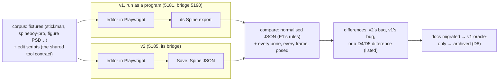
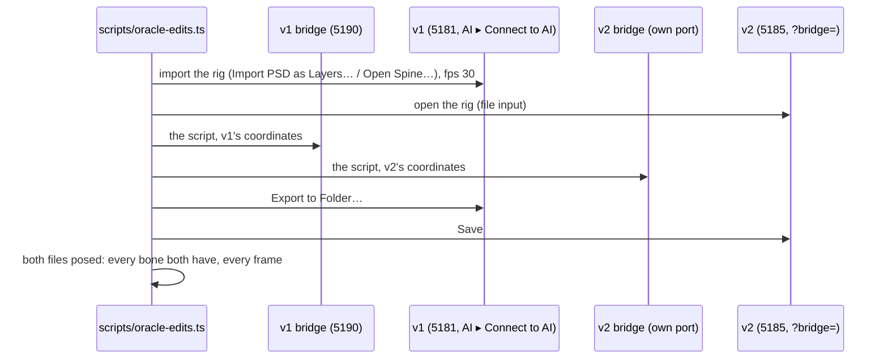
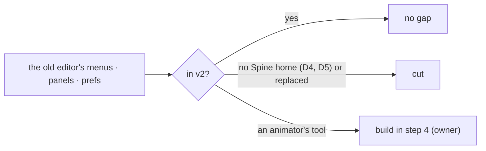
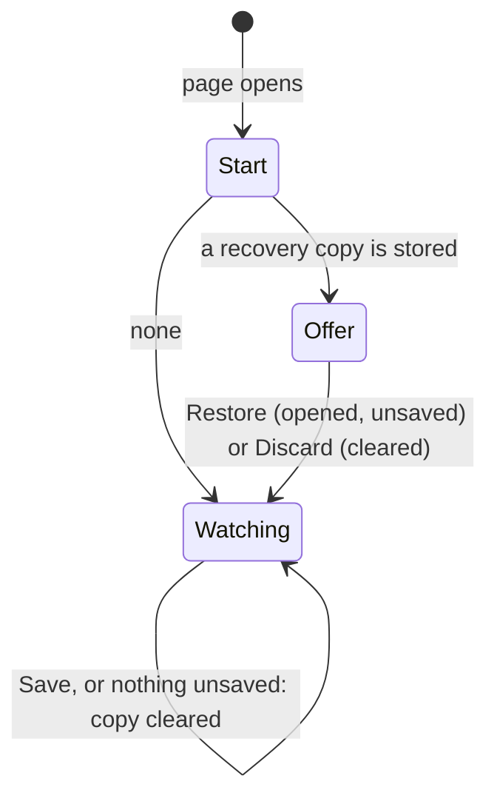
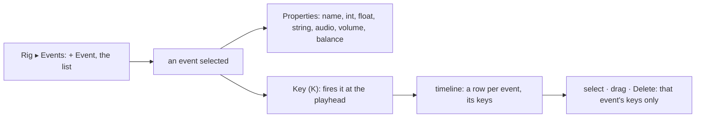
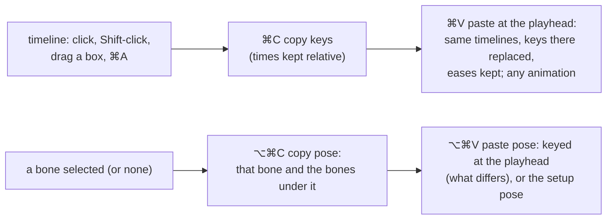
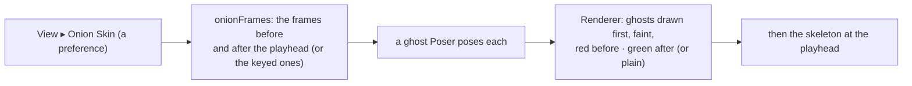
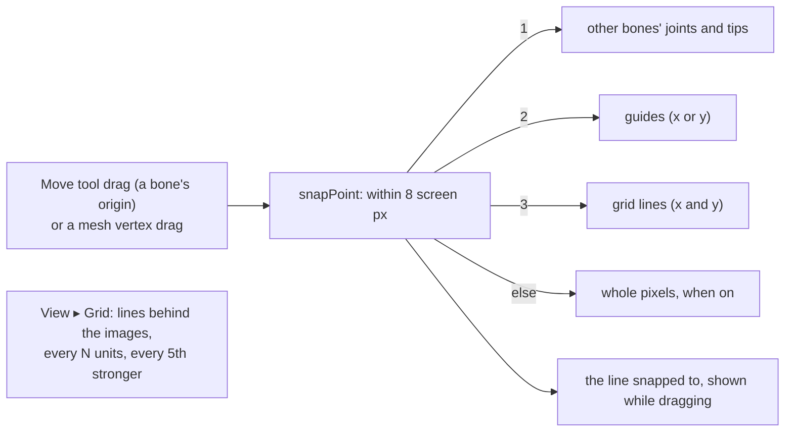

# E6 — parity with the old editor, then cutover — plan

**Status:** in progress, 2026-10-06. Step 1 (the oracle harness, round-trip parity) done: v2 writes
all 17 corpus rigs back exactly; the old editor changes every one, and poses one differently.
Step 2 (edit-script parity) done: both scripts agree once each known difference is taken out
(0.007 and 0 px); `set_keys`' named eases now are version 1's curves. Step 3 (the gap list) done: walked in the old editor, decided by the owner. Step 4 (the gaps
chosen, built in v2) in progress: 4a (autosave and recovery) done; 4b (events on the
timeline) done; 4c (copy and paste, multiple selection) done; 4d (onion skin) done; 4e (snapping and a grid) done; 4f (the weight brush) next. 4h (the axes) moved to the other
session (its owner's request; the Shear tool was already there).

E6 makes v2 the editor people use. The old editor (`../../Animation-BoneBurst-Src/`, AGPL, the
Animo fork) is the **behavioural oracle**: it is run, never read, and v2 has to agree with it on
the same rigs, the same edits and their exports. Then the docs move to v2, the fork becomes
oracle-only, and later it is archived. It is **done when** v2 is the daily driver and the fork
takes no new features (`../../Animation-BoneBurst-Src/docs/EDITOR-V2-PLAN.md` ▸ E6).

## Decisions

- **Clean room, unchanged.** v1 is run (its dev server, its bridge, its exports) and its outputs
  compared; its sources and `docs/ARCHITECTURE.md` stay closed. Where v1 and v2 differ, the
  answer comes from Spine's format and our own specs, never from reading how v1 did it.
- **What "same exports" means.** Byte equality is reported but not required: v1 and v2 write
  numbers and key order their own ways. Required: the two files are equal after E1's
  normalisation (key times as float32, nonessential fields, number formatting), and the runtime
  poses every bone at every frame of every animation within 0.01 pixels. Each difference is
  either fixed (in v2; in v1 only when v1 is wrong and the fix is data-format work, D1) or
  recorded as following from D4 or D5 (v2 is Spine-native; the contract is versioned).
- **Driving both.** The shared tool contract is the script language: an edit script is a list of
  tool calls, run on v1 through its bridge and on v2 through its own, with the calls whose
  meaning changed (the version note) written once per editor. UI-only features are compared by
  hand on screen, listed.
- **The gap list.** What v1 does that v2 does not, from running v1 (its menus, panels and
  tools), each item decided: build in v2, or cut (a feature nobody here uses is not ported,
  EDITOR-V2-PLAN ▸ Risks). E4's parked weight brush and guide snapping are on it.
- **Cutover is the owner's.** v2 becoming the daily driver, the fork's status changing, and how it
  is archived (D8: e.g. a final tag and the folder removed from `main`, its history kept readable,
  which also keeps AGPL's source offer) are asked when their step comes, not assumed.

## Steps

1. **The oracle harness and round-trip parity.** v1 started and driven in Playwright beside v2;
   each fixture opened in both and exported unchanged; the two exports compared as above.
   Kept as a script (not in `npm run check`, which must not depend on the fork existing).
2. **Edit-script parity.** The owner's flow (`auto_rig` → `apply_motion`) and a keyed walk run on
   both through their bridges; exports compared.
3. **The gap list**, walked in v1 on screen, each item decided (asked where it is a judgement).
4. **The gaps chosen**, built in v2 (the weight brush and guide snapping among them, if kept).
5. **Docs migrated**: the pipeline docs, the import package's mention of the editor's Export to
   Unity, the root `CLAUDE.md`; v2's own `README.md` (running it, connecting an AI).
6. **Cutover** (owner): v2 the daily driver; MCP client settings pointing at v2's bridge; the
   fork's `CLAUDE.md` saying oracle-only.
7. **Archive** (owner, D8).

## Step 1 results

1. `scripts/oracle-parity.ts` (`npx vite-node scripts/oracle-parity.ts [filter]`): starts either
   dev server if it is not up; in Playwright's own browser (a fresh profile, so neither editor's
   saved work is touched), opens each rig in the old editor with **File ▸ Open Spine…** and writes
   it with **Export to Folder…** (the folder picker answered by a recording folder), and in v2
   through its file input and **Save**; compares each export with the source: JSON differences
   (numbers as float32; bones, slots, skins and constraints by name, their order apart), and every
   bone at every frame of every animation (30 fps) in the default skin and up to three others,
   posed by v2's engine (`poseDifference`, as `check_preview`). Writes
   `node_modules/.cache/oracle-parity/report.json` and the old editor's exports beside it, and
   prints the old editor's changes grouped by kind. `scripts/` is now type-checked
   (`build-bvh-motions.ts` needed its optional fields typed; it still writes its data byte for
   byte). A launch entry `editor-v1-oracle` (port 5181) runs the old editor in the app's browser.
2. **Corpus**: the stickman and every sample with a JSON skeleton (17 rigs). The three binary
   samples (`cloud-pot`, `sack`, `snowglobe`: `.skel.bytes`) are left out: v2 opens JSON only
   (D4); on the gap list (step 3).
3. **Results** (2026-10-06):

   | | v2 | the old editor |
   |---|---|---|
   | JSON equal to the source | 17 of 17 | 0 of 17 |
   | posed within 0.01 px | 17 of 17 | 16 of 17 (spineboy-pro: 28.7 px, `hoverboard` frame 8, bone `side-glow1`) |

   What the old editor changes (rigs affected): a new `hash` (17), `spine` written `4.3.0` (16),
   `fps` added (16), key times and curves at float64 rather than float32 (14), the bones
   reordered (13; weighted mesh vertices renumbered with them, 10), keys baked frame by frame
   (12: e.g. 4 rotate keys become 31), `translate` and `scale` split into x and y timelines (4
   and 2), constraint mixes written at their defaults (5), mesh `width`/`height` changed (3),
   attachment keys added or dropped (6), curves dropped from some keys (4).
4. **Read**: "same exports" cannot mean the old editor's bytes: its round trip is lossy (keys
   baked, channels split, order changed), though it poses the same everywhere but one rig. v2's
   round trip is exact, so for unchanged rigs v2 is ahead and nothing in v2 changes. The
   spineboy-pro difference is the old editor's (its export against the source); under D1 it may
   take a fix, but as the fork is going oracle-only it is recorded, not fixed (owner call).

## Step 2 — edit-script parity

The same edits made in both editors through their AI bridges (the shared contract), each result
written out, and the two compared by pose.

### Decisions

- **Scripts**: (a) the owner's flow on the figure PSD: `auto_rig` with the joints, `apply_motion
  idle_front`; (b) a walk keyed with `set_keys` on the stickman (hips, chest, arms, the IK
  targets of the feet, eased). Both use only the flow's tools, whose names and shapes v1 and v2
  share.
- **Coordinates**: v1 places a PSD with its top-left corner at the origin (y up); v2 with its
  bottom centre at the origin. The script's points are v2's; v1 gets them moved by the
  measured offset (+150, −400 for the figure), and the comparison takes the same offset out.
  Spine files open at the same place in both.
- **Frame rate**: v1's documents start at 24 fps, v2's at 30; v1's is set to 30 first, so a
  frame is the same time in both.
- **Compared**: the bones both files have, by name, posed at every frame (30 fps) of the
  animation the script made; within 0.5 px is agreement for a retarget sampled frame by frame,
  within 0.01 for keys given exactly. JSON is not compared (step 1: v1 rewrites its keys).

### Step 2 results

1. `scripts/oracle-edits.ts` (`npx vite-node scripts/oracle-edits.ts [filter]`), on the shared
   `scripts/oracle/editors.ts` (both editors driven, both bridges started as an MCP client starts
   them, `poseGap`; `oracle-parity.ts` moved onto it). v1 is connected with **AI ▸ Connect to AI**;
   its bridge must be on 5190, v2's gets a port of its own.
2. **Found, and fixed in v2**: `set_keys`' named eases were the editor's CSS curves
   (`[0.42, 0, 0.58, 1]` for `inout`); version 1's, measured by running it, have their handles at
   thirds: `in` [⅓, 0, ⅔, ⅓], `out` [⅓, ⅔, ⅔, 1], `inout` [⅓, 0, ⅔, 1]. A flow tool keeps
   version 1's meaning, so the AI's eases are now those (`src/agent/eases.ts`, used by `set_keys`
   and read back by `get_animation`); the editor's own curve buttons keep the CSS curves. Guard:
   `tests/agentKeys.test.ts` (planting the CSS `inout` back fails it; the harness then leaves
   2.6 px on the walk).
3. **Results**, each with its known difference measured, not assumed (the script changes v2's
   result the old editor's way and compares again):

   | script | as made | the known difference | after taking it out |
   |---|---|---|---|
   | figure PSD: `auto_rig` → `apply_motion idle_front` | 1.76 px (thighs) | knees bent the other way: v1 writes `bendPositive: false` for legs drawn straight; v2 bends them forward for the facing (E5 step 5) | 0.007 px |
   | stickman: a walk keyed with `set_keys` into `run` | 18.4 px (head, frame 29) | v1 turns the rig's own keys between equal values into holds, and they stay holds when keyed between; Spine's format has them linear, as v2 keeps them | 0 px |

4. **Also measured, not differences of pose**: the two editors place a PSD at different origins
   (v1 its top-left corner, v2 its bottom centre: v1 = v2 + (150, −400)), and each roots its
   skeleton at its own origin; v1 gives IK target bones a length of 20, v2 of 0; v1 starts a
   document at 24 fps and changing the rate re-times its keys (so the harness sets 30 on the
   empty document before importing). `poseGap` compares tips at the first file's bone lengths.
5. Not in `npm run check` (it needs the old editor's folder); the eases' unit test is.

## Step 3 — the gap list

Walked in the old editor (run in Playwright's browser: every menu, submenu, panel and the
preferences, on the stickman), each item checked against v2's code, not memory.

### In v2 already (no gap)

Open a Spine skeleton with its atlas (v1: Open Spine…), Save, Export to Unity, PSD import and
re-import, undo and redo, the Move, Rotate and Scale tools, auto-keying while posing in an
animation, Fit, the skin picker, rulers and guides, reference images, the rig tree, draw order,
skins, constraints (all five kinds, keyed), mesh editing and weights, bounding boxes and points,
the timeline (keys, eases, play, loop), docking and popouts, preferences, the AI panel and bridge.

### Gaps: an animator's tools (proposed: build, the owner decides)

| v1 has | v2 now | proposal |
|---|---|---|
| Events on the timeline (define, key, see them) | only through the AI tools | build: a Spine feature artists key by hand |
| Copy and paste of keys and poses; selecting several keys or frames (Edit ▸ Copy/Paste, Paste and Overwrite Frames, Select All Frames) | one key at a time | build |
| Onion skin (View ▸ Onion Skin, its options) | none | build |
| Autosave with recovery (Preferences ▸ Files) | none | build: work lost in a crash is the costliest gap |
| The document's frame rate (Properties ▸ FPS) | read, not editable | build (small) |
| Snapping: grid, guides, objects, stage edges, whole pixels; a grid | guides without snapping | build (parked from E4, with the weight brush) |
| A weight brush | weights by number and by bind | build (parked from E4) |
| The curve graph (Graph tab) | curve presets per key | proposed later; **owner: build** |
| A Shear tool; Local, Parent, World axes for the tools | shear by number | proposed later; **owner: build** |
| History panel (the undo list, Revert) | undo and redo | later |
| Keyboard shortcuts sheet (Help) | none | later (small) |

### Cut: no home in Spine's file, or replaced (proposed: cut)

| v1 has | why cut |
|---|---|
| Symbols, groups, masks, the Library, Convert to Symbol, Swap Instance | D4: v2 is Spine-native, no nested symbols |
| Bone paths, the Local Path and World Path panels, Show Bone Paths | D5: dropped from the contract; Spine has no bone paths |
| The Preview panel | v2's stage is the runtime |
| The Poses panel (frames marked for the AI to animate between) | no contract tool uses it in v2; the AI keys with `set_keys` and `apply_motion` |
| Document size and background (Document Settings…) | not in Spine's file; v2 keeps its view in the sidecar |
| Export Spine… (a zip) and Export Settings… | Save and Export to Unity write the files |
| Binary skeletons (`.skel.bytes`) | v2's document is the JSON (D4); BoneBurst bakes JSON |
| Import Images… as loose pictures, New Layer, Bind to Bone | v2 works from an atlas or a PSD; `attach` binds |

### Step 3 results

1. **Owner's decisions, 2026-10-06** (asked once, recorded here):
   - **Build in step 4**, in this order of need: autosave with recovery; events on the
     timeline; copy and paste of keys and poses with multiple selection; onion skin; snapping
     and a grid; the weight brush; the curve graph; a Shear tool with Local, Parent and World
     axes. And the document's frame rate in Properties (small, proposed and kept).
   - **Later** (after cutover, not blocking it): the history panel, the keyboard shortcuts sheet.
   - **Cut, all as listed**: symbols, groups, masks and the Library; bone paths and their
     panels; the Preview panel; the Poses panel; document size and background; the zip export
     and export settings; binary skeletons; loose image import, New Layer, Bind to Bone.
2. The walk: every menu and submenu of the old editor (File, Edit, View with Snap To and Onion
   Skin Options, Modify with Attachments and Draw Order, Window, AI, Help), its panels (Library,
   Tree, Animations, Skins, Sub Tree, Preview, Local and World Path, History, Timeline, Graph,
   Reference, Poses) and its preferences (General, Interface, Stage, Grid & Rulers, Snapping,
   Selection & Gizmos, Timeline & Onion, Shortcuts), seen in Playwright's browser on the
   stickman; each item looked for in v2's `src/ui`.

## Step 4 — the gaps chosen, built

One sub-step per item, in the owner's order, each with its own decisions, tests and results:
**4a** autosave and recovery · **4b** events on the timeline · **4c** copy and paste of keys and
poses, with multiple selection · **4d** onion skin · **4e** snapping and a grid · **4f** the weight
brush · **4g** the curve graph · **4h** a Shear tool with Local, Parent and World axes · **4i** the
document's frame rate. Each item is built from Spine's format and v2's own model; the old editor
is run to see what the feature does for an artist, never read.

### 4a — autosave and recovery

#### Decisions

- **What is kept**: one recovery copy for the browser (as the old editor: "a single recovery copy
  inside this browser"): the skeleton as Spine JSON, its atlas text and pages (exact pixels, as
  PNG), the sidecar, the name, the time, and whether the atlas was made by the editor (a PSD
  import not saved yet), so a restored rig saves its atlas and pages as the original would have.
  Kept in IndexedDB (pages are too big for `localStorage`); the editor's one database
  (`ui/idb.ts`) holds it beside Export to Unity's folder.
- **When**: every N seconds (Preferences: on by default, 30 s, 5–600) while the document is
  unsaved and has changed since the last copy; and when the page is hidden or closed. Saving, or
  nothing left unsaved, clears it. The undo history is not kept: a restored rig starts a new one.
- **Offered back**: when the editor opens and a copy is there, a bar under the toolbar says what
  and when, with **Restore** and **Discard**. Until one is chosen, nothing writes over the copy
  (a file opened meanwhile is not autosaved yet).
- **Restored**: through the same open path as files (`Session.open`), then marked unsaved.

#### Steps

1. `ui/idb.ts` (Export to Unity moved onto it), `ui/recovery.ts` (the record, the files it
   opens as, the autosaver), the preferences, the bar; `Session.restore`.
2. Tests: the record's files picked as an opened rig's; the preferences' range; a browser test
   (an edit, the copy written, a reload, Restore gives the edit back unsaved; Save clears it;
   Discard clears it; a PSD rig restored saves its atlas and pages).

#### 4a results

1. `src/ui/idb.ts` (the editor's one database, version 2: `handles` for Export to Unity's folder,
   moved onto it, and `recovery`); `src/ui/recovery.ts` (`RecoveryRecord`, `recordOf`,
   `sourcesOf`, `Autosaver`); `Session.restore`; Preferences: **Keep a recovery copy of unsaved
   work**, **Every (seconds)** (on, 30, 5–600); the bar under the toolbar, **Restore** /
   **Discard**.
2. **Found while testing**: after a reload, Restore and Save, the copy stayed: the autosaver
   cleared only copies it had written itself. It now treats a copy from before the page as its
   own to clear once nothing is unsaved, and starts paused until the browser has been asked for
   an older copy, so a document opened in that moment cannot clear one not yet offered.
3. Tests: `tests/recovery.test.ts` (2: a record's files are picked as an opened rig's);
   `tests/preferences.test.ts` (the new values and their range); `e2e/recovery.spec.ts` (nothing
   kept while nothing is unsaved; an edit kept within the interval; a reload offers it; Restore
   gives it back unsaved; Save clears the copy; Discard clears it; the figure PSD restored still
   saves its atlas and page). Three planted faults fail it (Restore marking the rig saved; a copy
   from before the page never cleared; the restored PSD's atlas not written by Save).
4. **Not kept**: the undo history (a restored rig starts a new one), and reference pictures (the
   sidecar keeps where they go; their files are reopened as before).
5. Another session was building the editor's menu bar, activity bar and stage tool strip in the
   same working tree while this ran; nothing of theirs is in this step's changes.

### 4b — events on the timeline

Today v2 keys events only through the AI tools, and the timeline shows all of an animation's
events as one row, where two events on one frame are one diamond.

#### Decisions

- **Defining**: the Rig panel gets an **Events** tab (the skeleton's events, in file order):
  **+ Event** names a new one; selecting one shows it in Properties (name, the values it carries:
  int, float, string, and audio with volume and balance); Delete removes it and its keys
  (`edit/events.ts` already does each).
- **Keying**: with an event selected, the timeline's **Key** (K) fires it at the playhead, as Key
  does for a bone. An event already firing there is not keyed twice.
- **Seeing**: one timeline row per event (in the skeleton's order), not one for all; clicking its
  name selects the event. Its keys select, drag and delete like any key, and only that event's:
  a key reference carries the event's name (`KeyRef.name`), so two events on one frame are two
  keys. Several events may share a frame (Spine allows it), so moving onto another event's frame
  is allowed.
- **Not in this step**: per-key value overrides (the AI's `key_event` sets them), and showing an
  event's name on the stage as playback passes it.

#### Steps

1. `edit/keys.ts` (`KeyRef.name`), `ui/timeline/layout.ts` (rows per event), the session's
   `event` selection, the Rig panel's Events tab, the Properties form, Key for an event.
2. Tests: the edits (two events on a frame, one moved, one deleted), the rows; a browser test
   (define, key at a frame, see the row, drag, delete).

#### 4b results

1. **Rig ▸ Events** (`ui/panels/outline.ts`): the skeleton's events, each with how often the shown
   animation fires it; **+ Event**; Delete removes the event and its keys. **Properties ▸ Event**
   (`ui/panels/inspector.ts`): name (renames its keys too), int, float, string, audio, and volume
   and balance once it has audio; where the shown animation fires it. `defineEvent` now takes
   `undefined` to remove a value (back to its default).
2. **Timeline**: a row per event (`ui/timeline/layout.ts`, the flag icon, Lucide `flag` vendored at
   the pinned commit); its label selects the event; **Key** (K) fires the selected event at the
   playhead (`Timeline.keySelected`; an event already firing there is not keyed twice).
   `KeyRef.name` (`edit/keys.ts`) makes a selection, a drag and a delete take only that event's
   keys; an event may move onto another's frame.
3. Tests: `tests/eventsTimeline.test.ts` (2: the rows and their marks; delete and move one of two
   events on a frame); `e2e/events.spec.ts` (define in the Rig panel, a value in Properties, Key
   at frame 5, a second event on that frame, drag one to frame 8, delete the other). Three
   planted faults fail them (refs ignoring the event's name; Key not firing a selected event;
   marks without names).
4. Not built here (as planned): per-key overrides (the AI's `key_event` sets them), and showing a
   fired event on the stage during playback.
5. `edit/keys.ts` and `ui/timeline/layout.ts` landed in 3f9f3af (the other session's Auto Key
   commit, made before the two sessions agreed to stage only their own changes).

### 4c — copy and paste of keys and poses, with multiple selection

#### Decisions

- **Selecting keys**: as now (click, Shift-click), plus a box dragged over the track (a press on
  empty track that moves more than a few pixels; a plain click still moves the playhead and
  clears), Shift-box adding to the selection, and **Select All Keys** (⌘A) for the shown animation.
- **Copy and paste keys** (⌘C, ⌘V; Edit menu): the selected keys with their times relative to the
  first; pasted with the first at the playhead, onto the same timelines (by bone, slot,
  constraint or event name), in the shown animation, which may be another one. A key already on
  a pasted frame is replaced; an event is added beside other events on its frame. Eases come
  along as shapes and fit the new interval; a hold stays a hold. Timelines whose owner the rig
  does not have are skipped, and the status says which. One undo step.
- **Copy and paste a pose** (⌥⌘C, ⌥⌘V, as the old editor's Copy and Paste Properties): the
  selected bone and the bones under it (every bone with none selected, or the root), their local
  pose at the playhead; pasted onto the bones of the same names: in an animation, keyed at the
  playhead for each property that differs from what is there; in the setup pose, set. One undo
  step.
- **The clipboard** is the page's own (one for keys, one for a pose), not the system's: nothing
  to grant, and a key's meaning needs the rig anyway.

#### Steps

1. `edit/paste.ts` (copy and paste of keys and poses, pure), `ui/clipboard.ts`, the timeline's box
   and ⌘A, the Edit menu and shortcuts.
2. Tests: the edits (relative times, replacing, eases refitted, events beside, unknown owners
   skipped; a pose keyed where it differs, set in setup); a browser test.

#### 4c results

1. `src/edit/paste.ts` (`copyKeys`, `pasteKeys`, `pastePose`), `src/ui/clipboard.ts` (the page's
   two clips; `copyPose`, `pastePoseHere`), the timeline's box selection (a press on empty track
   that moves 4 px; a click still moves the playhead and clears), `selectAll`, `copySelected`,
   `paste` (the pasted keys come back selected); the Edit menu (Copy Keys ⌘C, Paste Keys ⌘V,
   Select All Keys ⌘A, Copy Pose ⌥⌘C, Paste Pose ⌥⌘V) and their shortcuts in `app.ts` (agreed
   with the other session, which was not editing it).
2. Tests: `tests/paste.test.ts` (3: spacing kept, a key replaced, the ease's shape refitted to its
   new interval, in another animation; an event beside another on its frame; an owner the rig
   lacks skipped and named; a pose keyed only where it differs, and set as the setup pose);
   `e2e/copyPaste.spec.ts` (a box over a row's first keys, ⌘C, ⌘V at frame 20 with the spacing,
   one ⌘Z; ⌘A; the head's pose copied from `run` frame 3 and pasted into `dance` frame 10, posed
   exactly so). Four planted faults each fail at least one of them (offsets dropped; eases not
   refitted; a pose keyed where it is the same; the box selecting nothing).
3. **Found while testing**: a box started near a key's diamond grabs the key (the diamond's 6 px
   reach wins); start a box on empty track.

### 4d — onion skin

#### Decisions

- **What**: with an animation shown and the playhead still, the poses at nearby frames drawn
  behind the skeleton, faint, nearer ones stronger. Not while playing (the motion shows itself).
- **Which frames** (Preferences, as the old editor's Onion Skin Options): how many before and
  after (2 and 2 by default, 0–10), every frame or only the frames with keys ("keyed frames
  only"), and colour-coded (past red, future green, as silhouettes) or plain (the images,
  faded). A loop wraps the frames past either end round; otherwise they stop at the ends.
- **Drawn by the stage's renderer**: a pass before the skeleton, each ghost posed by a second
  `Poser` of its own (so the shown pose is not disturbed) and drawn as soon as it is posed;
  clipping as for the skeleton. Colour-coded ghosts use the two-colour tint with light and dark
  both the ghost's colour, which gives a silhouette in that colour.
- **Toggle**: View ▸ Onion Skin, kept as a preference.

#### Steps

1. `ui/stage/onion.ts` (`onionFrames`, pure), the renderer's ghost pass, the stage passing ghosts,
   the preferences and the View menu item.
2. Tests: the frames chosen (counts, ends, loop, keyed only, opacity falloff); a browser test (the
   stage's pixels behind the skeleton change when onion skin is on, and only then).

#### 4d results

1. `src/ui/stage/onion.ts` (`onionFrames`, `ghostsFor`, the ghosts' own `Poser`); the renderer's
   ghost pass (`Renderer.slots`, shared by the ghosts and the skeleton; a colour-coded ghost is a
   silhouette in its colour through the two-colour tint, a plain one the images faded); the stage
   passing the ghosts; Preferences: Onion skin, frames before and after (2, 2; 0–10), keyed frames
   only, colour-coded; **View ▸ Onion Skin**. No ghosts while playing, nor without an animation.
2. Tests: `tests/onion.test.ts` (3: counts, ends, nearer stronger; loop wrapping, the playhead's
   frame never a ghost; keyed frames only, wrapping); `tests/preferences.test.ts` (the ranges);
   `e2e/onion.spec.ts` (on: hundreds of red and green pixels appear on the stage; off: the stage
   pixel for pixel as before). Four planted faults fail them (ghosts posed but not drawn; no
   silhouette colour; no wrap at a loop's ends; ghosts at no opacity).
3. Seen on screen: the stickman's `run` at frame 8 with three ghosts either side, red behind and
   green ahead.
4. The stage, renderer and View-menu lines were agreed with the other session (which was building
   document tabs in `app.ts` and `session.ts` meanwhile).

### 4e — snapping and a grid

#### Decisions

- **What snaps**: a bone's origin dragged with the Move tool (setup pose or animation, keyed as
  ever), and a mesh vertex dragged in mesh mode. The point snaps when within 8 screen pixels of
  a target, each axis on its own: to another bone's joint or tip (both axes; not the dragged
  bone's own, nor those under it, which move with it), else a guide (its axis), else a grid line;
  with **Whole Pixels** on, what did not snap rounds to a whole unit. The line or point snapped to
  is drawn while dragging.
- **Switches** (View menu, kept as preferences): **Grid** (off), **Snapping** (on), and what it
  snaps to: **Snap to Grid**, **Snap to Guides**, **Snap to Bones** (all on), **Snap to Whole
  Pixels** (off). Grid spacing in Preferences (50 units, 1–1000). The old editor's "stage edges
  and centre" has no stage to snap to in v2 (its size was cut in step 3).
- **Grid**: drawn by the renderer behind references and images, lines every spacing, every fifth
  stronger, the axes through the origin strongest.

#### Steps

1. `ui/stage/snap.ts` (`snapPoint`, pure), the stage's Move drag and vertex drag through it, the
   snap lines, the renderer's grid, preferences and View menu.
2. Tests: the snapping rules (each target, priority, radius in screen pixels, axes apart, whole
   pixels); a browser test (a bone dragged near a guide lands on it; with Snapping off it does
   not; the grid draws behind).

#### 4e results

1. `src/ui/stage/snap.ts` (`snapPoint`); the stage's Move drag snapping the bone's origin (the
   bone and those under it are not targets), the mesh vertex drag snapping the vertex, the line
   or joint snapped to drawn while dragging; the renderer's grid pass (behind references and
   images, one screen pixel wide, every fifth line stronger, the axes strongest, spaced out
   when zoomed far out); Preferences: grid spacing (50, 1–1000); View: **Grid**, **Snapping**
   (⇧⌘;), **Snap to Grid / Guides / Bones / Whole Pixels**, all kept as preferences.
2. Tests: `tests/snap.test.ts` (3: a joint first, the reach in screen pixels at the zoom; a guide
   on its axis, then the grid, axes apart; each switch, whole pixels); `tests/preferences.test.ts`;
   `e2e/snap.spec.ts` (the head dragged two pixels short of a guide lands on it; Snapping off, it
   stops short; View ▸ Grid changes the stage's pixels). Four planted faults fail them (the drag
   not snapped; guide axes swapped; the grid not drawn; the reach in units, not pixels).
3. **4h** (Local, Parent and World axes) is now the other session's, at its owner's request; it
   edits the Move drag beside this step's snapping lines, which feed its axis lock.

