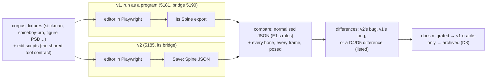

# E6 — parity with the old editor, then cutover — plan

**Status:** in progress, 2026-10-06. Step 1 (the oracle harness, round-trip parity) done: v2 writes
all 17 corpus rigs back exactly; the old editor changes every one, and poses one differently.
Step 2 (edit-script parity) next.

E6 makes v2 the editor people use. The old editor (`../../Animation-BoneBurst-Src/`, AGPL, the
Animo fork) is the **behavioural oracle**: it is run, never read, and v2 has to agree with it on
the same rigs, the same edits and their exports. Then the docs move to v2, the fork becomes
oracle-only, and later it is archived. It is **done when** v2 is the daily driver and the fork
takes no new features (`../../Animation-BoneBurst-Src/docs/EDITOR-V2-PLAN.md` ▸ E6).

## Decisions

- **Clean room, unchanged.** v1 is run (its dev server, its bridge, its exports) and its outputs
  compared; its sources and `docs/ARCHITECTURE.md` stay closed. Where v1 and v2 differ, the
  answer comes from Spine's format and our own specs, never from reading how v1 did it.
- **What "same exports" means.** Byte equality is reported but not required: v1 and v2 write
  numbers and key order their own ways. Required: the two files are equal after E1's
  normalisation (key times as float32, nonessential fields, number formatting), and the runtime
  poses every bone at every frame of every animation within 0.01 pixels. Each difference is
  either fixed (in v2; in v1 only when v1 is wrong and the fix is data-format work, D1) or
  recorded as following from D4 or D5 (v2 is Spine-native; the contract is versioned).
- **Driving both.** The shared tool contract is the script language: an edit script is a list of
  tool calls, run on v1 through its bridge and on v2 through its own, with the calls whose
  meaning changed (the version note) written once per editor. UI-only features are compared by
  hand on screen, listed.
- **The gap list.** What v1 does that v2 does not, from running v1 (its menus, panels and
  tools), each item decided: build in v2, or cut (a feature nobody here uses is not ported,
  EDITOR-V2-PLAN ▸ Risks). E4's parked weight brush and guide snapping are on it.
- **Cutover is the owner's.** v2 becoming the daily driver, the fork's status changing, and how it
  is archived (D8: e.g. a final tag and the folder removed from `main`, its history kept readable,
  which also keeps AGPL's source offer) are asked when their step comes, not assumed.

## Steps

1. **The oracle harness and round-trip parity.** v1 started and driven in Playwright beside v2;
   each fixture opened in both and exported unchanged; the two exports compared as above.
   Kept as a script (not in `npm run check`, which must not depend on the fork existing).
2. **Edit-script parity.** The owner's flow (`auto_rig` → `apply_motion`) and a keyed walk run on
   both through their bridges; exports compared.
3. **The gap list**, walked in v1 on screen, each item decided (asked where it is a judgement).
4. **The gaps chosen**, built in v2 (the weight brush and guide snapping among them, if kept).
5. **Docs migrated**: the pipeline docs, the import package's mention of the editor's Export to
   Unity, the root `CLAUDE.md`; v2's own `README.md` (running it, connecting an AI).
6. **Cutover** (owner): v2 the daily driver; MCP client settings pointing at v2's bridge; the
   fork's `CLAUDE.md` saying oracle-only.
7. **Archive** (owner, D8).

## Step 1 results

1. `scripts/oracle-parity.ts` (`npx vite-node scripts/oracle-parity.ts [filter]`): starts either
   dev server if it is not up; in Playwright's own browser (a fresh profile, so neither editor's
   saved work is touched), opens each rig in the old editor with **File ▸ Open Spine…** and writes
   it with **Export to Folder…** (the folder picker answered by a recording folder), and in v2
   through its file input and **Save**; compares each export with the source: JSON differences
   (numbers as float32; bones, slots, skins and constraints by name, their order apart), and every
   bone at every frame of every animation (30 fps) in the default skin and up to three others,
   posed by v2's engine (`poseDifference`, as `check_preview`). Writes
   `node_modules/.cache/oracle-parity/report.json` and the old editor's exports beside it, and
   prints the old editor's changes grouped by kind. `scripts/` is now type-checked
   (`build-bvh-motions.ts` needed its optional fields typed; it still writes its data byte for
   byte). A launch entry `editor-v1-oracle` (port 5181) runs the old editor in the app's browser.
2. **Corpus**: the stickman and every sample with a JSON skeleton (17 rigs). The three binary
   samples (`cloud-pot`, `sack`, `snowglobe`: `.skel.bytes`) are left out: v2 opens JSON only
   (D4); on the gap list (step 3).
3. **Results** (2026-10-06):

   | | v2 | the old editor |
   |---|---|---|
   | JSON equal to the source | 17 of 17 | 0 of 17 |
   | posed within 0.01 px | 17 of 17 | 16 of 17 (spineboy-pro: 28.7 px, `hoverboard` frame 8, bone `side-glow1`) |

   What the old editor changes (rigs affected): a new `hash` (17), `spine` written `4.3.0` (16),
   `fps` added (16), key times and curves at float64 rather than float32 (14), the bones
   reordered (13; weighted mesh vertices renumbered with them, 10), keys baked frame by frame
   (12: e.g. 4 rotate keys become 31), `translate` and `scale` split into x and y timelines (4
   and 2), constraint mixes written at their defaults (5), mesh `width`/`height` changed (3),
   attachment keys added or dropped (6), curves dropped from some keys (4).
4. **Read**: "same exports" cannot mean the old editor's bytes: its round trip is lossy (keys
   baked, channels split, order changed), though it poses the same everywhere but one rig. v2's
   round trip is exact, so for unchanged rigs v2 is ahead and nothing in v2 changes. The
   spineboy-pro difference is the old editor's (its export against the source); under D1 it may
   take a fix, but as the fork is going oracle-only it is recorded, not fixed (owner call).

