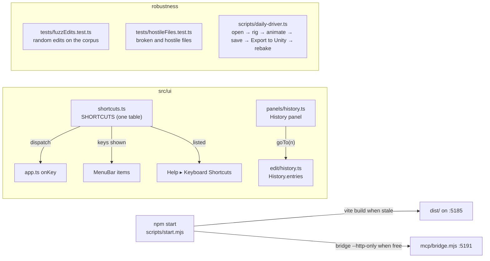

# E7 — the daily driver: history, shortcuts, a build, a robustness pass — plan

**Status:** in progress, 2026-10-06; step 1 (the History panel) done. Scope chosen by the owner:
the History panel and the shortcuts sheet (set aside at E6 step 3), running without the dev
server, and a robustness pass.
Not in E7: the AnimatedDrawings detection sidecar (waits on the owner's install decision).

E6 made v2 the editor in use, but it still runs as a developer runs it: `npm run dev`, shortcuts
only discoverable from menus, undo only one step at a time. E7 makes it an artist's daily
driver: every step visible and reachable, every shortcut listed, one command to start it, and
the edits, files and the Unity hand-off shaken until they stop breaking.

## Decisions

- **One table of shortcuts.** Today the keys live in `onKey`'s `if` chain, again as text in the
  menus, and nowhere as a list. E7 puts every shortcut in one table (`src/ui/shortcuts.ts`): its
  id, the keys as shown, what it does, its group, and how a key event matches it. `onKey`
  dispatches from the table to a handler map whose type requires a handler for every id, so a row
  without a handler, or a handler without a row, does not compile. The menus read their `keys`
  text from the table. The sheet lists the table. Nothing about which key does what changes.
- **The sheet** is Help ▸ Keyboard Shortcuts (and `?`): a modal list by group, searchable, closed
  with Escape. A dialog, not a panel: it is looked at, not worked in.
- **The History panel** is a Dockview panel (`history`, reserved in `panelIds.ts`): the undo
  steps by label, oldest first, the current one marked, the redo steps greyed after it. A click
  goes to that step (repeated undo or redo: one history, no branches, nothing lost until a new
  edit). `History` gains `entries` (labels, and the current index) and `goTo(index)`; no other
  change to how it records. The 500-step limit stays, and the panel says when older steps were
  dropped.
- **Running without the dev server.** `npm start` (`scripts/start.mjs`, Node only, no new
  dependency): builds `dist/` when any source is newer than it, serves it on `localhost:5185`
  (the same origin as the dev server, so preferences, layouts, recovery copies and folder
  permissions carry over) with a small static server, and starts the bridge `--http-only` for Ask
  AI and the AI button when port 5191 is free (a Claude Code session may already hold it, from
  `.mcp.json`). The dev-only helpers (`window.boneburst`, the fixture buttons) stay out of the
  build, as now.
- **Code-split** so the main chunk is under Vite's 500 kB warning: the parts an artist does not
  need at start load when first used (the PSD reader, the AI panel's chat, the curve graph's and
  the weight brush's code if they weigh). Measured before and after; the warning gone from
  `npm run build`.
- **The browser tests run against the build too.** A second Playwright project serves `dist/`
  through `scripts/start.mjs`'s server; a smoke set (open, edit, undo, save, export) runs there,
  so a build-only break (a dynamic import, a path that only the dev server serves) fails.
- **Robustness, three ways**, each finding fixed in v2 with a test that failed before the fix:
  1. **Edits fuzzed**: random sequences of the edit layer's own edits (bones, slots, keys,
     constraints, skins, meshes, weights, paste, frame rate) on every corpus rig, seeded and
     reproducible. Invariants after each step: the document passes `profileIssues`, writes and
     reads back to itself, poses without throwing, and undo of the whole sequence returns the very
     first document.
  2. **Hostile files**: truncated JSON, wrong types, missing parents, cycles, absurd sizes,
     duplicate names, an atlas that names missing pages, a PSD that is not one. Each opens with an
     issue said, or is refused with a reason; none throws to the console or hangs.
  3. **The daily driver end to end**: a Playwright script does what the owner does (open a PSD,
     auto-rig, key a walk, save, reopen, Export to Unity into a folder under `Assets/`), then the
     live Unity Editor rebakes it (`unity` CLI) and its bake is checked by reading it, not by
     looking (root `CLAUDE.md`: capture only through Unity). When no Unity Editor answers, that
     step is reported as not run, never as passed.

## Steps

1. **The History panel**: `History.entries` / `goTo`; `panels/history.ts`; Window menu and the
   activity bar; tests (`tests/history.test.ts` extended, `e2e/historyPanel.spec.ts`).
2. **The shortcuts table and sheet**: `src/ui/shortcuts.ts`, `onKey` dispatching from it, menus
   reading it, Help ▸ Keyboard Shortcuts; tests (`tests/shortcuts.test.ts`: no two rows match the
   same key event; every menu `keys` text is a row's; `e2e/shortcutsSheet.spec.ts`).
3. **Running without the dev server**: `scripts/start.mjs`, `npm start`; code-splitting; the
   build's Playwright project; README.
4. **Edits fuzzed** (`tests/fuzzEdits.test.ts`), and the fixes.
5. **Hostile files** (`tests/hostileFiles.test.ts`, a browser test for the PSD path), and the
   fixes.
6. **The daily driver end to end** (`scripts/daily-driver.ts`), with Unity, and the fixes.
7. **Close**: the charter's E7 row, README, SPEC where the shape changed, status.

## Step 1 results

1. `History` (`src/edit/history.ts`): `entries` (the labels, oldest first: the done steps, then
   the undone ones in redo order; `done`; `dropped`, the steps the limit let go of, now counted)
   and `goTo(done, step)`, which undoes or redoes one step at a time and calls `step` after each.
   Nothing else in how it records changed. `Session.goToStep` follows each step as the buttons do,
   so a jump across a PSD re-import takes the matching atlas with it: `followReimports` only
   recognises the documents right before and after a re-import, so a direct jump past one would
   have kept the wrong pages.
2. The panel (`src/ui/panels/history.ts`): "Opened name.json" (or how many older steps the limit
   let go), then each step; the current step marked (`aria-current`), the redo steps greyed; a
   click goes there. Rebuilt only when the steps or the position change. Registered as the
   `history` panel, tabbed behind the Rig panel by default (the default layout looks as before),
   in the Window menu and on the activity bar; Lucide's `rotate-ccw-clock` (its history icon at the
   pinned commit) vendored.
3. Tests: `tests/history.test.ts` (5 new: the list, going to any step through every step between,
   refusals, a new edit dropping the redo steps, the dropped count); `e2e/historyPanel.spec.ts`
   (the steps listed; back, to the start, forward; the toolbar's Undo agreeing; a new edit
   dropping the steps after). Planted faults, each caught: the redo labels not reversed; `goTo`
   not calling `step` on undo; the dropped count not kept; the panel's rows off by one.
4. `npm run check`: vitest 468 pass; the browser tests 13 of 14 at first, the failing one being
   `e2e/onion.spec.ts`, failing the same on a clean export of HEAD. The other session traced it:
   not the renderer (its framebuffer identical before and after) but the element screenshot the
   test compared, which goes through the compositor and moved by one level on 12 pixels since
   the Rig panel's search row (`overflow-y: auto` on `.outline .rows`). Its fix, reading the
   canvas's own pixels, landed in that session's commits; with it the test passes, the exact
   comparison kept. Then `npm run check`: 468 vitest, 14 browser tests, all pass.