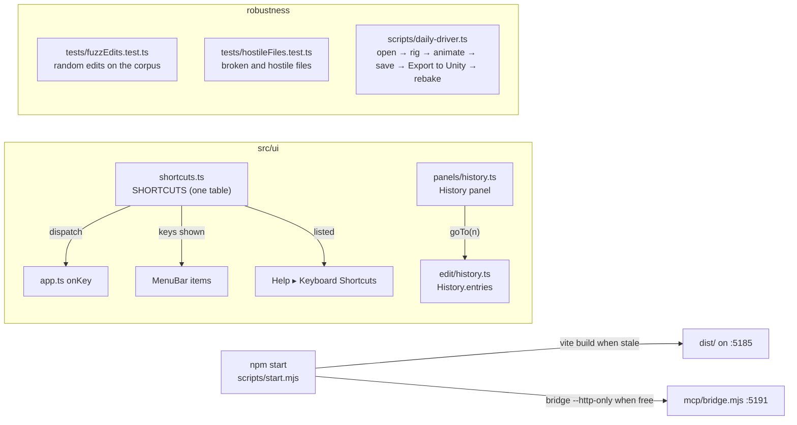
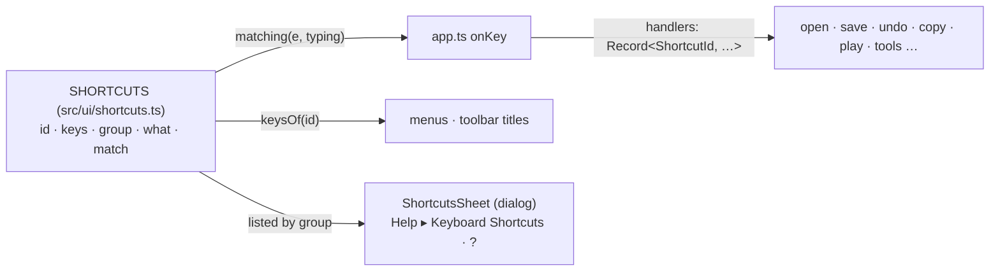
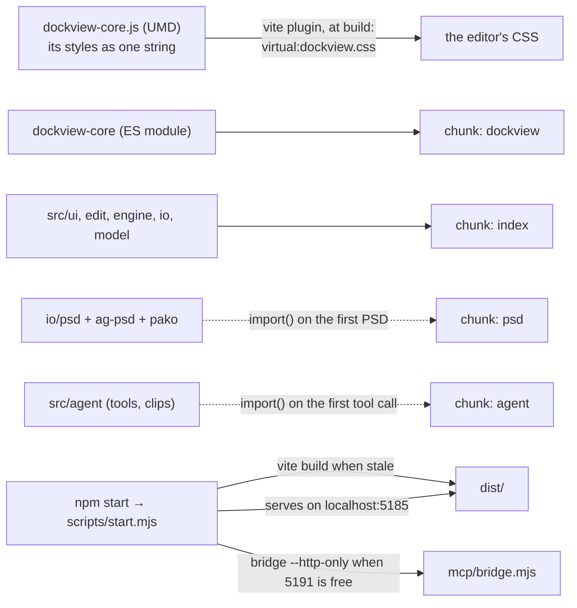
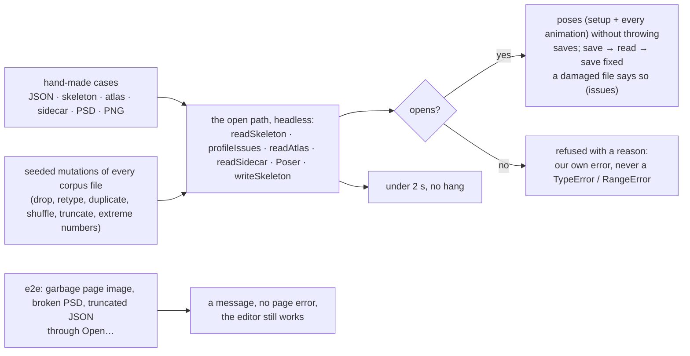
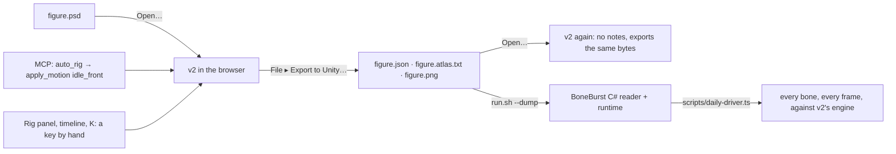
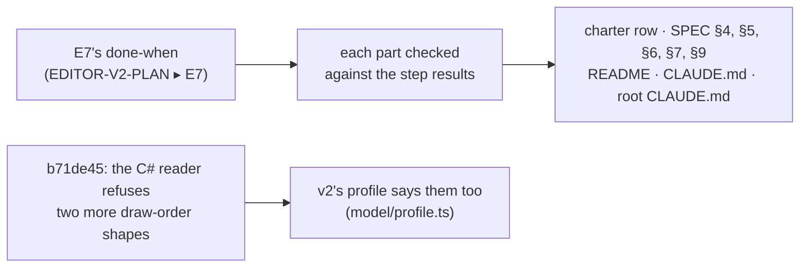

# E7 — the daily driver: history, shortcuts, a build, a robustness pass — plan

**Status:** **done**, 2026-10-06. All seven steps: the History panel; one shortcuts table, its
sheet and the menus reading it; `npm start` with a split build; edits fuzzed (seven findings fixed,
among them weighted meshes that bone edits had silently rebound since E4; one, NaN poses from
degenerate constraints, is the C# runtime's own behaviour); hostile files (seven findings fixed,
two in the C# reader handed on and since fixed there); the owner's flow end to end, its export
posed by BoneBurst's C# runtime as v2 poses it. Not run: the asset bake in the Unity Editor (the
owner's choice at step 6). Not in E7: the AnimatedDrawings detection sidecar.

E6 made v2 the editor in use, but it still runs as a developer runs it: `npm run dev`, shortcuts
only discoverable from menus, undo only one step at a time. E7 makes it an artist's daily
driver: every step visible and reachable, every shortcut listed, one command to start it, and
the edits, files and the Unity hand-off shaken until they stop breaking.

## Decisions

- **One table of shortcuts.** Today the keys live in `onKey`'s `if` chain, again as text in the
  menus, and nowhere as a list. E7 puts every shortcut in one table (`src/ui/shortcuts.ts`): its
  id, the keys as shown, what it does, its group, and how a key event matches it. `onKey`
  dispatches from the table to a handler map whose type requires a handler for every id, so a row
  without a handler, or a handler without a row, does not compile. The menus read their `keys`
  text from the table. The sheet lists the table. Nothing about which key does what changes.
- **The sheet** is Help ▸ Keyboard Shortcuts (and `?`): a modal list by group, searchable, closed
  with Escape. A dialog, not a panel: it is looked at, not worked in.
- **The History panel** is a Dockview panel (`history`, reserved in `panelIds.ts`): the undo
  steps by label, oldest first, the current one marked, the redo steps greyed after it. A click
  goes to that step (repeated undo or redo: one history, no branches, nothing lost until a new
  edit). `History` gains `entries` (labels, and the current index) and `goTo(index)`; no other
  change to how it records. The 500-step limit stays, and the panel says when older steps were
  dropped.
- **Running without the dev server.** `npm start` (`scripts/start.mjs`, Node only, no new
  dependency): builds `dist/` when any source is newer than it, serves it on `localhost:5185`
  (the same origin as the dev server, so preferences, layouts, recovery copies and folder
  permissions carry over) with a small static server, and starts the bridge `--http-only` for Ask
  AI and the AI button when port 5191 is free (a Claude Code session may already hold it, from
  `.mcp.json`). The dev-only helpers (`window.boneburst`, the fixture buttons) stay out of the
  build, as now.
- **Code-split** so the main chunk is under Vite's 500 kB warning: the parts an artist does not
  need at start load when first used (the PSD reader, the AI panel's chat, the curve graph's and
  the weight brush's code if they weigh). Measured before and after; the warning gone from
  `npm run build`.
- **The browser tests run against the build too.** A second Playwright project serves `dist/`
  through `scripts/start.mjs`'s server; a smoke set (open, edit, undo, save, export) runs there,
  so a build-only break (a dynamic import, a path that only the dev server serves) fails.
- **Robustness, three ways**, each finding fixed in v2 with a test that failed before the fix:
  1. **Edits fuzzed**: random sequences of the edit layer's own edits (bones, slots, keys,
     constraints, skins, meshes, weights, paste, frame rate) on every corpus rig, seeded and
     reproducible. Invariants after each step: the document passes `profileIssues`, writes and
     reads back to itself, poses without throwing, and undo of the whole sequence returns the very
     first document.
  2. **Hostile files**: truncated JSON, wrong types, missing parents, cycles, absurd sizes,
     duplicate names, an atlas that names missing pages, a PSD that is not one. Each opens with an
     issue said, or is refused with a reason; none throws to the console or hangs.
  3. **The daily driver end to end**: a Playwright script does what the owner does (open a PSD,
     auto-rig, key a walk, save, reopen, Export to Unity into a folder under `Assets/`), then the
     live Unity Editor rebakes it (`unity` CLI) and its bake is checked by reading it, not by
     looking (root `CLAUDE.md`: capture only through Unity). When no Unity Editor answers, that
     step is reported as not run, never as passed.

## Steps

1. **The History panel**: `History.entries` / `goTo`; `panels/history.ts`; Window menu and the
   activity bar; tests (`tests/history.test.ts` extended, `e2e/historyPanel.spec.ts`).
2. **The shortcuts table and sheet**: `src/ui/shortcuts.ts`, `onKey` dispatching from it, menus
   reading it, Help ▸ Keyboard Shortcuts; tests (`tests/shortcuts.test.ts`: no two rows match the
   same key event; every menu `keys` text is a row's; `e2e/shortcutsSheet.spec.ts`).
3. **Running without the dev server**: `scripts/start.mjs`, `npm start`; code-splitting; the
   build's Playwright project; README.
4. **Edits fuzzed** (`tests/fuzzEdits.test.ts`), and the fixes.
5. **Hostile files** (`tests/hostileFiles.test.ts`, a browser test for the PSD path), and the
   fixes.
6. **The daily driver end to end** (`scripts/daily-driver.ts`), with Unity, and the fixes.
7. **Close**: the charter's E7 row, README, SPEC where the shape changed, status.

## Step 1 results

1. `History` (`src/edit/history.ts`): `entries` (the labels, oldest first: the done steps, then
   the undone ones in redo order; `done`; `dropped`, the steps the limit let go of, now counted)
   and `goTo(done, step)`, which undoes or redoes one step at a time and calls `step` after each.
   Nothing else in how it records changed. `Session.goToStep` follows each step as the buttons do,
   so a jump across a PSD re-import takes the matching atlas with it: `followReimports` only
   recognises the documents right before and after a re-import, so a direct jump past one would
   have kept the wrong pages.
2. The panel (`src/ui/panels/history.ts`): "Opened name.json" (or how many older steps the limit
   let go), then each step; the current step marked (`aria-current`), the redo steps greyed; a
   click goes there. Rebuilt only when the steps or the position change. Registered as the
   `history` panel, tabbed behind the Rig panel by default (the default layout looks as before),
   in the Window menu and on the activity bar; Lucide's `rotate-ccw-clock` (its history icon at the
   pinned commit) vendored.
3. Tests: `tests/history.test.ts` (5 new: the list, going to any step through every step between,
   refusals, a new edit dropping the redo steps, the dropped count); `e2e/historyPanel.spec.ts`
   (the steps listed; back, to the start, forward; the toolbar's Undo agreeing; a new edit
   dropping the steps after). Planted faults, each caught: the redo labels not reversed; `goTo`
   not calling `step` on undo; the dropped count not kept; the panel's rows off by one.
4. `npm run check`: vitest 468 pass; the browser tests 13 of 14 at first, the failing one being
   `e2e/onion.spec.ts`, failing the same on a clean export of HEAD. The other session traced it:
   not the renderer (its framebuffer identical before and after) but the element screenshot the
   test compared, which goes through the compositor and moved by one level on 12 pixels since
   the Rig panel's search row (`overflow-y: auto` on `.outline .rows`). Its fix, reading the
   canvas's own pixels, landed in that session's commits; with it the test passes, the exact
   comparison kept. Then `npm run check`: 468 vitest, 14 browser tests, all pass.
## Step 2 — the shortcuts table and sheet

### Decisions

- **A row is data plus a match**: `{ id, keys, group, what, chord }`. `chord` describes the key
  event: ⌘ (⌘ or Ctrl), ⌥ and ⇧ each required, refused, or either, plus `e.key` or `e.code` (`e.code`
  where ⌥ changes `e.key`, as today). The defaults are what `onKey` does now: a key without ⌘
  needs ⌥ up and takes either ⇧; `whileTyping` marks the three that work in a text field (⌘O, ⌘S,
  ⌘,).
- **Order and fall-through kept.** `onKey` walks the rows in table order. A handler returns false
  when it does not apply (⌘A with no animation, `[` and `]` with the brush off), and the walk goes
  on as the `if` chain did. Delete is one row whose handler tries the timeline, the stage's vertex,
  then the rig panel, in that order. The one change: every handled key now calls `preventDefault`
  (before, F, K, the tools and the brush keys did not; none of them has a browser default that
  matters outside a text field), except Escape (`keepDefault`), on which a dialog closes.
- **Completeness by type**: `ShortcutId` is the union of the table's ids, and the handler map is a
  `Record<ShortcutId, …>`, so a row without a handler, or a handler without a row, does not
  compile. The tool keys come from the same table (one row per tool), and so does `TOOLS`' key text.
- **Menus and titles read the table** (`keysOf(id)`); a test checks `app.ts` writes no key text of
  its own (`keys: "…"`, or ⌘/⇧/⌥ inside a title).
- **The sheet**: a native `<dialog>` like Preferences: groups (File, Edit, View, Tools, Playback,
  Timeline, Stage), each row the keys and what they do, a filter field, Escape or Close to shut.
  Help ▸ Keyboard Shortcuts, and `?` (⇧/), a new row. It lists the table, nothing else.
- **Tests**: `tests/shortcuts.test.ts` (ids unique; no two rows match the same event, for every
  row's own event and its ⇧ variants; the table's matches equal today's `onKey` on a list of
  events; `keysOf` for every id; `app.ts` writes no key text); `e2e/shortcutsSheet.spec.ts` (`?`
  opens it, filter, Escape; a few keys still do what they did).

### Step 2 results

1. `src/ui/shortcuts.ts`: 28 rows (the 27 keys `onKey` handled, ⌘Y included, and `?` for the
   sheet), each with its keys, group, what it does and its chord; `keysOf`, `matches`, `matching`.
   `keepDefault` on Escape (added while building: with `preventDefault` on Escape, a dialog with a
   button focused no longer closed).
2. `app.ts`: `onKey` is a walk over `matching(e, isTyping(e))` into a `Record<ShortcutId, …>` of
   handlers (⌘A and the brush keys decline when they do not apply; Delete tries the timeline, the
   stage's vertex, then the rig panel). `TOOLS` names its row; the menus, the toolbar titles
   (Open, Save, tools, Fit, Preferences, Undo, Redo) and Auto Key's message read `keysOf`. Beyond
   `app.ts`, the key text in titles and messages of `timeline.ts` (Play, Key, To the first frame,
   the copy and paste messages), `clipboard.ts`, `outline.ts`, `inspector.ts` and `stage.ts` reads it
   too: the text check found "To the first frame (Home)", which the plan's list had missed.
3. `src/ui/shortcutsSheet.ts`: the `<dialog>` by group with a filter; Help ▸ Keyboard Shortcuts
   (its `?` shown) and `?`.
4. Tests: `tests/shortcuts.test.ts` (5: unique ids and keys; each row's own event, with ⇧ both ways
   where free, matches only that row; 39 events matched as the old `if` chain did, ⌘⇧C, ⌥W, ⇧W and
   ⌘; among them; in a text field only ⌘O, ⌘S, ⌘,; no key text written outside the table);
   `e2e/shortcutsSheet.spec.ts` (`?` opens it, the groups, the filter, Escape with a button
   focused, the Help menu, then E, ⌘Z and Space doing what they did). Planted faults, each caught:
   Escape's default prevented (the e2e), a tool key taking ⌥, a menu writing "⌘Z" itself, a
   handler missing (does not compile), Undo taking ⇧ too.
5. `npm run check`: 473 vitest and 15 browser tests, all pass.

## Step 3 — running without the dev server

Measured first (the build's source map, bytes per source): one chunk of 1,410 kB, of which
`dockview-core` 535 kB, `ag-psd` 241 kB with `pako` 49 kB, the AI layer (`src/agent`, with the
motion clips) 199 kB, and the rest of the editor about 350 kB. Dockview is that large because the
app loads its UMD build (E4-PLAN D6): the only build that carries its styles, as one JavaScript
string it injects; its ES module (387 kB minified) carries none.

### Decisions

- **Dockview's styles from its own package, at build time.** A small Vite plugin in
  `vite.config.ts` reads the pinned `dockview-core/dist/dockview-core.js`, takes the one CSS string
  it injects, and serves it as the CSS module `virtual:dockview.css`; the app imports the ES module
  and that CSS. Nothing copied or vendored, so an upgrade brings its styles with it; the plugin
  fails the build loudly when it does not find exactly one such string. Dockview copies the page's
  style sheets into a popout window, so popouts get the styles as before (`e2e/popout.spec.ts`).
- **Chunks**: Dockview in its own chunk; the PSD reader (`io/psd`, `ag-psd`, `pako`) loaded by
  `import()` when a PSD is first opened or re-imported; the AI layer (`@/agent/host`, its tools and
  clips) when the bridge first hands the page a tool call. Every chunk under 500 kB; `npm run
  build` without the warning.
- **`npm start`** (`scripts/start.mjs`, Node only): builds `dist/` with Vite when it is missing or
  older than any source (`src/`, `public/`, `index.html`, `vite.config.ts`, `package-lock.json`);
  serves it on `http://localhost:5185` (the dev server's origin, so preferences, layouts, recovery
  copies and the Unity folder's permission carry over); refuses with a reason when the port is
  taken (a dev server running); starts `mcp/bridge.mjs --http-only` when nothing answers on 5191,
  and stops it on exit; opens the browser (`--no-open` not to). The server: files under `dist/`
  only (no path outside it), the types an editor needs, `index.html` not cached and `assets/`
  cached for good (their names change with their content). `--port` and `--no-bridge` for tests.
- **The build has its browser tests**: `playwright.build.config.ts` runs `e2e-build/` against
  `scripts/start.mjs --no-open --no-bridge --port 5186`. The build has no dev hooks
  (`window.boneburst`, the fixture buttons), so the smoke test drives it as a user does: open the
  stickman's three files through Open…, the layout's panels present with Dockview's styles
  applied, an edit and ⌘Z, the History panel, `?`, a PSD opened (the lazy chunk loads), and the AI
  button connecting to a bridge the test starts with a tool call answered (the agent chunk loads).
  `scripts/check.sh` runs it after the dev tests.
- **README**: `npm start` first, `npm run dev` for working on the editor.

### Steps

1. The plugin, the ES module, the chunks; sizes measured again.
2. `scripts/start.mjs`, `npm start`.
3. `playwright.build.config.ts`, `e2e-build/smoke.spec.ts`, `check.sh`.
4. README, CLAUDE.md commands; planted faults (the plugin finding no styles; a lazy import made
   static; the server serving outside `dist/`).

### Step 3 results

1. **Dockview from its ES module**, its styles from `virtual:dockview.css` (`vite.config.ts` ▸
   `dockviewStyles`, reading the pinned package's one injected sheet; `dockview-umd.d.ts` replaced
   by `dockview-styles.d.ts`). All 15 browser tests pass on it, the popout windows' styles among
   them.
2. **Chunks**, measured again: at start `index` 342 kB and `dockview` 357 kB (was one 1,410 kB
   chunk); `psd` 297 kB (`ag-psd`, `pako`) loaded by the first PSD opened or re-imported
   (`Session.openPsd`, `reimportPsd`); `host` 212 kB (the AI layer and its clips) by the first tool
   call (`AiBridge.answer`); `psdImport`, `psdReimport` small. CSS 155 kB (Dockview's 133 kB). No
   warning. `check.sh` now fails on Vite's chunk warning.
3. **`npm start`** (`scripts/start.mjs`): builds when `dist/` is missing or older than `src/`,
   `public/`, `index.html`, `vite.config.ts` or `package-lock.json`; serves `dist/` on localhost:5185
   (`index.html` not cached, `assets/` immutable, correct types, 404 outside `dist/`); refuses a
   taken port with the reason; starts the bridge `--http-only` when 5191 does not answer (its
   origins the server's), stops it on exit; opens the browser. Checked by hand: the headers, a
   path outside `dist/` (raw and encoded) 404, a second start on a taken port refused.
4. **Tests**: `tests/start.test.ts` (the path rule: the page and assets mapped, seven ways out of
   `dist/` refused); `playwright.build.config.ts` and `e2e-build/smoke.spec.ts`, run by `check.sh`:
   on the build, no dev hooks, Dockview's rules present, the stickman opened through Open…, K keys
   hips and the History panel shows it, ⌘Z, `?`, neither lazy chunk asked for until a PSD is opened
   (then `psd`) and the AI button answers a tool call (then `host`), no page error. Planted faults,
   each caught: the plugin finding no styles (the build fails, naming it); the PSD reader imported
   statically (`index` 643 kB, the warning, `check.sh` fails); the server's path rule removed
   (`tests/start.test.ts`).
5. README (`npm start` first), the editor's `CLAUDE.md` (its commands). `npm run check`: 475
   vitest, 15 browser tests, 1 build browser test, all pass.

## Step 4 — edits fuzzed

```mermaid
flowchart LR
    RIG["every corpus rig<br/>(16 samples + the stickman)"] --> H["History(doc)"]
    RNG["seeded PRNG<br/>(rig, seed)"] --> GEN["pick an edit from the doc as it is now<br/>bones · slots · attachments · meshes · weights<br/>skins · constraints · events · animations · keys · fps"]
    GEN -->|"h.apply"| H
    H --> INV["after every step:<br/>no new profile issue · write→read→write fixed ·<br/>poses (setup + an animation) finite · no throw but EditRefused"]
    H -->|"goTo(0), goTo(n)"| UNDO["the very first and last documents"]
```

### Decisions

- **The edits are the edit layer's own**, called as the UI and the AI tools call them, with
  arguments drawn from the document as it is at that step (an existing bone, slot, attachment,
  constraint, animation, key; sometimes a name that does not exist, an empty or odd name, a value
  out of range), so refusals are exercised as much as the edits.
- **What must hold after each step**, the document's own invariants:
  1. no profile issue the starting document did not have (`profileIssues`, the rules the C#
     runtime's reader holds a file to);
  2. writing is a fixed point: `write(read(write(d))) === write(d)`, and reading what was written
     says nothing new;
  3. the setup pose and one animation (a random time) pose without throwing, every bone's matrix
     finite;
  4. anything thrown is an `EditRefused` (said to the user, nothing changed); any other error is a
     bug.
  At the end, `goTo(0)` gives back the very first document and `goTo(n)` the very last (identity).
- **Reproducible**: a failure names the rig, the seed, the step and the edit with its arguments;
  `FUZZ_SEED` and `FUZZ_STEPS` rerun one case or run longer. In `npm run check`: 17 rigs × 2 seeds ×
  60 steps, kept under about 20 s; longer runs by hand.
- **Each finding fixed** in the edit layer (or where it belongs) with a table test of its own that
  fails on the old code; the fuzz test itself stays as the net. The plan lists every finding.

### Steps

1. `tests/fuzzEdits.test.ts`: the generator, the invariants, the corpus.
2. Run long (thousands of steps per rig); triage; fix each finding with its own test.
3. Results here.

### Step 4 results

1. **`tests/fuzzEdits.test.ts`**: 58 edit kinds (every edit the stage, panels, curve graph, weight
   brush and AI tools make, with arguments from the document at that step, refusals included), on
   the 17 corpus rigs; `FUZZ_SEED`, `FUZZ_STEPS`, `FUZZ_RIG`, `FUZZ_STATS` (per kind: applied,
   refused, unchanged), `FUZZ_DUMP` (the documents before and after a failing step). Invariants after
   each step: no new profile issue; write → read → write fixed and the read says nothing; posing does
   not throw; nothing thrown but `EditRefused`; and (added after F3, which none of these saw) every
   weighted attachment the step did not aim at bound to the same bones by name, renames followed. At
   the end, undo to the very first document and redo to the very last. In `npm run check`: 17 rigs ×
   2 seeds × 60 steps, 9 s.
2. **Findings**, each fixed with rows in `tests/fuzzFindings.test.ts` (24) that fail on the old code
   (checked by stashing the fix):
   - **F1** NaN or ±Infinity taken by `updateBone`, `addBone`, `reparentBone`, `updateAttachment`,
     `addRegion`, `addAttachment`, `addConstraint`, `updateConstraint`, `setKey` (value and time),
     `defineEvent`, `keyEvent`, `moveVertex`, `addVertex`: the document could then not be saved.
     Now refused, naming the field (`src/edit/finite.ts` ▸ `refuseNonFinite`).
   - **F2** `bindMesh`/`autoWeights` to a bone whose world matrix has no inverse (a bone of another
     skin, posed as zeros; a bone scaled to zero): NaN binds. Reachable in the editor: Bind on
     hero-pro's mouth with its morningstar bone while the default skin shows. Now refused, saying why.
   - **F3** (the serious one) `addBone`, `reparentBone` and `deleteBone` changed the bone order but
     not the bone indices weighted vertices hold: since E4, adding a bone to a rig with weighted
     meshes silently rebound every mesh bound to a later bone to the wrong bone, and a delete could
     leave an index past the end. Now one function (`withBoneOrder`) remaps every weighted
     attachment (meshes, paths, boxes, clipping) by bone name, and refuses deleting a bone a
     weighted attachment outside the deleted slots is bound to, naming it.
   - **F4** vertex and weight edits on a mesh whose slot bone or bound bones are inactive in the skin
     shown: NaN, or vertices silently at the bone's origin. `frameFor` refuses, and says which skin
     to show.
   - **F5** `autoWeights` crashing on an index past the end: F3's consequence, gone with it.
   - **F6** bones posed to NaN after constraint edits (a path constraint following a path with
     nothing to follow; keys driven to extremes through a slider). Not v2's: BoneBurst's C# runtime
     poses the same bones to NaN on the same files (`run.sh --dump` on the fuzzer's documents:
     8 of 8 bones on mix-and-match; 19,360 of 19,360 bone-frames agree on spineboy-unity). The
     invariant counts these (812 poses in a 1,000-step seed) instead of failing; a note on the stage
     for an unposable bone is a possible follow-up, not done here.
   - **F7** `setWeight`/`setWeights` (the weight fields, the weight brush) giving weight to such a
     bone: as F2, refused.
   - **F8** `setChannelCurve` (the curve graph) taking NaN handles: refused (F1's guard).
   All refusals reach the user as the status line's message: every caller already catches
   `EditRefused`.
3. **Runs**: seeds 1–10 × 1,000 steps and seeds 9–12 × 3,000 steps on every rig, all clean after the
   fixes (about 250,000 edits). Every kind applied at least 31 times in a 1,000-step seed.
4. **Planted faults**, each caught by the default run: `updateBone`'s guard removed (1 run fails);
   `withBoneOrder` skipped in `addBone` (9) or `reparentBone` (13), caught by the drift invariant.
5. `npm run check`: 538 vitest, 16 browser tests, 1 build browser test, all pass.

## Step 5 — hostile files

### Decisions

- **The open path, headless**: what `Session.open` does without the DOM. The skeleton is read,
  checked against the profile, the atlas and sidecar read, the rig built and posed (setup pose,
  every animation at a few times), then saved again. A file may **open** (then it poses without
  throwing, saves, saves to a fixed point, and a file that is damaged says so in its issues), or be
  **refused** (then the error is the editor's own, with a reason: a `JsonSyntaxError`,
  `PsdRefused`, `PngRefused`, a plain `Error` written for the user; a `TypeError`, `RangeError` or
  stack overflow is a bug). Either way it takes under 2 s.
- **Two sources of files**: a hand-written table of the cases a person or a tool produces. These
  are empty and truncated files, a BOM, `1e400`, deep nesting, wrong types, a bone whose parent is
  missing or comes later or is itself, duplicate names, out-of-range indices in meshes, weights,
  draw order and keys, unsorted and negative times, curves of the wrong length, constraints naming
  nothing, linked meshes in a cycle, sequences of 0 or 1e6, 100,000 bones, garbage atlases, PSDs
  that are not one or break its limits. The second source is seeded **mutations** of every corpus
  skeleton, atlas and sidecar: a field dropped, its type changed, an array entry duplicated,
  shuffled or cut, a number made extreme, a name made empty or duplicate, as `FUZZ_SEED`/`FUZZ_STEPS`
  in step 4.
- **In the browser**: Open… with a page image that is not an image, a PSD that is not one, a
  truncated skeleton. Each shows a message, raises no page error, and the stickman still opens
  afterwards.
- **Each finding fixed** where it belongs (the reader says an issue instead of crashing, the engine
  skips what it cannot pose, the open path refuses with a reason), with a table row failing on the
  old code; the plan lists them.

### Steps

1. `tests/hostileFiles.test.ts`: the headless open path, the table, the mutations.
2. Run long; triage; fix each finding with its row.
3. `e2e/hostileFiles.spec.ts`.
4. Results here.

### Step 5 results

1. **`tests/hostileFiles.test.ts`**: the open path headless. Reading (`readSkeleton`, the profile,
   `readAtlas`, `readSidecar`, `missingRegions`, the rig built once) is the only stage that may
   refuse, with the editor's own error. After that, every skin's setup pose and every animation
   at three times, posed and drawn (triangle indices checked against the vertices), then saved,
   and save → read → save fixed: none of it may throw. Each file is under 2 s. 60 hand-made
   cases, 3 sidecars, 3 PSDs, and seeded mutations of every corpus skeleton and atlas
   (`HOSTILE_SEED`, `HOSTILE_STEPS`, `HOSTILE_LOG` names each case before it runs, so a hang shows
   which, `HOSTILE_EXPORT` writes the cases out for the C# reader).
2. **The C# reader as the judge of "says so"**: every hand-made case was run through BoneBurst's
   C# reader (`run.sh --dump`); 42 of the 60 it refuses. A file the C# reader refuses that opens
   here must say what is wrong (`CSHARP_REFUSES`); the others (an IK of three bones, keys out of
   order, two roots, 100,000 bones…) may open quietly, as Unity takes them.
3. **Findings**, each fixed with rows in `tests/hostileFindings.test.ts` (23; 19 failed on the old
   code, the draw-order row hung it, the rest are the controls):
   - **H1** a draw-order key moving one slot twice **hung** the engine (`orderFromOffsets` filled the
     places left past the end, forever); two slots moved to one place left a hole. The first move
     and the first claim on a place now win.
   - **H2** JSON nested 100,000 deep overflowed the parser's stack; refused past 1,000 levels.
     `1e400` read as Infinity: the document opened and could never be saved; refused as out of range.
   - **H3** a key that is `null` (or not an object) crashed posing; the engine's lists skip
     anything that is not an object.
   - **H4** a mesh with triangle indices out of range, or uvs in odd numbers, was handed to the
     drawing as it was (indices past the vertices: garbage for WebGL); the engine draws nothing of
     a broken triangle list. A weighted vertex stream with a negative or impossible bone count
     would have **hung** walking it; malformed streams are now refused by `weightedLength`.
   - **H5** a field of the wrong type kept as written (`lengths: {}`) crashed the engine, which reads
     the written JSON; it takes numbers only through `nums`.
   - **H6** six kinds of file the C# reader refuses opened here saying nothing: geometry (uvs in
     pairs, triangles in threes within the vertices, hull, weighted vertices ending where they
     should with real bones), curves of the wrong length, draw-order offsets out of range or
     moving a slot twice, colours that are not hex (slots, bones, attachments, keys); new
     profile rules (`src/model/profile.ts`). And an attachment whose region (or sequence frame)
     the atlas lacks, which the bake refuses: `src/engine/atlasCheck.ts` ▸ `missingRegions`, said
     when the file opens.
   - **H7** a page image the browser cannot decode failed the whole open with the browser's bare
     message; the rig now opens without that page, saying which page and file.
   Not a finding: a skeleton whose slot names a missing bone is refused with the engine's reason,
   and the open tab is kept (`app.ts` parks the shown tab and puts it back when opening fails,
   and opening poses the new document); the browser test now checks the title to hold that.
4. **The C# reader's own bugs**, found by the same cases and handed on as a task (not v2's code):
   the draw-order key that moves a slot twice throws `IndexOutOfRangeException` in
   `SkeletonJsonReader.DrawOrder`, and the 100,000-deep nesting overflows `JsonNode`'s stack,
   which would take the Unity Editor down.
5. **Runs**: seeds 1–4 × 150 and 5–6 × 300 mutated skeletons and atlases on every rig (about 40,800
   files), all clean. In `npm run check`: 60 hand-made cases and 12 mutations per rig.
6. **Browser**: `e2e/hostileFiles.spec.ts` drives Open… with a page that is not an image (opens,
   said), a cut-off skeleton, a PSD that is not one, a slot on a missing bone, JSON nested too
   deep (each refused with its reason, the stickman still the open document), then a good file;
   no page error. A planted fault, the unreadable-page handling removed, fails it.
7. Valid files pose exactly as before: `scripts/unity-parity.ts`, 17 rigs agree, worst 0.0067.

## Step 6 — the daily driver end to end

The owner's choice (2026-10-06): **the C# harness, no Unity Editor.** No Editor was running, and a
bake writes assets into `Assets/` and indexes them in `AssetSystem.db`, a file left to the Unity
session. BoneBurst's C# reader and runtime (the bake's own reader, through the parity harness)
read and pose what v2 exports; the asset bake itself is reported as not run.

### Decisions

- **The flow, as the owner works**: a PSD opened through Open…; rigged and given a motion by an AI
  over MCP (`auto_rig`, `apply_motion`), the flow E5 made the editor's purpose; then a hand edit in
  the UI (a bone chosen in the Rig panel, the playhead moved, K); Export to Unity into a folder
  (the picker answered by a folder the test reads back).
- **Its round trip**: the exported files opened again through Open…; they open with no notes, and
  exporting again writes the same bytes (skeleton, atlas, page). Saving to a project file is the
  other session's `.bbdata` work in progress, tested by its own `e2e/project.spec.ts`; this test
  stays on what is committed: export and open.
- **Unity's side, without the Editor**: `scripts/daily-driver.ts` takes the export the browser test
  wrote, has the parity harness's C# reader and runtime read and pose it (`run.sh --dump`), and
  compares every bone at every frame with v2's engine, as `scripts/unity-parity.ts` does for the
  corpus (one comparison, shared by both scripts). Run by hand (it needs Unity's .NET SDK); the
  browser test is in `npm run check`.
- **Reported, not passed**: the asset bake (`BoneBurstBake`, the `BoneBurstAsset`, AssetSystem
  indexing) did not run; the plan and the reply say so.

### Steps

1. `e2e/dailyDriver.spec.ts`: the flow, its export kept in `node_modules/.cache/daily-driver/`.
2. The comparison moved out of `scripts/unity-parity.ts` into `scripts/oracle/csharp.ts`, used by it
   and by `scripts/daily-driver.ts`.
3. Run both; fix what breaks, each with a test that fails on the old code.
4. Results here.

### Step 6 results

1. **`e2e/dailyDriver.spec.ts`**, in `npm run check`: the figure PSD through Open…; `auto_rig` (11
   bones) and `apply_motion idle_front` over MCP, the AI button connected; by hand, the Rig panel's
   `shin_left`, `idle` chosen, Home and five `.` to frame 5, K (one undo step more); File ▸ Export
   to Unity… (`figure.json`, `figure.atlas.txt`, `figure.png`), kept in
   `node_modules/.cache/daily-driver/`; those three opened again through Open… (no notes), and
   exported again to another folder: the same bytes, all three. No page error. Planted fault: the
   atlas reader dropping a field (`filter`) makes the second export's atlas differ, and the test
   fails on it.
2. **`scripts/daily-driver.ts`** (by hand, Unity's .NET SDK): the export read and posed by BoneBurst's
   C# reader and runtime (`run.sh --dump`), every bone at every frame of `idle` against v2's engine:
   **60 frames agree, worst 0.0002** (tolerance 0.01). The comparison now lives in
   `scripts/oracle/csharp.ts` (`compareWithCsharp`), which `scripts/unity-parity.ts` uses too:
   still 17 rigs agree, worst 0.0067.
3. **Found nothing to fix**: the flow ran clean on its first complete run; the two changes to the
   test were its own (a bone named by a row the tree shows).
4. **Not run**: the asset bake in the Unity Editor (`BoneBurstBake`, the `BoneBurstAsset`, its
   AssetSystem indexing): no Editor was running, and the owner chose not to start one, so nothing
   was written into `Assets/` or `AssetSystem.db`. What is shown is that the bake's own reader
   takes v2's export and its runtime plays it as v2 does.
5. Save and reopen of a project file is the other session's `.bbdata` work (uncommitted when this
   ran); this test stays on export and open.
6. `npm run check`'s suites: 657 vitest, 19 browser tests, all pass (its type check stops on the
   other session's work in progress in `tests/preferences.test.ts`, not on this step's files).

## Step 7 — close

### Decisions

- **The done-when, part by part**, against what the steps showed, written into the status.
- **One loose end from the hand-on**: the C# reader's fix (b71de45, from step 5's H1/H2) now also
  refuses draw-order offsets out of slot order and two slots moved to one place. v2's profile
  said neither, so such a file would open here quietly and fail in Unity: two profile rules, with
  rows in `tests/hostileFindings.test.ts` that fail without them.
- **SPEC** where E7 changed the shape: §4 (History `entries`/`goTo`; edits refuse non-finite numbers;
  bone order kept in weighted vertices), §5 (the JSON reader's depth and range limits; what opening
  reports), §6 (the engine's tolerance of broken data; missing regions), §7 (the shortcuts table, the
  History panel, `npm start` and the split build), §9 (the fuzz, hostile-file and daily-driver checks).
- **README, CLAUDE.md, the charter and root CLAUDE.md**: E7 done; the commands (`daily-driver.ts`,
  the `FUZZ_*`/`HOSTILE_*` switches).

### Steps

1. The two profile rules and their rows.
2. The docs.
3. `npm run check`; results; status.

### Step 7 results

1. **The done-when** (`EDITOR-V2-PLAN.md` ▸ E7), part by part:
   - *an artist starts it with one command*: `npm start` (step 3), tested on the build by
     `e2e-build/smoke.spec.ts`;
   - *sees and reaches every undo step*: the History panel and `History.goTo` (step 1);
   - *and every shortcut*: Help ▸ Keyboard Shortcuts and `?`, from the one table the key handler
     dispatches from (step 2);
   - *the fuzzed edits, hostile files and the end-to-end flow find nothing left unfixed*: about
     250,000 fuzzed edits and 40,800 mutated files clean after the fixes (steps 4–5); the flow clean
     on its first full run, its export posed alike by the C# runtime (step 6). The one exception is
     named: the Unity Editor bake not run.
2. **The draw-order rules aligned**: since b71de45 BoneBurst's C# reader also refuses offsets out
   of slot order and two slots moved to one place; v2's profile now says both (`model/profile.ts`),
   rows in `tests/hostileFindings.test.ts` (2, failing without the rules). No corpus file breaks
   either rule.
3. **Docs**: SPEC §4 (History `entries`/`goTo`; what edits refuse; bone order in weighted vertices),
   §5 (the reader's limits; what opening says), §6 (the engine and broken data), §7 (keys and the
   History; `npm start` and the split build), §9 (E7's nets), §10 (E7); the README (History, the
   shortcuts sheet, hostile files; `daily-driver.ts`); the editor's `CLAUDE.md` (the commands, the
   fuzz and hostile-file switches); the charter's status and E7 row; root `CLAUDE.md`.
4. `npm run check`: 659 vitest, 19 browser tests, 1 build browser test, all pass.
