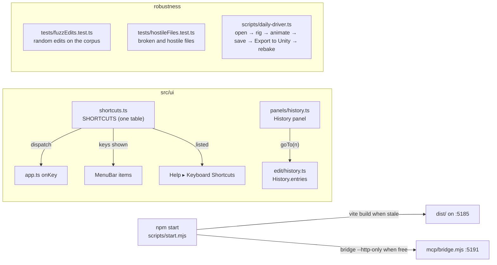
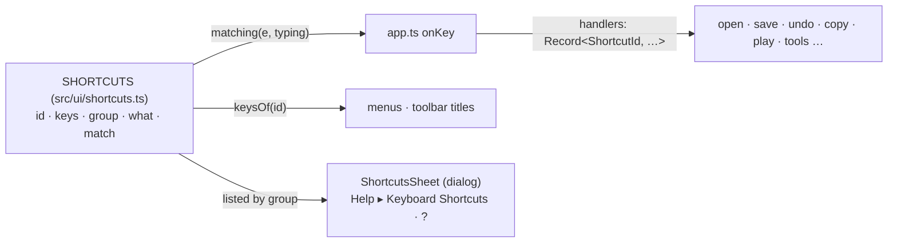
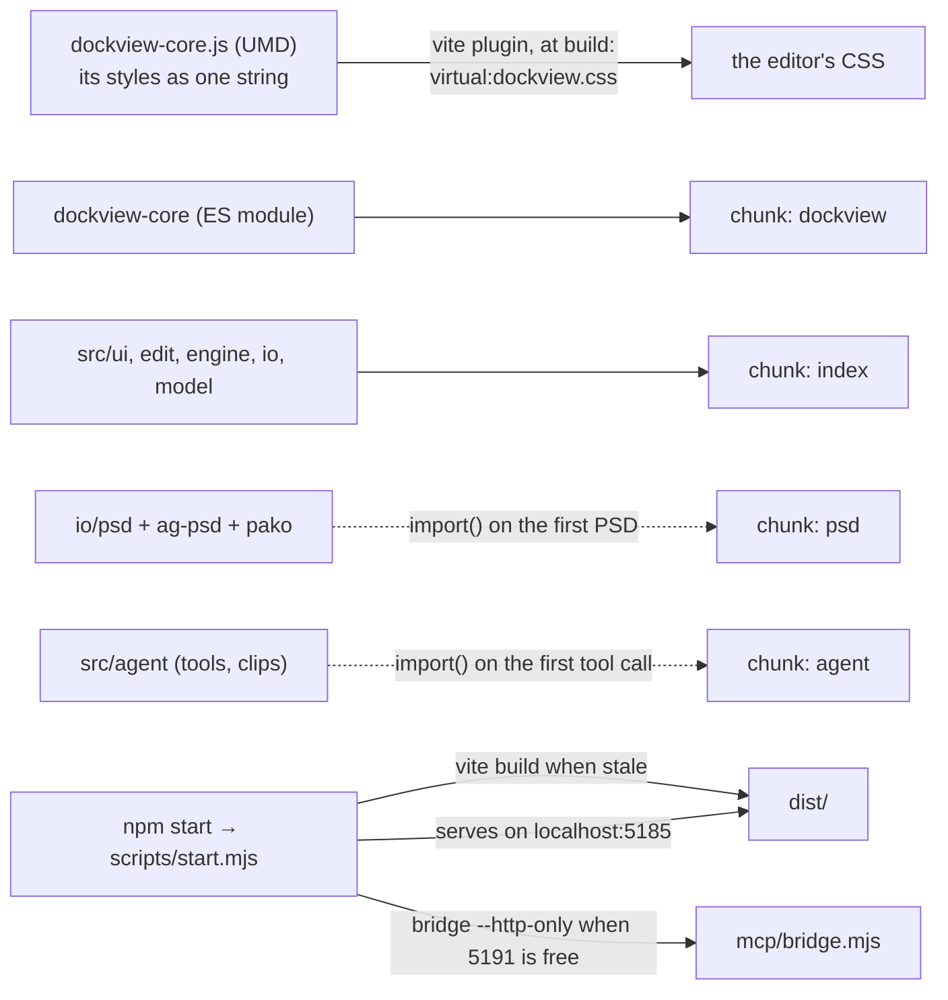

# E7 — the daily driver: history, shortcuts, a build, a robustness pass — plan

**Status:** in progress, 2026-10-06; steps 1 (the History panel), 2 (the shortcuts table and sheet) and 3 (running without the dev server) done. Scope chosen by the owner:
the History panel and the shortcuts sheet (set aside at E6 step 3), running without the dev
server, and a robustness pass.
Not in E7: the AnimatedDrawings detection sidecar (waits on the owner's install decision).

E6 made v2 the editor in use, but it still runs as a developer runs it: `npm run dev`, shortcuts
only discoverable from menus, undo only one step at a time. E7 makes it an artist's daily
driver: every step visible and reachable, every shortcut listed, one command to start it, and
the edits, files and the Unity hand-off shaken until they stop breaking.

## Decisions

- **One table of shortcuts.** Today the keys live in `onKey`'s `if` chain, again as text in the
  menus, and nowhere as a list. E7 puts every shortcut in one table (`src/ui/shortcuts.ts`): its
  id, the keys as shown, what it does, its group, and how a key event matches it. `onKey`
  dispatches from the table to a handler map whose type requires a handler for every id, so a row
  without a handler, or a handler without a row, does not compile. The menus read their `keys`
  text from the table. The sheet lists the table. Nothing about which key does what changes.
- **The sheet** is Help ▸ Keyboard Shortcuts (and `?`): a modal list by group, searchable, closed
  with Escape. A dialog, not a panel: it is looked at, not worked in.
- **The History panel** is a Dockview panel (`history`, reserved in `panelIds.ts`): the undo
  steps by label, oldest first, the current one marked, the redo steps greyed after it. A click
  goes to that step (repeated undo or redo: one history, no branches, nothing lost until a new
  edit). `History` gains `entries` (labels, and the current index) and `goTo(index)`; no other
  change to how it records. The 500-step limit stays, and the panel says when older steps were
  dropped.
- **Running without the dev server.** `npm start` (`scripts/start.mjs`, Node only, no new
  dependency): builds `dist/` when any source is newer than it, serves it on `localhost:5185`
  (the same origin as the dev server, so preferences, layouts, recovery copies and folder
  permissions carry over) with a small static server, and starts the bridge `--http-only` for Ask
  AI and the AI button when port 5191 is free (a Claude Code session may already hold it, from
  `.mcp.json`). The dev-only helpers (`window.boneburst`, the fixture buttons) stay out of the
  build, as now.
- **Code-split** so the main chunk is under Vite's 500 kB warning: the parts an artist does not
  need at start load when first used (the PSD reader, the AI panel's chat, the curve graph's and
  the weight brush's code if they weigh). Measured before and after; the warning gone from
  `npm run build`.
- **The browser tests run against the build too.** A second Playwright project serves `dist/`
  through `scripts/start.mjs`'s server; a smoke set (open, edit, undo, save, export) runs there,
  so a build-only break (a dynamic import, a path that only the dev server serves) fails.
- **Robustness, three ways**, each finding fixed in v2 with a test that failed before the fix:
  1. **Edits fuzzed**: random sequences of the edit layer's own edits (bones, slots, keys,
     constraints, skins, meshes, weights, paste, frame rate) on every corpus rig, seeded and
     reproducible. Invariants after each step: the document passes `profileIssues`, writes and
     reads back to itself, poses without throwing, and undo of the whole sequence returns the very
     first document.
  2. **Hostile files**: truncated JSON, wrong types, missing parents, cycles, absurd sizes,
     duplicate names, an atlas that names missing pages, a PSD that is not one. Each opens with an
     issue said, or is refused with a reason; none throws to the console or hangs.
  3. **The daily driver end to end**: a Playwright script does what the owner does (open a PSD,
     auto-rig, key a walk, save, reopen, Export to Unity into a folder under `Assets/`), then the
     live Unity Editor rebakes it (`unity` CLI) and its bake is checked by reading it, not by
     looking (root `CLAUDE.md`: capture only through Unity). When no Unity Editor answers, that
     step is reported as not run, never as passed.

## Steps

1. **The History panel**: `History.entries` / `goTo`; `panels/history.ts`; Window menu and the
   activity bar; tests (`tests/history.test.ts` extended, `e2e/historyPanel.spec.ts`).
2. **The shortcuts table and sheet**: `src/ui/shortcuts.ts`, `onKey` dispatching from it, menus
   reading it, Help ▸ Keyboard Shortcuts; tests (`tests/shortcuts.test.ts`: no two rows match the
   same key event; every menu `keys` text is a row's; `e2e/shortcutsSheet.spec.ts`).
3. **Running without the dev server**: `scripts/start.mjs`, `npm start`; code-splitting; the
   build's Playwright project; README.
4. **Edits fuzzed** (`tests/fuzzEdits.test.ts`), and the fixes.
5. **Hostile files** (`tests/hostileFiles.test.ts`, a browser test for the PSD path), and the
   fixes.
6. **The daily driver end to end** (`scripts/daily-driver.ts`), with Unity, and the fixes.
7. **Close**: the charter's E7 row, README, SPEC where the shape changed, status.

## Step 1 results

1. `History` (`src/edit/history.ts`): `entries` (the labels, oldest first: the done steps, then
   the undone ones in redo order; `done`; `dropped`, the steps the limit let go of, now counted)
   and `goTo(done, step)`, which undoes or redoes one step at a time and calls `step` after each.
   Nothing else in how it records changed. `Session.goToStep` follows each step as the buttons do,
   so a jump across a PSD re-import takes the matching atlas with it: `followReimports` only
   recognises the documents right before and after a re-import, so a direct jump past one would
   have kept the wrong pages.
2. The panel (`src/ui/panels/history.ts`): "Opened name.json" (or how many older steps the limit
   let go), then each step; the current step marked (`aria-current`), the redo steps greyed; a
   click goes there. Rebuilt only when the steps or the position change. Registered as the
   `history` panel, tabbed behind the Rig panel by default (the default layout looks as before),
   in the Window menu and on the activity bar; Lucide's `rotate-ccw-clock` (its history icon at the
   pinned commit) vendored.
3. Tests: `tests/history.test.ts` (5 new: the list, going to any step through every step between,
   refusals, a new edit dropping the redo steps, the dropped count); `e2e/historyPanel.spec.ts`
   (the steps listed; back, to the start, forward; the toolbar's Undo agreeing; a new edit
   dropping the steps after). Planted faults, each caught: the redo labels not reversed; `goTo`
   not calling `step` on undo; the dropped count not kept; the panel's rows off by one.
4. `npm run check`: vitest 468 pass; the browser tests 13 of 14 at first, the failing one being
   `e2e/onion.spec.ts`, failing the same on a clean export of HEAD. The other session traced it:
   not the renderer (its framebuffer identical before and after) but the element screenshot the
   test compared, which goes through the compositor and moved by one level on 12 pixels since
   the Rig panel's search row (`overflow-y: auto` on `.outline .rows`). Its fix, reading the
   canvas's own pixels, landed in that session's commits; with it the test passes, the exact
   comparison kept. Then `npm run check`: 468 vitest, 14 browser tests, all pass.
## Step 2 — the shortcuts table and sheet

### Decisions

- **A row is data plus a match**: `{ id, keys, group, what, chord }`. `chord` describes the key
  event: ⌘ (⌘ or Ctrl), ⌥ and ⇧ each required, refused, or either, plus `e.key` or `e.code` (`e.code`
  where ⌥ changes `e.key`, as today). The defaults are what `onKey` does now: a key without ⌘
  needs ⌥ up and takes either ⇧; `whileTyping` marks the three that work in a text field (⌘O, ⌘S,
  ⌘,).
- **Order and fall-through kept.** `onKey` walks the rows in table order. A handler returns false
  when it does not apply (⌘A with no animation, `[` and `]` with the brush off), and the walk goes
  on as the `if` chain did. Delete is one row whose handler tries the timeline, the stage's vertex,
  then the rig panel, in that order. The one change: every handled key now calls `preventDefault`
  (before, F, K, the tools and the brush keys did not; none of them has a browser default that
  matters outside a text field), except Escape (`keepDefault`), on which a dialog closes.
- **Completeness by type**: `ShortcutId` is the union of the table's ids, and the handler map is a
  `Record<ShortcutId, …>`, so a row without a handler, or a handler without a row, does not
  compile. The tool keys come from the same table (one row per tool), and so does `TOOLS`' key text.
- **Menus and titles read the table** (`keysOf(id)`); a test checks `app.ts` writes no key text of
  its own (`keys: "…"`, or ⌘/⇧/⌥ inside a title).
- **The sheet**: a native `<dialog>` like Preferences: groups (File, Edit, View, Tools, Playback,
  Timeline, Stage), each row the keys and what they do, a filter field, Escape or Close to shut.
  Help ▸ Keyboard Shortcuts, and `?` (⇧/), a new row. It lists the table, nothing else.
- **Tests**: `tests/shortcuts.test.ts` (ids unique; no two rows match the same event, for every
  row's own event and its ⇧ variants; the table's matches equal today's `onKey` on a list of
  events; `keysOf` for every id; `app.ts` writes no key text); `e2e/shortcutsSheet.spec.ts` (`?`
  opens it, filter, Escape; a few keys still do what they did).

### Step 2 results

1. `src/ui/shortcuts.ts`: 28 rows (the 27 keys `onKey` handled, ⌘Y included, and `?` for the
   sheet), each with its keys, group, what it does and its chord; `keysOf`, `matches`, `matching`.
   `keepDefault` on Escape (added while building: with `preventDefault` on Escape, a dialog with a
   button focused no longer closed).
2. `app.ts`: `onKey` is a walk over `matching(e, isTyping(e))` into a `Record<ShortcutId, …>` of
   handlers (⌘A and the brush keys decline when they do not apply; Delete tries the timeline, the
   stage's vertex, then the rig panel). `TOOLS` names its row; the menus, the toolbar titles
   (Open, Save, tools, Fit, Preferences, Undo, Redo) and Auto Key's message read `keysOf`. Beyond
   `app.ts`, the key text in titles and messages of `timeline.ts` (Play, Key, To the first frame,
   the copy and paste messages), `clipboard.ts`, `outline.ts`, `inspector.ts` and `stage.ts` reads it
   too: the text check found "To the first frame (Home)", which the plan's list had missed.
3. `src/ui/shortcutsSheet.ts`: the `<dialog>` by group with a filter; Help ▸ Keyboard Shortcuts
   (its `?` shown) and `?`.
4. Tests: `tests/shortcuts.test.ts` (5: unique ids and keys; each row's own event, with ⇧ both ways
   where free, matches only that row; 39 events matched as the old `if` chain did, ⌘⇧C, ⌥W, ⇧W and
   ⌘; among them; in a text field only ⌘O, ⌘S, ⌘,; no key text written outside the table);
   `e2e/shortcutsSheet.spec.ts` (`?` opens it, the groups, the filter, Escape with a button
   focused, the Help menu, then E, ⌘Z and Space doing what they did). Planted faults, each caught:
   Escape's default prevented (the e2e), a tool key taking ⌥, a menu writing "⌘Z" itself, a
   handler missing (does not compile), Undo taking ⇧ too.
5. `npm run check`: 473 vitest and 15 browser tests, all pass.

## Step 3 — running without the dev server

Measured first (the build's source map, bytes per source): one chunk of 1,410 kB, of which
`dockview-core` 535 kB, `ag-psd` 241 kB with `pako` 49 kB, the AI layer (`src/agent`, with the
motion clips) 199 kB, and the rest of the editor about 350 kB. Dockview is that large because the
app loads its UMD build (E4-PLAN D6): the only build that carries its styles, as one JavaScript
string it injects; its ES module (387 kB minified) carries none.

### Decisions

- **Dockview's styles from its own package, at build time.** A small Vite plugin in
  `vite.config.ts` reads the pinned `dockview-core/dist/dockview-core.js`, takes the one CSS string
  it injects, and serves it as the CSS module `virtual:dockview.css`; the app imports the ES module
  and that CSS. Nothing copied or vendored, so an upgrade brings its styles with it; the plugin
  fails the build loudly when it does not find exactly one such string. Dockview copies the page's
  style sheets into a popout window, so popouts get the styles as before (`e2e/popout.spec.ts`).
- **Chunks**: Dockview in its own chunk; the PSD reader (`io/psd`, `ag-psd`, `pako`) loaded by
  `import()` when a PSD is first opened or re-imported; the AI layer (`@/agent/host`, its tools and
  clips) when the bridge first hands the page a tool call. Every chunk under 500 kB; `npm run
  build` without the warning.
- **`npm start`** (`scripts/start.mjs`, Node only): builds `dist/` with Vite when it is missing or
  older than any source (`src/`, `public/`, `index.html`, `vite.config.ts`, `package-lock.json`);
  serves it on `http://localhost:5185` (the dev server's origin, so preferences, layouts, recovery
  copies and the Unity folder's permission carry over); refuses with a reason when the port is
  taken (a dev server running); starts `mcp/bridge.mjs --http-only` when nothing answers on 5191,
  and stops it on exit; opens the browser (`--no-open` not to). The server: files under `dist/`
  only (no path outside it), the types an editor needs, `index.html` not cached and `assets/`
  cached for good (their names change with their content). `--port` and `--no-bridge` for tests.
- **The build has its browser tests**: `playwright.build.config.ts` runs `e2e-build/` against
  `scripts/start.mjs --no-open --no-bridge --port 5186`. The build has no dev hooks
  (`window.boneburst`, the fixture buttons), so the smoke test drives it as a user does: open the
  stickman's three files through Open…, the layout's panels present with Dockview's styles
  applied, an edit and ⌘Z, the History panel, `?`, a PSD opened (the lazy chunk loads), and the AI
  button connecting to a bridge the test starts with a tool call answered (the agent chunk loads).
  `scripts/check.sh` runs it after the dev tests.
- **README**: `npm start` first, `npm run dev` for working on the editor.

### Steps

1. The plugin, the ES module, the chunks; sizes measured again.
2. `scripts/start.mjs`, `npm start`.
3. `playwright.build.config.ts`, `e2e-build/smoke.spec.ts`, `check.sh`.
4. README, CLAUDE.md commands; planted faults (the plugin finding no styles; a lazy import made
   static; the server serving outside `dist/`).

### Step 3 results

1. **Dockview from its ES module**, its styles from `virtual:dockview.css` (`vite.config.ts` ▸
   `dockviewStyles`, reading the pinned package's one injected sheet; `dockview-umd.d.ts` replaced
   by `dockview-styles.d.ts`). All 15 browser tests pass on it, the popout windows' styles among
   them.
2. **Chunks**, measured again: at start `index` 342 kB and `dockview` 357 kB (was one 1,410 kB
   chunk); `psd` 297 kB (`ag-psd`, `pako`) loaded by the first PSD opened or re-imported
   (`Session.openPsd`, `reimportPsd`); `host` 212 kB (the AI layer and its clips) by the first tool
   call (`AiBridge.answer`); `psdImport`, `psdReimport` small. CSS 155 kB (Dockview's 133 kB). No
   warning. `check.sh` now fails on Vite's chunk warning.
3. **`npm start`** (`scripts/start.mjs`): builds when `dist/` is missing or older than `src/`,
   `public/`, `index.html`, `vite.config.ts` or `package-lock.json`; serves `dist/` on localhost:5185
   (`index.html` not cached, `assets/` immutable, correct types, 404 outside `dist/`); refuses a
   taken port with the reason; starts the bridge `--http-only` when 5191 does not answer (its
   origins the server's), stops it on exit; opens the browser. Checked by hand: the headers, a
   path outside `dist/` (raw and encoded) 404, a second start on a taken port refused.
4. **Tests**: `tests/start.test.ts` (the path rule: the page and assets mapped, seven ways out of
   `dist/` refused); `playwright.build.config.ts` and `e2e-build/smoke.spec.ts`, run by `check.sh`:
   on the build, no dev hooks, Dockview's rules present, the stickman opened through Open…, K keys
   hips and the History panel shows it, ⌘Z, `?`, neither lazy chunk asked for until a PSD is opened
   (then `psd`) and the AI button answers a tool call (then `host`), no page error. Planted faults,
   each caught: the plugin finding no styles (the build fails, naming it); the PSD reader imported
   statically (`index` 643 kB, the warning, `check.sh` fails); the server's path rule removed
   (`tests/start.test.ts`).
5. README (`npm start` first), the editor's `CLAUDE.md` (its commands). `npm run check`: 475
   vitest, 15 browser tests, 1 build browser test, all pass.
