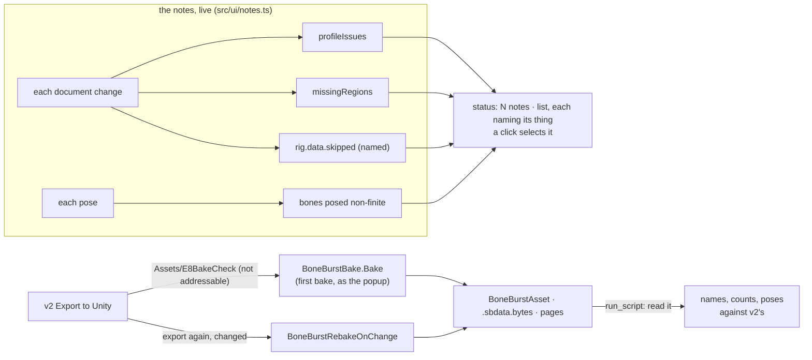

# E8 — the editor tells the truth up to the bake — plan

**Status:** in progress, 2026-10-06; step 1 (live notes) done. Scope chosen by the owner ("go E8" on the recommendation): what
the editor cannot show, it says, as you edit, naming the thing; and v2's export baked by the real
Unity bake, first bake and rebake on change, checked by reading the result in Unity.

E7 left two ways for a problem to reach Unity unannounced. The notes the editor shows are worked
out once, when a file opens, and go stale as soon as it is edited; and what the engine skips or
cannot pose (a constraint naming a bone that is gone, a bone a degenerate constraint leaves
without a pose, an attachment whose region the atlas lacks) is either unnamed ("IK with unknown
bones") or silent (drawn as nothing). And the bake itself, the step that turns an export into a
`BoneBurstAsset`, was never run on v2's output.

## Decisions

- **Notes are live.** One function (`src/ui/notes.ts`) works out every note from the document as it
  is now: the profile (`profileIssues`), regions the atlas lacks (`missingRegions`), what the
  engine skipped, and, from the pose shown, bones the engine poses to nothing. Recomputed when the
  document changes (keyed on the history's revision, the atlas and the skin, so playback does not
  redo the document's part), the pose's part on each pose. What reading the file said (`issues`
  at open: a page not given, a field kept as written) stays as it is: those are about the files.
- **Every note names its thing**, and a click on it selects that thing (a bone, slot, constraint,
  attachment) where it can. The engine's skip list becomes named (`"IK reach: bone x is not
  a bone"`), not a category (`"IK with unknown bones"`).
- **A bone with no pose (F6, E7)**: the stage draws nothing of it rather than garbage (it may
  already), the note says which bones at which frame, and Properties for a selected such bone says
  so. Nothing is changed in the engine's posing: BoneBurst's C# runtime poses the same bones to NaN.
- **The bake, in Unity, checked by reading** (root `CLAUDE.md`: never by looking):
  - The Editor: this project's, through the `unity` CLI (`unity status`; `unity open` when none
    is running). Compiles and the run are checked through `recompile_status` / `console_status`.
  - Where: `Assets/E8BakeCheck/` (the export) and the bake's output folder beside it. Neither is
    a SmartAddresser target, so `MappingMutationService.EnsureIndexed` refuses them as not
    addressable before writing anything: **`AssetSystem.db` is not written** (checked by its hash
    before and after). The asset's references are then GUID-only, which the Editor answers.
  - What: v2's daily-driver export (the figure, rigged, animated, keyed) baked with
    `BoneBurstBake.Bake(source, SettingsFor(source))`, the call the popup makes (the first bake an
    artist does). Then a second export from v2 with a change (another key) written over it:
    `BoneBurstRebakeOnChange` must rebake on its own, the asset's GUID kept, the change in it.
  - Read back by `run_script` (a builder `.cs` outside `Assets/`, in `Temp/AgentScripts/`): the
    asset's data reference valid, its pages, bone, slot, animation names and counts equal to v2's
    export, and the runtime's pose at a few frames of `idle` against v2's (as the harness compares).
  - Afterwards the scratch folders are deleted with `AssetDatabase.DeleteAsset` (they are the
    check's own output, made in this step; §6's rule is about create paths), leaving `Assets/`
    as it was; `git status` checked.
- **What stays the owner's**: a player build (§5: the AssetSystem path is proven only in a player)
  needs the export in an addressable folder and the Unity session's index; not in E8.

## Steps

1. **Live notes**: `src/ui/notes.ts`, the named skip list (`engine/rigData.ts`), bones with no pose;
   the status list built from it, a click selecting; tests (`tests/notes.test.ts`,
   `e2e/notes.spec.ts`: an edit that breaks the file shows its note at once, undo takes it away).
2. **A bone with no pose** on the stage and in Properties.
3. **The bake**: the Unity Editor; `Temp/AgentScripts/E8Bake.cs`; first bake, read back; rebake on
   change; clean up; `AssetSystem.db` unchanged.
4. **Close**: the charter's E8 row, SPEC, README, status.

## Step 1 results

1. **The engine names what it skips**: `RigData.unsupported` (category strings: "IK with unknown
   bones") is now `RigData.skipped`, each `{ message, subject }`: the constraint, attachment or
   animation, what it lacks, and what follows (`IK "reach" names bones the skeleton lacks ("x",
   "w"); it is not solved`). Posing is unchanged.
2. **`src/ui/notes.ts`**: `documentNotes` (the profile, the atlas's missing regions, the engine's
   skips, each with the thing to select: a profile `where` of `bones[i]`, `slots[i]`,
   `constraints[i]`, `skins/<skin>/<slot>/<key>` or `animations/<name>`, matched against the
   document's own names, so names holding `/` work); `poseNotes` (the bones the pose shown leaves
   without one, named, with the frame).
3. **`Session.notes()`**: the document's notes recomputed when the document, atlas or rig changes
   (0.78 ms on mix-and-match, the largest rig), the pose's on each call. `Session.open` and the PSD
   import keep only what reading the files said (`issues`); the profile and the regions are now
   the live notes'.
4. **The status list** (`app.ts`): reading's notes then the live ones; a note about a thing is a
   button that selects it (an animation's shows it); rebuilt only when the text changes.
5. Tests: `tests/notes.test.ts` (12: six skips named with their subjects, a file played whole
   skipping nothing, subjects of profile notes including a skin and an animation whose names hold
   `/`, a missing region, the bones without a pose); `e2e/notes.spec.ts` (the stickman with none;
   an attachment's path set to a region the atlas lacks shows "1 note" at once, naming it; a click
   selects it; undo clears it). Planted faults, caught: the notes cache never refreshed for a
   document (the e2e); the engine's old skip list (7 of the unit tests). Not a fault: dropping
   the revision from the cache key, since a changed document builds a new rig, whose new skip
   list refreshes the notes anyway.
6. `npm run check`: all pass (21 browser tests).
