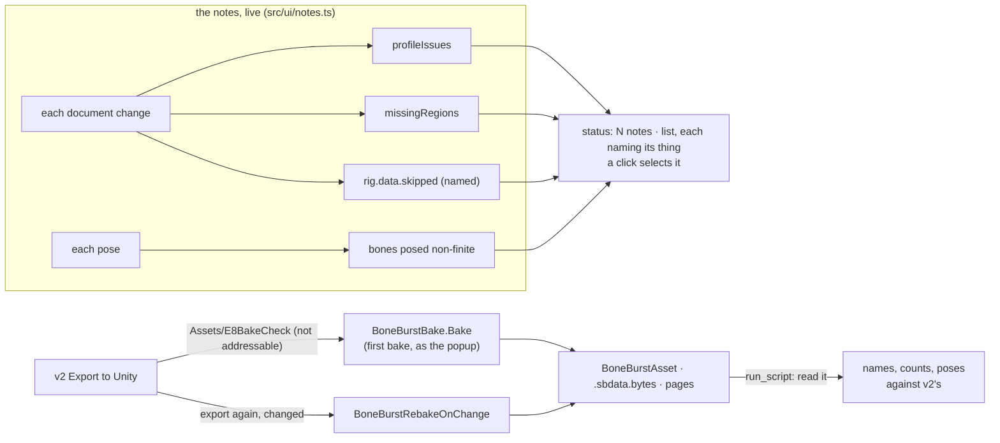

# E8 — the editor tells the truth up to the bake — plan

**Status:** in progress, 2026-10-06; steps 1 (live notes), 2 (a bone with no pose) and 3 (the bake) done. Scope chosen by the owner ("go E8" on the recommendation): what
the editor cannot show, it says, as you edit, naming the thing; and v2's export baked by the real
Unity bake, first bake and rebake on change, checked by reading the result in Unity.

E7 left two ways for a problem to reach Unity unannounced. The notes the editor shows are worked
out once, when a file opens, and go stale as soon as it is edited; and what the engine skips or
cannot pose (a constraint naming a bone that is gone, a bone a degenerate constraint leaves
without a pose, an attachment whose region the atlas lacks) is either unnamed ("IK with unknown
bones") or silent (drawn as nothing). And the bake itself, the step that turns an export into a
`BoneBurstAsset`, was never run on v2's output.

## Decisions

- **Notes are live.** One function (`src/ui/notes.ts`) works out every note from the document as it
  is now: the profile (`profileIssues`), regions the atlas lacks (`missingRegions`), what the
  engine skipped, and, from the pose shown, bones the engine poses to nothing. Recomputed when the
  document changes (keyed on the history's revision, the atlas and the skin, so playback does not
  redo the document's part), the pose's part on each pose. What reading the file said (`issues`
  at open: a page not given, a field kept as written) stays as it is: those are about the files.
- **Every note names its thing**, and a click on it selects that thing (a bone, slot, constraint,
  attachment) where it can. The engine's skip list becomes named (`"IK reach: bone x is not
  a bone"`), not a category (`"IK with unknown bones"`).
- **A bone with no pose (F6, E7)**: the stage draws nothing of it rather than garbage (it may
  already), the note says which bones at which frame, and Properties for a selected such bone says
  so. Nothing is changed in the engine's posing: BoneBurst's C# runtime poses the same bones to NaN.
- **The bake, in Unity, checked by reading** (root `CLAUDE.md`: never by looking):
  - The Editor: this project's, through the `unity` CLI (`unity status`; `unity open` when none
    is running). Compiles and the run are checked through `recompile_status` / `console_status`.
  - Where: `Assets/E8BakeCheck/` (the export) and the bake's output folder beside it. Neither is
    a SmartAddresser target, so `MappingMutationService.EnsureIndexed` refuses them as not
    addressable before writing anything: **`AssetSystem.db` is not written** (checked by its hash
    before and after). The asset's references are then GUID-only, which the Editor answers.
  - What: v2's daily-driver export (the figure, rigged, animated, keyed) baked with
    `BoneBurstBake.Bake(source, SettingsFor(source))`, the call the popup makes (the first bake an
    artist does). Then a second export from v2 with a change (another key) written over it:
    `BoneBurstRebakeOnChange` must rebake on its own, the asset's GUID kept, the change in it.
  - Read back by `run_script` (a builder `.cs` outside `Assets/`, in `Temp/AgentScripts/`): the
    asset's data reference valid, its pages, bone, slot, animation names and counts equal to v2's
    export, and the runtime's pose at a few frames of `idle` against v2's (as the harness compares).
  - Afterwards the scratch folders are deleted with `AssetDatabase.DeleteAsset` (they are the
    check's own output, made in this step; §6's rule is about create paths), leaving `Assets/`
    as it was; `git status` checked.
- **What stays the owner's**: a player build (§5: the AssetSystem path is proven only in a player)
  needs the export in an addressable folder and the Unity session's index; not in E8.

## Steps

1. **Live notes**: `src/ui/notes.ts`, the named skip list (`engine/rigData.ts`), bones with no pose;
   the status list built from it, a click selecting; tests (`tests/notes.test.ts`,
   `e2e/notes.spec.ts`: an edit that breaks the file shows its note at once, undo takes it away).
2. **A bone with no pose** on the stage and in Properties.
3. **The bake**: the Unity Editor; `Temp/AgentScripts/E8Bake.cs`; first bake, read back; rebake on
   change; clean up; `AssetSystem.db` unchanged.
4. **Close**: the charter's E8 row, SPEC, README, status.

## Step 1 results

1. **The engine names what it skips**: `RigData.unsupported` (category strings: "IK with unknown
   bones") is now `RigData.skipped`, each `{ message, subject }`: the constraint, attachment or
   animation, what it lacks, and what follows (`IK "reach" names bones the skeleton lacks ("x",
   "w"); it is not solved`). Posing is unchanged.
2. **`src/ui/notes.ts`**: `documentNotes` (the profile, the atlas's missing regions, the engine's
   skips, each with the thing to select: a profile `where` of `bones[i]`, `slots[i]`,
   `constraints[i]`, `skins/<skin>/<slot>/<key>` or `animations/<name>`, matched against the
   document's own names, so names holding `/` work); `poseNotes` (the bones the pose shown leaves
   without one, named, with the frame).
3. **`Session.notes()`**: the document's notes recomputed when the document, atlas or rig changes
   (0.78 ms on mix-and-match, the largest rig), the pose's on each call. `Session.open` and the PSD
   import keep only what reading the files said (`issues`); the profile and the regions are now
   the live notes'.
4. **The status list** (`app.ts`): reading's notes then the live ones; a note about a thing is a
   button that selects it (an animation's shows it); rebuilt only when the text changes.
5. Tests: `tests/notes.test.ts` (12: six skips named with their subjects, a file played whole
   skipping nothing, subjects of profile notes including a skin and an animation whose names hold
   `/`, a missing region, the bones without a pose); `e2e/notes.spec.ts` (the stickman with none;
   an attachment's path set to a region the atlas lacks shows "1 note" at once, naming it; a click
   selects it; undo clears it). Planted faults, caught: the notes cache never refreshed for a
   document (the e2e); the engine's old skip list (7 of the unit tests). Not a fault: dropping
   the revision from the cache key, since a changed document builds a new rig, whose new skip
   list refreshes the notes anyway.
6. `npm run check`: all pass (21 browser tests).

## Step 2 results

1. **A fixture both runtimes agree on**: `tests/fixtures/unposed/unposed.json`, a two-bone IK on an
   arm scaled to 0 in y; `hand` has no pose in v2 and in BoneBurst's C# runtime alike (`run.sh
   --dump`). Found by posing 4,000 small random rigs with one constraint each and keeping those
   where v2 gave NaN, then dumping them through the C# runtime: 4 of the 6 agree.
2. **The stage**: `Stage.screenBones` leaves out a bone whose ends are not finite (neither drawn nor
   picked, whatever the canvas does with NaN), and the gizmo is not drawn for a selected bone
   without a pose. **Properties**: a selected bone without a pose has a "Pose: none here…" line.
3. **`e2e/unposed.spec.ts`**: the fixture through Open…; the note names `hand` with "setup pose"; a
   click selects it; Properties says so; the stage's bones leave `hand` out and keep the others; no
   page error. Planted faults, each caught: the stage's filter removed; the Properties line removed.
4. **F9 (found on the way)**: an open path of fewer than 6 vertices (or a vertex count not a multiple
   of 3) has no whole curve. v2's solver read past its curves (NaN), and the C# solver past its
   scratch buffer (whatever lay there; stock spine-csharp alike), so neither had defined behaviour.
   The profile now says so (`a path of 3 vertices: …`), and v2's solver leaves the bones as they
   were. Rows in `tests/hostileFindings.test.ts` (3, failing without the fixes).
5. **F10 (recorded, not fixed)**: 2 of the 6 random rigs, a two-bone IK on a parent scaled to 0 in
   y, give `hand` no pose in v2 but a pose in C#. The solvers are the same (both pass NaN
   through `atan2`); a branch on the degenerate input (`d >= 0`, `rr >= 0`) falls on different
   sides in float64 and float32. An ill-conditioned input as root `CLAUDE.md` §5 describes; v2's note
   names the bone either way.
6. Main was broken for a while by another session's commit (bdf3db4: the Animations panel squashed
   the stage, 10 browser tests failing); this step was checked on cfb7806 with its changes applied
   meanwhile (all pass but the three that need the bridge's own origin), and again on main once
   62d46c6 fixed it: `npm run check` all pass (681 vitest, 22 browser tests, 1 build).
7. Valid files pose as before: `scripts/unity-parity.ts`, 17 rigs agree, worst 0.0067.

## Step 3 results

1. **The Editor**: this project's, opened with `unity open` (6000.6.4f1; root `CLAUDE.md` names
   6000.6.3f1), compiling clean, auto-tick on. Midway the Editor was closed (an ordinary quit at
   20:11:46, after the rebake had run; not one of the step's commands); the owner chose to reopen it
   and finish there. Unity clears `Temp/` on restart, so the builder script is kept in the repository,
   `scripts/unity/BakeCheck.cs` (copied to `Temp/AgentScripts/` to run), outside `Assets/`.
2. **First bake, as the popup makes it** (`FindSource`, `SettingsFor`, `Bake`) of the daily-driver
   export copied to `Assets/E8BakeCheck/figure`: `figure_BoneBurst.asset`, `figure.sbdata.bytes` (8,289
   bytes, scale 0.01), the page, shader `BoneBurst/Unlit`. Read back: 14 bones, 7 slots, 1 skin, 2
   constraints, 1 animation, all as exported; the baked data posed by BoneBurst's runtime in Unity
   (`ManagedPose`, as the harness's dump) against v2's engine on the export: **60 frames agree, worst
   0.0010** (`scripts/bake-check.ts`; `scripts/oracle/csharp.ts ▸ comparePoses` now takes a poses
   file and its bake scale, shared with `unity-parity.ts`, still 17 rigs agreeing).
3. **Rebake on change**: a second export made by v2's own edit and writer (a key on `hips` at 1.5 s)
   written over the first and imported: `BoneBurstRebakeOnChange` rebaked it by itself ("BoneBurst
   rebake on change: … rebaked"). Read back after reopening: the asset's and the data's GUIDs kept,
   the data changed; it agrees with the second export (60 frames, worst 0.0010) and no longer with
   the first (25.5 off at frame 45, where the new key is): the check tells the two apart.
4. **Cleanup**: `Assets/E8BakeCheck` deleted through `AssetDatabase.DeleteAsset`; `git status` of
   `Assets/` and `ProjectSettings/` as before (the three files the Unity session already had
   modified); `Packed Assets.asset` and `SmartAddresserData.asset` byte for byte as before; no
   duplicate index (§11's query); console clean.
5. **What the plan had wrong**: "`AssetSystem.db` is not written". The bake's indexing did refuse the
   scratch folder (no `EntryAssetReference` row; those tables last written 04:48 UTC, before this
   step), but the AssetSystem's **cache** table (`EntryAssetReferenceCache`) gained a row for the baked
   asset on import, and keeps it, marked valid, after the asset is deleted. The same stale rows sit
   there for every `BoneBurstBakeTest_*` folder the EditMode tests made and deleted at 12:13 UTC: the
   cache does not follow deletions. Not edited by hand (§11); for the owner and pb-creator-base (M2).
6. **Found, for the owner**: stock spine-unity, kept here as the parity reference and the
   benchmark's stock side (D1), **auto-imports any Spine export put under `Assets/`**: it made
   `figure_SkeletonData.asset`, `figure_Atlas.asset` and two materials beside the export, and clears
   and rebuilds them on every change. In M0 an artist's Export to Unity therefore also makes stock
   Spine assets (M2, which removed stock Spine, does not).
7. Not run: a player build (§5's check of the AssetSystem path), as planned: the export was not in an
   addressable folder.
