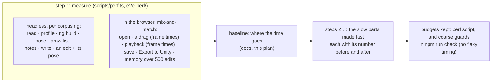

# E9 — fast on production-size rigs — plan

**Status:** in progress, 2026-10-06; step 1 (measure) done: within every budget on mix-and-match, with
little headroom on a doubled rig; two costs to take out. Scope chosen by the owner ("go E9" on the recommendation):
measure the editor on the largest rigs it is meant for, make what is slow fast, and keep budgets so
it stays fast. The AnimatedDrawings detection sidecar moved to E10 (owner); the packaged app is the
candidate after it.

E7 made v2 robust and E8 made it honest, both on correctness. Nothing has measured how it feels on
a rig the size of mix-and-match-pro (725 kB of JSON, dozens of skins, hundreds of attachments):
how long a drag step takes, whether playback holds 60 frames a second, how long opening, saving
and exporting take, and whether memory grows over a long session. One cost is visible in the
code already: every change to the document builds a new rig (`Session.poserFor`: a `Poser` per
document, so each step of a drag serializes the whole skeleton and reads it back). Measured first,
changed second.

## Decisions

- **The rigs**: every corpus rig, mix-and-match-pro the largest (725 kB JSON), and a synthetic
  "production" rig made from it (its skins and animations doubled, its meshes kept) to see how costs
  grow. The stickman for the small end.
- **What is measured**, headless (Node, the engine and edit layer as the browser runs them): reading,
  the profile, building the rig, posing a frame (setup and animated, with physics), the draw list
  and drawn vertices, the live notes, writing; an edit applied (a bone moved, a key set) followed by
  what the stage does next (the rig rebuilt or not, the pose, the notes). In the browser (Playwright,
  Chromium, the dev server and the build): open through Open…, a 120-step drag on the stage (each
  step's time from pointer event to painted frame, through `requestAnimationFrame`), 5 s of playback
  (frame intervals), Save, Export to Unity, and the JS heap after 500 edits and after undoing them.
- **How it is read**: medians and the 95th percentile over repeated runs, on this machine (an Apple
  silicon Mac), with what else was running noted. Absolute numbers are this machine's; the budgets
  are about the shape (60 fps is 16.7 ms a frame).
- **Budgets** (the targets the fixes aim at): a drag step and a playback frame within 16.7 ms on
  mix-and-match at the 95th percentile; open under 1.5 s; save and export under 1 s; the heap back
  within 10% of where it began after the 500 edits are undone and the history let go.
- **Guarding without flakes**: `npm run perf` (`scripts/perf.ts` and `playwright.perf.config.ts`) runs
  the full measurement and compares with the budgets, by hand. `npm run check` keeps only coarse
  guards that cannot flake: counts, not times (e.g. how many rigs one drag builds: 1, not 120).
- **Fixes keep behaviour**: every change is held by the existing tests, the fuzz and hostile-file
  nets, and `scripts/unity-parity.ts` (17 rigs agree); a fix that would change a pose is not a
  performance fix.

## Steps

1. **Measure**: `scripts/perf.ts` (headless) and `e2e-perf/` (browser); the baseline written here.
2. **The slow parts**, one at a time, as the baseline ranks them; each with its numbers before and
   after and the counter that guards it.
3. **Memory** over a long session.
4. **Budgets**: `npm run perf`; the coarse guards in `npm run check`.
5. **Close**: the charter's E9 row, SPEC, README, status.

## Step 1 results

Measured on this machine (an Apple silicon Mac) while it was busy: load average 4.5–7.9, another
Unity Editor creating a project. Medians / 95th percentiles in ms.

**Headless** (`scripts/perf.ts`, every corpus rig; a few of them here):

| rig | kB | read | profile | rig build | setup pose + draw | anim frame + draw | notes | write | drag step* |
|---|---|---|---|---|---|---|---|---|---|
| stickman | 29 | 0.35 / 0.83 | 0.06 / 0.16 | 0.21 / 0.44 | 0.02 / 0.04 | 0.02 / 0.03 | 0.08 / 0.10 | 0.20 / 0.37 | 0.17 / 0.21 |
| spineboy-pro | 189 | 2.86 / 3.36 | 0.51 / 0.54 | 1.90 / 2.35 | 0.01 / 0.02 | 0.02 / 0.03 | 0.33 / 0.36 | 2.24 / 2.74 | 1.89 / 2.25 |
| raptor-pro | 286 | 3.60 / 4.56 | 0.49 / 0.56 | 2.31 / 2.79 | 0.02 / 0.02 | 0.02 / 0.03 | 0.32 / 0.38 | 2.97 / 3.96 | 2.40 / 3.02 |
| mix-and-match-pro | 708 | 9.07 / 9.42 | 0.43 / 0.77 | 3.48 / 4.71 | 0.03 / 0.04 | 0.03 / 0.04 | 0.56 / 0.70 | 6.95 / 7.58 | 3.24 / 3.69 |
| mix-and-match ×2 | 1043 | 16.42 / 16.89 | 0.80 / 0.98 | 6.31 / 6.71 | 0.03 / 0.04 | 0.03 / 0.03 | 1.01 / 1.30 | 13.05 / 13.71 | 6.30 / 6.88 |

\* an edit, then the rig built again (the document changed) and posed, as the stage does one today.

**In the browser** (`e2e-perf/perf.spec.ts`, Chromium, the dev server):

| | mix-and-match-pro | ×2 | budget |
|---|---|---|---|
| open, through Open… to "Opened" | 130 ms | 113 ms | 1.5 s |
| Export to Unity, to its message | 224 ms | 290 ms | 1 s |
| a drag step: the edit | 0.0 / 0.1 | 0.0 / 0.1 | |
| … the Rig panel's update (`Outline`) | 4.3 / 5.3 | 4.4 / 4.8 | |
| … Properties' update (`Inspector`, the first to pose: it pays the rig build) | 3.2 / 4.8 | 6.2 / 7.6 | |
| … the status line (`refresh`, the notes) | 0.6 / 1.5 | 1.0 / 2.0 | |
| … the stage's paint | 0.4 / 0.6 | 0.5 / 0.7 | |
| **a drag step, all of it** | **8.9 / 12.5** | **12.4 / 14.9** | 16.7 |
| a real drag at 60 Hz: frame intervals | 16.7 / 16.7 (max 16.8) | 16.7 / 16.7 | 16.7 |
| playback, 3 s: frame intervals | 16.7 / 16.8 | 16.7 / 16.7 | 16.7 |
| JS heap: before → after 500 edits | 17.7 → 19.2 MB | 21.2 → 23.2 MB | |

**What it says**:
1. Every budget is met on mix-and-match-pro, and on the doubled rig, but a drag step on the doubled
   rig leaves only ~2 ms of a 16.7 ms frame: a rig a third larger again would drop frames.
2. Two costs make up most of a drag step, and both grow with the rig:
   - **the rig built again on every change** (`Session.poserFor`: a new `Poser` per document, which
     writes the skeleton to JSON and reads it back), 3.5 ms on mix-and-match, 6.3 ms doubled, paid
     by whichever listener poses first;
   - **the Rig panel rebuilt on every change** (`Outline.update`), 4.3 ms, though a drag changes
     nothing it shows.
3. Posing, drawing, the notes, the edit itself and the stage's paint are each under 1 ms.
4. Memory: the history's structural sharing costs about 3–4 kB an edit. The measurement of "undone
   and let go" was wrong (going back to step 0 keeps the redo steps); step 3 measures it properly.

**Step 2, ranked**: (a) a change that leaves the rig's structure as it was (a bone's or a key's values)
updates the built rig instead of building a new one, or the build loses its JSON round trip; (b) the
Rig panel rebuilds only when what it shows changed. Each with its numbers before and after, and a
count as its guard (rigs built during a drag: 1, not 120; Rig panel rebuilds during a drag: 0).
