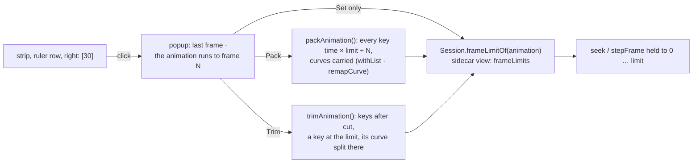

# An animation's last frame: a button, a popup, and Pack or Trim

**Status:** done, 2026-10-09. Nothing left.

FramePath's frame strip has a **last frame** for the animation shown: the playhead stops there and Q / W wrap round to 0 after it
(FRAMEPATH-SPEED-PLAN step 15 began it as a lock, step 24 as a number field). The owner's note:

> convert to button for show label only [30], but when click show popup panel for set. If I have 50 key, then I set number to 30, it
> must can have option to pack data, or trim.

The owner's answers (2026-10-09): **Pack** scales every key into the new length (refused, nothing changed, when two keys of a list
would land on one frame); **Trim** cuts the keys after it and keys each list at the limit with the value it had there, so the motion up
to it is the same; both change **the whole animation** (every bone, slot, constraint, deform, draw order and event list); the limit
is **per animation**, default 30, kept in the project's view (the sidecar) as Loop is.

## Steps

1. **Model** (`src/edit/fitLength.ts`, no DOM; tests first in `tests/fitLength.test.ts`):
   - `packAnimation(animation, toFrame, fps)`: every key list's times scaled by `toFrame ÷ end` (the animation's last key frame),
     rounded to frames; each bezier carried to its interval's new ends (`withList` + `remapCurve`, as moving keys does). Refused when two
     keys of one list (events aside) land on one frame, naming the list and the frame. Nothing to do when the animation already ends by
     `toFrame`.
   - `trimAnimation(animation, toFrame, fps)`: for each list with keys after `toFrame`: keys after it deleted; when the cut falls inside
     an interval, a key at the cut with the value there and the interval's bezier split at the cut (de Casteljau, per channel), so the
     curve up to it is unchanged. Numbers through `channelField`; slot colours written back as hex; deform as its vertices at the cut;
     lists without channels (attachment, draw order, events, inherit, physics reset) only lose the keys after the cut: their last key
     before it holds.
2. **Per-animation limit**: `View.frameLimits` in the sidecar (`edit/sidecar.ts`); `Session.frameLimitOf(name)` (default 30) and
   `setFrameLimit(name, n)`, saved with the view like `loopOff`; `seek`, `stepFrame` and `changed` hold to the shown animation's limit.
   Step 24's browser-wide `boneburst.frameLimit` is dropped.
3. **UI**: the strip's field becomes a button showing the limit (`30`); a click opens a popup by it: the last frame (a number), and when
   the animation runs past it, "The animation runs to frame N" with **Pack into 0–L**, **Trim after L**, and **Set only** (keys kept; the
   playhead stops at L). One undo step for Pack or Trim (the limit is view, not document). Escape or a click outside closes it.
4. **Tests**: e2e: the button shows 30; Set only changes the limit (seek held, Q / W wrap) and is kept per animation; Pack scales the
   keys into the limit (last key on it, one undo step); Trim cuts and keys the limit (the pose at the limit as before, one undo step);
   Pack refused on a collision says so and changes nothing.
5. **Docs**: SPEC's FramePath paragraph; this plan's result; FRAMEPATH-SPEED-PLAN step 24 pointed here.

## Result

1. `src/edit/fitLength.ts`: `packAnimation` and `trimAnimation` as planned (`keys.ts` now exports `withList` and `Rebuilt` for them).
   `tests/fitLength.test.ts` (8): Pack scales every kind of list (translate, rotate, colour, attachment, events), carries a bezier's handles
   to the new interval, leaves an animation already short enough alone, refuses two keys on one frame (naming the list and the frame) and a
   bad frame; Trim cuts and keys the cut: the split bezier is the original curve exactly up to the cut (checked on the exact cubic), and as
   played within 0.2 units (Spine samples a bezier in 10 steps, so a shorter curve's samples fall elsewhere); a colour keyed as hex at the
   cut; an attachment list only loses its later key; events after the cut go; a key on the cut needs no new key.
2. `View.frameLimits` (`edit/sidecar.ts`, only the values that read: whole numbers from 1), `Session.frameLimitOf` / `setFrameLimit` /
   `frameLimits` (`DEFAULT_FRAME_LIMIT` 30), written with the view on save (`app.ts` `viewNow`). `tests/sidecar.test.ts` round-trips it.
3. The strip's button (`limitBtn`, by Fit) and `openLimitPopup()`. Found while testing: Escape only closed the popup from the number
   field; it now closes it from anywhere in it (a button keeps the focus after a refused Pack).
4. `e2e/frameLock.spec.ts` rewritten (4): the button shows 30, the playhead stops there and Q / W wrap; Set only moves the stop and keeps
   the keys, a value past the keys offers only Set; Pack scales the keys by the whole animation's length (its last key is another bone's),
   one undo step, undone; Trim cuts the hips' keys at 18 and keys it; a Pack into 3 frames is refused in the popup and changes nothing.
   Seen on a Playwright screenshot. vitest 803 pass; e2e: all pass except the 3 AI-bridge tests (no bridge from the dev server on 5199).
