# FramePath: key nodes with a detail panel and a speed — plan

**Status: done 2026-10-09 (see "Result"); split translatex/translatey keys left for later.** The FramePath tab gets what the TwinSpline tab has under its picture: numbered nodes, the picked node's data and a speed graph. On FramePath the nodes are the bone's translate keys, and a node's speed is written into the keys' own Bezier curves, so it plays and exports as plain Spine data (no sidecar, no bake).

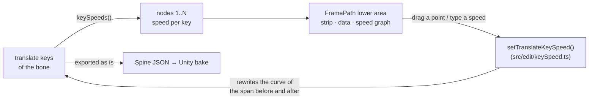

## What was asked

> at "FramePath", now when click node must show detail panel like in "TwinSpline", for add addition speed adjust

The owner chose (2026-10-09): **ease between keys** (the keys stay on their frames; the speed shapes each span's Bezier, the clip length never changes), and **keyed frames only** are nodes.

## The design

- **Nodes** are the keys of the bone's combined `translate` timeline in the shown animation, numbered 1..N in time order. A bone keyed with split `translatex` / `translatey` timelines gets an honest line instead of nodes (not handled in this step).
- **Speed** of a node: −0.99 to 5, the TwinSpline's range: the bone moves *1 + speed* times as fast as the span's even pace at that key. The span from key *i* to key *i+1* gets the shape `[1/3, (1+a)/3, 2/3, 1 − (1+b)/3]` on both channels, *a* the speed at its start, *b* at its end. The same normalised shape on x and y keeps the bone on the straight line between the keys: only the timing changes. Both speeds 0 is the straight line, written as no curve.
- **Reading back**: a key's speed is the slope its curves have there over the span's even pace, minus 1, from the channel that moves most. Any imported curve reads; a stepped span reads as stepped and becomes a curve once a speed is set on it.
- **Closed** (the FramePath ⋮ toggle): setting the speed of the first or the last node sets both, as the drag does for their place.
- **The lower area** under the picture on FramePath: the numbered strip (press: pick and go to that key's frame), the picked key's data (frame, place x/y, speed with its ×multiplier), the speed graph over the animation's frames (the speed the curves give at each moment, a point per key; drag a point up or down, Shift in steps of 0.1, double-click: 0). A key's dot on the picture picks that node too.

## Steps

1. `src/edit/keySpeed.ts`: `keySpeeds`, `spanSpeedAt` (the graph's line), `setTranslateKeySpeed`; table tests in `tests/keySpeed.test.ts` (linear reads 0, a set speed reads back, both 0 drops the curve, the path between keys stays on the line, stepped, last key, refusals).
2. The FramePath lower area in `motionPanel.ts`: strip, data, graph and its drag; the picture's key dot picks the node.
3. e2e in `e2e/motionModes.spec.ts`: the strip shows the keys, a node's data, a speed typed is written into the curves.
4. Status and results here.

## Result

1. `src/edit/keySpeed.ts` as planned; `tests/keySpeed.test.ts` (7 tests) passes. Speeds read back to four places, since the handles are stored as short floats. A span whose x and y had different imported curves gets one shape on both once a speed is set on it, so the bone then runs straight between those two keys.
2. `motionPanel.ts`: on FramePath the lower area shows a button per translate key (`renderKeyStrip`), the picked key's frame, place and speed (`renderKeyData`), and the speed graph over the frames (`drawKeySpeed`, the same canvas and drag as TwinSpline's: a point drags its speed, double-click puts it to 0, the cap scrubs the frames). A key's dot on the picture picks its node. With Closed on, the first and the last key take a speed or a place together, as one undo step.
3. e2e: `motionModes.spec.ts` checks the strip, the data and a typed speed written into the curves. The whole e2e suite (154) and `vitest` (842) pass. It also fixed `twinSpline.spec.ts`, which the FramePath rename had left asking for the old menu name.

## Step 2: a frame strip like the Timeline's, and one Key toggle (2026-10-09, the owner's second note)

> remove all Green bt, then convert to similar like "TimeLine". we have 32 node, if we need add additionPath, just have bt for toggle key

FramePath and TwinSpline are to stay clearly apart (TwinSpline may go soon); the work is FramePath's.

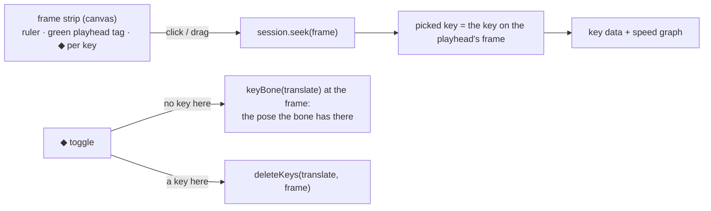

- **The green numbered buttons go** on FramePath. In their place, a strip drawn like the Timeline's ruler: frame numbers, the green playhead tag, and a diamond on every frame with a translate key. It shares the speed graph's view (same left edge, zoom and pan), so a frame on the strip is above the same frame on the graph.
- **Click or drag on the strip** moves the playhead. The picked key is simply the key on the playhead's frame, so clicking a dot in the picture, a point on the graph or a diamond on the strip all pick the same way; a frame with no key shows "no key here" in the data.
- **One toggle button** at the strip's left, ◆: on a frame with no translate key it keys translate there with the pose the bone has on that frame (the motion does not change); on a frame with a key it deletes that key. One undo step each.
- TwinSpline keeps its own strip as it is.

### Result (step 2)

Built as above in `motionPanel.ts` (`renderKeyStrip`, `drawKeyStrip`, `keyStripEvents`, `toggleKey`) and `style.css`. The key data now follows the playhead: the "picked" key is the one on its frame. With no key on that frame, the data says so and points at ◆. The strip and the graph also show for a bone with fewer than two keys, so ◆ can start a FramePath. e2e: `motionModes.spec.ts` checks no green buttons, the strip, the key data on the playhead's frame, and ◆ adding then deleting a key. Checked in the browser on Stickman_IK's `hips`: the strip lines up with the graph, a click moves the playhead, and ◆ added the key on frame 13 and then removed it.

## Step 3: Shift + click deletes a key; two speeds per key with three leg modes (2026-10-09, the owner's third note)

> 1 add can delete "key ◆ Speed" (when hover node + shift, node icon to red, l click delete). 2 add full 2 control with 3 mode

The owner chose: the two controls are the speed **arriving** at a key and the speed **leaving** it; the three modes are TwinSpline's legs: **Mirror**, **Break**, **Auto**. Delete works on the graph's points and on the strip's diamonds.

```mermaid
stateDiagram-v2
    [*] --> Mirror: in = out
    Mirror --> Break: Break (or Alt + drag a leg)
    Break --> Mirror: Mirror (in takes out's value)
    Mirror --> Auto: Auto
    Break --> Auto: Auto
    Auto: in, out from the neighbours (an action; reads back as Mirror or Break)
```

- **Two speeds per key.** The span before a key ends at its *in* speed, the span after starts at its *out* speed (`setTranslateKeySpeeds(animation, bone, index, { in, out })` in `src/edit/keySpeed.ts`; `keySpeedPairs` reads them). The graph draws a key's point with a leg each side: a hollow ring on a short stem at the in speed (left) and the out speed (right). The point drags both by the same amount; a leg drags its own side, and in Mirror the other side follows.
- **The modes** are actions, as on TwinSpline's legs, shown on the key's data row and in the point's right-click menu. **Mirror**: in takes the out speed. **Break**: each leg on its own. **Auto**: the pace through the key is the Catmull–Rom one (the distance from the key before to the key after, over their time), written as the in and out speeds that give it, held to −0.99…5. The mode shown is read from the data: in = out is Mirror; else Break. A Break chosen on equal speeds is remembered by the panel for that key until the bone or animation changes, since the file has nowhere to keep it.
- **Delete.** With Shift held over a point on the graph or a diamond on the strip, it turns red; a click deletes that translate key (one undo step). A Shift + drag on a point that started without Shift still steps by 0.1.

### Result (step 3)

- `src/edit/keySpeed.ts`: `keySpeedPairs`, `autoKeySpeeds`, `setTranslateKeySpeeds` (a side left out leaves its span as it was, a stepped one too); `setTranslateKeySpeed` sets both sides through it. `tests/keySpeed.test.ts` has three more tests (10 in all). The Auto test checks the written handles, not a finite difference of the engine's pose: the engine draws a Bezier as 10 straight steps, so a 1 ms difference near a key reads the first step's slope, not the curve's.
- `motionPanel.ts`: the graph draws a leg each side of a key (in left, out right); the point drags both, a leg drags its side (and the other too in Mirror; Alt + drag breaks first; double-click on a leg: Auto). The key's data has *Speed in*, *Speed out* and *Legs: Mirror · Break · Auto*; right-click on a point gives the same and Delete. Shift over a point or a diamond turns it red (Shift pressed or let go with the pointer still there counts too) and a click deletes the key.
- e2e: `motionModes.spec.ts` checks Break, Mirror and Auto through the data row, and a Shift + click delete on the graph and on the strip (it fails on step 2's code, where Shift + press began a drag). All suites pass: vitest 845, e2e 157. Checked in the browser on `hips`: the legs and the Mirror · Break · Auto row show. The red Shift hover is not checked: the e2e test checks the delete, not the colour, and the browser pane cannot hold Shift while hovering.

### Revised (step 3, the owner's fourth note, 2026-10-09)

> 3 mode: 2 hand, relate 2 side · break leg, freedom by each hand · plain node, if you have 2 plain node it just basic line

The three modes are now **Mirror** (two handles, linked), **Break** (each handle free) and **Plain** (no handles: the key's speed is 0 on both sides, so a span between two plain keys is the straight line, written as no curve). **Auto is gone**, with `autoKeySpeeds` and its test.

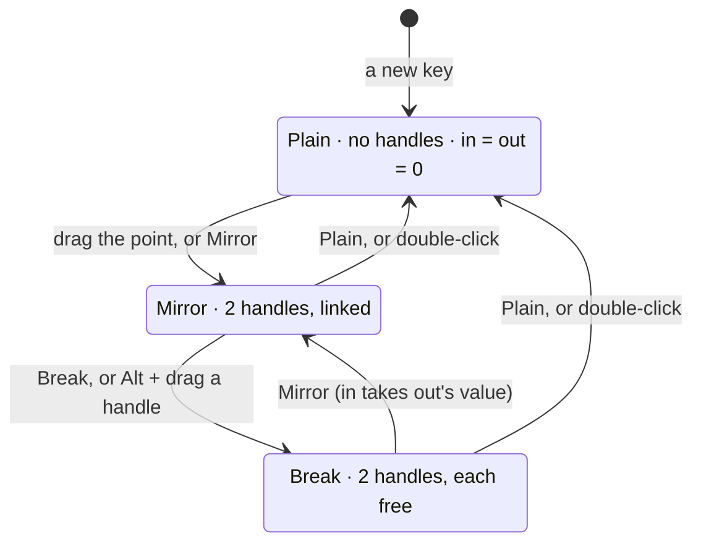

- The mode is read from the keys: in ≠ out is Break; both 0 is Plain; else Mirror. A choice the file cannot show (Mirror or Break at 0 and 0, Break on equal speeds) is remembered by the panel for that key until the bone or animation changes.
- A plain key draws no handles on the graph. Double-click on a point or a handle makes the key Plain.

Result: built as above. `motionPanel.ts` has `keyMode` / `setKeyLegs` with Mirror · Break · Plain on the key's data row and in the point's right-click menu; a plain key draws no handles; double-click on a point or a handle makes it Plain. The e2e test checks that a key with no speeds starts Plain with no handles, that Break lets out differ from in, that Mirror links them, and that Plain puts both to 0 and hides the handles. vitest 844 and the Motion Path e2e (36) pass.

## Step 4: the Timeline's look (2026-10-09, the owner's fifth note: "make it same style as time line")

- **The strip** is drawn as the Timeline's top: its ruler (24 px, frame numbers on `--bg`, the same label steps from `timeline/layout.ts`'s `labelStep`), the green playhead tag with the time since the key before (`secondsSinceLastKey`), and under it the Timeline's row of span tabs, one between each two keys with its length ("4f · 0.17s"), the playhead's span lit; each key's ◆ sits between its tabs.
- **The speed graph** is drawn as the Timeline's graph: no ruler or pink cap of its own (the strip above is its ruler), the panel's colour, the frame lines running down through it, past the end dimmed, a 1.5 px curve, square keys (white when picked), thin handles with small rings, and the green playhead line.
- Checked in the browser on `hips`; the Motion Path e2e (36) passes.

## Step 5: the three modes on the picture, a curved path (2026-10-09, the owner's sixth note)

> now convert "FramePath" to can 3 mode

The picture's path between keys gets the same three modes as the speed graph: **Plain** (straight lines to the keys either side), **Mirror** (two handles in line: a smooth curve through the key), **Break** (two free handles: a corner). One mode per key serves both views.

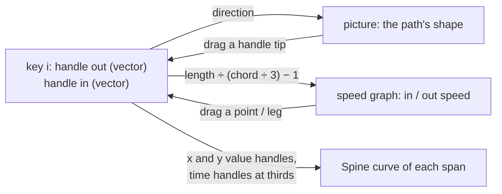

- **The model.** Each key has a handle out (to the span after it) and a handle in (from the span before), each a vector in the bone's translate units. A span from key *i* to *i + 1* is written with its time handles at a third and two thirds and its value handles at `key i + out` and `key i+1 + in`, on x and y each: with the same time handles on both channels, x(t) and y(t) share one parameter, so the span is exactly the 2D Bezier those four points make. A span whose handles lie on its chord at a third each way is the straight, even line, written as no curve.
- **Speed is the handle's length.** The speed at a side is `|handle| ÷ (|chord| ÷ 3) − 1`, the chord being that side's span. On a straight span that is exactly step 1's speed, so files made since step 1 read the same. The speed graph changes only the length (the direction stays); the picture's handle tip changes direction and length, so the speed follows.
- **Modes.** Plain: both handles on their chords at a third (straight, speed 0); the picture draws no handles. Mirror: the in handle points opposite the out handle, at the same speed. Break: each free. Read from the data: on the chords at speed 0 is Plain, opposite at equal speed is Mirror, else Break; a choice the data cannot show is kept by the panel as before.
- **The picture** draws, for each key that is not Plain, a line from its dot to each handle's tip and a ring there (TwinSpline's look). A tip is dragged in the panel's space; the handle is that offset taken back through the parent bone's matrix at the key's frame. In Mirror the other handle turns to stay opposite and keeps the same speed.
- **Reading other files.** A Spine curve whose time handles are not at the thirds reads its handle as the velocity it gives (value offset × (Δt ÷ 3) ÷ time offset); writing a handle puts the time handles at the thirds.
- **Not in this step.** Moving a key's place remaps its spans' curves channel by channel as before (`settle` in `edit/keys.ts`), which can bend the handles; keeping them as vectors when a key moves comes later if needed.

### Result (step 5)

- `src/edit/keySpeed.ts` rewritten around handle vectors: `spanHandles`, `keyHandles`, `keyChords`, `setKeyHandles`; the speeds (`spanEnds`, `keySpeedPairs`, `setTranslateKeySpeeds`) are now the handles' lengths, and `spanSpeedSamples` the 2D speed along the curve. Step 1's tests pass unchanged, so files made since then read the same. Four new tests: handles read back, the bone passes the 2D Bezier's middle point at the middle time, a speed keeps a curved handle's direction, and a handle that is not two numbers is refused. Handles read back to four places (a third is a short float).
- `motionPanel.ts`: `keyMode` reads Plain · Mirror · Break from the handles; `setKeyLegs` does Plain (handles back on the chords) and Mirror (the in handle turned opposite at the same speed); the picture draws each non-Plain key's handles (`drawKeyHandles`, through the parent's matrix at the key, cached per document) and a tip drags (`dragKeyHandle`; Mirror turns the other handle, Alt + drag breaks first).
- e2e: `motionModes.spec.ts` checks that Mirror gives a key two handles on the picture, that dragging a tip curves both spans and turns the other handle, and that Plain makes both spans straight again (no curve) with no handles. vitest 848 and e2e 158 pass.
- In the browser: on Stickman_IK's `hips` Mirror · Break · Plain switch, but no handles could be seen: key 5 sits on the same place as its neighbours (a chord of 0, so its handles have no length); a bone that travels shows the curve better.

## Step 6: the strip and graph always shown, the resize line under the picture (2026-10-09, the owner's seventh note)

> this panel must always show, and move drag able at blue line to red line

- **Always shown**: the frame strip, the speed graph and the key data stay for any selection. With no animation, no bone, a bone a constraint places, or split x/y keys, they are empty, the ◆ toggle is off, and the data says why (`keyHint`).
- **The resize line** (`lp-split`) moves from above the strip to right under the picture, above the zoom bar; dragging it still trades the picture's height for the strip and graph's.
- e2e: `motionModes.spec.ts` checks both with no bone selected, and that dragging the line up gives the lower area more room. All e2e (119) pass.

## Step 7: the speed graph's points move in time; the Timeline's graph leaves translate to FramePath (2026-10-09, the owner's eighth note)

> now it has 3 graphs: FramePath, SpeedGraph, Timeline graph. Reduce the Timeline graph's duty; make SpeedGraph free drag.

The owner chose: a point on the speed graph drags **sideways too**, moving its key to another frame (legs stay up and down, the speed); and the Timeline's graph **no longer shows or edits a bone's combined translate curves**, which FramePath owns.

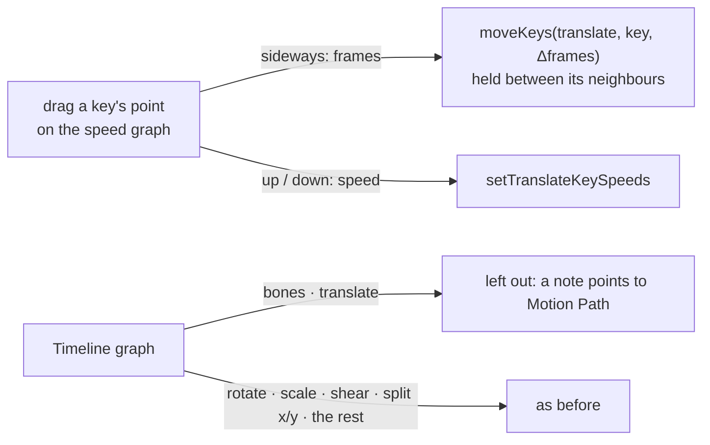

- **Sideways**: the key moves to the frame under the pointer, held between the keys either side (never onto one) and inside the animation; its curves follow (`moveKeys` settles them, so the handles stay at the thirds and the speeds keep). Up and down sets the speed as before; both in one drag, one undo step.
- **The Timeline's graph** leaves out the `translate` timeline of bones; a line on the graph says the selected bone's translate is edited in Motion Path (FramePath). Split `translatex` / `translatey` keys, which FramePath does not handle, stay on the Timeline. The dope sheet rows are not changed.

### Result (step 7)

- `motionPanel.ts`: `moveKeyTo` moves the dragged key with `moveKeys` (held between its neighbours, inside the animation; the playhead follows it); sideways movement under 6 px is ignored so an up-and-down drag does not nudge the key.
- `timeline/timeline.ts`: `graphChannels` leaves out bones' `translate`; `translateLeftOut` draws the note. ⌘A on the graph therefore selects no translate keys either.
- e2e: a new test in `motionModes.spec.ts` drags a point sideways (the key moves earlier) and past its neighbour (it stops one frame after it). `graph.spec.ts`'s geometry helper leaves translate out as the graph now does, and its "dragged up" check asks for a smaller rise (the value scale is tighter without translate's large values); `copyPaste.spec.ts`'s ⌘A count no longer needs ten keys. vitest 766 and e2e 120 pass.

## Step 8: a speed never moves the path (2026-10-09, the owner's ninth note)

> why when I adjust a speed node, the FramePath moves too? Refactor: the FramePath can't change, I just want the speed to change.

Since step 5 a speed was a handle's **length**, so a speed bent a curved span, and a speed above 2 made the bone run past the next key and come back (the handle reached beyond it). Now shape and speed are two separate parts of the same Spine curve:

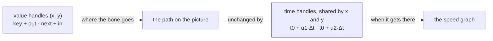

- **Why it is exact.** Both channels use the same time handles, so x(s) and y(s) still share one parameter s: the curve the bone follows is the 2D Bezier of the value handles whatever the time handles are. The time handles only change how fast s runs.
- **Speed at a side.** The bone's velocity there over the span's even pace: for the start, `|out| ÷ (u1 · |chord|)`, so a speed m = 1 + s is written as `u1 = |out| ÷ (m · |chord|)`; the end alike with `in` and `1 − u2`. Read back from any curve as the velocity its handles give, channel by channel.
- **Range.** A time handle must stay inside its span (0 ≤ u ≤ 1) or the curve runs back in time. On a curved span the slowest speed is therefore `|handle| ÷ |chord| − 1`; asking for less gives that, and the field shows what was reached. On a **straight** span the handle's length along the chord does not change the line, so it is chosen with the speed: a third of the chord up to speed 2, then the whole chord with the time handle shortened, so −0.99 to 5 all fit and the bone never passes the next key.
- **Modes are the shape only.** Plain: a straight span (handles along the chord, inside it), no handles on the picture, and the speed as it was. Mirror and Break: the path's handles, opposite or free. On the speed graph, the in and out speeds are linked unless the key is Break, as before. Setting a shape keeps both speeds; setting a speed keeps the shape.

### Result (step 8)

- `src/edit/keySpeed.ts`: `spanHandles` reads the value handles as they are; `spanEnds` reads a speed as the velocity a span's handles give at its end over the even pace (files from steps 1–7, written with the time handles at the thirds, read the same); one writer, `spanCurve`, places the time handles for the speeds and keeps the value handles; `setKeyHandles` keeps a span's speeds, `setTranslateKeySpeeds` keeps its shape. `alongChord` (exported) tells a straight span, within a thousandth of a radian since handles are kept to four places.
- Tests (`tests/keySpeed.test.ts`, 16): the bone follows the 2D Bezier of the handles; **a speed of −0.3, 1 or 4 on a curved key leaves its handles as they were and every pose on the same curve** (and the timing does change); on a straight span speeds −0.99, 2 and 5 read back and the bone never leaves the segment; a speed slower than a curved handle allows gives the slowest it allows; a new handle keeps the speeds. The "keeps the handle" and "never leaves the segment" checks fail on step 7's code (the handle grew, the bone passed the next key at speed 5).
- `motionPanel.ts`: Plain reads as a straight span at any speed and keeps the speeds when chosen; Mirror links the speeds again (in takes out's); the speed graph's legs show on every key; a press on the graph takes a key's point before a leg near it.
- e2e (`motionModes.spec.ts`): the modes test now checks the picture's handles and that Plain keeps the speeds; the picture test checks Plain by its handles, not by "no curve". vitest 769, e2e 120 pass.

## Step 9: two duties, nothing shared (2026-10-09, the owner's tenth note)

> why when I drag a node's leg in FramePath, the speed graph changes too? It must be separate duties: 1 FramePath, where the bone moves; 2 the speed graph, how fast it moves.

Step 8 kept a key's speed when its handle moved, but the speed graph drew the bone's **velocity**, which on a curved span also depends on the curve's shape: the handle's length changed the graph between the keys (and, past the time handle's reach, at the key too). Now each view reads only its own half of the curve:

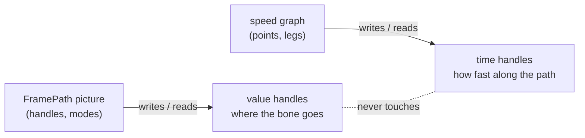

- **On a curved span the speed is the rate along the path**: how fast the curve's own parameter runs against the span's even pace, from the time handles alone (`1 ÷ (3 u1)` at the start, `1 ÷ (3 (1 − u2))` at the end, and in between the time curve's slope). Moving a value handle changes nothing on the graph.
- **On a straight span** the rate along the path and the velocity are the same thing, and the handle's length along the chord is invisible, so step 8 stays: the speed is the velocity, the length chosen with it, −0.99 to 5.
- **Range on a curved span**: a time handle stays inside its span, so the slowest at a key is a third of the even pace (speed −0.67); asking for less gives that and the field shows it. The fastest is 5, as everywhere.
- **Straight to curved**: when a handle drag bends a straight span, its speeds carry over (held to −0.67), so the graph stays unless a speed was slower than that.

### Result (step 9)

- `src/edit/keySpeed.ts`: `isStraight` tells the two cases; on a curved span `spanEnds` and `spanSpeedSamples` read the time handles alone (`timeHandles`, `timeSlope`) and `spanCurve` writes them from the speeds alone (`u = 1 ÷ (3 m)`); straight spans as in step 8. A curved span saved by steps 5–8 now reads its speed from its time handles (at the thirds: 0), not from its handle's length.
- Tests (`tests/keySpeed.test.ts`, 17): **moving the path handles of a curved key three ways leaves the speed graph's samples across both spans, and the key's speeds, exactly as they were** (on step 8's code the graph moved with the shape); the slowest speed on a curved span is −2/3. vitest 770 pass; the e2e suite passes except `e2e/stagePath.spec.ts`, which belongs to another session's work in progress (`docs/STAGE-PATH-PLAN.md`), not to this step.

## Step 10: a leg's length is its reach (2026-10-09, the owner's eleventh note)

> at Speed Graph must can change size long leg too

The owner chose: a leg's length is its **reach** (After Effects' influence): how far into the span the key's speed lasts, as a share of
the span's time. **Straight spans only.** On a straight span the speed is `|handle| ÷ (u · |chord|)`, so the time handle `u` is free
once the speed is set: the reach is `u`, and the handle along the chord becomes `m · u · |chord|` (so `u ≤ 1 ÷ m`). On a curved span
the time handle is the speed and the value handles are the path (step 9): nothing is left over, so its legs keep their usual length.

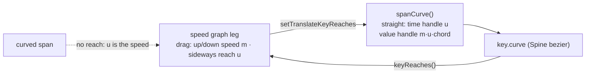

1. `src/edit/keySpeed.ts`: `keyReaches(bone, keys)` reads each key's reach in and out (null on a curved, stepped or missing span);
   `setTranslateKeyReaches(animation, bone, index, { in, out })` writes it on straight spans, held to `0.02 … min(1, 1 ÷ m)` and to the
   two reaches of a span summing to at most 1; a curved span is refused. A speed change keeps the reach (held to `1 ÷ m`), unless the
   handle was at the whole chord, which is where a speed over 3 put it: then the usual third comes back.
2. The graph draws a straight span's leg reaching `u` of its span in time; a curved span's leg keeps the 22 px stem. A leg dragged
   sideways (after 4 px) sets its reach, up and down its speed; Mirror reaches both sides, Break one. The key's data gets a **Reach**
   row (in and out, % of the span), off on a curved side.
3. Tests: a table of reach writes (kept speed, the bounds, a curved span refused, a speed change keeping the reach); e2e: a leg dragged
   sideways changes the reach and not the speed.

### Result (step 10)

- `src/edit/keySpeed.ts`: `keyReaches`, `setTranslateKeyReaches`, `REACH_MIN`, `REACH_PLAIN`; `spanCurve` takes the reaches (the handle along
  the chord is `m · u`); `spanNow` keeps a straight span's reach through a speed or handle edit. As planned, plus: the side being set wins
  when the two reaches of a span would overlap (the other side's reach is what it leaves).
- `motionPanel.ts`: a straight side's leg is drawn reaching `u` of its span; a curved side keeps the 22 px stem. A leg dragged sideways past
  4 px sets its reach (Mirror and Plain: both straight sides; Break: its own), and a curved side says why it has none. The key's data has
  **Reach** in and out (% of the span), off on a curved side.
- Tests: `tests/keySpeed.test.ts` (6 new, 23): reach read and set, the speed and the line kept, a longer reach holds the speed further in,
  the bounds, the overlap, a speed change keeping the reach, curved and stepped spans refused. `e2e/speedReach.spec.ts`: a leg dragged
  sideways shortens its reach and keeps its speed, and a typed reach lengthens the leg; it fails with the sideways drag switched off.
  vitest 776 pass; e2e 119 pass, the 3 failing are the AI-bridge tests (`askAi`, `dailyDriver`, `mcpFlow`), which could not reach the
  bridge from a dev server on another port (the usual 5185 was taken by `npm start`), not this step.
- Note for use: at the whole-animation zoom a short span's legs are short; **Node** fits the picked key's span so they can be grabbed.

## Step 11: each view its own mode (2026-10-09, the owner's twelfth note)

> each graph muse seperate mode of graph change , now it sync

One mode per key (Mirror · Break · Plain) drove both views: Mirror linked the path's handles **and** the speeds, Break freed both. The
owner chose: **each view its own mode**. The picture keeps **Mirror · Break · Plain** for the path's handles; the speed graph gets
**Linked · Broken** for the key's legs (speed and reach). Neither reads nor writes the other, as step 9 did for the data.

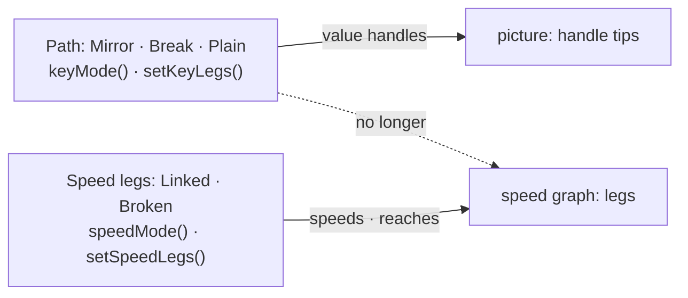

1. `motionPanel.ts`: `speedMode(i)` reads Linked when the in and out speeds (and reaches, where both sides have one) are equal, else
   Broken; a Broken chosen on equal values is remembered as the path's Break is (`speedModes`, cleared with `keyModes`). `setSpeedLegs`:
   Linked sets in to out (speed and reach), Broken frees them.
2. `keyMode` no longer compares speeds (Mirror is the handles in line), and Mirror no longer copies the speed. A leg's drag, the Speed
   and Reach fields follow `speedMode`; Alt + drag on a leg breaks the speed legs, on a handle tip the path's.
3. The key's data: **Path** (Mirror · Break · Plain) and **Speed legs** (Linked · Broken). The speed graph's right-click menu and
   double-click are about its own legs (double-click: Linked); the picture's stay about the path.
4. e2e: the three-modes test splits in two: the path's modes leave the speeds alone, and Linked · Broken leave the path alone.

### Result (step 11)

- `motionPanel.ts`: `speedMode` / `setSpeedLegs` / `speedModes` as planned; `keyMode` reads Mirror from the handles alone and Mirror no
  longer copies the speed. The leg drag, the reach drag and the Speed and Reach fields follow `speedMode`; Alt + drag on a leg breaks the
  speed legs. The key's data: **Speed legs** (Linked · Broken) and **Path** (Mirror · Break · Plain). The graph's right-click menu is
  Linked · Broken · Delete; a double-click on a point or leg links its legs (it used to make the path Plain).
- One thing that still moves with a speed, by step 8's design: on a **straight** span the path handle's length along the line is part of
  how the speed is stored, so its tip slides along the same line when the speed changes. The path (the line) does not change.
- e2e (`motionModes.spec.ts`): the three-modes test is now two: the path's modes keep the speeds (it fails with Mirror copying the
  speed again), and Linked · Broken keep the path's mode and its handles' directions. vitest 776 pass; e2e 120 pass, the 3 failing are
  the AI-bridge tests again (`askAi`, `dailyDriver`, `mcpFlow`: no bridge from the dev server on 5199), not this step.

## Step 12: a quieter picture (2026-10-09, the owner's thirteenth note)

> at FramePath remove small pink dot in line between dot ,and show leg only on selected node

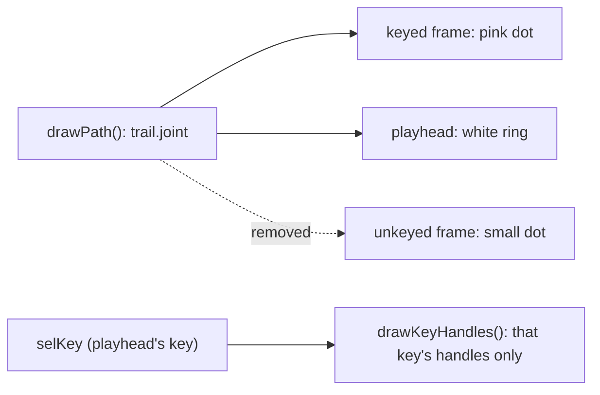

1. `drawPath`: an unkeyed frame gets no dot; the line, the keyed dots, the playhead's ring and a click on any frame of the line stay.
2. `drawKeyHandles`: only the picked key (the one on the playhead's frame) shows its in and out handles; the others none.

### Result (step 12)

As planned. `drawPath` skips unkeyed frames' dots (the line and a click on it stay); `drawKeyHandles` draws only `selKey`'s handles.
e2e: the picture's modes test now checks that key 4's handles go when the playhead is on key 3 and come back on key 4 (it fails with
every key's handles drawn); Motion Path, speed reach and Stage path e2e (13) pass. The dots were checked on a Playwright screenshot of
the picture: keyed dots and the playhead's ring only. The Stage's path (docs/STAGE-PATH-PLAN.md) keeps a dot per frame: not asked.

**Revised (step 12, the owner's fourteenth note: "speed graph legs only on selected node too"):** the speed graph draws only the picked
key's legs (`drawKeySpeed`); every key keeps its point, which still drags and picks. The e2e check below covers it.

## Step 13: the speed graph's point moves up and down only (2026-10-09, the owner's fifteenth note)

> node at Speed path disable it to cant move in x axis

Step 7's sideways drag is taken out: a point on the speed graph sets its key's speed and never its frame (the frame strip and the
Timeline move keys in time). `moveKeyTo` and `speedDragX` are deleted; the point's cursor is `ns-resize`. The legs still drag sideways
for their reach (step 10).

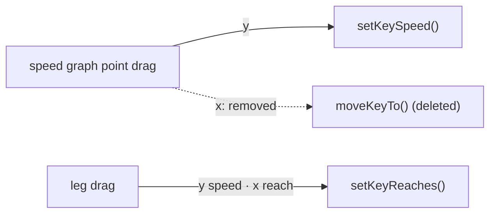

Result: done. e2e: step 7's test is replaced by one that drags key 4's point halfway to key 3 and finds every key on its frame.

## Step 14: Auto Key is the Timeline's, FramePath always keys (2026-10-09, the owner's sixteenth note)

> clean up about autoKey in TimeLine and in FramePath path, it must separate sync. autoKey for timeLine only, if i drag in FramePath, it must sep

FramePath read the Stage's Auto Key (`motionPanel.autoKey = () => stage.autoKey`, LOCALPATH-EDIT-PLAN step 3): off, a drag on the
picture posed the bone unkeyed. Now the two are apart: **Auto Key belongs to the Stage and the Timeline**; a drag on FramePath's
picture always writes keys, and never changes or reads Auto Key. This replaces LOCALPATH-EDIT-PLAN step 3's Auto Key rule.

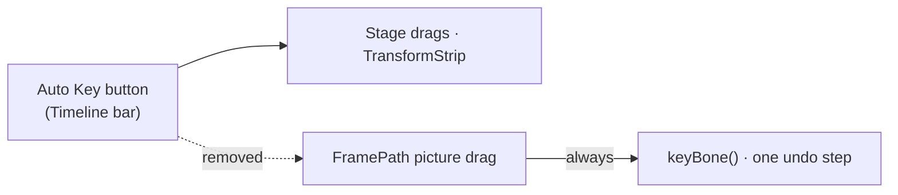

Result: done. `MotionPathPanel.autoKey` and its wiring in `app.ts` are deleted; `BoneEdit.key` is never null, so the unkeyed branch
(`setUnkeyed`) is gone from the panel. Auto Key's tooltip says FramePath's drags always key. e2e (`motionPanelEdit.spec.ts`): with
Auto Key off, a drag on the picture still writes the key as one undo step, and Auto Key stays off (on the old code the drag posed the
bone unkeyed, which this test reads as no key written).

## Step 15: Fit as an icon on the strip; a lock that holds the playhead to the animation (2026-10-09, the owner's seventeenth note)

> 1 move Fit to be icon at red box. 2 add new bt, for lock Cap[5] not go over max we have, lock min max, and when press Q,W Cap[5] must loop

The red box is the right end of FramePath's frame strip, in the ruler row. Cap[5] is the strip's green playhead tag.

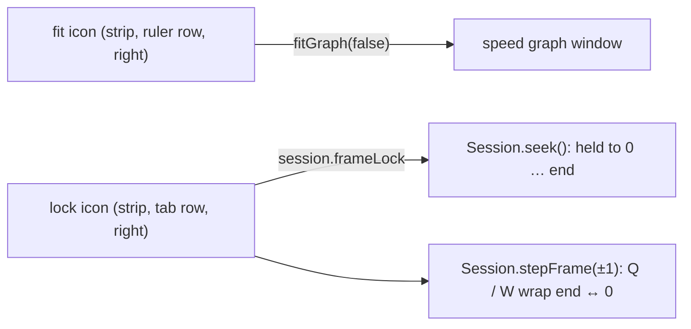

1. The speed graph's header loses its **Fit** text button; a fit icon sits at the right end of the strip's ruler row and does the same
   (the whole animation across the graph and the strip). The graph's plot leaves room on its right so no frame is under the icons.
2. Under it, at the right end of the strip's tab row, a **lock** icon (Lucide `lock` / `lock-open`, vendored from the same 1.52.0
   release). On: `Session.frameLock`, and `seek` holds the playhead to frame 0 … the animation's last frame (the Timeline's playhead
   too, since it seeks the same session); Q and W (`stepFrame`) wrap: W on the last frame goes to 0, Q on 0 to the last. Off: as before
   (no upper bound, no wrap). Kept per browser (`boneburst.frameLock`). Pose mode has no animation: nothing to hold.
3. Tests: a session table test (held seek, wrap both ways, off unchanged); e2e: the lock and Q/W wrap, and the fit icon fits.

### Result (step 15)

As planned. `Session.frameLock`, `seek` held to `0 … last` and `stepFrame` wrapping (Q / W in `app.ts` call it); the panel's
`stripFit` and `lockBtn` at the strip's right end, the lock kept in `boneburst.frameLock`; the speed header keeps Stage, the colour
and Node; the graph's plot ends 34 px from the right so the icons cover no frame. `lock.svg` and `lock-open.svg` are Lucide 1.52.0's,
listed in the Lucide MANIFEST. e2e `frameLock.spec.ts`: off, W goes past the end; on, the playhead comes back to the last frame, W
wraps to 0, Q to the last, a seek past the end stops there, the setting is kept, and off again W goes past the end (it fails with the
wrap taken out); the fit icon undoes Node's zoom. Checked on a Playwright screenshot of the strip. vitest 776 pass; e2e 123 pass, the
3 AI-bridge tests fail as before (no bridge from the dev server on 5199).

**Revised (step 15, the owner's eighteenth note: "when press lock, playhead (Cap[5]) must auto back in range"):** pressing the lock
already sought the playhead back (`seek` holds it); what could still leave it past the end was the end moving under a locked
playhead: an edit or an undo that shortens the animation. `Session.changed()` now brings a locked, paused playhead back to the last
frame whenever anything changes. e2e: after an edit that drops the keys past half a second, the locked playhead is on the new last
frame (it fails with that line of `changed()` switched off). vitest 776; e2e 123 pass, the 3 AI-bridge tests fail as before.

## Step 16: ⌘ + drag a strip diamond moves the key in time; the path stays (2026-10-09, the owner's twentieth note)

> เมื่อ Hover บน redBox + cmd press, จะสามารถเลื่อนคีย์เฟรมได้ โดยที่ตำแหน่งต่างๆ บน "FramePath" ยังคงอยู่ที่เดิม
> (hover on a key's diamond on the strip, hold ⌘ and press: the key slides in time, and everything on FramePath stays where it is.)

The key keeps its place (x, y) and both spans keep their path handles, so the picture does not change; only when the bone gets there
does. The two spans' time handles are scaled with their new length (each stays the same share of its span), so each span's speed
shape is kept. `moveKeys` (the Timeline's) moves a key's time but leaves the curves' absolute time handles where they were, which
can put a handle past the key; FramePath gets its own edit.

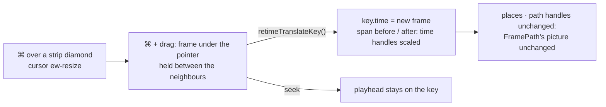

1. `src/edit/keySpeed.ts`: `retimeTranslateKey(animation, bone, index, time)`: the key to `time`, refused at or past a neighbour
   or before 0; the curve of the span before and of the span after keep their value handles and get their time handles scaled.
2. `motionPanel.ts`: on the strip, ⌘ over a diamond shows the `ew-resize` cursor; ⌘ + press drags that key, one undo step,
   between its neighbours (a frame from each; the last key up to the animation's end, the first down to 0); the playhead follows.
   Without ⌘ the strip scrubs as before.
3. Tests: a table test (the key's time moved, the places and value handles the same, the bone on the same path, time handles
   inside their spans and the same share, the refusals); e2e: ⌘ + drag moves a diamond, the key's place and the picture's dots of the
   keys are where they were, one undo step puts it back.

### Result (step 16)

As planned. `retimeTranslateKey` in `keySpeed.ts`; in the panel `stripDotAt`, `updateRetimeHover` (⌘ or Ctrl, held or pressed while
over a diamond: `ew-resize`), `retimeKeyTo` and `retimeDrag`. Tests: `keySpeed.test.ts` (4 new: the key's time moved with places,
path handles and the bone's route the same and each span's time handles at the same share; speeds kept; keys without curves; the
refusals); `e2e/retimeKey.spec.ts` (⌘ over a diamond shows `ew-resize`, ⌘ + drag moves key 3 two frames, every place and the other
keys' times stay, its dot in the picture is within 2 px of where it was (the view refits to the frames' points), the playhead follows,
one undo puts it back). vitest 781 pass; e2e 126 pass, the 3 AI-bridge tests fail as before (no bridge from the dev server on 5199).

## Step 17: FramePath's path in the speed graph's colour (2026-10-09, the owner's twenty-first note)

> สีของเส้น FramePath ต้องสอดคล้องกับสี SpeedGraph (FramePath's line colour must match the speed graph's.)

The picture drew the path's line in the theme's accent (blue) and its dots and lengths in a fixed pink (`DOT`), while the speed
graph, the key handles and the Stage's path use the swatch colour by **Stage** (`stagePath.colour`, orange by default). Now the
line, the keyed dots, the playhead's ring and the lengths take that colour too; `DOT` is gone.

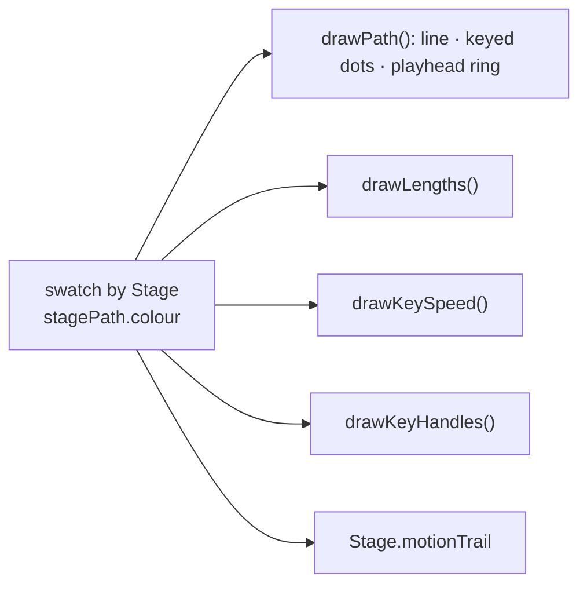

Result: done. `e2e/stagePath.spec.ts` now also finds the picked colour in the picture (it fails with the old pink and blue); the
Motion Path, Stage path and retime e2e (31) pass. Seen on a Playwright screenshot: the path and its dots orange, as the graph.

## Step 18: the span at the playhead is lit on the path (2026-10-09, the owner's twenty-second note)

> when we click 0, then path must show diff color 0-2, for can easy look

The strip lights the tab of the span the playhead is in (from a key to the next, `s.frame >= f0 && s.frame < f1`, in the theme's
accent). The picture now draws that span's stretch of the path in the same accent, 3 px over the 2 px line, so the span on the strip
and on the path are seen together. Past the last key no span is lit, as on the strip.

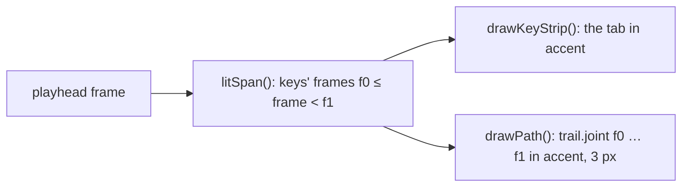

1. `motionPanel.ts`: `litSpan()` (the one rule, used by the strip's tabs and the picture); `drawPath` strokes the joint's trail from
   f0 to f1 in the accent after the whole line, before the dots.
2. e2e: on frame 0 the path at frame 1 (inside the first span) is in the accent; with the playhead in another span it is in the path
   colour.

### Result (step 18)

As planned: `litSpan()` is the one rule for the strip's lit tab and the picture's lit stretch. `e2e/litSpan.spec.ts`: with the
playhead on key 2 the path halfway to key 3 is in the accent; with it on key 4 the same place is the path colour (it fails with the
lit stretch switched off). The Motion Path e2e pass.

## Step 19: ⌘ + click a key's dot for its leg mode; in and out legs in their own colours (2026-10-09, the owner's twenty-third note)

> when cmd + click node, show menu, for switch 3 mode leg, each leg must diff color and can set color in "Preferences" too

The owner chose: the node is a key's dot on FramePath's picture; the colours are **in** (the leg arriving at the key) and **out**
(the leg leaving it), on the picture and on the speed graph.

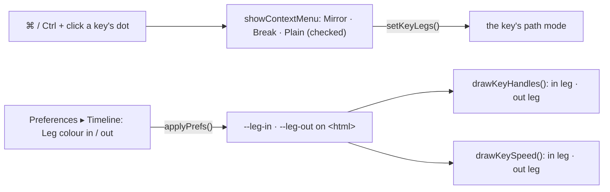

1. `preferences.ts`: `legInColour` and `legOutColour` join the appearance values (`#rrggbb`, or `auto` for the path colour); by
   default in is `#38b6ff` (blue) and out `#ff5c8a` (pink), so they differ from each other and from the orange path.
2. `app.ts`: `--leg-in` and `--leg-out` on `<html>` (removed for `auto`); popouts copy them.
3. `motionPanel.ts`: `drawKeyHandles` and the speed graph's legs draw each side in its colour (a lit or dragged leg stays white);
   ⌘ (Ctrl elsewhere) + click on a key's dot seeks to it and opens Mirror · Break · Plain with the key's mode checked, without starting
   a drag.
4. Preferences ▸ Timeline: **Leg colour, in** and **Leg colour, out** (Automatic: the path colour).
5. Tests: preferences (defaults, `auto`, a bad value falls back); e2e: ⌘ + click a dot opens the menu, Mirror there gives the key its
   handles; the in and out tips are drawn in their two colours; a colour set in Preferences reaches the picture.

### Result (step 19)

As planned: `legColours()` and `legMenu()` in the panel; `--leg-in` / `--leg-out` from `applyPrefs`. Tests: `preferences.test.ts`
(defaults differ from each other and from the path's orange, `auto` reads, a bad value falls back; the round trip carries both);
`e2e/legMenu.spec.ts` (⌘ + click key 3's dot: the playhead goes there, the menu shows Plain checked, Mirror gives two legs, in tip
`#38b6ff` and out tip `#ff5c8a`; an out colour stored in the preferences, `#00c000`, is the out tip's colour). Seen on a Playwright
screenshot: the in legs blue and the out legs pink, on the picture and on the speed graph. vitest 782 pass; e2e 129 pass, the 3
AI-bridge tests fail as before (no bridge from the dev server on 5199).

## Step 20: on the picture, ⌘ + click the path adds a key, Shift + click a key's dot deletes it (2026-10-09, the owner's twenty-fourth note)

> PathFrame: การเพิ่ม Node สามารถทำได้โดย cmd+click at path only; การลด Node สามารถทำได้โดย Shift+click at Node only
> (FramePath: a node is added by ⌘ + click on the path; a node is removed by Shift + click on a node.)

Read as where each works: adding on the path (a frame with no key), deleting on a node (a key's dot). The strip's ◆ and Shift + click
on the strip and the graph stay.

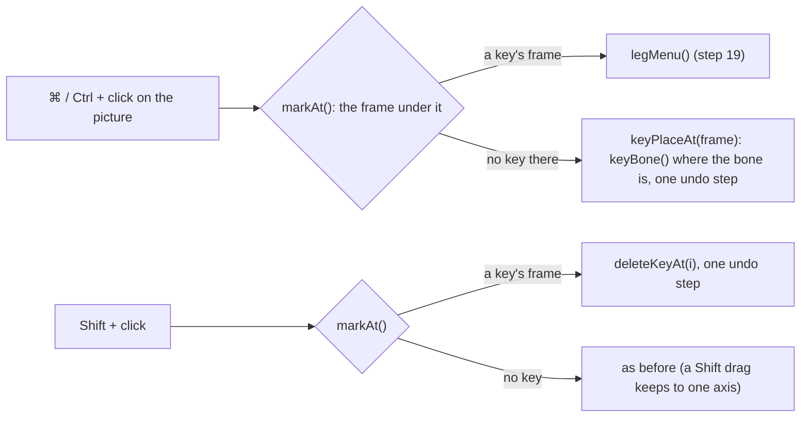

1. `motionPanel.ts`: `keyPlaceAt(frame)` (the ◆'s add, now shared): the playhead to the frame, the bone's place there keyed, so
   the path does not change. In `down`: ⌘ on a key's dot opens the menu, ⌘ elsewhere on the path adds a key; Shift on a key's dot
   deletes it.
2. e2e: ⌘ + click on the path between two keys adds one key at that frame, the bone's place there unchanged; Shift + click on that
   dot deletes it; one undo each.

### Result (step 20)

As planned, with two things the test found:

- **⌘ and Shift are read before the frame tag.** The playhead's tag ("0") can sit over the path, and a press on it started a scrub
  before the ⌘ check: a key under the tag could not be added or deleted.
- **Where the path passes a spot more than once (or stands still), the frame nearest the playhead wins** (`markAt`, also for a drag
  on a dot). Before, the last frame won, so a click between keys 2 and 3 of the stickman's walk added a key at frame 10, where the
  path comes back, instead of frame 6.

`e2e/pathAddDelete.spec.ts`: with the playhead on key 2, ⌘ + click on the path halfway to key 3 adds one key between them, one undo
step, its dot on the spot clicked; Shift + click on that dot deletes it, one more step, and the keys are as they were. vitest 782 pass;
e2e 130 pass, the 3 AI-bridge tests fail as before (no bridge from the dev server on 5199).

## Step 21: ⌘ and Shift preview what a click on the picture will do (2026-10-09, the owner's twenty-fifth note)

> when shift or cmd near node or path, ควรจะมี Preview or change icon color (there should be a preview, or the icon's colour changes)

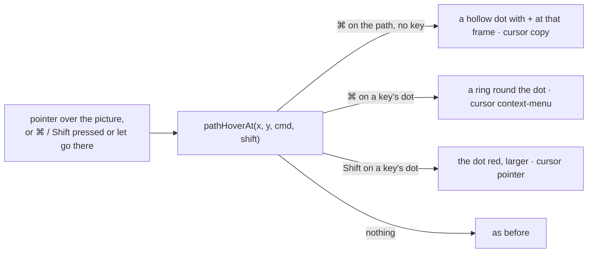

1. `motionPanel.ts`: `pathHover` ({ kind: add | menu | delete, frame } or null) from the frame `markAt` gives under the pointer and the
   modifiers held, the same rule `down` uses; kept on pointer moves over the picture and on ⌘ / Shift pressed or let go while the pointer
   is there; cleared when it leaves. `drawPath` draws the preview over the dots; the cursor says it too.
2. e2e: ⌘ over the path between keys gives an add preview at that frame (the `pathHover` hook and the cursor); ⌘ over a key's dot a
   menu preview; Shift over it a delete preview drawn red; letting go of the key clears it.

### Result (step 21)

As planned: `updatePathHover`, `pathHover`, `picPointer` and the drawing in `drawPath`; a click that adds or deletes updates the
preview at once (an added key previews its menu). `e2e/pathHover.spec.ts`: ⌘ over key 3's dot previews its menu (cursor
`context-menu`), Shift over it a delete with the dot drawn red, ⌘ over the path halfway to it an add (cursor `copy`), and letting go
of the key clears each. Seen on Playwright screenshots: the "+" dot on the path and the red key.

**Revised (step 21, the owner's twenty-sixth note: "the cursor should only be the arrow and the hand; more is clutter"):** every
preview shows the hand (`pointer`), no preview the arrow; the drawing tells the add, the menu and the delete apart. `pathHover.spec.ts`
checks the hand for each.

**Revised (step 19, the owner's twenty-seventh note: "when cmd + click node menu, add Delete option too"):** the ⌘ + click menu on
a key's dot ends with **Delete key n (Shift + click)**, the same delete as a Shift + click there. `legMenu.spec.ts` checks it is in
the menu, and that choosing it deletes that key as one undo step.

**Superseded in part (2026-10-09):** the speed graph's drags (the point's, step 3 and 7; the legs', step 3; the reach's, step 10) are
gone: the speed graph is a preview and a span's timing is edited in the Curves view (docs/CURVES-PANEL-PLAN.md, steps 2 and 3).
