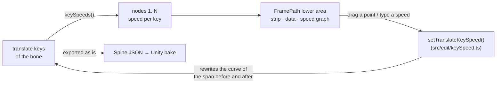
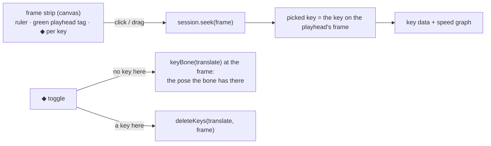
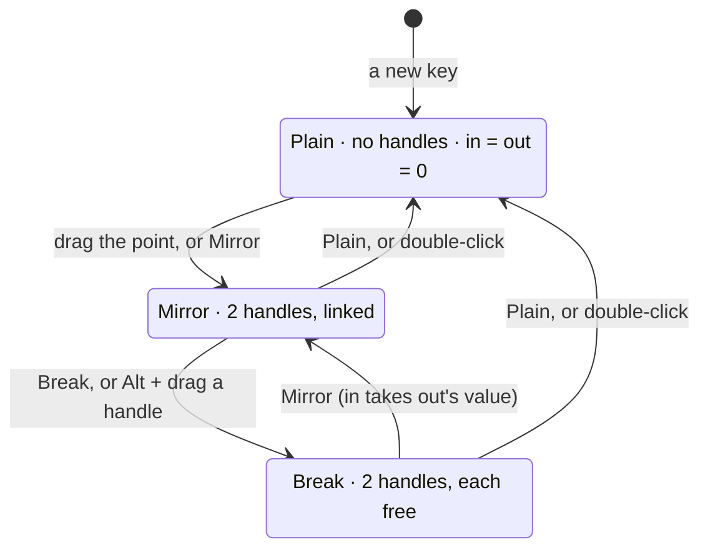

# FramePath: key nodes with a detail panel and a speed — plan

**Status: done 2026-10-09 (see "Result"); split translatex/translatey keys left for later.** The FramePath tab gets what the TwinSpline tab has under its picture: numbered nodes, the picked node's data and a speed graph. On FramePath the nodes are the bone's translate keys, and a node's speed is written into the keys' own Bezier curves, so it plays and exports as plain Spine data (no sidecar, no bake).

## What was asked

> at "FramePath", now when click node must show detail panel like in "TwinSpline", for add addition speed adjust

The owner chose (2026-10-09): **ease between keys** (the keys stay on their frames; the speed shapes each span's Bezier, the clip length never changes), and **keyed frames only** are nodes.

## The design

- **Nodes** are the keys of the bone's combined `translate` timeline in the shown animation, numbered 1..N in time order. A bone keyed with split `translatex` / `translatey` timelines gets an honest line instead of nodes (not handled in this step).
- **Speed** of a node: −0.99 to 5, the TwinSpline's range: the bone moves *1 + speed* times as fast as the span's even pace at that key. The span from key *i* to key *i+1* gets the shape `[1/3, (1+a)/3, 2/3, 1 − (1+b)/3]` on both channels, *a* the speed at its start, *b* at its end. The same normalised shape on x and y keeps the bone on the straight line between the keys: only the timing changes. Both speeds 0 is the straight line, written as no curve.
- **Reading back**: a key's speed is the slope its curves have there over the span's even pace, minus 1, from the channel that moves most. Any imported curve reads; a stepped span reads as stepped and becomes a curve once a speed is set on it.
- **Closed** (the FramePath ⋮ toggle): setting the speed of the first or the last node sets both, as the drag does for their place.
- **The lower area** under the picture on FramePath: the numbered strip (press: pick and go to that key's frame), the picked key's data (frame, place x/y, speed with its ×multiplier), the speed graph over the animation's frames (the speed the curves give at each moment, a point per key; drag a point up or down, Shift in steps of 0.1, double-click: 0). A key's dot on the picture picks that node too.

## Steps

1. `src/edit/keySpeed.ts`: `keySpeeds`, `spanSpeedAt` (the graph's line), `setTranslateKeySpeed`; table tests in `tests/keySpeed.test.ts` (linear reads 0, a set speed reads back, both 0 drops the curve, the path between keys stays on the line, stepped, last key, refusals).
2. The FramePath lower area in `motionPanel.ts`: strip, data, graph and its drag; the picture's key dot picks the node.
3. e2e in `e2e/motionModes.spec.ts`: the strip shows the keys, a node's data, a speed typed is written into the curves.
4. Status and results here.

## Result

1. `src/edit/keySpeed.ts` as planned; `tests/keySpeed.test.ts` (7 tests) passes. Speeds read back to four places, since the handles are stored as short floats. A span whose x and y had different imported curves gets one shape on both once a speed is set on it, so the bone then runs straight between those two keys.
2. `motionPanel.ts`: on FramePath the lower area shows a button per translate key (`renderKeyStrip`), the picked key's frame, place and speed (`renderKeyData`), and the speed graph over the frames (`drawKeySpeed`, the same canvas and drag as TwinSpline's: a point drags its speed, double-click puts it to 0, the cap scrubs the frames). A key's dot on the picture picks its node. With Closed on, the first and the last key take a speed or a place together, as one undo step.
3. e2e: `motionModes.spec.ts` checks the strip, the data and a typed speed written into the curves. The whole e2e suite (154) and `vitest` (842) pass. It also fixed `twinSpline.spec.ts`, which the FramePath rename had left asking for the old menu name.

## Step 2: a frame strip like the Timeline's, and one Key toggle (2026-10-09, the owner's second note)

> remove all Green bt, then convert to similar like "TimeLine". we have 32 node, if we need add additionPath, just have bt for toggle key

FramePath and TwinSpline are to stay clearly apart (TwinSpline may go soon); the work is FramePath's.

- **The green numbered buttons go** on FramePath. In their place, a strip drawn like the Timeline's ruler: frame numbers, the green playhead tag, and a diamond on every frame with a translate key. It shares the speed graph's view (same left edge, zoom and pan), so a frame on the strip is above the same frame on the graph.
- **Click or drag on the strip** moves the playhead. The picked key is simply the key on the playhead's frame, so clicking a dot in the picture, a point on the graph or a diamond on the strip all pick the same way; a frame with no key shows "no key here" in the data.
- **One toggle button** at the strip's left, ◆: on a frame with no translate key it keys translate there with the pose the bone has on that frame (the motion does not change); on a frame with a key it deletes that key. One undo step each.
- TwinSpline keeps its own strip as it is.

### Result (step 2)

Built as above in `motionPanel.ts` (`renderKeyStrip`, `drawKeyStrip`, `keyStripEvents`, `toggleKey`) and `style.css`. The key data now follows the playhead: the "picked" key is the one on its frame. With no key on that frame, the data says so and points at ◆. The strip and the graph also show for a bone with fewer than two keys, so ◆ can start a FramePath. e2e: `motionModes.spec.ts` checks no green buttons, the strip, the key data on the playhead's frame, and ◆ adding then deleting a key. Checked in the browser on Stickman_IK's `hips`: the strip lines up with the graph, a click moves the playhead, and ◆ added the key on frame 13 and then removed it.

## Step 3: Shift + click deletes a key; two speeds per key with three leg modes (2026-10-09, the owner's third note)

> 1 add can delete "key ◆ Speed" (when hover node + shift, node icon to red, l click delete). 2 add full 2 control with 3 mode

The owner chose: the two controls are the speed **arriving** at a key and the speed **leaving** it; the three modes are TwinSpline's legs: **Mirror**, **Break**, **Auto**. Delete works on the graph's points and on the strip's diamonds.

```mermaid
stateDiagram-v2
    [*] --> Mirror: in = out
    Mirror --> Break: Break (or Alt + drag a leg)
    Break --> Mirror: Mirror (in takes out's value)
    Mirror --> Auto: Auto
    Break --> Auto: Auto
    Auto: in, out from the neighbours (an action; reads back as Mirror or Break)
```

- **Two speeds per key.** The span before a key ends at its *in* speed, the span after starts at its *out* speed (`setTranslateKeySpeeds(animation, bone, index, { in, out })` in `src/edit/keySpeed.ts`; `keySpeedPairs` reads them). The graph draws a key's point with a leg each side: a hollow ring on a short stem at the in speed (left) and the out speed (right). The point drags both by the same amount; a leg drags its own side, and in Mirror the other side follows.
- **The modes** are actions, as on TwinSpline's legs, shown on the key's data row and in the point's right-click menu. **Mirror**: in takes the out speed. **Break**: each leg on its own. **Auto**: the pace through the key is the Catmull–Rom one (the distance from the key before to the key after, over their time), written as the in and out speeds that give it, held to −0.99…5. The mode shown is read from the data: in = out is Mirror; else Break. A Break chosen on equal speeds is remembered by the panel for that key until the bone or animation changes, since the file has nowhere to keep it.
- **Delete.** With Shift held over a point on the graph or a diamond on the strip, it turns red; a click deletes that translate key (one undo step). A Shift + drag on a point that started without Shift still steps by 0.1.

### Result (step 3)

- `src/edit/keySpeed.ts`: `keySpeedPairs`, `autoKeySpeeds`, `setTranslateKeySpeeds` (a side left out leaves its span as it was, a stepped one too); `setTranslateKeySpeed` sets both sides through it. `tests/keySpeed.test.ts` has three more tests (10 in all). The Auto test checks the written handles, not a finite difference of the engine's pose: the engine draws a Bezier as 10 straight steps, so a 1 ms difference near a key reads the first step's slope, not the curve's.
- `motionPanel.ts`: the graph draws a leg each side of a key (in left, out right); the point drags both, a leg drags its side (and the other too in Mirror; Alt + drag breaks first; double-click on a leg: Auto). The key's data has *Speed in*, *Speed out* and *Legs: Mirror · Break · Auto*; right-click on a point gives the same and Delete. Shift over a point or a diamond turns it red (Shift pressed or let go with the pointer still there counts too) and a click deletes the key.
- e2e: `motionModes.spec.ts` checks Break, Mirror and Auto through the data row, and a Shift + click delete on the graph and on the strip (it fails on step 2's code, where Shift + press began a drag). All suites pass: vitest 845, e2e 157. Checked in the browser on `hips`: the legs and the Mirror · Break · Auto row show. The red Shift hover is not checked: the e2e test checks the delete, not the colour, and the browser pane cannot hold Shift while hovering.

### Revised (step 3, the owner's fourth note, 2026-10-09)

> 3 mode: 2 hand, relate 2 side · break leg, freedom by each hand · plain node, if you have 2 plain node it just basic line

The three modes are now **Mirror** (two handles, linked), **Break** (each handle free) and **Plain** (no handles: the key's speed is 0 on both sides, so a span between two plain keys is the straight line, written as no curve). **Auto is gone**, with `autoKeySpeeds` and its test.

- The mode is read from the keys: in ≠ out is Break; both 0 is Plain; else Mirror. A choice the file cannot show (Mirror or Break at 0 and 0, Break on equal speeds) is remembered by the panel for that key until the bone or animation changes.
- A plain key draws no handles on the graph. Double-click on a point or a handle makes the key Plain.

Result: built as above. `motionPanel.ts` has `keyMode` / `setKeyLegs` with Mirror · Break · Plain on the key's data row and in the point's right-click menu; a plain key draws no handles; double-click on a point or a handle makes it Plain. The e2e test checks that a key with no speeds starts Plain with no handles, that Break lets out differ from in, that Mirror links them, and that Plain puts both to 0 and hides the handles. vitest 844 and the Motion Path e2e (36) pass.

## Step 4: the Timeline's look (2026-10-09, the owner's fifth note: "make it same style as time line")

- **The strip** is drawn as the Timeline's top: its ruler (24 px, frame numbers on `--bg`, the same label steps from `timeline/layout.ts`'s `labelStep`), the green playhead tag with the time since the key before (`secondsSinceLastKey`), and under it the Timeline's row of span tabs, one between each two keys with its length ("4f · 0.17s"), the playhead's span lit; each key's ◆ sits between its tabs.
- **The speed graph** is drawn as the Timeline's graph: no ruler or pink cap of its own (the strip above is its ruler), the panel's colour, the frame lines running down through it, past the end dimmed, a 1.5 px curve, square keys (white when picked), thin handles with small rings, and the green playhead line.
- Checked in the browser on `hips`; the Motion Path e2e (36) passes.
