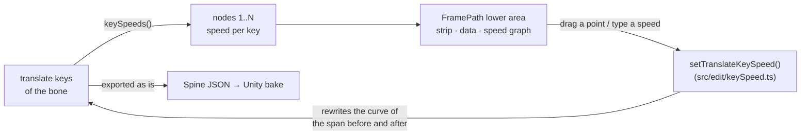

# FramePath: key nodes with a detail panel and a speed — plan

**Status: done 2026-10-09 (see "Result"); split translatex/translatey keys left for later.** The FramePath tab gets what the TwinSpline tab has under its picture: numbered nodes, the picked node's data and a speed graph. On FramePath the nodes are the bone's translate keys, and a node's speed is written into the keys' own Bezier curves, so it plays and exports as plain Spine data (no sidecar, no bake).

## What was asked

> at "FramePath", now when click node must show detail panel like in "TwinSpline", for add addition speed adjust

The owner chose (2026-10-09): **ease between keys** (the keys stay on their frames; the speed shapes each span's Bezier, the clip length never changes), and **keyed frames only** are nodes.

## The design

- **Nodes** are the keys of the bone's combined `translate` timeline in the shown animation, numbered 1..N in time order. A bone keyed with split `translatex` / `translatey` timelines gets an honest line instead of nodes (not handled in this step).
- **Speed** of a node: −0.99 to 5, the TwinSpline's range: the bone moves *1 + speed* times as fast as the span's even pace at that key. The span from key *i* to key *i+1* gets the shape `[1/3, (1+a)/3, 2/3, 1 − (1+b)/3]` on both channels, *a* the speed at its start, *b* at its end. The same normalised shape on x and y keeps the bone on the straight line between the keys: only the timing changes. Both speeds 0 is the straight line, written as no curve.
- **Reading back**: a key's speed is the slope its curves have there over the span's even pace, minus 1, from the channel that moves most. Any imported curve reads; a stepped span reads as stepped and becomes a curve once a speed is set on it.
- **Closed** (the FramePath ⋮ toggle): setting the speed of the first or the last node sets both, as the drag does for their place.
- **The lower area** under the picture on FramePath: the numbered strip (press: pick and go to that key's frame), the picked key's data (frame, place x/y, speed with its ×multiplier), the speed graph over the animation's frames (the speed the curves give at each moment, a point per key; drag a point up or down, Shift in steps of 0.1, double-click: 0). A key's dot on the picture picks that node too.

## Steps

1. `src/edit/keySpeed.ts`: `keySpeeds`, `spanSpeedAt` (the graph's line), `setTranslateKeySpeed`; table tests in `tests/keySpeed.test.ts` (linear reads 0, a set speed reads back, both 0 drops the curve, the path between keys stays on the line, stepped, last key, refusals).
2. The FramePath lower area in `motionPanel.ts`: strip, data, graph and its drag; the picture's key dot picks the node.
3. e2e in `e2e/motionModes.spec.ts`: the strip shows the keys, a node's data, a speed typed is written into the curves.
4. Status and results here.

## Result

1. `src/edit/keySpeed.ts` as planned; `tests/keySpeed.test.ts` (7 tests) passes. Speeds read back to four places, since the handles are stored as short floats. A span whose x and y had different imported curves gets one shape on both once a speed is set on it, so the bone then runs straight between those two keys.
2. `motionPanel.ts`: on FramePath the lower area shows a button per translate key (`renderKeyStrip`), the picked key's frame, place and speed (`renderKeyData`), and the speed graph over the frames (`drawKeySpeed`, the same canvas and drag as TwinSpline's: a point drags its speed, double-click puts it to 0, the cap scrubs the frames). A key's dot on the picture picks its node. With Closed on, the first and the last key take a speed or a place together, as one undo step.
3. e2e: `motionModes.spec.ts` checks the strip, the data and a typed speed written into the curves. The whole e2e suite (154) and `vitest` (842) pass. It also fixed `twinSpline.spec.ts`, which the FramePath rename had left asking for the old menu name.
