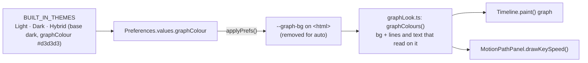

# Hybrid: a dark editor with light graphs

**Status:** done, 2026-10-09. Nothing left.

The owner asked for a third built-in theme, **Hybrid**: the editor is Dark, but the graphs are light gray. The graphs are the
Timeline's curve graph and Motion Path's speed graph. A new appearance value, **Graph colour**, gives them a background of their
own; Hybrid is Dark with that set to light gray (`#d3d3d3`). Any theme can set it in Preferences ▸ Timeline.

1. `preferences.ts`: `graphColour` (`auto` or `#rrggbb`) joins the appearance values; `BUILT_IN_THEMES` entries carry their base and
   their own defaults, and **Hybrid** (`hybrid`, base dark, `graphColour: #d3d3d3`) is added after Light and Dark.
2. `app.ts`: `--graph-bg` is set on `<html>` from it (removed for `auto`); popouts copy it with the rest (POPOUT-THEME-PLAN).
3. `src/ui/graphLook.ts`: `graphColours(css)` reads `--graph-bg`; with none, the theme's own colours; with one, that background
   and lines, muted text and text chosen for a light or a dark background. The Timeline's graph (its body, frame lines, zero line,
   labels; the ruler and the playhead tag stay the theme's) and the speed graph paint with it.
4. Preferences ▸ Timeline: **Graph background colour**, Auto = the theme's panel.
5. Tests: preferences (Hybrid is built in, dark-based, its graph colour; `graphColour` reads and round-trips); e2e: choosing Hybrid
   leaves the page dark and paints the speed graph and the Timeline graph light gray.

## Result

As planned. `themeDefaults(id)` gives a built-in theme's starting values (Hybrid's `#d3d3d3`); a stored Light or Dark from before
Hybrid still reads, Hybrid is added, and a value missing from a stored built-in is that theme's own default. Preferences' section
Reset puts back the theme in use's defaults. The frame strips, rulers and the playhead tag keep the theme's colours; only the
graphs' bodies change. Seen on a Playwright screenshot: dark editor, light gray speed graph and Timeline graph, dark lines and text.

Tests: `preferences.test.ts` (Hybrid built in and dark-based, an old file gets it, its colour kept; the built-in and theme-list tests
take the third theme); `e2e/hybridTheme.spec.ts` (Hybrid: the page dark, the speed graph and the Timeline graph `#d3d3d3`; Dark: both
`#2d2d2d`); `e2e/themes.spec.ts` lists Hybrid among the themes. vitest 777 pass; e2e: all pass except the AI-bridge tests (`askAi`,
`dailyDriver`, `mcpFlow`), which cannot reach the bridge from the dev server on 5199.
