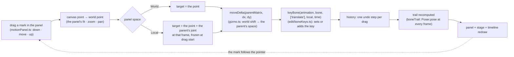

# Editing a bone's motion from the Motion Path panel — plan

> **Note 2026-10-08:** the path is now one of two separate systems (key animation and path motion): it has its own clock in seconds, no bake, and a one-time Make keys from path; see `TWO-SYSTEMS-PLAN.md` and SPEC §6a. What follows is the history of this plan.

**Status:** built 2026-10-07, not committed; **not verified in a person's hands**: `tsc`, the unit
tests (`tests/trailEdit.test.ts`) and four Playwright tests (`e2e/motionPanelEdit.spec.ts`) pass, the
existing Motion Path suite still passes, and a deliberate sign flip in the drag fails the e2e. Done:
dragging a mark (World and Local), the **move arrows** with a Parent / World axes button, the **rotation handle** (added at the owner's request, "go, use
your recommendations, but it need rotation handle too"), Shift (axis lock, or 15° steps on the
handle), the constraint-driven check, Auto Key off. **Left:** snapping while dragging (World only,
as planned; not built), and step 6's doc lines (SPEC §7, the v2 plan's cut list).
The panel and the trail are in `docs/MOTION-PREVIEW-PLAN.md` (done): this plan makes what they only
show *editable*, in **Local** and in **World**.

The Motion Path panel draws the selected bone's joint over every frame of the animation: a mark per
frame, larger where the animation keys the bone. Today a click on a mark moves the playhead and
nothing else. The plan: **drag a mark, and the bone's translate key at that frame moves with it**,
measured in whichever space the panel is in, so a motion is reshaped on its path instead of being
nudged frame by frame on the stage.

## What was asked

> u can see it more easy edit if we refactor for edit able from "local, World Path"
> let plan md

(with a screenshot of the panel: `foot-front-IK · World`, the trail drawn as a closed loop of marks,
one lit at the playhead.)

## My reading, to confirm

1. **"Edit able" = the marks of the path can be dragged.** A mark is the joint at one frame; moving
   it re-keys that frame. Not the tip's fainter trail, not the images.
2. **Both spaces edit.** In **World** the mark goes where the pointer is on the Stage's own axes. In
   **Local** (measured from the parent's joint, same orientation) the pointer is a place relative to
   the parent, so it is the right view for a limb or a foot that rides on a moving body.
3. **A frame with no key gets one.** As the Stage does with Auto Key: dragging an unkeyed frame adds
   a translate key there and keeps the neighbours as they are. With Auto Key off, the drag poses
   without keying until Key is pressed, the same rule as the Stage (`Stage.autoKey`).
4. **A bone an IK or other constraint drives can't be dragged** (its marks are drawn, not
   grabbable, with a note naming the constraint and its target). Its own keys do not decide where it
   is, so moving the mark would key something that does not move it. The target bone is the one to
   drag; selecting it shows its trail.
5. **Out of scope here:** adding or deleting keys by clicking the path (a later step, "add a mark"),
   curve handles between marks, rotate and scale from the panel, dragging the tip.

## What exists (checked on disk, 2026-10-07)

| Piece | Where | Used for |
|---|---|---|
| `boneTrail(poser, skin, animation, bone, fps, duration, space)` | `src/ui/stage/trail.ts` | joint and tip at every frame, Local or World |
| `fromParent(p, bone, x, y)` | `src/ui/stage/trail.ts` | a world point as Local shows it (minus the parent's joint) |
| the mark list and `down()` hit test | `src/ui/panels/motionPanel.ts` (`this.marks`, nearest within a radius, then `session.seek`) | where a drag starts |
| `moveDelta(parent, dx, dy)` | `src/ui/stage/gizmo.ts` | a world shift in the parent's space: what the bone's x and y add |
| `animatedLocal(p, bone)` | `src/ui/stage/posed.ts` | the bone's local pose as animated at the playhead |
| `keyBone(animation, bone, properties, local, time)` | `src/edit/boneKeys.ts` | sets or adds the bone's key at `time` |
| drag plumbing for a translate (history `begin` / `apply` / `end`) | `src/ui/stage/stage.ts` (the move tool's drag, around `moveDelta`) | the pattern to follow; not copied |

## Design

**Where the code goes.** The maths is pure and goes where it can be tested without a DOM:
`src/edit/trailEdit.ts` (new, tiny): `translateForJoint(parent, from, targetWorld): { x, y }`, the
bone's local x and y that put its joint at a world point under a given parent matrix. The panel
(`motionPanel.ts`) owns the pointer and calls it. No new window (CLAUDE.md §8: the panel exists).

**The drag.**
- *Pointer down* on a mark (nearest within the existing radius): if the bone is constraint-driven,
  say so in the status line and do nothing else; otherwise remember the frame, `session.seek(frame)`
  (the playhead goes there, as a click does today), `history.begin("Move bone <name> at frame <n>")`,
  and **freeze** the parent's joint matrix at that frame (`parentMatrix` from the posed rig then).
- *Pointer move*: canvas point → world point (the panel's inverse fit / zoom / pan); in Local add
  the frozen parent's joint. `moveDelta` against the frozen parent gives the shift in the parent's
  space; add it to the bone's local x and y *as animated at that frame* and `keyBone(..., ["translate"], local, time)`.
  One `apply` per move, replaced in place (the stage's pattern) so the drag is one undo step.
- *Pointer up*: `history.end()`; the trail is recomputed once more from the final keys.

**Why freeze the parent.** A parent that follows the bone (the bone is an IK target, or a child of
something a constraint moves) would otherwise shift under the pointer as the key changes: the mark
would run away from the pointer. Frozen at drag start, the target is stable and the result is exact
once the drag ends.

**Snapping and guides.** The Stage's snap (grid, pixels) applies in World only, on the target
point, through the existing `snap.ts`; Local shows no snap in this step. Shift locks to an axis
(horizontal or vertical on the panel), as the Stage's move does.

**Feedback.** The dragged mark is drawn larger with its frame number; the status line says
`<bone> · frame <n> · x y` in the panel's space. The cursor is a grab on a mark, the panel's pan
drag elsewhere (a mark wins over pan within its radius).

## What changed from the plan, and why

- **The owner's answers:** all four recommendations taken (Auto Key off poses without keying; a
  constraint-driven bone's marks are drawn but not grabbable, and the status line names the
  constraint and its IK target; snapping World only; add/delete a mark by click is the next step).
- **Move arrows (new, owner's request).** The mark of the playhead's frame, where the bone's joint
  is, gets an x (red) and a y (green) arrow, the Stage's colours. A press on an arrow drags the bone
  along that axis only (the pointer's part along it); the joint itself, and every other frame's
  mark, still drag freely. An **Axes: Parent / Axes: World** button in the panel's header says which
  axes the arrows follow (the parent's, as the Stage's default, or the world's); it is remembered.
- **Rotation handle (new, owner's request).** A ring a little beyond the bone's tip, with a line to
  it, drawn when the bone is selected in Animate mode and not constraint-driven. Dragging it turns
  the bone **at the playhead** and keys `rotate` there, with the Stage's own maths (`turn`, `localRotation`,
  `turnSign`; the turn is summed step by step, so a drag round the bone keeps going). Shift snaps to 15°.
- **Local needs no parent offset.** The plan had Local add the parent's joint to the pointer. With the
  parent held at the drag's start, a shift of the pointer is the same shift in Local and in World, so
  the drag is one code path: pointer delta ÷ scale, y up, through `shiftedLocal`. Local differs only
  in what the marks show. (Test: "a trail in Local moves by the same shift as in World".)
- **The view holds still.** The panel refits to the trail on every change; during a drag that moved
  the mark away from the pointer. The fitted box is now held from the first edit until Fit, or a
  different bone, animation or space, so the mark follows the pointer and the picture does not jump
  on release (e2e: the mark ends where the pointer let go).
- **Where the maths lives:** `src/ui/stage/trailEdit.ts` (`constraintDriving`, `shiftedLocal`,
  `axisLocked`), not `src/edit`, because it uses the Stage's `moveDelta` (the edit layer imports nothing from the UI).
- **Test hook:** `window.boneburst.motionPath.grabPoints` (the marks and the handle on the canvas), for the e2e.
- **Cost, not measured:** each drag step re-poses every frame of the animation (`boneTrail`); fine for
  the fixtures (tens of frames), unmeasured for a 2000-frame animation.

## Steps

(Done unless marked.)

1. **`src/ui/stage/trailEdit.ts`** and `tests/trailEdit.test.ts`: `translateForJoint` over a rotated,
   scaled, mirrored parent, and a root (no parent); round-trip against `boneTrail` (set the key from
   a target, re-pose, the joint is within 1e-6 of the target).
2. **The drag in `motionPanel.ts`**: down / move / up as above, behind the IK check; World first.
3. **Local** (the frozen parent offset), then the axis lock and the snap.
4. **Feedback**: larger mark, status text, cursor.
5. **`e2e/motionPanelEdit.spec.ts`** (Playwright, the stickman fixture): a drag of a mark keys the bone
   at that frame, seeks there, is one undo step and the mark follows the pointer; Shift; the handle
   keys `rotate`; an IK-driven bone has no handle and its marks do not edit. **Not covered:** Auto Key off (no e2e).
6. **Docs:** the v2 plan's cut list and SPEC §7 gain a line; the Motion Path panel's tooltip in
   Preferences' help is updated; a dated entry in `Assets/Docs-Plan/CHANGELOG.md` when committed.

## Guards (how it stays right)

- `tests/trailEdit.test.ts`: the round trip, so the maths cannot drift from `boneTrail`.
- **A deliberate bug must fail a test:** flip the sign in `moveDelta`'s use once and confirm the
  round-trip test and the e2e drag fail.
- The e2e checks the *key in the document*, not the picture: the exported JSON's translate key at the
  dragged frame equals the target within a pixel.
- `npm run check` (tsc, vitest, the Playwright suites) stays green; the unity-parity script is
  unaffected (no engine change).

## Open questions for the owner

1. **Auto Key off:** pose without keying (as the Stage), or refuse the drag? *Recommended: as the Stage.*
2. **Marks of a constraint-driven bone:** only drawn (this plan), or let the drag key the *target*
   bone instead? *Recommended: drawn only; the target is one click away.*
3. **Local snapping:** World only in this step, or also Local? *Recommended: World only; Local later if wanted.*
4. **Add and delete a mark by clicking the path** (a key at an unkeyed frame, without dragging): the
   next step, or part of this one? *Recommended: next step.*
