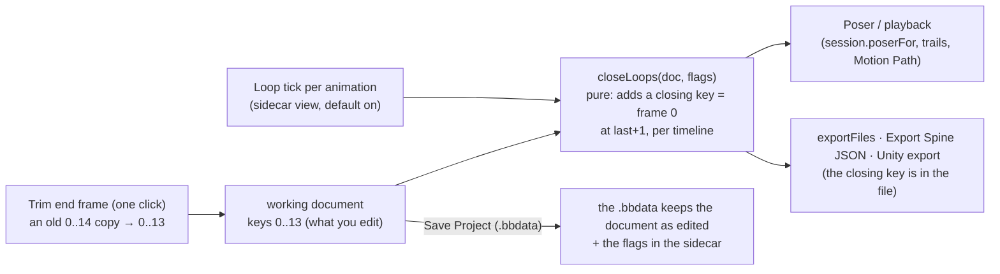

# A Loop tick per animation: key 0–13, loop as 0–14 — plan

**Status:** built 2026-10-07, not committed; **not verified by hand**. `tsc`, 11 unit tests
(`tests/loop.test.ts`) and 4 Playwright tests (`e2e/loop.spec.ts`) pass, and the whole Playwright suite
and vitest (725) pass after one test was adjusted (below). Done: steps 1–5 except the `unity-parity` run
on a closed document (not run: the script does not use the closing step, and the closed file is an
ordinary Spine file; a run through the C# runtime is still the check to make). Taken as recommended: on
for every animation read from a file too; the tick in the Timeline bar; Trim end per animation, only
when seamless. Docs (step 6): SPEC and the changelog entry are left for the commit.

A looping animation that must end on its first pose is authored today as frames 0–14 with frame 14
a copy of frame 0 (15 frames, a duplicated frame). The owner wants to key **0–13 only** and get the
same result. One tick per animation says it is a loop, **ticked by default**; the editor then supplies
the closing frame itself, so frame 13 blends into frame 0 and the file the runtime reads is the same
as the hand-made 0–14.

## What was asked

> every animation is can be loop, but if 0-14 = 15 frame, it mean 0==14, can we 0-13, but same
> result

and, to my question of how (an automatic closing frame, a one-click command, or playback only):

> have one bool flag, for tick, by default is loop

## My reading, to confirm

1. **A closing frame is derived, not stored.** The working document keeps 0–13. Everything that
   *uses* the animation (posing, playback, the trail panels, every export) sees it with one more key,
   at frame 14, equal to frame 0 on each timeline the animation keys. The Spine JSON that leaves the
   editor is therefore exactly the hand-made 0–14 one, and the document stays the Spine file (SPEC §1)
   with no new keys of ours in it.
2. **The flag is per animation, on by default,** kept in the project's sidecar (`view`, like the skin
   and bone) so it is not in the Spine JSON. Unticked, the animation is exactly as authored.
3. **An animation that is already seamless is left alone.** If its last frame already equals frame 0
   on every timeline (a hand-made 0–14), nothing is added: no second duplicate. A **Trim end frame**
   button (shown then) deletes those copies, turning it into 0–13.
4. **Closing key time = last key's frame + 1**, so the length grows by one frame and 13 → 0 is one
   frame of blending. The curve of the key before it is kept; the closing key is linear (a copy of
   frame 0's value; its own curve is frame 0's).

## Why derived at the edge, not stored

Storing a hidden key at frame 14 would mean every edit to frame 0 must also edit frame 14 (a second
write in each edit, and in undo, paste, move keys, import, AI tools): a sync bug waiting. Deriving it
at the one place the document leaves for use (`closeLoops`) keeps editing untouched and the closing
key always right.

## What exists (to be checked on disk before building)

`animationDuration` and `timeFrame` (`model/timelines.ts`), `keyLists`, `session.loop` (the playback
Loop toggle; **a different thing**: it repeats playback; this tick says what the animation *is*),
`Session.poserFor`/`pose()`, `exportFiles` (`ui/unityExport.ts`), the Export Spine JSON path, the
sidecar view (`edit/sidecar.ts`: skin, animation, bone), the timeline's end marker.

## What changed from the plan, and why

- **The tick is called "Closed loop"**, not "Loop": the Timeline bar already has a Loop button (playback
  repeats), and two buttons both called Loop would be read as one.
- **Everything that poses or plays uses the closed document** (`Session.closedDoc()`, memoised on the
  document and the ticks): the Stage, playback, the Motion Path trail and onion skin, the Timeline's
  length and Fit, the Animations panel's seconds. `Session.length(anim)` is the length with the
  closing key. **Not changed:** the AI tools (`src/agent/*`) read the document as edited, so an AI keying
  frames sees 0–13, not the closing frame.
- **Exports:** Export Spine JSON and Export to Unity write the closed document; **Save Project does not**
  (`exportFiles(session, false)`), so a project reopens as 0–13.
- **A frame-rate test changed:** `e2e/frameRate.spec.ts` counted frames of "run" (17 at 24 fps); with the
  tick on it is 18. The test now unticks Closed loop first, so it still tests the rate, not the loop.
- **The seam is drawn** as a dashed line and "= 0" after the last key; the closing key itself has no
  diamond and cannot be selected or moved.
- **The tick is not an edit** (no undo step, the document does not become unsaved); it is kept in the
  project's view as `loopOff` (only unticked animations are listed). A project opened from a folder
  without a `.bb.json` has every animation ticked.

## Steps

1. `src/edit/loop.ts` and `tests/loop.test.ts`: `closeLoop(animation, fps)` (pure), `isSeamless`,
   `trimClosingKeys` (an edit); cases: bone, slot, IK, deform, draw order and event timelines; split
   `translatex`/`translatey`; a curve on the last key; an animation with no keys; already seamless.
2. The flag: `view.loops` in the sidecar (off-list: only animations turned **off** are stored, so a new
   animation is on without writing anything), `Session.loopOf(name)` / `setLoop`.
3. Use it at the edge: the Poser's document and every exporter go through `closeLoops(doc, flags)`.
4. The tick in the Timeline bar (beside Rename… / Delete), the seam drawn as a dimmed column after
   frame 13 with a label "= 0", Trim end frame when seamless.
5. Guards: round trip (export of a 0–13 loop equals the export of the hand-made 0–14, byte for byte),
   playback wraps through the closing key, `unity-parity` on the closed doc, an e2e for the tick,
   the seam column, and Save Project / reopen keeping the flag.
6. Docs: SPEC (the derived key), BBDATA-PLAN (the flag), a dated changelog entry when committed.

## Risks

- **Default on changes exports of existing files**: an animation whose last frame is *not* its first
  gets a closing key added in the exported JSON. That is the owner's wish (every animation is a
  loop), and one tick removes it; but it is a behaviour change for any file opened as it was.
- **The closing key's value for a timeline that starts at a later frame** (no key at 0): there is no
  frame 0 to copy, so none is added for it.
- **Constraint and physics timelines**: copied like the rest; unverified until the unity-parity run.

## Open questions

1. **Default on for old files too, or only for animations made in the editor?** The owner said "by
   default is loop". *Recommended: on everywhere, shown plainly (the tick, and "= 0" on the timeline),
   so nothing is silent.* The alternative is on for new animations and off for ones read from a file.
2. **Where the tick lives:** the Timeline bar (this plan), or the Animations panel's row.
   *Recommended: the Timeline bar.*
3. **Trim end frame:** offered only when seamless (this plan), or also a menu command for all
   animations at once. *Recommended: per animation, only when seamless.*
